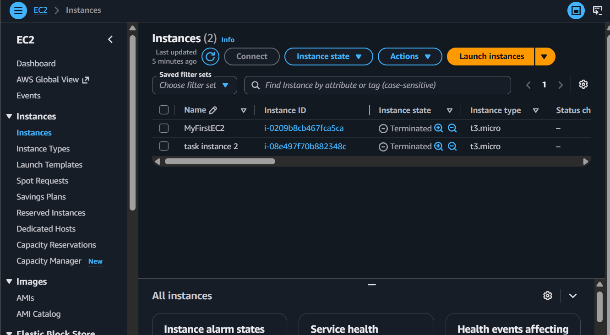
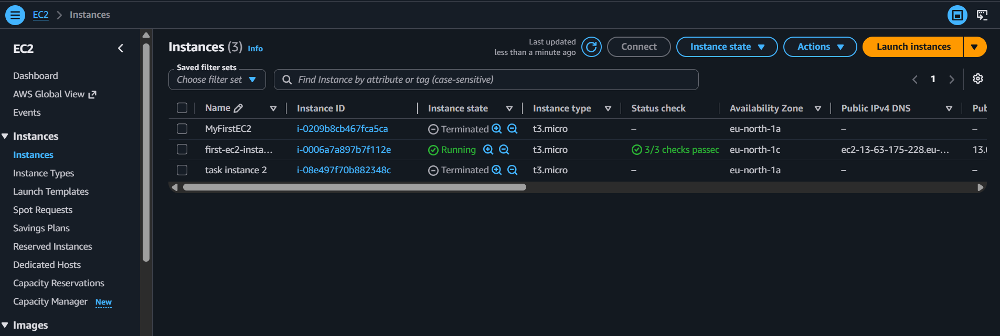

<div align="center">


# ⚡ Amazon EC2: Launch & Connect

### Your First Cloud Server — From Zero to SSH in 30 Minutes!


</div>

---

> ### 🗣️ *"Ravi, every cloud engineer's journey starts with launching a virtual server. It's like the 'Hello World' of AWS. Let's get your first EC2 instance up and running!"*
> — **Rithu** ☁️

---

<details>
<summary><b>🎭 Ravi & Rithu's Coffee Break Chat</b></summary>

**Ravi:** "So this EC2 instance... is it like my laptop?"

**Rithu:** "More like your laptop's cooler cousin who lives in a data center and doesn't overheat."

**Ravi:** "Can I install games on it?"

**Rithu:** "You CAN. But AWS charges by the hour, so your gaming habit just got a subscription model."

**Ravi:** "...I'll stick to Apache."

</details>

---

<div align="center">

## 📊 Lab Progress

`[██░░░░░░░░░░░░░░░░░░] 5% — Let's Begin!`

</div>

---

## 📋 Table of Contents

- [🎯 What You'll Accomplish](#-what-youll-accomplish)
- [📊 Lab Progress](#-lab-progress)
- [🤔 In Plain English](#-in-plain-english)
- [🧠 Prerequisites](#-prerequisites)
- [💸 Cost Warning](#-cost-warning)
- [🏗️ Architecture Overview](#-architecture-overview)
- [🛠️ Step-by-Step Walkthrough](#-step-by-step-walkthrough)
- [✅ Validation Checklist](#-validation-checklist)
- [🧹 Cleanup (DO NOT SKIP!)](#-cleanup-do-not-skip)
- [🧠 Memory Tips](#-memory-tips)
- [🎓 What You Learned](#-what-you-learned)
- [🎮 Test Yourself](#-test-yourself-no-peeking)
- [🆚 Pro Tip vs Noob Tip](#-pro-tip-vs-noob-tip)
- [🔗 What's Next?](#-whats-next)
- [❓ Troubleshooting](#-troubleshooting)

---

## 🤔 In Plain English

> **What is this, really?** EC2 is just **renting a computer that lives in AWS's data center** instead of buying one. You pick the size (t2.micro = the small free one), the operating system, and where it lives — and it boots up in about a minute. It's *your* server: you can SSH in, install software, and host websites on it.
>
> 🌍 **Why you should care:** Every company with a website, app, or API uses servers just like this one. Once you've launched one EC2, you've done the AWS rite of passage. Everything else builds on this.

---

## 🎯 What You'll Accomplish

By the end of this lab, you'll have **your own virtual server running in the cloud** — accessible from your laptop, serving a real webpage to the entire internet.

> 
>
> ✅ Launch an EC2 instance from the AWS Console
> ✅ Create & manage SSH key pairs
> ✅ Connect to your server via SSH
> ✅ Install Apache httpd web server
> ✅ Host a custom webpage — live on the internet!

---

## 🧠 Prerequisites

| Requirement | Details |
|:---:|---|
| ☁️ | An **AWS account** with administrative access |
| 🖥️ | Basic familiarity with the AWS Management Console |
| 🎓 | No prior EC2 experience needed — this is ground zero! |

---

## 💸 Cost Warning

<table>
<tr>
<td width="50" align="center"><h1>💰</h1></td>
<td>

All resources in this lab are **Free Tier eligible** (t2.micro). However, as our favorite greenhorn once said:

> *"I forgot to terminate my instance and got a surprise **$15 AWS bill** the next month."*

**Never forget to terminate.** Seriously. There's a Cleanup section at the bottom. **USE IT.**

</td>
</tr>
</table>

> **Ravi's Mistake of the Day:** I once forgot to add an HTTP inbound rule and spent 20 minutes debugging why my website wouldn't load. The server was fine. The code was fine. The firewall was just being a bouncer with a "no visitors" policy.

---

## 🏗️ Architecture Overview

```
╔══════════════════════════════════════════════════════╗
║                    PUBLIC SUBNET                      ║
║                                                      ║
║   ┌──────────────────────────────────────────────┐   ║
║   │            🖥️  t2.micro EC2                  │   ║
║   │         Amazon Linux 2023 AMI                 │   ║
║   │                                              │   ║
║   │   🔐 Security Group:                         │   ║
║   │      SSH (22) ──▶ My IP Only                 │   ║
║   │      HTTP (80) ──▶ 0.0.0.0/0                │   ║
║   │                                              │   ║
║   │   🌐 httpd installed & running               │   ║
║   │   📄 index.html served on port 80            │   ║
║   └──────────────────────┬───────────────────────┘   ║
║                          │                            ║
║                    ┌─────▼─────┐                      ║
║                    │    IGW    │ ◀── Internet Gateway  ║
║                    └─────┬─────┘                      ║
║                          │                            ║
╚══════════════════════════╪════════════════════════════╝
                           │
                    ┌──────▼──────┐
                    │  🌍 Browser │
                    │  http://<IP>│
                    └─────────────┘
```

> **Did You Know?** Amazon EC2 was launched in 2006. Before that, if you wanted a server, you had to physically buy one, rack it, wire it, and pray it didn't overheat. Now you can launch one in 90 seconds from your couch.

---

## 🛠️ Step-by-Step Walkthrough

---

### Step 1: Launch the EC2 Instance

> 

**1.** Go to the **AWS Management Console** → search for **EC2** → click it.

**2.** Click the orange **`Launch instance`** button.

<div align="center">

<br/>
<sub>📸 EC2 Dashboard — Click that beautiful orange button!</sub>
</div>

<br/>

**3.** **Name your instance:** Enter `first-ec2-instance`

**4.** **Choose your OS:**
- Click **Amazon Linux** (usually the default)
- Select **Amazon Linux 2023 AMI** *(Free Tier eligible ✅)*

**5.** **Instance type:** Select **t2.micro**
> That little asterisk saying "Free tier eligible" is like winning the lottery 🎰

**6.** **Key pair (your door key):**
- Click **Create new key pair**
- Name: `first-key-pair` | Type: **RSA** | Format: **.pem**
- Click **Create key pair** — the `.pem` file downloads automatically

> 
> Move that `.pem` file to `~/.ssh/` on Mac/Linux or a dedicated folder on Windows.
> **Don't lose it. You can't SSH without it.** 🔑

**7.** **Network settings →** Click **Edit:**
- VPC & Subnet: leave as default
- **Auto-assign public IP:** ✅ Enable
- **Firewall:** Select "Create security group"
  - Name: `launch-wizard-1`
  - Click **Add security group rule:**
    - Type: **SSH** | Source: **My IP** | Description: `SSH from my IP`

**8.** **Storage:** Leave default 8 GiB gp2/gp3

**9.** Click **`Launch instance`** at the bottom → **View all instances**

<div align="center">

<br/>
<sub>📸 Your first EC2 instance — running and healthy! 🎉</sub>
</div>

---

### Step 2: Wait for Instance Ready

> 

- Instance shows **Pending** → then **Running**
- Wait for **2/2 status checks** to pass (refresh every 30s)

```
┌──────────────────────┬──────────┬───────────┬────────────┐
│ Instance State       │ Status   │ Checks    │ Public IP  │
├──────────────────────┼──────────┼───────────┼────────────┤
│ ✅ Running           │ 2/2 OK   │  ✅ PASS  │ 54.x.x.x  │
└──────────────────────┴──────────┴───────────┴────────────┘
```

---

### Step 3: Find Your Public IP

> 

1. Click `first-ec2-instance` in the list
2. Go to **Details** tab
3. Copy the **Public IPv4 address** — you'll need this!
4. Also note the **Public IPv4 DNS** — it works too

---

### Step 4: Connect via SSH

> 

Pick **ONE** option based on your OS:

---

<details>
<summary><b>🍎 Option A: Mac / Linux — Terminal</b></summary>

```bash
# 1. Lock down key permissions (SSH is paranoid — and it should be!)
chmod 400 /path/to/your/first-key-pair.pem

# 2. SSH into your cloud server!
ssh -i /path/to/your/first-key-pair.pem ec2-user@<YOUR-PUBLIC-IP>
```

When prompted:
```
The authenticity of host 'xx.xx.xx.xx' can't be established.
Are you sure you want to continue connecting (yes/no)?
```
Type `yes` and press Enter.

You should see:
```
   ,     #_
   ~\_  ####_        Amazon Linux 2023
  ~~  \_#####\
  ~~     \###|
  ~~       \#/ ___   https://aws.amazon.com/linux/
   ~~       V~' '->
    ~~~         /
      ~~._.   _/
         _/ _/
       _/m/'
[ec2-user@ip-xxx-xxx-xxx-xxx ~]$
```

> 
> If you see `Permissions 0644 are too open`, you forgot `chmod 400`. Fix it!

</details>

---

<details>
<summary><b>🪟 Option B: Windows — PuTTY</b></summary>

PuTTY uses `.ppk` files, not `.pem`. Convert first:

1. Open **PuTTYgen** → click **Load** → select your `.pem` file
2. Click **OK** → **Save private key** → **Yes** (no passphrase)
3. Save as `first-key-pair.ppk`

Now connect with PuTTY:

| Setting | Value |
|---------|-------|
| Host Name | `ec2-user@<YOUR-PUBLIC-IP>` |
| Port | `22` |
| Connection type | SSH |
| Auth → Private key | `first-key-pair.ppk` |

Click **Open** → **Accept** the fingerprint → You're in! 🎉

</details>

---

<details>
<summary><b>🌐 Option C: AWS EC2 Instance Connect (Browser)</b></summary>

The easiest option — no setup needed:

1. Select your instance → **Connect** button
2. Go to **EC2 Instance Connect** tab
3. Click **Connect**
4. New browser tab opens with a terminal — magic! ✨

> 
> Great for quick tasks, but falls flat in private subnets.
> **Learn the CLI methods — they'll save you someday!**

</details>

---

### Step 5: Install Apache Web Server

> 

You're inside your EC2 instance now. Let's install Apache:

```bash
# Update all packages (always do this first!)
sudo yum update -y
```

```bash
# Install the Apache web server
sudo yum install -y httpd
```

```bash
# Start the web server
sudo systemctl start httpd
```

```bash
# Enable auto-start on reboot (survives restarts!)
sudo systemctl enable httpd
```

```bash
# Verify it's running
sudo systemctl status httpd
```

You should see: **`active (running)`** — the green light! 🟢

---

### Step 6: Create Your Custom Web Page

> 

```bash
echo "<h1>Hello from Ravi's first EC2 instance!</h1>" | sudo tee /var/www/html/index.html
```

> 
> `tee` writes to a file AND prints to terminal — like a microphone + speaker.
> `sudo` is needed because `/var/www/html/` is owned by `root`.

---

### Step 7: Verify Your Work 🎉

> 

1. Open your browser
2. Go to: **`http://<YOUR-PUBLIC-IP>`**
3. **You should see:** `Hello from Ravi's first EC2 instance!`

> 
> Notice it's `http://` NOT `https://`. SSL comes later. Patience, grasshopper. 🦗

---

<details>
<summary><b>⚠️ Page not loading? Click here!</b></summary>

**Most likely cause:** Your security group doesn't have an HTTP rule!

**Fix it now:**
1. EC2 Console → Security Groups → select your SG
2. **Inbound rules** → **Edit inbound rules** → **Add rule:**
   - Type: **HTTP** | Source: **0.0.0.0/0** | Description: `HTTP from anywhere`
3. **Save rules** → Refresh browser → **Magic!** ✨

</details>

---

## ✅ Validation Checklist

Before moving on, confirm ALL of these:

- [ ] 🖥️ EC2 instance launched from Amazon Linux 2023 AMI
- [ ] 🔑 Key pair `first-key-pair` created and downloaded
- [ ] 🔐 SSH connection established to the instance
- [ ] 🌐 Apache httpd installed and running (`active (running)`)
- [ ] 📄 Custom `index.html` visible at `http://<public-ip>`
- [ ] 🔥 HTTP inbound rule added to security group

> **POV:** You launched your first EC2 instance and keep refreshing the page to see if it's still running.

<div align="center">

> **Achievement Unlocked:** First Cloud Server! You've officially entered the cloud.

</div>

---

## 🧹 Cleanup (DO NOT SKIP!)

> 

Don't skip this. **Future Ravi will thank you.**

### 1. Terminate the Instance

EC2 Console → Instances → `first-ec2-instance` → **Instance state** → **Terminate**

### 2. Delete the Key Pair

EC2 Console → Network & Security → **Key Pairs** → `first-key-pair` → **Delete**

Also delete the `.pem` / `.ppk` file from your computer.

### 3. Clean Up Security Group

EC2 Console → **Security Groups** → select your SG → **Delete security groups**

> 
> You may need to wait for instance termination to complete before deleting the SG.
> Get in the muscle memory early! 💪

---

## 🧠 Memory Tips

Stick these in your brain and they'll never leave. 🧲

| 🧠 Memory Hook | Remember it like... |
|---|---|
| **t2.micro = Free Tier king** | Think "**t**iny **2**-slice **micro** sandwich" — the free lunch of compute. 🥪 |
| **`.pem` vs `.ppk`** | **PEM** stays on **P**enguins (**M**ac/Linux), **PPK** is **Pu**TTY's pet. Convert with PuTTYgen. 🐧 |
| **Security Group = bouncer** | It has a guest list (rules). Only names on the list get in — stateful means it remembers who walked out. 🚪 |
| **Install → Start → Enable** | Remember **ISE** — "**I**nstall, **S**tart, **E**nable". Enable = auto-start on reboot. 🔄 |
| **SSH = port 22** | Port 22 sounds like "two-two, who's there?" — the secret knock for your server. 🤫 |

> 🗣️ **Rithu:** *"If you remember just ONE thing: don't open SSH to the whole world. My-IP-only, always. The bouncer should know your face!"*

---

## 🎓 What You Learned

<table>
<tr><th>Concept</th><th>Key Takeaway</th></tr>
<tr><td>🖥️ EC2 Launch</td><td>t2.micro is the Free Tier king</td></tr>
<tr><td>🔑 Key Pairs</td><td>RSA .pem for Mac/Linux, convert to .ppk for PuTTY</td></tr>
<tr><td>🔥 Security Groups</td><td>Stateful firewall — allow only what's needed</td></tr>
<tr><td>🔐 SSH Methods</td><td>Mac/Linux CLI, Windows PuTTY, EC2 Instance Connect</td></tr>
<tr><td>🌐 Apache httpd</td><td>Install → start → enable for automatic boot</td></tr>
<tr><td>📝 User Data</td><td>Not covered here, but remember: scripts run at launch!</td></tr>
</table>

### Pro Tip vs Noob Tip
| | Approach |
|---|---|
| **Noob Tip** | Open SSH to 0.0.0.0/0 "so I can connect from anywhere" |
| **Pro Tip** | Lock SSH to My IP only. Security is not optional. |

---

## 🎮 Test Yourself! (No Peeking 👀)

**Q1:** Which EC2 instance type is Free Tier eligible?

<details><summary>👀 Show answer</summary>

**A:** `t2.micro` (or `t3.micro`) — the tiny workhorse that costs you nothing for 750 hours/month. 🐴

</details>

**Q2:** What port does SSH use, and why does it matter for your security group?

<details><summary>👀 Show answer</summary>

**A:** Port **22**. You should only allow it from **My IP**, so random bots on the internet can't try to break in.

</details>

**Q3:** What does `sudo systemctl enable httpd` do that `start` doesn't?

<details><summary>👀 Show answer</summary>

**A:** `start` runs it now; **`enable` makes it auto-start after every reboot**. Both together = server that survives restarts. 💪

</details>

### 🔥 Bonus Challenge

Your site works on `http://`. Now **add an HTTPS (port 443) rule** to your security group and try `https://<your-ip>`. It won't fully work (no SSL cert yet) — but watch what happens, and note why browsers complain. That's exactly how real traffic gets encrypted later. 🔐

> 💪 **Rithu:** *"Breaking things on purpose is how you learn what 'working' actually means. Click the button, Ravi!"*

---

## 🔗 What's Next?

> 

This was the warm-up! Next up, we play with **firewalls**.

👉 **[Lab 02 — EC2 Security Groups Deep Dive](../02%20-%20EC2%20-%20Security%20Groups%20Deep%20Dive/README.md)**

We'll lock down traffic, open ports on-demand, and reference security groups within each other.
It'll be like being a **cloud bouncer**. 🫡

---

## ❓ Troubleshooting

| Problem | Likely Cause | Fix |
|---------|-------------|-----|
| `Permission denied (publickey)` | Wrong key or permissions | `chmod 400` on `.pem`, verify key name |
| PuTTY: `No supported auth algorithms` | `.pem` used directly | Convert to `.ppk` with PuTTYgen |
| Website won't load | Missing HTTP rule in SG | Add inbound HTTP (80) from `0.0.0.0/0` |
| Connection timeout | Wrong IP or instance down | Verify Public IP, check instance state |
| `sudo: yum: command not found` | Amazon Linux 2023 uses dnf | Try `sudo dnf install -y httpd` |
| Browser shows default Apache page | Custom index.html failed | Re-run the `echo \| sudo tee` command |

---

> **Rithu's Real Talk:** In my first month of AWS, I racked up $87 in charges. Not because AWS is expensive - because I didn't clean up. These labs are designed to prevent that. Follow the cleanup sections. Your wallet will thank you.

<div align="center">

### 🏆 Lab Complete!


---

*Built with ☕ and a lot of patience — Rithu* ☁️

</div>
