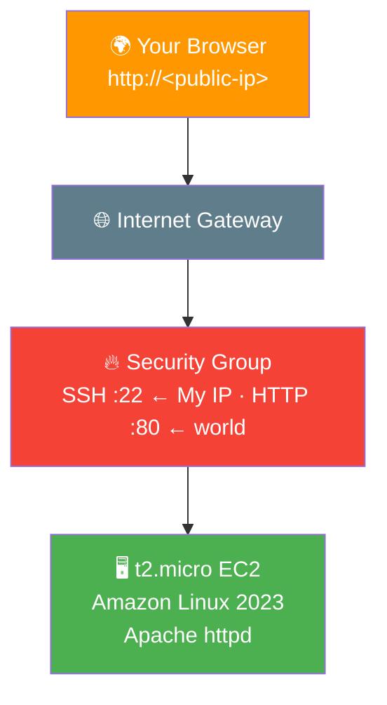

# ⚡ Lab 01 - EC2: Launch & Connect

> 📅 **Updated:** 21 August 2026 | ⏱️ **Duration:** ~30 minutes | 📊 **Level:** Beginner (Ground Zero 🌱)


> ### 🗣️ *"Ravi, every cloud engineer's journey starts with launching a virtual server. It's the 'Hello World' of AWS. Let's get your first EC2 instance up and running!"*
> — **Rithu** ☁️

<details>
<summary><b>🎭 Ravi & Rithu's Coffee Break Chat</b></summary>

**Ravi:** "So this EC2 instance... is it like my laptop?"

**Rithu:** "More like your laptop's cooler cousin who lives in a data center and doesn't overheat."

**Ravi:** "Can I install games on it?"

**Rithu:** "You CAN. But AWS charges by the hour, so your gaming habit just got a subscription model. 😏"

</details>

---

## 🎯 What You'll Master

| Skill | Description |
|-------|-------------|
| 🚀 **Launch an EC2 Instance** | From console click to running server in ~90 seconds |
| 🔑 **SSH Key Pairs** | Create, download, and protect your `.pem` |
| 🔐 **Connect via SSH** | Three ways in: terminal, PuTTY, browser |
| 🌐 **Install Apache httpd** | Install → start → enable, the sacred trio |
| 📄 **Host a Live Webpage** | Your HTML, served to the entire internet |
| 🧹 **Clean Termination** | Stop the billing meter like a pro |

> 💡 **Pro Tip:** This lab is the foundation for ALL 24 labs that follow. Take the 30 minutes seriously — every future skill stacks on top of this one!

---

## 🚦 Before You Start

### ✅ Prerequisites Checklist
- [ ] ☁️ **AWS account** with administrative access
- [ ] 🌍 **Single Region** — pick one and stick with it
- [ ] 🖥️ Basic familiarity with the AWS Console
- [ ] 🎓 Zero EC2 experience needed — this is day one!

### 📦 What You Need (and Don't)
| Required | Optional |
|----------|----------|
| AWS Account | PuTTY (Windows users only) |
| Browser + terminal access | Domain name (not yet!) |
| ~30 minutes | |

---

## 💰 Cost & Safety First

> ⚠️ **Real resources = Real charges.** This lab is Free Tier friendly — but only if you terminate!

> 🕰️ **Free Tier note:** Accounts created before **July 15, 2025** get 750 hrs/month of `t2.micro` free for 12 months. Newer accounts draw from their **$100–200 signup credits** instead (~$0.01 for this lab). Either way: **terminate when done!** [Details →](https://docs.aws.amazon.com/awsaccountbilling/latest/aboutv2/free-tier.html)

> 💸 **Ravi's Mistake of the Day:** *"I forgot to terminate my instance and got a surprise $15 bill next month."* Don't be Ravi. There's a Cleanup section at the bottom. **USE IT.** 🛑

### 🏷️ Naming Convention

| Resource | Name |
|----------|------|
| 🖥️ Instance | `first-ec2-instance` |
| 🔑 Key pair | `first-key-pair` |

---

## 🧠 How It All Fits Together



### 🔑 Key Concepts
| Component | Role |
|-----------|------|
| **EC2 Instance** | Your rented computer in AWS's data center |
| **AMI** | The disk image — we use Amazon Linux 2023 |
| **Instance Type** | The hardware size — `t2.micro` = free-tier tiny |
| **Key Pair** | Your door key — `.pem` file, lose it = locked out |
| **Security Group** | The bouncer 🚪 — stateful firewall with a guest list |

> 🗣️ **Rithu:** *"Before EC2 existed (2006!), you had to physically buy a server, rack it, wire it, and pray it didn't overheat. Now you launch one from your couch in 90 seconds. Appreciate the magic!"* ✨

---

## 🪜 Step-by-Step Guide

### 🟢 Step 1: Launch the EC2 Instance 🚀

<details>
<summary><b>📋 Expand for detailed steps</b></summary>

1. 🌐 Open **AWS Console** → search **EC2** → open it
2. ➕ Click the orange **Launch instance** button
3. 📝 **Name:** `first-ec2-instance`
4. 💿 **OS:** Amazon Linux → **Amazon Linux 2023 AMI** (Free Tier eligible ✅)
5. ⚙️ **Instance type:** `t2.micro`
6. 🔑 **Key pair:** **Create new key pair**
   - Name: `first-key-pair` · Type: **RSA** · Format: **`.pem`**
   - Click **Create key pair** → the `.pem` downloads automatically
7. 🌐 **Network settings → Edit:**
   - VPC/Subnet: leave default
   - **Auto-assign public IP:** ✅ Enable
   - Firewall: **Create security group** → name `launch-wizard-1`
   - Add rule: **SSH** `22` ← Source **My IP**
8. 💾 **Storage:** leave default 8 GiB
9. ✅ **Launch instance** → **View all instances**

</details>


> 🗣️ **Rithu's Tip:** *"Move that `.pem` file to `~/.ssh/` (Mac/Linux) or a dedicated folder (Windows). Don't lose it — you can't SSH without it, and AWS won't reissue it!"* 🔑

---

### 🟢 Step 2: Wait for Ready ⏳

<details>
<summary><b>⏳ Expand for readiness checks</b></summary>

1. 👀 Watch the instance state: **Pending** → **Running**
2. ✅ Wait for **2/2 status checks** passed (refresh every ~30 s)
3. 📋 Both checks green = your server is truly ready

</details>


---

### 🟢 Step 3: Find Your Public IP 🔍

<details>
<summary><b>🔍 Expand to find the IP</b></summary>

1. Click `first-ec2-instance` in the list
2. 📋 **Details** tab → copy **Public IPv4 address**
3. 📝 Note the **Public IPv4 DNS** too — it works just as well

</details>

---

### 🟢 Step 4: Connect via SSH 🔐

Pick **ONE** of three ways in:

<details>
<summary><b>🍎 Option A: Mac / Linux Terminal</b></summary>

```bash
# 1. Lock down key permissions (SSH is paranoid — rightly so!)
chmod 400 /path/to/first-key-pair.pem

# 2. SSH into your cloud server!
ssh -i /path/to/first-key-pair.pem ec2-user@<YOUR-PUBLIC-IP>
```

Type `yes` at the fingerprint prompt → you'll see the Amazon Linux 2023 ASCII logo and the `ec2-user@ip-...` prompt. 🎉

> 🗣️ **Rithu's Tip:** *"`Permissions 0644 are too open`? You forgot `chmod 400`. SSH rejects loose keys — it's protecting you from yourself!"*

</details>

<details>
<summary><b>🪟 Option B: Windows PuTTY</b></summary>

PuTTY needs `.ppk`. If you didn't pick `.ppk` at creation, convert:

1. 🔧 Open **PuTTYgen** → **Load** → select your `.pem`
2. 💾 **Save private key** → **Yes** (no passphrase) → `first-key-pair.ppk`

Connect:

| Setting | Value |
|---------|-------|
| Host Name | `ec2-user@<YOUR-PUBLIC-IP>` |
| Port | `22` |
| Connection type | SSH |
| Auth → Credentials | `first-key-pair.ppk` |

**Open** → **Accept** fingerprint → You're in! 🎉

</details>

<details>
<summary><b>🌐 Option C: EC2 Instance Connect (Browser)</b></summary>

The zero-setup option:

1. Select instance → **Connect** button
2. **EC2 Instance Connect** tab → **Connect**
3. ✨ Browser terminal appears — magic!

> 🗣️ **Rithu's Tip:** *"Great for quick tasks, but it struggles with private-subnet instances. Learn the CLI methods — they'll save you someday!"*

</details>

---

### 🟢 Step 5: Install Apache 🌐

<details>
<summary><b>🌐 Expand for httpd setup</b></summary>

```bash
# Update packages (always first!)
sudo dnf update -y

# Install Apache web server
sudo dnf install -y httpd

# Start it now
sudo systemctl start httpd

# Auto-start on reboot (survives restarts!)
sudo systemctl enable httpd

# Verify — want to see: active (running) 🟢
sudo systemctl status httpd
```

</details>

> 🗣️ **Rithu's Tip:** *"Remember **ISE** — **I**nstall, **S**tart, **E**nable. `start` runs it now; `enable` makes it survive reboots. Pros do both!"* 🔄

---

### 🟢 Step 6: Create Your Web Page 📝

<details>
<summary><b>📝 Expand for the one-liner</b></summary>

```bash
echo "<h1>Hello from Ravi's first EC2 instance!</h1>" | sudo tee /var/www/html/index.html
```

</details>

> 🗣️ **Rithu's Tip:** *"`tee` writes the file AND prints to screen — microphone + speaker 🎤. And `sudo` is required because `/var/www/html/` belongs to root."*

---

### 🟢 Step 7: Verify Your Work 🎉

<details>
<summary><b>🎉 Expand for verification</b></summary>

1. 🌍 Open your browser
2. 🔗 Go to `http://<YOUR-PUBLIC-IP>`
3. 👀 Expect: **Hello from Ravi's first EC2 instance!**

</details>

> 📸 **Screenshot Proof:** Capture the browser showing your custom page live on the internet.

> ⚠️ **Page not loading?** Your security group is missing the HTTP rule! Fix: **EC2 → Security Groups → your SG → Edit inbound rules → Add: HTTP `80` ← `0.0.0.0/0`** → Save → refresh → magic! ✨

> 🗣️ **Rithu's Tip:** *"It's `http://`, NOT `https://`. No SSL cert yet — patience, grasshopper. 🦗"*

---

## ✅ Validation Checklist

| # | Check | Status |
|---|-------|--------|
| 1️⃣ | EC2 launched from Amazon Linux 2023 AMI | ☐ ✅ |
| 2️⃣ | Key pair `first-key-pair` created & downloaded | ☐ ✅ |
| 3️⃣ | SSH connection established | ☐ ✅ |
| 4️⃣ | Apache `active (running)` | ☐ ✅ |
| 5️⃣ | Custom page visible at `http://<public-ip>` | ☐ ✅ |
| 6️⃣ | HTTP inbound rule added to security group | ☐ ✅ |

> 🏆 **Achievement Unlocked:** First Cloud Server! You've officially entered the cloud.

---

## 🧹 Cleanup (Follow Order!)

> ⚠️ **Future Ravi will thank you.** Forgotten instances bill forever!

| Step | Action | Console Location |
|------|--------|------------------|
| 1️⃣ 🗑️ | Terminate `first-ec2-instance` (Instance state → Terminate) | EC2 → Instances |
| 2️⃣ 🔑 | Delete `first-key-pair` (+ delete `.pem`/`.ppk` locally) | EC2 → Key Pairs |
| 3️⃣ 🧹 | Delete `launch-wizard-1` security group (wait for termination first!) | EC2 → Security Groups |

> 🗣️ **Rithu's Tip:** *"In my first month of AWS I racked up $87 — not because AWS is expensive, but because I didn't clean up. Build the cleanup muscle memory NOW."* 💪

---

## 🚀 Level Ups (Post-Core Lab)

| Challenge | What to Try | Notes |
|-----------|-------------|-------|
| 🔐 **HTTPS Peek** | Add port 443 inbound rule, try `https://<ip>` | Fails without cert — observe WHY, that's real learning |
| 📜 **User Data** | Relaunch with a bootstrap script in Advanced details | Zero-touch Apache installs |
| 🏷️ **Tagging** | Add `Name` + `Owner` tags to your instance | Habit for real environments |

---

## 🆘 Troubleshooting Quick Reference

| 🔍 Issue | 💡 Likely Cause | 🔧 Fix |
|-------|--------------|-----|
| 🔐 `Permission denied (publickey)` | Wrong key or permissions | `chmod 400` the `.pem`; verify username `ec2-user` |
| 🪟 PuTTY: `No supported auth algorithms` | Fed `.pem` directly | Convert to `.ppk` with PuTTYgen |
| 🌐 Website won't load | Missing HTTP rule in SG | Add inbound HTTP `80` ← `0.0.0.0/0` |
| ⏱️ Connection timeout | Wrong IP or instance stopped | Re-copy Public IP; check instance state |
| 📦 `yum` errors on AL2023 | AL2023 uses **dnf** | Use `sudo dnf update -y` / `dnf install -y httpd` |
| 🖥️ Default Apache test page | Custom index failed | Re-run the `echo \| sudo tee` command |

---

## 🎮 Test Yourself! (No Peeking 👀)

**Q1:** Which instance types are Free Tier eligible?

<details><summary>👀 Show answer</summary>

**A:** `t2.micro` — plus `t3.micro` and `t4g.micro`. Tiny workhorses, 750 hrs/month on legacy accounts. 🐴

</details>

**Q2:** What port does SSH use, and how should its source be restricted?

<details><summary>👀 Show answer</summary>

**A:** Port **22**, locked to **My IP** — never `0.0.0.0/0`, or internet bots will knock all night. 🚪

</details>

**Q3:** What does `systemctl enable httpd` do that `start` doesn't?

<details><summary>👀 Show answer</summary>

**A:** `start` runs it now; **`enable` auto-starts it after every reboot**. Both together = a server that survives restarts. 💪

</details>

### 🔥 Bonus Challenge

Add an HTTPS (443) rule and try `https://<your-ip>`. It won't fully work (no SSL cert) — but watch exactly HOW the browser complains. That's the door SSL later opens. 🔐

> 💪 **Rithu:** *"Breaking things on purpose is how you learn what 'working' actually means. Click the button, Ravi!"*

---

## 📚 Official Documentation

- 🚀 [Launch an EC2 Instance](https://docs.aws.amazon.com/AWSEC2/latest/UserGuide/EC2_GetStarted.html)
- 🔑 [EC2 Key Pairs](https://docs.aws.amazon.com/AWSEC2/latest/UserGuide/ec2-key-pairs.html)
- 🔐 [Connect to Your Linux Instance](https://docs.aws.amazon.com/AWSEC2/latest/UserGuide/AccessingInstances.html)
- 🌐 [Get Started with Amazon EC2](https://aws.amazon.com/ec2/getting-started/)

---

## 🎓 What You Learned

> **Your first full stack deployment loop:**
> - 🚀 **Launch** → AMI + type + key pair + SG
> - 🔐 **Connect** → SSH via terminal, PuTTY, or browser
> - 🌐 **Serve** → httpd installed, started, enabled
> - 🧹 **Terminate** → stop the meter deliberately

**Golden Habit:** Launch → Verify → **Terminate**. Every single time. 🧹

| | Approach |
|---|---|
| 👶 **Noob Way** | Open SSH to `0.0.0.0/0` "so I can connect from anywhere" |
| 🧙 **Pro Way** | Lock SSH to My IP. Security is not optional. |

> 🗣️ **Rithu:** *"If you remember ONE thing: don't open SSH to the whole world. My-IP-only, always. The bouncer should know your face!"* 🚪

---

## ➡️ What's Next?

This was the warm-up! Next up, we play with **firewalls** — lock down traffic, open ports on demand, and chain security groups together. Cloud bouncer school. 🫡

🎯 **[Lab 02 - EC2: Security Groups Deep Dive](../02%20-%20EC2%20-%20Security%20Groups%20Deep%20Dive/README.md)**

---

<div align="center">

### ⭐ Enjoyed this lab? Star the repo & share your feedback!

**Happy Learning!** 🚀☁️

</div>
