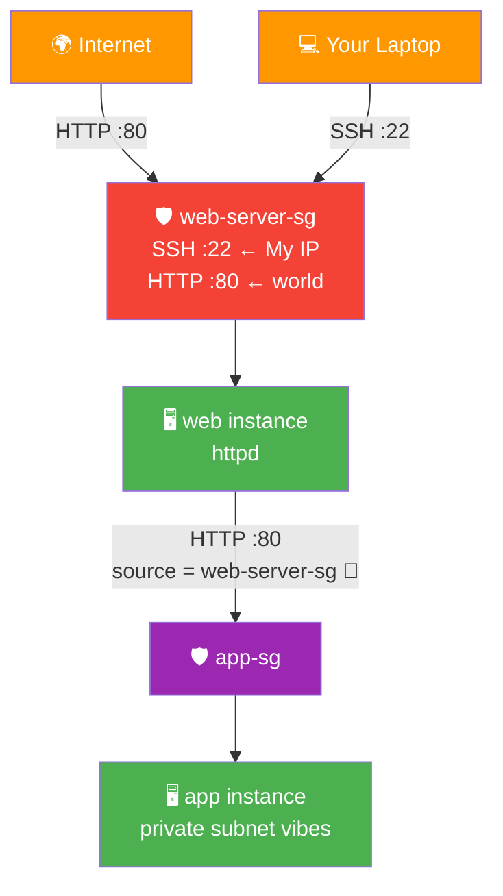
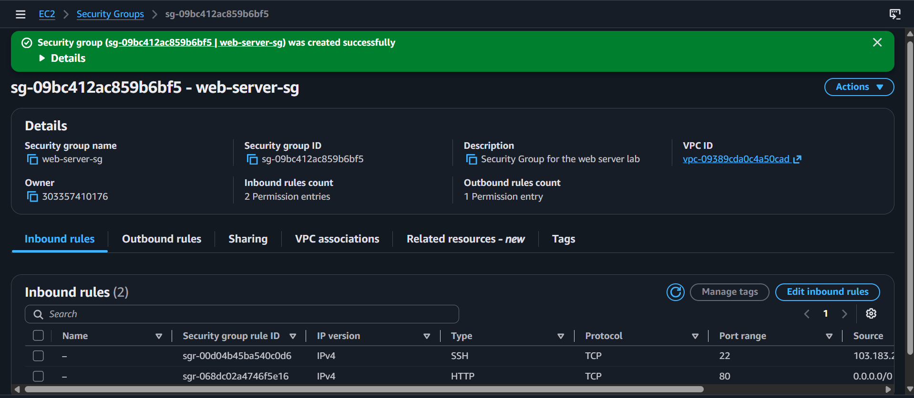
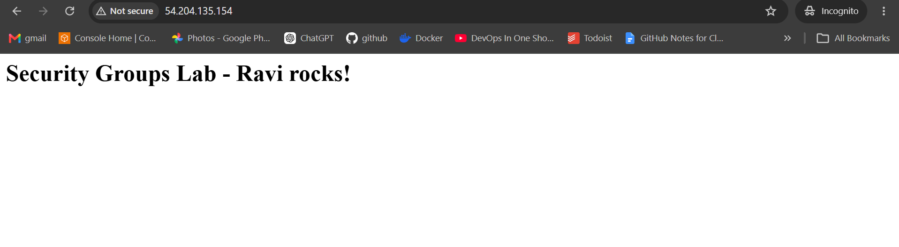
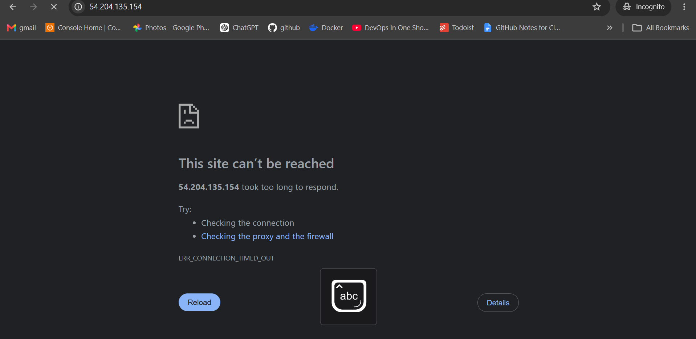
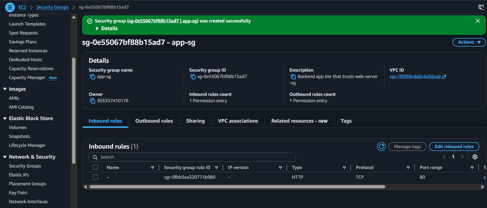

# 🔥 Lab 02 - EC2: Security Groups Deep Dive

> 📅 **Updated:** 21 August 2026 | ⏱️ **Duration:** ~25 minutes | 📊 **Level:** Beginner


> ### 🗣️ *"Security groups are the bouncers of your EC2 club. They decide who gets in (inbound) and what the party people can access (outbound). Tonight, YOU are the bouncer."*
> — **Rithu** 🚪

<details>
<summary><b>🎭 Ravi & Rithu's Coffee Break Chat</b></summary>

**Ravi:** "So security groups are like a bouncer at a club?"

**Rithu:** "Exactly! But this bouncer checks IDs, remembers faces, and never takes a break."

**Ravi:** "What if I open port 22 to `0.0.0.0/0`?"

**Rithu:** "That's leaving your front door wide open with a sign saying 'Free WiFi + Steal My Stuff'."

**Ravi:** "...Noted. Closing that immediately."

</details>

---

## 🎯 What You'll Master

| Skill | Description |
|-------|-------------|
| 🛡️ **Create Security Groups** | Hand-crafted rules instead of wizard defaults |
| 🌐 **Control Web Traffic** | Add/remove HTTP access live — watch the site die & revive |
| 🔐 **Restrict SSH by IP** | Understand why *My IP* matters |
| ⚡ **Live Rule Changes** | Rules apply instantly — no reboots |
| 🔗 **SG-to-SG Referencing** | The multi-tier secret weapon |
| 🧠 **Stateful Thinking** | Why replies flow back without extra rules |

> 💡 **Pro Tip:** Misconfigured security groups cause more outages and hacks than almost anything else in AWS. Master this lab and you'll never be the person who "opened everything just in case."

---

## 🚦 Before You Start

### ✅ Prerequisites Checklist
- [ ] ✅ **[Lab 01](../01%20-%20EC2%20-%20Launch%20and%20Connect/README.md) complete** — you need SSH basics + your key pair
- [ ] 🌍 Same Region as Lab 01
- [ ] 💻 Comfortable with basic Linux shell commands

### 📦 What You Need (and Don't)
| Required | Optional |
|----------|----------|
| Key pair from Lab 01 | Second browser for testing |
| ~25 minutes | |

---

## 💰 Cost & Safety First

> ✅ **Security groups are always free** — AWS charges for compute time, not firewall rules. Stick to `t2.micro` and this lab costs pennies (or draws pennies from credits on post-Jul-2025 accounts).

> 💸 **Ravi's Mistake of the Day:** *"I opened SSH to 0.0.0.0/0 during a lab. Within 10 minutes my instance was running crypto-mining software. AWS sent me a very stern email. Lesson: LOCK. YOUR. PORTS."* 🔒

### 🏷️ Naming Convention

| Resource | Name |
|----------|------|
| 🛡️ Web SG | `web-server-sg` |
| 🛡️ App SG | `app-sg` |
| 🖥️ Instances | `security-group-lab-instance`, `app-instance` |

---

## 🧠 How It All Fits Together



### 🔑 Key Concepts
| Component | Role |
|-----------|------|
| **Inbound rules** | Who's allowed INTO the club |
| **Outbound rules** | Who the club is allowed to call |
| **Stateful** | The bouncer remembers who left — replies walk back in free |
| **SG referencing** | Bouncer-to-bouncer trust: *"my friends are allowed"* — no IPs exposed |
| **Instant rules** | Guest list updates in real time, party keeps going |

> 🧠 **Did You Know?** Security groups are **stateful**: allow outbound traffic and the response returns automatically — no separate inbound rule needed. (Network ACLs are the stateless ones — different beast, later! 🐺)

---

## 🪜 Step-by-Step Guide

### 🟢 Step 1: Create the Web Server SG 🛡️

<details>
<summary><b>📋 Expand for detailed steps</b></summary>

1. 🌐 **EC2 Console** → **Security Groups** (under Network & Security)
2. ➕ **Create security group**
3. 📝 Fill in:

   | Field | Value |
   |-------|-------|
   | Name | `web-server-sg` |
   | Description | `Security group for the web server lab` |
   | VPC | default VPC |

4. ➕ **Inbound rules:**

   | Type | Port | Source | Description |
   |------|------|--------|-------------|
   | SSH | 22 | **My IP** | SSH from my secure fortress |
   | HTTP | 80 | **0.0.0.0/0** | Allow all web traffic |

5. 📤 Outbound: leave default (**Allow all**)
6. ✅ **Create security group**

</details>



> 🗣️ **Rithu's Tip:** *"SSH locked to YOUR IP, HTTP open to the world — that's intentional. You manage the server privately; your users browse publicly."*

---

### 🟢 Step 2: Launch an Instance With It 🖥️

<details>
<summary><b>🖥️ Expand for launch steps</b></summary>

1. 🌐 **EC2 → Instances → Launch instance**
2. 📝 **Name:** `security-group-lab-instance`
3. ⚙️ **AMI:** Amazon Linux 2023 · **Type:** `t2.micro`
4. 🔑 **Key pair:** select `first-key-pair` from Lab 01
5. 🌐 **Network settings:**
   - Auto-assign public IP: ✅ Enable
   - Firewall: **Select existing security group** → `web-server-sg`
6. 💾 Storage: default 8 GiB → ✅ **Launch**

</details>

---

### 🟢 Step 3: Set Up the Web Server 🌐

<details>
<summary><b>🌐 Expand for server setup</b></summary>

Wait for **2/2 checks**, then SSH in:

```bash
ssh -i first-key-pair.pem ec2-user@<public-ip>
```

Install and serve:

```bash
sudo dnf update -y
sudo dnf install -y httpd
sudo systemctl start httpd
sudo systemctl enable httpd
echo '<h1>Security Groups Lab - Ravi rocks!</h1>' | sudo tee /var/www/html/index.html
```

</details>

> 🗣️ **Rithu's Tip:** *"Lost your key? Check Downloads. Future you keeps SSH keys organized... present you, well, at least it's somewhere."* 😅

---

### 🟢 Step 4: Verify Access ✅

<details>
<summary><b>✅ Expand for verification</b></summary>

1. 🌍 Browser → `http://<public-ip>` (not https!)
2. 👀 Expect: **"Security Groups Lab - Ravi rocks!"**
3. 🎉 Take a moment. You built this.

</details>



---

### 🟢 Step 5: The SSH Restriction Test 🚫

<details>
<summary><b>🚫 Expand for the lockout experiment</b></summary>

Your SSH rule trusts **My IP**. Simulate being elsewhere:

1. 🔧 `web-server-sg` → **Edit inbound rules** → change SSH source to `1.2.3.4/32` → **Save**
2. 🖥️ Existing SSH session keeps working (stateful! established connections stay open)
3. 🆕 Open a **NEW** terminal and try SSH → it hangs, then times out. **Denied!** 🚫
4. ↩️ Change source back to **My IP** → save → SSH works again

</details>

> 🗣️ **Rithu's Tip:** *"At a coffee shop your IP changes — and your bouncer doesn't recognize you anymore. That's exactly how production incidents start!"* ☕

---

### 🟢 Step 6: Kill the Site (On Purpose!) 💥

<details>
<summary><b>💥 Expand for the takedown</b></summary>

1. 🔧 `web-server-sg` → **Edit inbound rules**
2. 🗑️ Remove the HTTP rule → **Save**
3. 🔄 Refresh `http://<public-ip>` in a **fresh Incognito window**

Result: connection refused/timeout. AWS silently drops those packets — the server is fine, the door is just closed.

</details>



> 🗣️ **Rithu's Tip:** *"Stateful = an already-open keep-alive connection can linger after the rule dies. Incognito window = clean test!"*

---

### 🟢 Step 7: Restore + Add HTTPS ✨

<details>
<summary><b>✨ Expand for restore steps</b></summary>

1. ➕ Edit inbound rules → **Add rule:** HTTP `80` ← `0.0.0.0/0` (`HTTP restored`) → **Save**
2. 🔄 Refresh browser → site's back! Feels powerful, right? 🔥
3. 🔒 Add another rule while you're there: **HTTPS** `443` ← `0.0.0.0/0` (`HTTPS placeholder`) — ready for SSL in later labs

</details>

---

### 🟢 Step 8: SG-to-SG Referencing 🔗

<details>
<summary><b>🔗 Expand for the spicy part</b></summary>

Security groups can trust **other security groups** instead of IP ranges — gold for multi-tier apps!

**Create the backend SG:**

1. ➕ **Create security group**
2. 📝 Name: `app-sg` · Description: `Backend app tier that trusts web-server-sg`
3. ➕ Inbound: **HTTP** `80` ← Source: **Custom** → type `web-server-sg` → select it
4. ✅ Source shows `web-server-sg (sg-xxxxxxxx)` → **Create**

**Launch the backend instance:**

5. 🖥️ Launch `app-instance` (t2.micro, AL2023) with **`app-sg`** — no public IP needed

**Wire up and test:**

6. SSH into `app-instance`:
   ```bash
   sudo dnf install -y httpd && sudo systemctl start httpd
   echo "<h1>Backend App - Only reachable from web-server-sg</h1>" | sudo tee /var/www/html/index.html
   ```
7. SSH into `security-group-lab-instance`, then:
   ```bash
   curl http://<private-ip-of-app-instance>
   ```
8. 👀 You get the backend page — because traffic came from something wearing the `web-server-sg` badge!

</details>



> 🗣️ **Rithu's Tip:** *"Instead of handing out addresses (IPs), your bouncer tells the other bouncer: 'my friends are allowed.' Even if IPs change — auto-scaling! — the trust holds."* 🤝

---

## ✅ Validation Checklist

| # | Check | Status |
|---|-------|--------|
| 1️⃣ | `web-server-sg`: SSH ← My IP, HTTP ← anywhere | ☐ ✅ |
| 2️⃣ | Browser loads the custom page | ☐ ✅ |
| 3️⃣ | SSH blocked after source change to `1.2.3.4/32` | ☐ ✅ |
| 4️⃣ | Removing HTTP kills the site | ☐ ✅ |
| 5️⃣ | Re-adding HTTP revives the site | ☐ ✅ |
| 6️⃣ | HTTPS placeholder rule added | ☐ ✅ |
| 7️⃣ | `app-sg` references `web-server-sg` as source | ☐ ✅ |
| 8️⃣ | Web instance curls app instance via private IP | ☐ ✅ |

> 🏆 **Achievement Unlocked:** Firewall Master! You control the gates now.

---

## 🧹 Cleanup (Follow Order!)

> ⚠️ **Double-check every item — forgotten instances bill forever!**

| Step | Action | Console Location |
|------|--------|------------------|
| 1️⃣ 🗑️ | Terminate `security-group-lab-instance` | EC2 → Instances |
| 2️⃣ 🗑️ | Terminate `app-instance` | EC2 → Instances |
| 3️⃣ ⏳ | Wait 2–3 min for full termination | ☕ break time |
| 4️⃣ 🧹 | Delete `web-server-sg` and `app-sg` | EC2 → Security Groups |
| 5️⃣ 🔑 | Delete key pair (if you made a new one) | EC2 → Key Pairs |

---

## 🚀 Level Ups (Post-Core Lab)

| Challenge | What to Try | Notes |
|-----------|-------------|-------|
| 🏗️ **Three Tiers** | Add a `db-sg` allowing 3306 only from `app-sg` | The full defense-in-depth chain |
| 🚪 **NACL Peek** | Compare a Network ACL vs your SGs | Stateless vs stateful, feel the difference |
| ⚡ **Rule Racing** | Time how fast a new rule takes effect | Spoiler: near-instant |

---

## 🆘 Troubleshooting Quick Reference

| 🔍 Issue | 💡 Likely Cause | 🔧 Fix |
|-------|--------------|-----|
| 🔐 SSH times out after source change | Rule no longer matches your IP | Set source back to **My IP** |
| 🌐 Browser times out after HTTP removal | Door is closed | Re-add HTTP `80` inbound rule |
| 🚫 Curl gets `Connection refused` | httpd not running on target | `sudo systemctl status httpd`; install if missing |
| ⚠️ Can't delete a security group | Instances still attached | Terminate instances first, wait 2–3 min |
| 🔒 Multiple SGs assigned, still blocked | No rule allows that traffic anywhere | SG rules are **additive** — check each SG for the missing rule |
| 🔗 SG referencing fails | Wrong VPC or Region | Both SGs must share the same VPC **and** Region |

---

## 🎮 Test Yourself! (No Peeking 👀)

**Q1:** True or false: security groups are **stateless** — every reply needs its own inbound rule.

<details><summary>👀 Show answer</summary>

**A:** **False!** They're **stateful** — replies to connections your instance initiated flow back automatically. 🧠

</details>

**Q2:** You add a new inbound rule. Restart required?

<details><summary>👀 Show answer</summary>

**A:** **Nope.** Rules apply instantly — the bouncer updates the list mid-party. 🎉

</details>

**Q3:** Why reference an SG instead of an IP range?

<details><summary>👀 Show answer</summary>

**A:** IPs change (auto-scaling!); the **group identity is stable**. You trust the badge, not the address. 🎯

</details>

> 💪 **Rithu:** *"If you can chain security groups in your sleep, you're already ahead of half the engineers I've met."*

---

## 📚 Official Documentation

- 🛡️ [Amazon EC2 Security Groups](https://docs.aws.amazon.com/AWSEC2/latest/UserGuide/ec2-security-groups.html)
- ⚖️ [Security Group Rules Reference](https://docs.aws.amazon.com/AWSEC2/latest/UserGuide/security-group-rules.html)
- 🔗 [Referencing Security Groups](https://docs.aws.amazon.com/AWSEC2/latest/UserGuide/security-group-rules.html#security-group-referencing)

---

## 🎓 What You Learned

> **The bouncer's full job description:**
> - 🚪 **Inbound** → who gets in (SSH: My IP, HTTP: world)
> - 📞 **Outbound** → who the club calls (default: everyone)
> - 🧠 **Stateful** → replies come home free
> - 🤝 **Referencing** → trust badges, not addresses
> - ⚡ **Instant** → rules live-update, zero downtime

**Golden Habit:** Least privilege per tier → test both directions → clean up every rule you create. 🧹

| | Approach |
|---|---|
| 👶 **Noob Way** | One SG, all ports open, "for convenience" |
| 🧙 **Pro Way** | Separate SG per tier: web gets 80/443, app trusts web-SG, DB trusts app-SG |

---

## ➡️ What's Next?

Time to talk disks — EC2 without storage is a laptop without a hard drive. We'll add volumes, format them, snapshot them, and restore like cloud forensics pros (but friendlier). 🔍

🎯 **[Lab 03 - EBS: Volumes and Snapshots](../03%20-%20EBS%20-%20Volumes%20and%20Snapshots/README.md)**

---

<div align="center">

### ⭐ Enjoyed this lab? Star the repo & share your feedback!

**Happy Learning!** 🚀☁️

</div>
