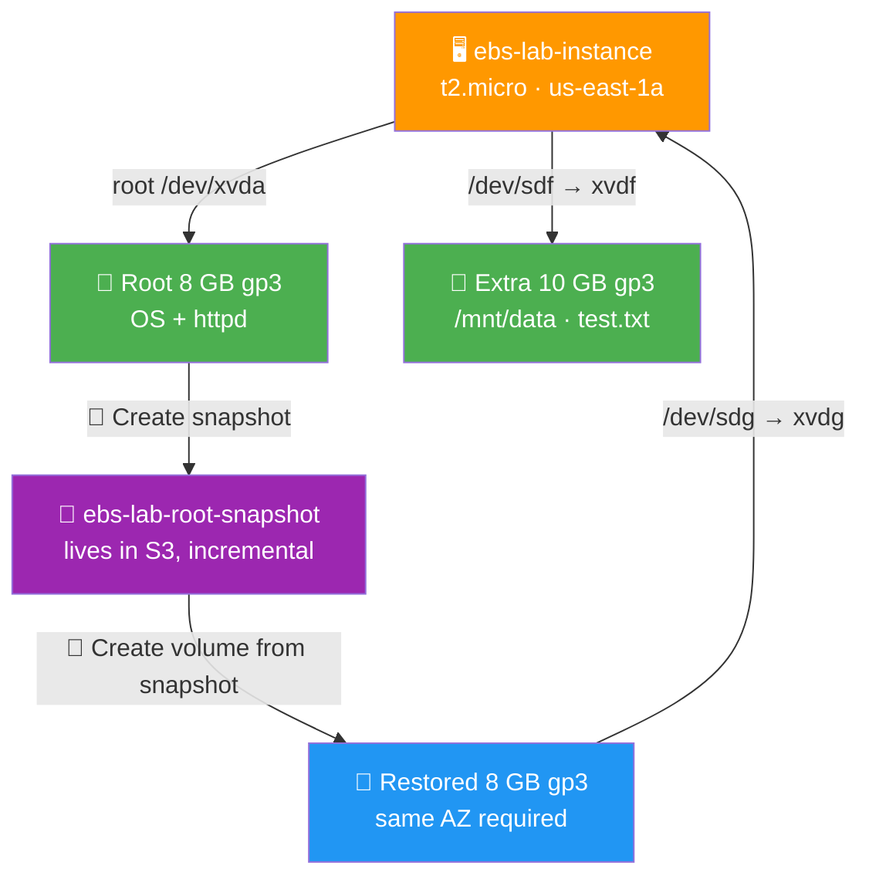

# 💾 Lab 03 - EBS: Volumes and Snapshots

> 📅 **Updated:** 21 August 2026 | ⏱️ **Duration:** ~30 minutes | 📊 **Level:** Beginner


> ### 🗣️ *"EBS volumes are like USB drives for your EC2 instance — except they never get lost in the couch cushions and you can take photo-perfect snapshots of them."*
> — **Rithu** 📸

<details>
<summary><b>🎭 Ravi & Rithu's Coffee Break Chat</b></summary>

**Ravi:** "What happens if I accidentally delete an EBS volume?"

**Rithu:** "It's gone. Like, *really* gone. Like 'should-have-backed-up' gone."

**Ravi:** "Even if I'm nice to it?"

**Rithu:** "AWS doesn't respond to please and thank you. That's what snapshots are for."

</details>

---

## 🎯 What You'll Master

| Skill | Description |
|-------|-------------|
| 💾 **Attach Extra Storage** | Add a second volume to a live instance |
| 🔧 **Format & Mount** | `mkfs` + `mount` like a Linux pro |
| 📸 **Snapshot Volumes** | Point-in-time backups that outlive everything |
| 🔄 **Restore From Snapshots** | Rebuild a disk from its photo |
| 🗺️ **AZ Affinity** | The one rule everyone trips on |

> 💡 **Pro Tip:** Real apps separate the OS disk from the data disk so they can scale, back up, and swap servers without losing data. Snapshots are how every AWS backup actually works under the hood.

---

## 🚦 Before You Start

### ✅ Prerequisites Checklist
- [ ] ✅ **[Lab 01](../01%20-%20EC2%20-%20Launch%20and%20Connect/README.md)** + **[Lab 02](../02%20-%20EC2%20-%20Security%20Groups%20Deep%20Dive/README.md)** complete
- [ ] 🔑 Key pair ready (`first-key-pair`)
- [ ] 🛡️ `web-server-sg` still exists (or any SG with SSH ← My IP)
- [ ] 💻 SSH comfort level: confident

### 📦 What You Need (and Don't)
| Required | Optional |
|----------|----------|
| ~30 minutes | Coffee ☕ (snapshot refresh clicking burns calories) |
| Same Region as Labs 01–02 | |

---

## 💰 Cost & Safety First

| Item | Cost |
|------|------|
| t2.micro instance | ✅ Free Tier eligible |
| 8 GB gp3 root volume | ✅ Within the 30 GB-month EBS free allowance |
| 10 GB extra gp3 volume | ⚠️ A few cents if left running |
| 📸 Snapshots | ~$0.05/GB-month — negligible here, but **DELETE them after!** |

> 💸 **Ravi's Mistake of the Day:** *"I created a 500 GB snapshot and forgot about it. Three months later: $75 in surprise charges. Snapshots survive instance termination AND volume deletion. ALWAYS delete them."*

### 🏷️ Naming Convention

| Resource | Name |
|----------|------|
| 🖥️ Instance | `ebs-lab-instance` |
| 💾 Extra volume | `ebs-lab-extra-volume` |
| 📸 Snapshot | `ebs-lab-root-snapshot` |

---

## 🧠 How It All Fits Together



### 🔑 Key Concepts
| Component | Role |
|-----------|------|
| **Root volume** (`xvda`) | The OS disk your instance boots from |
| **Extra volume** (`xvdf`) | Your data disk — format, mount, fill it |
| **Snapshot** | Photo of a volume, stored in S3, **incremental** |
| **Restore** | New volume built from a snapshot — filesystem and all |
| **Same-AZ rule** | Volume and instance must share an AZ. No exceptions. |

> 🧠 **Did You Know?** Snapshots are incremental — the first copies all blocks, later ones only copy changes. Daily snapshots of a 1 TB volume ≠ 30 TB of storage.

---

## 🪜 Step-by-Step Guide

### 🟢 Step 1: Launch the Instance 🖥️

<details>
<summary><b>🖥️ Expand for launch steps</b></summary>

1. 🌐 **EC2 Console → Launch instance**
2. 📝 **Name:** `ebs-lab-instance`
3. ⚙️ **AMI:** Amazon Linux 2023 · **Type:** `t2.micro`
4. 🔑 **Key pair:** `first-key-pair`
5. 🌐 **Network settings:**
   - Subnet: pick one in **us-east-1a** *(AZ matters — write it down!)*
   - Auto-assign public IP: ✅ Enable
   - Firewall: **Select existing** → `web-server-sg` (or any SG with SSH ← My IP)
6. 💾 Storage: default 8 GB gp3 root → ✅ **Launch**
7. ⏳ Wait for **Running + 2/2 checks**

</details>

> 🗣️ **Rithu's Tip:** *"The Availability Zone matters A LOT for EBS. You can only attach a volume to an instance in the SAME AZ. I learned this by clicking around aimlessly for 10 minutes."*

---

### 🟢 Step 2: Inspect What You Have 🔍

<details>
<summary><b>🔍 Expand for inspection commands</b></summary>

SSH in:

```bash
ssh -i first-key-pair.pem ec2-user@<public-ip>
```

List block devices:

```bash
lsblk
```
```
NAME    MAJ:MIN RM SIZE RO TYPE MOUNTPOINT
xvda    202:0    0   8G  0 disk
└─xvda1 202:1    0   8G  0 part /
```

Check usage and filesystem signature:

```bash
df -h
file -s /dev/xvda     # raw disk — no signature yet
file -s /dev/xvda1    # partition — says ext4
```

</details>

> 🗣️ **Rithu's Tip:** *"`/dev/xvda` is the whole pizza; `/dev/xvda1` is a slice. mmm."* 🍕

---

### 🟢 Step 3: Create + Attach a 10 GB Volume 💾

<details>
<summary><b>💾 Expand for create & attach steps</b></summary>

**Create:**

1. 🌐 EC2 → **Volumes** → ➕ **Create volume**

   | Field | Value |
   |-------|-------|
   | Type | **gp3** |
   | Size | **10 GiB** |
   | IOPS / Throughput | 3000 / 125 (gp3 defaults) |
   | Availability Zone | **us-east-1a** — MUST match your instance! |
   | Encryption | None (keep it simple) |
   | Tags | `Name` = `ebs-lab-extra-volume` |

2. ✅ **Create volume** → wait for status **Available**

**Attach:**

3. Select the volume → **Actions → Attach volume**
4. Instance: type `ebs-lab-instance` · Device: `/dev/sdf` (shows up as `/dev/xvdf` on t2.micro)
5. ✅ Attach → wait for state **in-use**

</details>


---

### 🟢 Step 4: Format & Mount It 🔧

<details>
<summary><b>🔧 Expand for format & mount commands</b></summary>

Confirm the new disk appeared:

```bash
lsblk        # xvdf  202:80  0  10G  0 disk
```

Format as ext4 (answer `y` if prompted about an existing superblock):

```bash
sudo mkfs -t ext4 /dev/xvdf
```

Create a mount point and mount:

```bash
sudo mkdir /mnt/data
sudo mount /dev/xvdf /mnt/data
df -h        # /dev/xvdf mounted at /mnt/data, ~9.6G available
```

</details>

> 🗣️ **Rithu's Tip:** *"To survive reboots you'd add this to `/etc/fstab`. We skip it here to keep cleanup clean — but know that reboot = volume exists, auto-mount does NOT happen without fstab."*

---

### 🟢 Step 5: Write Data 📄

<details>
<summary><b>📄 Expand for write steps</b></summary>

```bash
echo "EBS Lab by Ravi" | sudo tee /mnt/data/test.txt
cat /mnt/data/test.txt       # → EBS Lab by Ravi
ls -la /mnt/data             # readable ✓
```

This file is our "precious data" we'll prove survives via snapshots.

</details>

---

### 🟢 Step 6: Snapshot the Root Volume 📸

<details>
<summary><b>📸 Expand for snapshot steps</b></summary>

1. 🌐 EC2 → **Volumes** → select the **8 GB root volume** (`/dev/xvda`)
2. 📸 **Actions → Create snapshot**

   | Field | Value |
   |-------|-------|
   | Description | `Snapshot of root volume from ebs-lab-instance` |
   | Tags | `Name` = `ebs-lab-root-snapshot` |

3. ✅ **Create snapshot** → check **Snapshots** page: `pending` → `completed` (~1–2 min)

</details>

> 🗣️ **Rithu's Tip:** *"Refresh-clicking the pending snapshot won't speed it up. It's incremental — first one copies everything, so give it a minute."* ⏳

---

### 🟢 Step 7: Restore Into a New Volume 🔄

<details>
<summary><b>🔄 Expand for restore steps</b></summary>

1. 🌐 EC2 → **Snapshots** → select `ebs-lab-root-snapshot`
2. 🔄 **Actions → Create volume from snapshot**

   | Field | Value |
   |-------|-------|
   | Type | **gp3** |
   | Size | **8 GiB** (≥ snapshot size) |
   | Availability Zone | **us-east-1a** (same AZ again!) |

3. ✅ **Create volume** → a perfect copy appears: filesystem, partitions, customizations and all

**Attach & explore:**

4. Select it → **Actions → Attach volume** → `ebs-lab-instance`, device `/dev/sdg`
5. In SSH:
   ```bash
   lsblk                      # xvdg shows up
   sudo fdisk -l /dev/xvdg    # snapshot carries the partition table!
   sudo mkdir /mnt/restored
   sudo mount /dev/xvdg1 /mnt/restored    # partitioned → mount the PARTITION
   # if no partitions: sudo mount /dev/xvdg /mnt/restored
   ls /mnt/restored/          # full Linux directory structure — your root at snapshot time!
   ```

</details>

> 🗣️ **Rithu's Tip:** *"If the source was partitioned, the restored volume is too — mount `xvdg1`, not raw `xvdg`."*

---

## ✅ Validation Checklist

| # | Check | Status |
|---|-------|--------|
| 1️⃣ | `lsblk` shows root + extra disk | ☐ ✅ |
| 2️⃣ | `df -h` shows `/mnt/data` with ~9.6 GB available | ☐ ✅ |
| 3️⃣ | `cat /mnt/data/test.txt` → `EBS Lab by Ravi` | ☐ ✅ |
| 4️⃣ | Snapshot listed with `completed` status | ☐ ✅ |
| 5️⃣ | Restored volume attached, mounted, browsable at `/mnt/restored` | ☐ ✅ |

> 🏆 **Achievement Unlocked:** Backup Hero! Your data has a safety net.

---

## 🧹 Cleanup (Follow Order!)

> ⚠️ **Snapshots outlive volumes AND instances. Delete every item below!**

| Step | Action | Console Location |
|------|--------|------------------|
| 1️⃣ 🗑️ | Terminate `ebs-lab-instance` (root volume auto-deletes) | EC2 → Instances |
| 2️⃣ 💾 | Detach `ebs-lab-extra-volume` → wait for Available → **Delete** | EC2 → Volumes |
| 3️⃣ 💾 | Detach restored 8 GB volume → wait for Available → **Delete** | EC2 → Volumes |
| 4️⃣ 📸 | Delete `ebs-lab-root-snapshot` | EC2 → Snapshots |

> 🗣️ **Rithu's Tip:** *"Snapshots live INDEPENDENTLY of their source. Delete the volume, the snapshot stays — and keeps billing. DELETE IT."*

---

## 🚀 Level Ups (Post-Core Lab)

| Challenge | What to Try | Notes |
|-----------|-------------|-------|
| 🧟 **Zombie Disk Drill** | Snapshot → delete original volume → restore fresh → data intact | The exact production dead-disk recovery flow |
| 📜 **fstab Forever** | Add the mount to `/etc/fstab` and reboot | Mount survives — then remove the entry before cleanup |
| 📏 **Grow a Volume** | Modify the 10 GB volume to 20 GB, extend the filesystem | `growpartition`/`resize2fs` territory |

---

## 🆘 Troubleshooting Quick Reference

| 🔍 Issue | 💡 Likely Cause | 🔧 Fix |
|-------|--------------|-----|
| 🚫 Can't attach volume | Different AZ than instance | Create the volume in the instance's AZ |
| 🔧 `mkfs: device or resource busy` | Already formatted/mounted | Check `lsblk` + `df -h`; `sudo umount /dev/xvdf` |
| 📁 `already mounted` error | Target in use | `sudo umount /mnt/data` and retry |
| ⏳ Snapshot stuck on `pending` | First snapshot copies all blocks | Wait 2–10 min — it's working |
| 🔍 `file -s` shows no signature | Raw unformatted volume | `sudo mkfs -t ext4 /dev/xvdg` |
| ❌ `/dev/xvdg1 does not exist` | No partition table on restore | Mount whole device: `sudo mount /dev/xvdg /mnt/restored` |
| 💸 Billed after termination | Orphaned non-delete-on-termination volume | Volumes → find orphaned Available 8 GB → delete |

---

## 🎮 Test Yourself! (No Peeking 👀)

**Q1:** Volume in `us-east-1a`, instance in `us-east-1b`. Attach?

<details><summary>👀 Show answer</summary>

**A:** **No!** EBS is AZ-locked. Create in the same AZ — or snapshot → restore into the right AZ. 🎯

</details>

**Q2:** Where do snapshots physically live, and are they full copies each time?

<details><summary>👀 Show answer</summary>

**A:** **S3**, and they're **incremental** — only changed blocks after the first. Cheap, fast, clever. 🧠

</details>

**Q3:** You `mount /dev/xvdf /data`, reboot, and it's gone. Why?

<details><summary>👀 Show answer</summary>

**A:** `mount` is temporary. Add the entry to **`/etc/fstab`** for auto-mount on boot. 📜

</details>

> 💪 **Rithu:** *"Snapshots are your time machine. Take them BEFORE you break things — not after."*

---

## 📚 Official Documentation

- 💾 [Amazon EBS Volumes](https://docs.aws.amazon.com/ebs/latest/userguide/ebs-volumes.html)
- 📸 [Amazon EBS Snapshots](https://docs.aws.amazon.com/ebs/latest/userguide/ebssnapshots.html)
- 🔧 [Make an Amazon EBS Volume Available for Use](https://docs.aws.amazon.com/ebs/latest/userguide/ebs-using-volumes.html)

---

## 🎓 What You Learned

> **The disk whisperer's routine:**
> - 💾 **Lifecycle** → Create → Attach → Format → Mount → Use (**CAFMU** — say it like a pirate: *"Can Anyone Format My Universe?"* 🏴‍☠️)
> - 🗺️ **AZ affinity** → same-AZ only, no exceptions
> - 📸 **Snapshots** → point-in-time, incremental, stored in S3
> - 🔄 **Restore** → snapshot → new volume → attach → mount the partition
> - 📜 **Persistence** → `mount` = temporary, `/etc/fstab` = forever

**Golden Habit:** Separate data from OS → snapshot before risky changes → delete snapshots when done. 🧹

| | Approach |
|---|---|
| 👶 **Noob Way** | Cram everything on root — out of space, one bad day loses it all |
| 🧙 **Pro Way** | Separate data volume + snapshots before risky changes; server dies? New one mounts the data and you're back |

---

## ➡️ What's Next?

You've backed up a disk. Next: turn a whole configured server into a reusable golden image — Ctrl+C Ctrl+V for EC2. 🍼

🎯 **[Lab 04 - AMI: Create and Clone](../04%20-%20AMI%20-%20Create%20and%20Clone/README.md)**

---

<div align="center">

### ⭐ Enjoyed this lab? Star the repo & share your feedback!

**Happy Learning!** 🚀☁️

</div>
