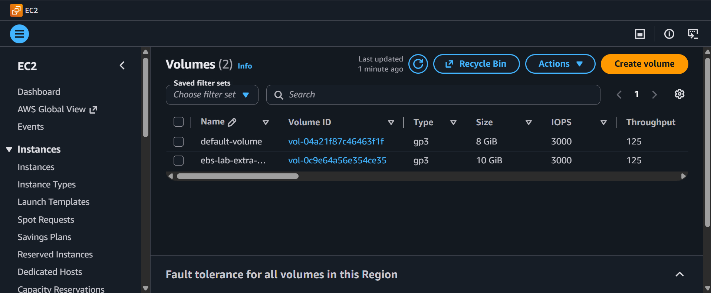

<div align="center">


# EBS: Volumes and Snapshots


</div>

---

> **"EBS volumes are like USB drives for your EC2 instance, except they never get lost in the couch cushions and you can take photo-perfect snapshots of them."** - Rithu


> *"EBS volumes are like USB drives for your EC2 instance, except they never get lost in the couch cushions and you can take photo-perfect snapshots of them."* — Rithu

---

<details>
<summary><b>🎭 Ravi & Rithu's Coffee Break Chat</b></summary>

**Ravi:** "What happens if I accidentally delete an EBS volume?"

**Rithu:** "It's gone. Like, really gone. Like 'should-have-backed-up' gone."

**Ravi:** "Even if I'm nice to it?"

**Rithu:** "AWS doesn't respond to please and thank you. That's what snapshots are for."

</details>

---

## 📋 Table of Contents

- [🎯 Objective](#-objective)
- [📊 Lab Progress](#-lab-progress)
- [🤔 In Plain English](#-in-plain-english)
- [🧠 Prerequisites](#-prerequisites)
- [💰 Cost Warning](#-cost-warning)
- [🏗️ Architecture](#️-architecture)
- [🛠️ Step-by-Step Instructions](#️-step-by-step-instructions)
- [✅ Validation Checklist](#-validation-checklist)
- [🧹 Cleanup (IMPORTANT!)](#-cleanup-important)
- [🧠 Memory Tips](#-memory-tips)
- [🎓 What You Learned](#-what-you-learned)
- [🎮 Test Yourself](#-test-yourself-no-peeking-)
- [🆚 Pro Tip vs Noob Tip](#-pro-tip-vs-noob-tip)
- [🔗 What's Next?](#-whats-next)
- [❓ Troubleshooting](#-troubleshooting)

---

<div align="center">

## 📊 Lab Progress

`[██░░░░░░░░░░░░░░░░░░] 5% — Let's Begin!`

</div>

---

## 🤔 In Plain English

> **What is this, really?** EBS is a **virtual hard drive you can unplug and plug into EC2 instances**. Your instance's "system disk" is already an EBS volume — but you can add more! It's like an external USB drive, except it's network-attached and lives in the same building (Availability Zone) as your server.
>
> 🌍 **Why you should care:** Real apps separate the OS disk from the data disk so they can scale, back up, and even swap servers without losing data. Snapshots are how every AWS backup actually works under the hood.

---

## 🎯 Objective

Create and attach an Elastic Block Store (EBS) volume to an EC2 instance, format and mount it, write data to it, take a snapshot of an existing volume, and restore data from that snapshot onto a new volume. This is how backups really work in the cloud.

## 🧠 Prerequisites

- Completion of **[Lab 01 — EC2: Launch and Connect](../01%20-%20EC2%20-%20Launch%20and%20Connect/README.md)** and **[Lab 02 — EC2: Security Groups Deep Dive](../02%20-%20EC2%20-%20Security%20Groups%20Deep%20Dive/README.md)**
- Familiarity with SSH

## 💰 Cost Warning

- t2.micro – Free Tier eligible ✅
- 8 GB gp3 root volume – within Free Tier (30 GB-month EBS free)
- 10 GB additional gp3 volume – could incur a few cents if left running
- **Snapshots** cost ~$0.05 per GB-month in standard tier — negligible for this lab, but DELETE them afterward

> *Ravi learned the hard way that EBS snapshots survive instance termination. Donation: $2 worth of orphaned snapshots over a month. Be like Ravi-but-wiser: clean up.*

> **Ravi's Mistake of the Day:** I created a 500 GB EBS snapshot and forgot about it. Three months later: $75 in surprise charges. Snapshots survive instance termination. ALWAYS delete them.

## 🏗️ Architecture

```
┌────────────────────────────────────────────────┐
│           EC2 t2.micro (Amazon Linux 2023)     │
│                                                  │
│  ┌───────────────────┐  ┌──────────────────┐   │
│  │ Root Volume (xvda) │  │ New Volume (xvdf)│   │
│  │ 8 GB gp3          │  │ 10 GB gp3        │   │
│  │ OS + httpd        │  │ /mnt/data        │   │
│  │                   │  │ test.txt         │   │
│  │ SNAPSHOT → NewVol  │  │                  │   │
│  └───────────────────┘  └──────────────────┘   │
│                                                  │
└────────────────────────────────────────────────┘
                         │
                    Snapshot
                    (restore target)
```

> **Did You Know?** EBS snapshots are incremental. The first snapshot copies all data, but subsequent snapshots only copy what changed. So taking daily snapshots of a 1TB volume doesn't cost you 30TB of storage.

## 🛠️ Step-by-Step Instructions

> 

### Step 1: Launch the Instance

1. EC2 Console → **Launch instance**.
2. Name: `ebs-lab-instance`.

3. **AMI:** Amazon Linux 2023.

4. **Instance type:** t2.micro.

5. **Key pair:** Select `first-key-pair` or create a new one.

6. **Network settings:**
   - VPC: default
   - Subnet: **Select a subnet in us-east-1a** (AZ matters! Write this down.)
   - Auto-assign public IP: **Enable**
   - Firewall: **Select existing security group**
     - Choose `web-server-sg` from Lab 02 (or create a new SG with SSH inbound rule)
   - Advanced: Nothing else needed here.

7. **Configure storage:**
   - 1 volume: **8 GB gp3** root volume (/dev/xvda)
   - Keep it as default.

8. Click **Launch instance**.

9. Wait for the instance to become Running with 2/2 status checks.

>  The Availability Zone (us-east-1a, us-east-1b, etc.) matters a LOT for EBS. You can only attach an EBS volume to an instance in the SAME Availability Zone. I learned this by clicking around aimlessly for 10 minutes.

> 

### Step 2: SSH and Inspect the Volume

SSH into the instance:

```bash
ssh -i first-key-pair.pem ec2-user@<public-ip>
```

Check what block devices exist:

```bash
lsblk
```

You'll see something like:
```
NAME    MAJ:MIN RM SIZE RO TYPE MOUNTPOINT
xvda    202:0    0   8G  0 disk
└─xvda1 202:1    0   8G  0 part /
```

Check disk usage:

```bash
df -h
```

```
Filesystem      Size  Used Avail Use% Mounted on
/dev/xvda1      8.0G  1.2G  6.9G  15% /
```

Check filesystem type:

```bash
file -s /dev/xvda
```

This reads the raw device signature. It should say something about the ext4 filesystem.

```bash
file -s /dev/xvda1
```

>  `/dev/xvda` is the entire disk. `/dev/xvda1` is the first partition on that disk. Think of the disk as a pizza and partitions as the slices. mmm.

> 

### Step 3: Create a New EBS Volume

1. EC2 Console → **Volumes** under Elastic Block Store in the left panel.
2. Click **Create volume** (blue button).

| Field | Value |
|-------|-------|
| Volume type | **gp3** |
| Size (GiB) | **10** |
| IOPS | **3000** (default for gp3) |
| Throughput (MB/s) | **125** (default for gp3) |
| Availability Zone | **us-east-1a** (MUST match your instance's AZ!) |
| Snapshot ID | Leave blank (we'll create one later) |
| Encryption | **Not Encrypted** (for simplicity) |
| Tags | Key: `Name`, Value: `ebs-lab-extra-volume` |

3. Click **Create volume**.

📸 [Screenshot: Create Volume screen with gp3, 10 GB, us-east-1a settings]


Wait for the volume status to turn **Available**.

> 

### Step 4: Attach the Volume to Your Instance

1. Select the newly created volume (check the box).
2. Right-click → **Attach volume**.
3. Or Actions → Attach volume.
4. Fill in:
   - **Instance:** Start typing `ebs-lab-instance` and select it.
   - **Device name:** Linux recommends `/dev/sdf` (appears as `/dev/xvdf` on Xen-based instances like t2.micro). Just leave `/dev/sdf`.
5. Click **Attach volume**.

Wait for the state to change to `in-use`.


> 

### Step 5: Format and Mount the Volume

Back in your SSH terminal:

View the new disk:

```bash
lsblk
```

You should now see `xvdf`:

```
xvdf    202:80   0   10G  0 disk
```

Format it as ext4:

```bash
sudo mkfs -t ext4 /dev/xvdf
```

You'll be prompted about a superblock. Type `y` and press Enter.

Now create the mount point:

```bash
sudo mkdir /mnt/data
```

Mount the volume:

```bash
sudo mount /dev/xvdf /mnt/data
```

Verify:

```bash
df -h
```

You should see `/dev/xvdf` mounted at `/mnt/data` with 9.6G available.

>  To make this mount survive a reboot, you'd add it to `/etc/fstab`. We won't do that here to keep things clean. But know that a reboot = the volume exists but AUTO-MOUNT WON'T HAPPEN without fstab.

> 

### Step 6: Write Some Data

Create a test file:

```bash
echo "EBS Lab by Ravi" | sudo tee /mnt/data/test.txt
```

Verify:

```bash
cat /mnt/data/test.txt
```

Output: `EBS Lab by Ravi`

Make sure it's readable:

```bash
ls -la /mnt/data
```

> 

### Step 7: Take a Snapshot of the Root Volume

1. EC2 Console → **Volumes**.
2. Select your **8 GB root volume** (the one attached as `/dev/xvda`).
3. Actions → **Create snapshot**.
4. Fill in:

| Field | Value |
|-------|-------|
| Description | `Snapshot of root volume from ebs-lab-instance` |
| Tags | Key: `Name`, Value: `ebs-lab-root-snapshot` |

5. Click **Create snapshot**.

6. EC2 Console → **Snapshots** under Elastic Block Store.
7. Your snapshot will start with status **pending** → then **completed**.

📸 [Screenshot: Snapshots page showing the snapshot with status "completed"]

This might take 1–2 minutes. The snapshot is incremental: subsequent snapshots copy only the blocks that changed.

> 

### Step 8: Create a New Volume from the Snapshot

1. EC2 Console → **Snapshots** → select your snapshot.
2. Actions → **Create volume from snapshot**.
3. Configure:

| Field | Value |
|-------|-------|
| Volume type | **gp3** |
| Size | **8 GB** (must be >= snapshot size) |
| Availability Zone | **us-east-1a** (same AZ as the instance) |

4. Click **Create volume**.

You'll see a new volume appear that's a perfect copy of your root volume, including the filesystem, partitions, and any customizations.

> 

### Step 9: Attach and Verify the Restored Volume

1. Select the new volume → Actions → **Attach volume**.
2. Instance: `ebs-lab-instance` | Device: `/dev/sdg`.

3. Back in SSH terminal:

```bash
lsblk
```

You should see `xvdg`:

```bash
xvdf    202:80   0   10G  0 disk /mnt/data
xvdg    202:80   0    8G  0 disk
```

Wait, where's the partition? The snapshot was taken of the root volume which had partitions (xvda1). Since we're attaching as xvdg, and the snapshot INCLUDES the partition table, let's see if partitions exist:

```bash
sudo fdisk -l /dev/xvdg
```

If partitions exist, mount the partition (usually xvdg1):

```bash
sudo mkdir /mnt/restored
sudo mount /dev/xvdg1 /mnt/restored  # adjust if needed
```

>  If the snapshot was of a partitioned volume, the restored volume ALSO has partitions. You'll mount the PARTITION (`xvdg1`), not the raw disk (`xvdg`).

If it's a whole-filesystem snapshot (no partitions), mount directly:

```bash
sudo mount /dev/xvdg /mnt/restored
```

Now look around the restored root volume:

```bash
ls /mnt/restored/
```

You'll see the full Linux directory structure — it's your original 8 GB root at the moment the snapshot was taken.

> 

### Step 10: Verify Your Work

- [ ] EBS root volume size matches what you launched (8 GB)
- [ ] Secondary EBS volume (10 GB gp3) created and attached
- [ ] Volume formatted with ext4
- [ ] Volume mounted at `/mnt/data`
- [ ] File `test.txt` created with content `EBS Lab by Ravi` verified via `cat`
- [ ] Snapshot of root volume created and reached `completed` status
- [ ] New volume restored from snapshot and attached
- [ ] Able to browse the restored filesystem on `/mnt/restored`

## ✅ Validation Checklist

- [ ] `lsblk` shows root + extra disk
- [ ] `df -h` shows `/mnt/data` with ~9.6 GB available
- [ ] `cat /mnt/data/test.txt` → `EBS Lab by Ravi`
- [ ] Snapshot listed in EBS Snapshots with `completed` status
- [ ] Restored volume mountable and browsable

> **POV:** You see the EBS snapshot is still "pending" and keep clicking refresh like it's a tracking page.

<div align="center">

> **Achievement Unlocked:** Backup Hero! Your data has a safety net.

</div>

## 🧹 Cleanup (IMPORTANT!)

1. **Terminate the instance:**
   - Select `ebs-lab-instance` → Instance state → **Terminate** → Confirm.
   - Terminating the instance DOES NOT delete attached EBS volumes unless you specifically enabled "Delete on termination" (which is enabled for root volumes by default).

2. **Detach and delete the extra EBS volume:**
   - EC2 Console → Volumes.
   - Select the 10 GB extra volume → Actions → **Detach** → Confirm detach.
   - Once detached (Available status), select it → Actions → **Delete volume** → Confirm.

3. **Delete the restored volume:**
   - Select the 8 GB restored volume → Actions → **Detach** → Confirm.
   - Once Available, Actions → **Delete** → Confirm.

4. **Delete the snapshot:**
   - EC2 Console → Snapshots.
   - Select `ebs-lab-root-snapshot`.
   - Actions → **Delete snapshot** → Confirm.

>  Snapshots live INDEPENDENTLY of their source volume. Even if you delete the volume, the snapshot stays. AWS charges for snapshot storage. DELETE IT.

## 🧠 Memory Tips

Stick these in your brain and they'll never leave. 🧲

| 🧠 Memory Hook | Remember it like... |
|---|---|
| **EBS lifecycle: CAFMU** | **C**reate → **A**ttach → **F**ormat → **M**ount → **U**se. Say it like a pirate: "**C**an **A**nyone **F**ormat **M**y **U**niverse?" 🏴☠️ |
| **Same-AZ rule** | A USB drive only works in the **same laptop**. EBS volume in `us-east-1a` cannot attach to an instance in `us-east-1b`. Period. 🗄️ |
| **Snapshots → S3** | Snapshots are stored in **S3** behind the scenes — your "photo" of the disk lives in the cloud object store. 📸 |
| **`/etc/fstab` = permanent** | `mount` is temporary (gone on reboot). `/etc/fstab` is the **permanent contract** — the OS mounts it every boot. 📜 |

> 🗣️ **Rithu:** *"The #1 exam trap: can an EBS volume attach cross-AZ? NO. Cross-region? NO. Same AZ only. I've watched people lose points on this for years."*

---

## 🎓 What You Learned

| Concept | Takeaway |
|---------|----------|
| EBS volume lifecycle | Create → Attach → Format → Mount → Use |
| Availability Zone affinity | EBS volumes only attach to EC2 in the SAME AZ |
| Formatting | `mkfs.ext4` for Linux filesystems |
| Mounting | Temporary via `mount`; permanent via `/etc/fstab` |
| Snapshots | Point-in-time backups stored in S3 (incrementally) |
| Snapshots → Volume restore | Create a new volume from snapshot → attach → mount |
| Block device mapping | Console names (`/dev/sd*`) appear as `/dev/xvd*` on Xen-based instances (t2.micro) and `/dev/nvme*` on Nitro instances (t3, m5, etc.) |

## 🎮 Test Yourself! (No Peeking 👀)

**Q1:** Your EBS volume is in `us-east-1a`. Your EC2 instance is in `us-east-1b`. Can you attach it?

<details><summary>👀 Show answer</summary>

**A:** **No!** EBS volumes are locked to their **Availability Zone**. Create the volume in the same AZ as the instance — or take a snapshot and restore it into the right AZ. 🎯

</details>

**Q2:** Where are EBS snapshots physically stored, and are they full copies each time?

<details><summary>👀 Show answer</summary>

**A:** In **S3**, and they're **incremental** — only the changed blocks are stored after the first snapshot. Cheap, fast, clever. 🧠

</details>

**Q3:** You `mount /dev/xvdf /data`, reboot, and the mount is gone. Why?

<details><summary>👀 Show answer</summary>

**A:** Because `mount` alone is temporary. Add the entry to **`/etc/fstab`** so the OS remounts it automatically on every boot. 📜

</details>

### 🔥 Bonus Challenge

Take a snapshot, **delete the original volume**, then restore a brand-new volume from that snapshot. Attach it, mount it, and confirm your data is back. That's the exact same flow AWS uses to recover from a dead disk in production. 🧟

> 💪 **Rithu:** *"Snapshots are your time machine. Take them before you break things — not after."*

---

### 🆚 Pro Tip vs Noob Tip

| | Approach |
|---|---|
| **Noob Tip** | Cram everything onto the root volume "it's simpler" → out of space, and one bad day loses it all |
| **Pro Tip** | Separate data volume + snapshots before risky changes. Server dies? New one mounts the data and you're back |

---

## 🔗 What's Next?

You've backed up a server with a snapshot. Next, let's turn that saved OS configuration into a reusable AMI.

👉 **Proceed to Lab 04:** [AMI - Create and Clone](../04%20-%20AMI%20-%20Create%20and%20Clone/README.md)

We'll snapshot a running instance WITH apps pre-installed, then launch duplicate servers from that golden image. Like Ctrl+C Ctrl+V for EC2.

## ❓ Troubleshooting

| Problem | Likely Cause | Fix |
|---------|-------------|------|
| Cannot attach volume: wrong AZ | Instance and volume are in different AZs | Create the volume in the same AZ as the instance |
| `mkfs: /dev/xvdf: device or resource busy` | Volume already formatted/mounted | Check `lsblk` and `df -h`; unmount with `sudo umount /dev/xvdf` |
| `mount: /mnt/data: /dev/xvdf already mounted` | Mount target already used | Check with `df -h`. Unmount: `sudo umount /mnt/data` |
| Snapshot stuck on `pending` | First-time snapshot copying all blocks | Wait. Can take 2–10 minutes depending on size |
| `file -s /dev/xvdg` shows no signature | Volume is raw/unformatted | `sudo mkfs -t ext4 /dev/xvdg` and retry |
| `mount: /mnt/restored: special device /dev/xvdg1 does not exist` | No partition on that device | Mount the whole device: `sudo mount /dev/xvdg /mnt/restored` |
| Root volume still billed after termination | Root volumes set NOT to delete on termination are orphaned | Go to Volumes → look for orphaned Available 8 GB, delete |

---

*Written after accidentally leaving a 500 GB snapshot for three months — Rithu*

---

<div align="center">


*Written after accidentally leaving a 500 GB snapshot for three months - Rithu*

</div>
