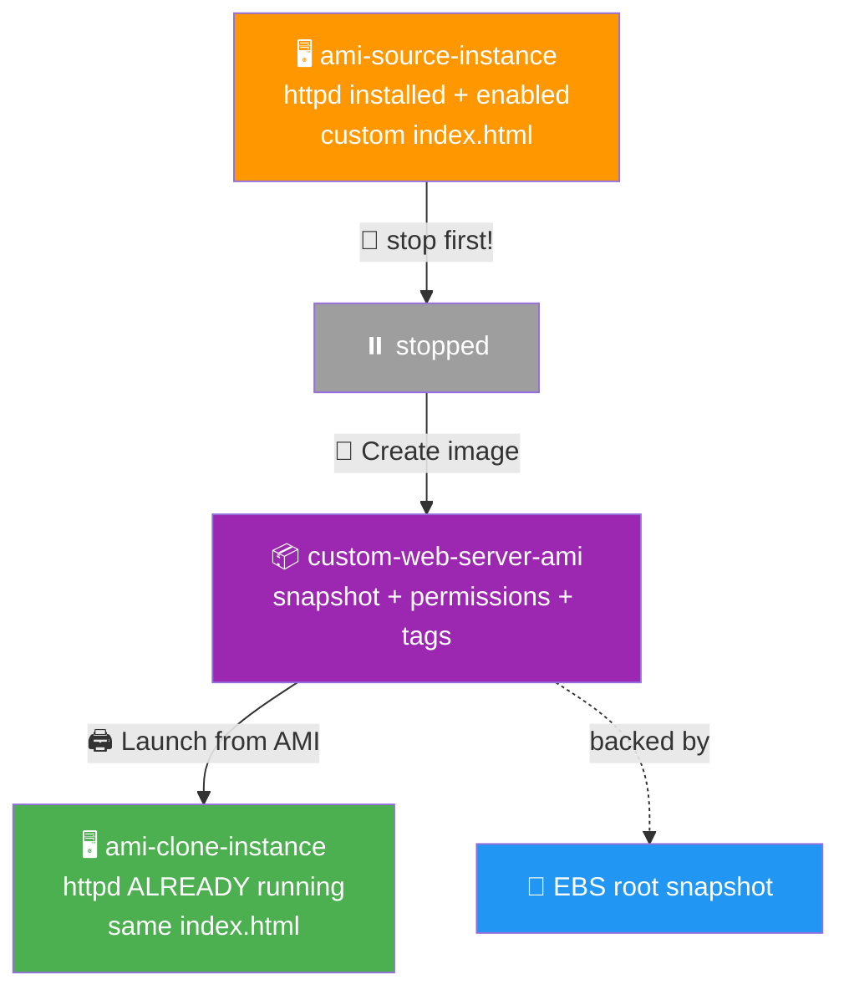

# 🍕 Lab 04 - AMI: Create and Clone

> 📅 **Updated:** 21 August 2026 | ⏱️ **Duration:** ~20 minutes | 📊 **Level:** Beginner


> ### 🗣️ *"An AMI is a frozen pizza. Bake it once, configure it how you like, freeze it — and anytime you're hungry (for infrastructure) you just heat it up and boom, instant server."*
> — **Rithu** 🍕

<details>
<summary><b>🎭 Ravi & Rithu's Coffee Break Chat</b></summary>

**Ravi:** "So an AMI is basically Ctrl+C Ctrl+V for servers?"

**Rithu:** "More like a cookie cutter. You bake one perfect cookie, then stamp out dozens."

**Ravi:** "I like cookies."

**Rithu:** "Focus, Ravi. We're making servers, not bakery items."

</details>

---

## 🎯 What You'll Master

| Skill | Description |
|-------|-------------|
| 🍞 **Bake a Golden Image** | Freeze a configured server into a reusable AMI |
| 🖨️ **Launch Clones** | Boot identical servers from your AMI |
| ⚡ **Verify Carryover** | Prove services + files survive the clone |
| 🔍 **Read AMI Anatomy** | Snapshots, block mappings, permissions, tags |
| ♾️ **Immutable Thinking** | The DevOps philosophy in one lab |

> 💡 **Pro Tip:** Real companies don't hand-configure servers — they bake a golden image once and clone it hundreds of times. This lab is your first taste of that philosophy.

---

## 🚦 Before You Start

### ✅ Prerequisites Checklist
- [ ] ✅ **[Lab 03](../03%20-%20EBS%20-%20Volumes%20and%20Snapshots/README.md)** complete
- [ ] 🔑 Key pair ready (`first-key-pair`)
- [ ] 🛡️ SG with SSH + HTTP (`web-server-sg` works)
- [ ] 💻 SSH comfort level: confident

### 📦 What You Need (and Don't)
| Required | Optional |
|----------|----------|
| ~20 minutes | Cookie cutter for morale 🍪 |
| Same Region as Labs 01–03 | |

---

## 💰 Cost & Safety First

| Item | Cost |
|------|------|
| t2.micro instances ×2 | ✅ Free Tier eligible |
| AMI storage | ⚠️ ~$0.05/GB-month per backing snapshot |
| Underlying snapshots | ⚠️ Charged until YOU delete them |

> ✅ Still under $1 total if cleaned promptly. **Don't leave instances or AMIs orphaned.**

> 💸 **Ravi's Mistake of the Day:** *"I created an AMI from an instance with my SSH keys still on it. Then shared it publicly. Guess who rotated every credential in their AWS account? This guy."* 🔐

### 🏷️ Naming Convention

| Resource | Name |
|----------|------|
| 🖥️ Source instance | `ami-source-instance` |
| 📸 Custom AMI | `custom-web-server-ami` |
| 🖥️ Clone instance | `ami-clone-instance` |

---

## 🧠 How It All Fits Together



### 🔑 Key Concepts
| Component | Role |
|-----------|------|
| **Root volume snapshot** | The disk photo captured at creation |
| **Block device mapping** | Which snapshot maps to which device at launch |
| **Launch permissions** | Who may use it — private, public, or shared |
| **Tags** | Organizational metadata |
| **Enabled services** | `systemctl enable` survives cloning — magic! |

> 🧠 **Did You Know?** An AMI is NOT a snapshot — it's a catalog entry *pointing to* snapshots plus launch metadata. Snapshot = photo of the hard drive; AMI = photo + the box it came in. 📦

---

## 🪜 Step-by-Step Guide

### 🟢 Step 1: Launch & Configure the Source 🖥️

<details>
<summary><b>🖥️ Expand for launch steps</b></summary>

1. 🌐 **EC2 → Launch instance**
2. 📝 **Name:** `ami-source-instance`
3. ⚙️ Amazon Linux 2023 · `t2.micro` · key pair `first-key-pair`
4. 🌐 Public IP: ✅ Enable · Firewall: existing SG with SSH + HTTP
5. 💾 Default 8 GB → ✅ **Launch**

**Configure once 2/2 checks pass:**

```bash
ssh -i first-key-pair.pem ec2-user@<public-ip>
sudo dnf update -y
sudo dnf install -y httpd
sudo systemctl start httpd
sudo systemctl enable httpd        # ← THE line that makes clones self-starting!
echo "<h1>Custom AMI Lab - Built by Ravi</h1>" | sudo tee /var/www/html/index.html
curl http://localhost              # → <h1>Custom AMI Lab - Built by Ravi</h1>
```

</details>

---

### 🟢 Step 2: Stop the Instance 🛑

<details>
<summary><b>🛑 Expand for stop steps</b></summary>

1. 🌐 EC2 → **Instances** → select `ami-source-instance`
2. ⏸️ **Instance state → Stop instance** → confirm
3. ⏳ Wait for state = **stopped**

</details>


> 🗣️ **Rithu's Tip:** *"You CAN image a running instance, but stopping first guarantees a clean filesystem. Stopped pizza makes better frozen pizza."*

---

### 🟢 Step 3: Create the AMI 📸

<details>
<summary><b>📸 Expand for create-image steps</b></summary>

1. Select the stopped instance → right-click → **Image and templates → Create image**
2. 📝 Fill in:

   | Field | Value |
   |-------|-------|
   | Image name | `custom-web-server-ami` |
   | Description | `AMI with httpd pre-installed and custom index page` |
   | No reboot | Unchecked (already stopped — perfect) |

3. 💾 Block device mappings: leave the 8 GB root as-is → ✅ **Create image**
4. 🌐 EC2 → **AMIs** → status goes `pending` → `available` (~1–3 min)

</details>


> 🗣️ **Rithu's Tip:** *"Behind the scenes AWS snapshots every attached volume and registers them as the AMI's block device mappings. Each AMI = root snapshot + permissions + tags + launch metadata."*

---

### 🟢 Step 4: Launch the Clone 🖨️

<details>
<summary><b>🖨️ Expand for clone launch steps</b></summary>

1. 🌐 EC2 → **AMIs** → check `custom-web-server-ami` (status `available`)
2. ➕ **Launch instance from AMI**
3. 📝 Configure:

   | Setting | Value |
   |---------|-------|
   | Name | `ami-clone-instance` |
   | Instance type | `t2.micro` |
   | Key pair | `first-key-pair` |
   | Network | default VPC, public IP ✅ |
   | Security group | existing SG with SSH + HTTP |
   | Storage | stays 8 GB (copied from AMI metadata) |

4. ✅ **Launch** → wait for 2/2 checks

</details>


---

### 🟢 Step 5: Verify the Clone Carried Everything ✨

<details>
<summary><b>✨ Expand for verification steps</b></summary>

**Browser test:**

1. 🌍 Visit `http://<clone-public-ip>` → expect **"Custom AMI Lab - Built by Ravi"**

**SSH test:**

```bash
ssh -i first-key-pair.pem ec2-user@<clone-public-ip>
sudo systemctl status httpd     # active (running) — nobody started it manually!
cat /var/www/html/index.html    # <h1>Custom AMI Lab - Built by Ravi</h1>
```

Why did httpd auto-start? Because `systemctl enable httpd` on the source survived the snapshot — so the clone boots with the service registered.

</details>


> 🗣️ **Rithu's Tip:** *"This is why AMIs are POWERFUL. Install once, clone forever. DevOps calls this 'immutable infrastructure' — instances are disposable, AMIs are immutable artifacts."*

---

### 🟢 Step 6: Dissect the AMI 🔬

<details>
<summary><b>🔬 Expand for anatomy exploration</b></summary>

1. 🌐 EC2 → **AMIs** → select `custom-web-server-ami` → open **Block device mappings** tab:

   | Device | Snapshot ID | Size | Volume type |
   |--------|------------|------|-------------|
   | /dev/xvda | snap-xxxxxxxxxxxx | 8 GiB | gp3 |

2. 🌐 EC2 → **Snapshots** → search that snapshot ID — there it is!

The AMI is just a catalog entry backed by EBS snapshots + launch permissions + tags.

</details>


---

## ✅ Validation Checklist

| # | Check | Status |
|---|-------|--------|
| 1️⃣ | Source launched, configured, stopped | ☐ ✅ |
| 2️⃣ | `custom-web-server-ami` status = `available` | ☐ ✅ |
| 3️⃣ | Clone launched from the custom AMI | ☐ ✅ |
| 4️⃣ | Clone serves the custom page with zero extra setup | ☐ ✅ |
| 5️⃣ | httpd auto-running on clone (`systemctl status`) | ☐ ✅ |
| 6️⃣ | Block device mapping inspected; AMI↔snapshot link understood | ☐ ✅ |

> 🏆 **Achievement Unlocked:** Cloning Expert! One server becomes many.

---

## 🧹 Cleanup (Follow Order!)

> ⚠️ **Deregistering an AMI does NOT delete its snapshots — AWS bills those until you delete them manually!**

| Step | Action | Console Location |
|------|--------|------------------|
| 1️⃣ 🗑️ | Terminate `ami-clone-instance` | EC2 → Instances |
| 2️⃣ 🗑️ | Terminate `ami-source-instance` | EC2 → Instances |
| 3️⃣ 📦 | Deregister `custom-web-server-ami` ("in use" warning is informational) | EC2 → AMIs |
| 4️⃣ 💾 | Delete the AMI's backing snapshot(s) — TWO if you had two volumes | EC2 → Snapshots |

> 🗣️ **Rithu's Tip:** *"If your AMI registered two volumes, there are TWO snapshots. Delete both."*

---

## 🚀 Level Ups (Post-Core Lab)

| Challenge | What to Try | Notes |
|-----------|-------------|-------|
| 🖨️ **Twin Clones** | Launch TWO instances from one AMI | Exactly what auto-scaling does behind the scenes |
| 🏷️ **Version It** | Bake `custom-web-server-ami-v2` with a changed page | Golden images have versions! |
| 👥 **Share It** | Modify launch permissions to share with another account | Careful: no secrets baked in! |

---

## 🆘 Troubleshooting Quick Reference

| 🔍 Issue | 💡 Likely Cause | 🔧 Fix |
|-------|--------------|-----|
| ⏳ AMI stuck on `pending` | Copying initial blocks | Wait — 8 GB root shouldn't exceed ~5 min |
| 🚫 Clone boots, httpd NOT running | `enable httpd` skipped on source | Fix source → re-create the AMI |
| 🌐 Clone serves wrong page | index.html wasn't saved pre-image | Check source file, re-bake |
| 🔄 AMI listed but `pending` | Registration still running | Refresh after 1–2 min |
| ⚠️ Can't deregister AMI | Console warns "in use" | Informational only — confirm and proceed |
| ❌ Snapshot deletion fails | Snapshot still backs an active AMI | Deregister AMI FIRST, then delete snapshots |

---

## 🎮 Test Yourself! (No Peeking 👀)

**Q1:** AMI vs EBS snapshot — what's the difference?

<details><summary>👀 Show answer</summary>

**A:** Snapshot = just the **disk data**. AMI = the **full recipe**: snapshots + launch permissions + metadata (OS, architecture, block map). Photo vs photo-in-a-box. 📦

</details>

**Q2:** Should you stop the source before creating the AMI?

<details><summary>👀 Show answer</summary>

**A:** **Yes** — guarantees a **consistent** image with no half-written files. Running instances can produce corrupted golden images. 🎯

</details>

**Q3:** Clone boots but Apache isn't running. What did the source miss?

<details><summary>👀 Show answer</summary>

**A:** **`systemctl enable httpd`** — without it the service never registered for boot. Fix the source, re-image. 🔧

</details>

> 💪 **Rithu:** *"Golden images are why companies scale from 1 server to 100 in minutes. You've got the superpower now — use it wisely."*

---

## 📚 Official Documentation

- 📦 [Amazon Machine Images (AMIs)](https://docs.aws.amazon.com/AWSEC2/latest/UserGuide/ec2-ami-know-how.html)
- 📸 [Create an AMI from an Amazon EC2 Instance](https://docs.aws.amazon.com/AWSEC2/latest/UserGuide/create-ami.html)
- 🖥️ [Launch an Instance from Your AMI](https://docs.aws.amazon.com/AWSEC2/latest/UserGuide/launching-instance.html)

---

## 🎓 What You Learned

> **The baker's method:**
> - 🍞 **AMI = golden image** → bake once, launch a hundred times
> - 🛑 **Stop before you shoot** → consistent photos need still subjects
> - 🎫 **AMI ≠ snapshot** → alias pointing to snapshots + launch metadata
> - ⚡ **Enablement survives** → `systemctl enable` rides along into every clone
> - 🆕 **Immutable infra** → don't patch band-aids; build a new AMI and redeploy

**Golden Habit:** Configure → verify → stop → image → test the clone → clean up everything including snapshots. 🧹

| | Approach |
|---|---|
| 👶 **Noob Way** | Hand-configure every server from scratch — slow, error-prone, unrepeatable |
| 🧙 **Pro Way** | Bake once, clone forever — consistent, fast, versioned infrastructure |

---

## ➡️ What's Next?

Leaving compute behind for OBJECT STORAGE. S3 is arguably AWS's most loved service — we'll host a full static website straight from a bucket. No EC2. Just HTML and infinite scalability. ♾️

🎯 **[Lab 05 - S3: Static Website Hosting](../05%20-%20S3%20-%20Static%20Website%20Hosting/README.md)**

---

<div align="center">

### ⭐ Enjoyed this lab? Star the repo & share your feedback!

**Happy Learning!** 🚀☁️

</div>
