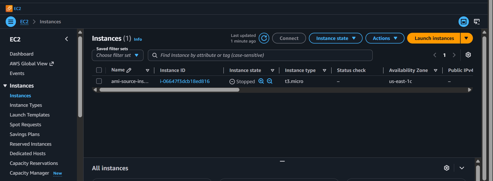
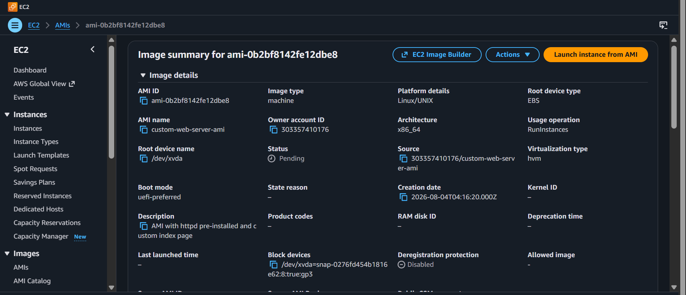
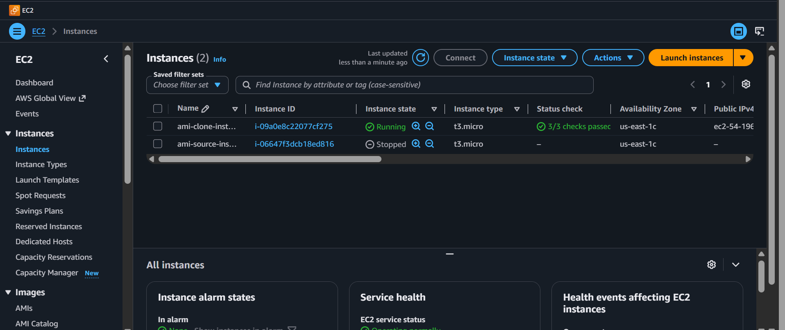
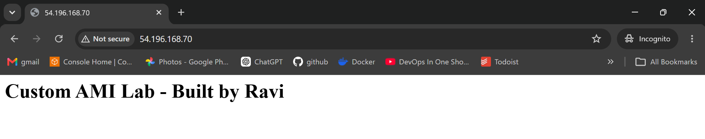
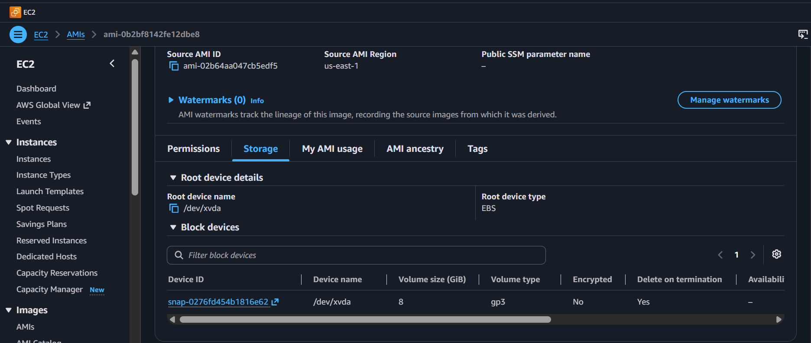

<div align="center">


</div>

<div align="center">

# Lab 04 — AMI: Create and Clone


</div>

> *"An AMI is a frozen pizza. Bake it once, configure it how you like, freeze it, and anytime you're hungry (for infrastructure) you just heat it up and boom — instant server."* — Rithu

---

<details>
<summary><b>🎭 Ravi & Rithu's Coffee Break Chat</b></summary>

**Ravi:** "So an AMI is basically Ctrl+C Ctrl+V for servers?"

**Rithu:** "More like a cookie cutter. You bake one perfect cookie, then stamp out dozens."

**Ravi:** "I like cookies."

**Rithu:** "Focus, Ravi. We're making servers, not bakery items."

</details>

---

## 📋 Table of Contents

- [🎯 Objective](#-objective)
- [📊 Lab Progress](#-lab-progress)
- [🤔 In Plain English](#-in-plain-english)
- [🧠 Prerequisites](#-prerequisites)
- [💰 Cost Warning](#-cost-warning)
- [🏗️ Architecture](#️-architecture)
- [🛠️ Step-by-Step Instructions](#️-step-by-step-instructions)
- [✅ Validation Checklist](#-validation-checklist)
- [🧹 Cleanup (IMPORTANT!)](#-cleanup-important)
- [🧠 Memory Tips](#-memory-tips)
- [🎓 What You Learned](#-what-you-learned)
- [🎮 Test Yourself](#-test-yourself-no-peeking-)
- [🆚 Pro Tip vs Noob Tip](#-pro-tip-vs-noob-tip)
- [🔗 What's Next?](#-whats-next)
- [❓ Troubleshooting](#-troubleshooting)

---

<div align="center">

## 📊 Lab Progress

`[██░░░░░░░░░░░░░░░░░░] 5% — Let's Begin!`

</div>

---

## 🤔 In Plain English

> **What is this, really?** An AMI is a **frozen photo of a whole server** — the OS, installed software, configuration, everything. Once you have the photo, you can print as many identical servers as you want. It's like taking a perfect cake and using it as the master mold for a bakery. 🎂
>
> 🌍 **Why you should care:** Real companies don't configure servers by hand — they "bake" a golden image once and clone it hundreds of times. This lab is your first taste of that philosophy.

---

## 🎯 Objective

Create a custom Amazon Machine Image (AMI) from a running EC2 instance that has been pre-configured with a web server and custom website content, then launch a new instance from that custom AMI to verify that everything carries over perfectly.

## 🧠 Prerequisites

- Completion of **[Lab 03 — EBS: Volumes and Snapshots](../03%20-%20EBS%20-%20Volumes%20and%20Snapshots/README.md)**
- Understanding of EC2 and SSH

## 💰 Cost Warning

- t2.micro is Free Tier eligible.
- AMI storage costs ~$0.05 per GB-month per snapshot backing the AMI.
- Each AMI creates an underlying snapshot (charged).
- Two instances = double the cost (still under $1 for this lab if cleaned promptly).

**DON'T leave instances or AMIs orphaned. Cleanup is mandatory.**

> **Ravi's Mistake of the Day:** I created an AMI from an instance with my SSH keys still on it. Then shared the AMI publicly. Guess who had to rotate every credential in their AWS account? This guy.

## 🏗️ Architecture

```
   Source Instance                    Custom AMI                   Clone Instance
┌────────────────────┐           ┌────────────────┐           ┌────────────────────┐
│  t2.micro          │           │                │           │  t2.micro          │
│  Amazon Linux 2023 │  ──stop──▶│  (frozen copy) │  ──launch▶│  Amazon Linux 2023 │
│  httpd installed   │           │                │           │  httpd IS running  │
│  index.html exists │           │  EBS Snapshots │           │  index.html exists │
│  httpd is running  │           │  Permissions   │           │  httpd IS running  │
└────────────────────┘           │  Tags          │           └────────────────────┘
                                 └────────────────┘
```

> **Did You Know?** AWS has over 700+ instance types. From nano to metal, from general purpose to GPU-optimized. There's literally an instance type for every possible workload.

## 🛠️ Step-by-Step Instructions

> 

1. EC2 Console → **Launch instance**.
2. Name: `ami-source-instance`.
3. **AMI:** Amazon Linux 2023 (Free Tier).
4. **Instance type:** t2.micro.
5. **Key pair:** Select `first-key-pair` or create a new one.
6. **Network settings:**
   - VPC: default
   - Subnet: No preference
   - Auto-assign public IP: **Enable**
   - Firewall: Select existing SG → `web-server-sg` or create one with SSH + HTTP.
7. **Storage:** Default 8 GB gp2/gp3.
8. Click **Launch instance**.

> 

Wait for 2/2 checks. SSH in:

```bash
ssh -i first-key-pair.pem ec2-user@<public-ip>
```

Install httpd:

```bash
sudo dnf update -y
sudo dnf install -y httpd
sudo systemctl start httpd
sudo systemctl enable httpd
```

Create a custom index page that will DISTINGUISH this AMI from a generic Amazon Linux launch:

```bash
echo "<h1>Custom AMI Lab - Built by Ravi</h1>" | sudo tee /var/www/html/index.html
```

Verify:

```bash
curl http://localhost
```

Output: `<h1>Custom AMI Lab - Built by Ravi</h1>`

> 

This is IMPORTANT:

1. EC2 Console → **Instances** → select `ami-source-instance`.
2. Instance state dropdown → **Stop instance**.
3. Click **Stop** in the confirmation popup.
4. Wait for the instance state to show **stopped**.

📸 [Screenshot: ami-source-instance showing state "stopped"]


> 
> You CAN create an AMI from a running instance, but for a CONSISTENT image, stop the instance first — it ensures the filesystem is clean before the snapshot. Stopped pizza makes better frozen pizza.

> 

1. Select the stopped instance.
2. Right-click → **Image and templates** → **Create image**.
3. Fill in:

| Field | Value |
|-------|-------|
| Image name | `custom-web-server-ami` |
| Image description | `AMI with httpd pre-installed and custom index page` |
| No reboot | Unchecked (instance is already stopped, perfect!) |

4. Under **Block device mappings**, you'll see the root volume (8 GB, gp2/gp3). Leave it as is.
5. Click **Create image**.

📸 [Screenshot: Create Image screen showing image name and description]

6. EC2 left sidebar → **AMIs** under Images.
7. You'll see your AMI with status **pending** → then **available** (usually takes 1–3 minutes).

> 
> Behind the scenes, AWS takes a snapshot of each EBS volume attached to the instance and registers those snapshots as the AMI's Block Device Mappings. Each AMI = Volume snapshot of root + permissions + tags + launch metadata.

> 

Now the magical cloning moment:

1. EC2 Console → **AMIs**.
2. Check the box for `custom-web-server-ami` (status should be **available**).
3. Click **Launch instance from AMI** (blue button at the top).

4. Configure:

| Setting | Value |
|---------|-------|
| Name | `ami-clone-instance` |
| Instance type | **t2.micro** |
| Key pair | `first-key-pair` |
| Network | default VPC, enable public IP |
| Security group | Select existing SG with SSH + HTTP |
| Storage | stays at 8 GB (copied from AMI metadata) |

5. Click **Launch instance**.

6. Wait for the clone to have 2/2 status checks.

📸 [Screenshot: Two instances in the EC2 console: ami-source-instance (stopped) and ami-clone-instance (running)]


> 

Get the **public IP** of `ami-clone-instance`.

**Browser test:**

1. Open a browser, navigate to `http://<clone-public-ip>`.
2. You should see:

> **Custom AMI Lab - Built by Ravi**

📸 [Screenshot: Browser showing the custom AMI page on the clone instance]



**SSH test:**

```bash
ssh -i first-key-pair.pem ec2-user@<clone-public-ip>
```

And check that httpd is running automatically:

```bash
sudo systemctl status httpd
```

It should show `active (running)`.

Check your custom file:

```bash
cat /var/www/html/index.html
```

Output: `<h1>Custom AMI Lab - Built by Ravi</h1>`

The httpd service didn't need to be manually started. Why? Because we ran `sudo systemctl enable httpd` on the source, which survived the snapshot, which means the clone ALSO has httpd auto-starting on boot.

> 
> This is why AMIs are POWERFUL. With a properly baked AMI, your instances come alive already configured. Install once, clone forever. DevOps teams call this "immutable infrastructure" because you treat your instances as disposable and your AMIs as immutable artifacts.

> 

Go to EC2 Console → **AMIs** → select `custom-web-server-ami` → scroll to the **Block device mappings** tab.

You'll see something like:

| Device | Snapshot ID | Size | Volume type |
|--------|------------|------|-------------|
| /dev/xvda | snap-xxxxxxxxxxxx | 8 GiB | gp3 |

Go to EC2 Console → **Snapshots** → search for the snapshot ID you see above.

📸 [Screenshot: AMI Block device mapping showing device, snapshot ID, size, volume type]


This shows that an AMI is essentially a catalog entry backed by one or more EBS snapshots, launch permissions, and tags.

Components of an AMI:

1. **Root volume snapshot** — captured during creation
2. **Block device mapping** — defines which snapshot maps to which device at launch
3. **Launch permissions** — who can use it (private, public, or shared)
4. **Tags** — organizational metadata

## ✅ Validation Checklist

- [ ] 🖥️ Source instance `ami-source-instance` launched and stopped ✅
- [ ] 🌐 httpd installed, enabled, and serving custom page on source ✅
- [ ] 📸 AMI `custom-web-server-ami` created with status `available` ✅
- [ ] 🔄 Clone instance `ami-clone-instance` launched from custom AMI ✅
- [ ] 🌐 Clone serves the same custom page at `http://<clone-ip>` without additional setup ✅
- [ ] ⚡ httpd is auto-started on the clone (verified via `sudo systemctl status httpd`) ✅
- [ ] 🔍 AMI block device mapping viewed; understands AMI-to-snapshot relationship ✅

<div align="center">

> **Achievement Unlocked:** Cloning Expert! One server becomes many.

</div>

## 🧹 Cleanup (IMPORTANT!)

> 🛑 **Don't skip cleanup!** These resources will cost you money if left running.

1. 🖥️ **Terminate `ami-clone-instance`:**
   - Select → Instance state → **Terminate** → Confirm.

2. 🖥️ **Terminate `ami-source-instance`:**
   - Select → Instance state → **Terminate** → Confirm.

3. 📸 **Deregister the AMI:**
   - EC2 Console → **AMIs**.
   - Select `custom-web-server-ami`.
   - Actions → **Deregister AMI** → Confirm.
   - AWS may warn that the AMI is in use — that's informational; you can still deregister.

4. 💾 **Delete the EBS snapshots associated with the AMI:**
   - EC2 Console → **Snapshots** (make sure it's not filtered).
   - Find the snapshot named or tagged with your AMI name.
   - Select it → Actions → **Delete snapshot** → Confirm.
   - **CRITICAL:** Deregistering the AMI does NOT delete the underlying snapshots. AWS bills for those until you manually delete them.

> 
> If your AMI registered two volumes (root + data), there will be TWO snapshots. Delete both.

## 🧠 Memory Tips

Stick these in your brain and they'll never leave. 🧲

| 🧠 Memory Hook | Remember it like... |
|---|---|
| **AMI = Golden Image** | A **frozen master copy** — "bake once, launch a hundred times." 🍞 |
| **AMI ≠ snapshot** | AMI is an **alias** that *points to* snapshots + launch metadata. Snapshot = just the disk photo; AMI = the whole launch recipe. 🎫 |
| **Stop before you shoot** | Take the photo while the subject is still — **stop the instance** first for a consistent image. 📸 |
| **Immutable infrastructure** | Don't patch running servers like a band-aid. **Build a new AMI and redeploy** — clean and reproducible. 🆕 |

> 🗣️ **Rithu:** *"If you bake an AMI while Apache is running mid-request, you get a weird cake. Stop the instance, then photograph it. Consistency matters."*

---

## 🎓 What You Learned

| Concept | Takeaway |
|---------|----------|
| AMI = Golden Image | Frozen OS + apps ready to clone |
| AMI creation | Stop instance → Create image → Wait |
| Derivative AMI | Launch new instance FROM the custom AMI |
| AMI reuse | All installed tools + enabled services carry over |
| AMI is NOT a snapshot | It's an alias pointing to EBS snapshots + metadata |
| Immutable infrastructure | Don't patch instances; deploy fresh from updated AMIs |
| Enablement survives cloning | `systemctl enable httpd` persisted through AMI to clone |

## 🎮 Test Yourself! (No Peeking 👀)

**Q1:** What's the difference between an AMI and an EBS snapshot?

<details><summary>👀 Show answer</summary>

**A:** A snapshot is just the **disk's data**. An AMI is the **full recipe**: snapshots + launch permissions + metadata (OS, architecture, block device map). Think: snapshot = photo of the hard drive; AMI = photo + the box it came in. 📦

</details>

**Q2:** Should you stop the source instance before creating the AMI? Why?

<details><summary>👀 Show answer</summary>

**A:** **Yes** — it guarantees a **consistent** image (no half-written files). A running instance can produce a corrupted golden image. 🎯

</details>

**Q3:** Your clone boots but Apache isn't running. What did the original instance probably miss?

<details><summary>👀 Show answer</summary>

**A:** The **`systemctl enable httpd`** step! Without it, httpd wasn't registered to start on boot — so the clone inherits a disabled service. Fix the source, re-image. 🔧

</details>

### 🔥 Bonus Challenge

Create an AMI, then launch **two** clones from it instead of one. Both should boot with your custom page working. You just horizontally cloned a production server — exactly what auto-scaling does behind the scenes. 🖨️

> 💪 **Rithu:** *"Golden images are why companies can scale from 1 server to 100 in minutes. You've got the superpower now — use it wisely."*

---

### 🆚 Pro Tip vs Noob Tip

| | Approach |
|---|---|
| **Noob Tip** | Hand-configure every new server from scratch — slow, error-prone, impossible to repeat |
| **Pro Tip** | Bake a golden AMI once, clone it forever. Consistent, fast, versioned infrastructure |

---

## 🔗 What's Next?

Time to LEAVE compute behind and dip into the world of OBJECT STORAGE. S3 is arguably AWS's most loved service.

👉 **Proceed to Lab 05:** [S3 - Static Website Hosting](../05%20-%20S3%20-%20Static%20Website%20Hosting/README.md)

We'll host a full static website directly from an S3 bucket. No EC2 instance needed. Just you, HTML, and infinite scalability.

<details>
<summary><strong>❓ Troubleshooting</strong></summary>

| 🔍 Problem | 💡 Likely Cause | 🔧 Fix |
|---------|-------------|------|
| ⏳ AMI creation stuck on `pending` | Large volume copying initial blocks | Wait. Small root (8 GB) shouldn't take more than 5 minutes |
| 🚫 Clone instance boots but httpd is NOT running | `systemctl enable httpd` was NOT run on source | SSH into source → `sudo systemctl enable httpd` → re-snapshot |
| 🌐 Clone instance boots, httpd running, wrong page | Custom index.html wasn't saved correctly | SSH source → `cat /var/www/html/index.html` → fix if needed |
| 🔄 AMI appears in list but says `pending` | AWS hasn't finished registering | Refresh after 1–2 minutes |
| ⚠️ Cannot deregister AMI | Console warns the AMI is in use | The warning is informational — deregistration doesn't affect running instances; confirm and proceed |
| ❌ Snapshot deletion fails | Snapshot is still attached to the active AMI | Deregister AMI first, THEN delete snapshots

</details>

---

<div align="center">


*Written with the spirit of "bake once, launch a hundred times" — Rithu*

</div>
