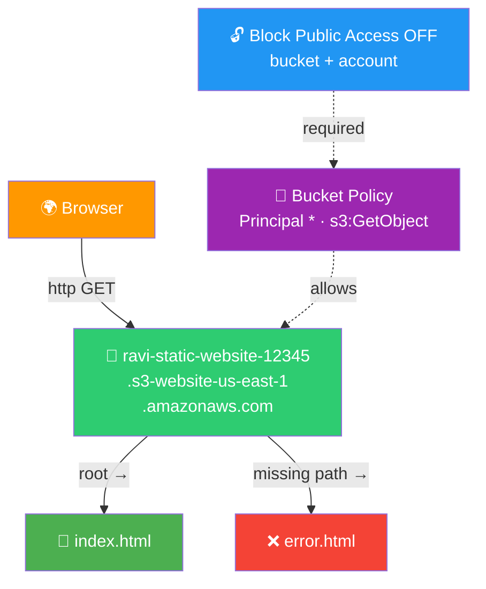

# 🪣 Lab 05 - S3: Static Website Hosting

> 📅 **Updated:** 21 August 2026 | ⏱️ **Duration:** ~25 minutes | 📊 **Level:** Beginner


> ### 🗣️ *"S3 is like a magical empty filing cabinet in the sky. Stuff files in it, configure it right, and the whole world can read them. Today we're building a full static website inside that cabinet. No EC2. No Apache. Just S3."*
> — **Rithu** 🗄️

<details>
<summary><b>🎭 Ravi & Rithu's Coffee Break Chat</b></summary>

**Ravi:** "Wait, I can host a WEBSITE on S3?!"

**Rithu:** "Yep! No server to manage, no OS to patch. Just pure static files served globally."

**Ravi:** "So S3 is basically a fancy USB stick that also hosts websites?"

**Rithu:** "That's... actually not a terrible analogy. I'm both proud and concerned."

</details>

---

## 🎯 What You'll Master

| Skill | Description |
|-------|-------------|
| 🪣 **Create Buckets** | Globally-unique names, right region |
| 🌐 **Static Website Hosting** | Turn a bucket into a web server |
| 📜 **Bucket Policies** | JSON that opens the door to the world |
| 📄 **Custom Error Pages** | Your branding on every 404 |
| 🔒 **Public Access Judgment** | When open is OK — and when it's a breach |

> 💡 **Pro Tip:** Static sites (portfolios, landing pages, SPAs) are served to millions from S3 daily. It costs pennies, never goes down, and scales to infinity — the cheapest hosting you'll ever buy.

---

## 🚦 Before You Start

### ✅ Prerequisites Checklist
- [ ] ✅ **[Lab 04](../04%20-%20AMI%20-%20Create%20and%20Clone/README.md)** complete
- [ ] 🌍 Region: us-east-1 for this lab
- [ ] 📝 Any text editor for two tiny HTML files
- [ ] 🧠 HTML knowledge: barely any needed

### 📦 What You Need (and Don't)
| Required | Optional |
|----------|----------|
| ~25 minutes | CloudFront knowledge (later labs!) |
| AWS Console access | |

---

## 💰 Cost & Safety First

| Item | Cost |
|------|------|
| ~0.01 GB of S3 storage | ✅ Well inside the free allowance |
| Requests | ✅ Pennies at lab scale |

> ⚠️ **Public buckets mean anyone with the URL can read your objects.** This lab is intentionally public — real workloads need stricter controls (CloudFront, later).

> 💸 **Ravi's Mistake of the Day:** *"I enabled public access on a bucket with test data containing real customer emails. S3 misconfigurations are the #1 cause of AWS data breaches. Don't be like me."*

### 🏷️ Naming Convention

| Resource | Name |
|----------|------|
| 🪣 Bucket | `ravi-static-website-12345` *(taken? add more numbers)* |

---

## 🧠 How It All Fits Together



### 🔑 Key Concepts
| Component | Role |
|-----------|------|
| **Bucket** | The drawer — globally unique name required |
| **Static website hosting** | S3 serves `index.html` at root, `error.html` on 4xx |
| **Bucket policy** | `"Principal": "*"` + `s3:GetObject` + `Resource .../*` = world-readable |
| **Block Public Access** | Must be OFF (bucket AND account level) or the policy is silently blocked |
| **Website endpoint** | `http://<bucket>.s3-website-<region>.amazonaws.com` — HTTP only! |

> 🧠 **Did You Know?** S3 launched in 2006 and stores over 100 TRILLION objects — about 13,000 for every human on Earth.

---

## 🪜 Step-by-Step Guide

### 🟢 Step 1: Create the Bucket 🪣

<details>
<summary><b>🪣 Expand for bucket creation steps</b></summary>

1. 🌐 Console → search **S3** → ➕ **Create bucket**
2. 📝 General configuration:

   | Field | Value |
   |-------|-------|
   | Bucket type | General purpose |
   | Name | `ravi-static-website-12345` |
   | Region | US East (N. Virginia) `us-east-1` |

3. 👤 Object Ownership: default (**ACLs disabled**)
4. 🔓 **Block Public Access — THE important step:**
   - UNCHECK **Block all public access**
   - ✅ Check the acknowledgment box in the warning banner
5. 🕰️ Versioning: Disable · 🏷️ Tags: `Name=ravi-static-website`, `Project=AWS-Hands-On-Labs`
6. 🔐 Default encryption: leave SSE-S3 (all new buckets encrypt by default since Jan 2023)
7. ✅ **Create bucket** — you own a cloud bucket! 🪣

</details>


> 🗣️ **Rithu's Tip:** *"Bucket names are globally unique across ALL AWS accounts — like a username for the entire internet. If yours is taken, add numbers."*

---

### 🟢 Step 2: Enable Static Website Hosting 🌐

<details>
<summary><b>🌐 Expand for hosting steps</b></summary>

1. Open bucket `ravi-static-website-12345` → **Properties** tab
2. Scroll to **Static website hosting** → ✏️ **Edit**
3. Configure:

   | Field | Value |
   |-------|-------|
   | Static website hosting | **Enable** |
   | Hosting type | **Host a static website** |
   | Index document | `index.html` |
   | Error document | `error.html` |

4. ✅ **Save changes** → copy the **Bucket website endpoint**:

```
http://ravi-static-website-12345.s3-website-us-east-1.amazonaws.com
```

</details>


> 🗣️ **Rithu's Tip:** *"Notice it's `http://` — S3 website endpoints don't do HTTPS natively. For HTTPS you'd front it with CloudFront. File that away, young padawan."*

---

### 🟢 Step 3: Create the Website Files 📄

<details>
<summary><b>📄 Expand for index.html</b></summary>

Save locally as `index.html`:

```html
<!DOCTYPE html>
<html>
<head>
<title>Ravi's Website</title>
<style>
body {
  font-family: Arial, sans-serif;
  text-align: center;
  padding: 50px;
  background: #f0f0f0;
}
h1 {
  color: #ff9900;
}
p {
  color: #333;
}
</style>
</head>
<body>
<h1>Welcome to Ravi's S3 Website!</h1>
<p>Hosted on Amazon S3 - Built by Ravi with guidance from Rithu</p>
<p>This website runs entirely on S3. No servers. No maintenance. Just magic.</p>
</body>
</html>
```

</details>

<details>
<summary><b>❌ Expand for error.html</b></summary>

Save locally as `error.html`:

```html
<!DOCTYPE html>
<html>
<head>
<title>Oops - Not Found</title>
<style>
body {
  font-family: Arial, sans-serif;
  text-align: center;
  padding: 50px;
  background: #ffe6e6;
}
h1 {
  color: #cc0000;
}
p {
  color: #555;
}
</style>
</head>
<body>
<h1>404 - Page Not Found</h1>
<p>Ravi says: This page doesn't exist!</p>
<p>Looks like you took a wrong turn somewhere. Try the <a href="index.html">homepage</a>.</p>
</body>
</html>
```

</details>

> 🗣️ **Rithu's Tip:** *"Any editor works — just don't let Windows save it as `.html.txt`. Classic trap!"*

---

### 🟢 Step 4: Upload Both Files 📤

<details>
<summary><b>📤 Expand for upload steps</b></summary>

1. 🪣 Bucket → **Objects** tab → ➕ **Upload**
2. ➕ **Add files** → select BOTH `index.html` and `error.html` (or drag & drop)
3. ✅ **Upload** → both files listed in Objects tab (~300 bytes each)

</details>


---

### 🟢 Step 5: Apply the Public-Read Bucket Policy 📜

<details>
<summary><b>📜 Expand for policy steps</b></summary>

Objects are STILL private — unblocking public access doesn't make them readable. The policy does.

1. 🪣 Bucket → **Permissions** tab → **Bucket policy** → ✏️ **Edit**
2. Paste:

```json
{
  "Version": "2012-10-17",
  "Statement": [
    {
      "Sid": "PublicReadGetObject",
      "Effect": "Allow",
      "Principal": "*",
      "Action": "s3:GetObject",
      "Resource": "arn:aws:s3:::ravi-static-website-12345/*"
    }
  ]
}
```

3. ✅ **Save changes**

Decode: `"Principal": "*"` = anyone on Earth · `"Action": "s3:GetObject"` = may read objects · `/*` = every object in the bucket.

> ⚠️ **Account-level Block Public Access:** newer accounts have it ON at the ACCOUNT level too — it silently overrides bucket settings. If saving fails: **S3 → Block Public Access settings** (account level) → uncheck → save the policy again.

</details>


---

### 🟢 Step 6: Verify — Homepage AND 404 ✅

<details>
<summary><b>✅ Expand for verification steps</b></summary>

**Homepage:**

1. 🌍 Fresh browser tab → paste the website endpoint → expect **"Welcome to Ravi's S3 Website!"**

**Error page:**

2. Append `/nonexistent-page` to the URL:
   ```
   http://ravi-static-website-12345.s3-website-us-east-1.amazonaws.com/nonexistent-page
   ```
3. 👀 Expect YOUR custom **404 - Page Not Found** page — not an ugly XML blob!

Terminal alternative: `curl http://ravi-static-website-12345.s3-website-us-east-1.amazonaws.com`

</details>


> 🗣️ **Rithu's Tip:** *"Without the error document, S3 returns generic XML. With `error.html`, S3 intercepts all 4xx and serves YOUR page. Your site, your branding."*

---

## ✅ Validation Checklist

| # | Check | Status |
|---|-------|--------|
| 1️⃣ | Bucket created in us-east-1, BPA unchecked + acknowledged | ☐ ✅ |
| 2️⃣ | Static hosting enabled with index + error docs | ☐ ✅ |
| 3️⃣ | Both HTML files uploaded | ☐ ✅ |
| 4️⃣ | Bucket policy grants `s3:GetObject` to `*` | ☐ ✅ |
| 5️⃣ | Homepage loads at the website endpoint | ☐ ✅ |
| 6️⃣ | Custom 404 loads at `/nonexistent-page` | ☐ ✅ |

> 🏆 **Achievement Unlocked:** Web Host! Your first website is live on AWS!

---

## 🧹 Cleanup (Follow Order!)

> ⚠️ **Orphaned PUBLIC buckets = bill + breach risk. Delete everything!**

| Step | Action | Console Location |
|------|--------|------------------|
| 1️⃣ 🗑️ | Select both objects → Delete → type `permanently delete` → confirm | Bucket → Objects |
| 2️⃣ 🪣 | Select bucket → type `ravi-static-website-12345` → **Delete bucket** | S3 → Buckets |

> 🗣️ **Rithu's Tip:** *"Bucket won't delete? Enable **Show versions** and delete ALL versions + delete markers first. AWS refuses non-empty buckets."*

---

## 🚀 Level Ups (Post-Core Lab)

| Challenge | What to Try | Notes |
|-----------|-------------|-------|
| ☕ **Meme 404** | Funny custom error page with a link home | A good 404 = a dev who cares |
| 🖼️ **Add Images** | Upload an image, reference it in index.html | Watch content types work |
| 🚀 **Multi-Page Site** | Add an about.html and link between pages | Still zero servers! |

---

## 🆘 Troubleshooting Quick Reference

| 🔍 Issue | 💡 Likely Cause | 🔧 Fix |
|-------|--------------|-----|
| 🚫 **403 Forbidden** | Policy missing/wrong, or BPA still ON somewhere | Paste policy exactly; check BPA at bucket AND account level |
| ❌ **404 Not Found** on root | Filename isn't exactly `index.html` | Rename/re-upload; verify in Objects list |
| 📄 Raw HTML shown as text | Error doc name mismatch | Error document must match configured filename |
| 🌐 "name already taken" | Someone globally owns that name | Add more numbers/characters |
| ⚠️ Policy won't save (warning) | Block Public Access still enabled | Uncheck ALL boxes at bucket + account level |
| 🔄 "bucket does not have a website configuration" | Hosting not enabled | Properties → Static website hosting → Enable |
| 🔒 Internet users get Access Denied | Policy syntax error / ARN mismatch | `Resource` must end with `/*` |

---

## 🎮 Test Yourself! (No Peeking 👀)

**Q1:** Can two AWS accounts create buckets with the same name?

<details><summary>👀 Show answer</summary>

**A:** **No.** Names are globally unique across ALL accounts worldwide — hence the random numbers. 🌍

</details>

**Q2:** Your S3 site returns **403 Forbidden**. Likely cause?

<details><summary>👀 Show answer</summary>

**A:** Missing/wrong bucket policy, or BPA still on (bucket OR account level). Need `s3:GetObject` for `*` with `/*` in the Resource. 🔧

</details>

**Q3:** Why must the homepage be named exactly `index.html`?

<details><summary>👀 Show answer</summary>

**A:** Static hosting treats it as the root document — served automatically at `/`. Rename it and you get 404s. 📄

</details>

> 💪 **Rithu:** *"I once left a bucket public for 3 weeks. Lesson learned: public is a choice you make ON PURPOSE, not by accident."*

---

## 📚 Official Documentation

- 🪣 [Hosting a Static Website on Amazon S3](https://docs.aws.amazon.com/AmazonS3/latest/userguide/WebsiteHosting.html)
- 📜 [Bucket Policies for Public Reads](https://docs.aws.amazon.com/AmazonS3/latest/userguide/example-bucket-policies.html#example-bucket-policies-use-case-2)
- 🔧 [Setting Permissions for Website Access](https://docs.aws.amazon.com/AmazonS3/latest/userguide/website-hosting-custom-domain-walkthrough.html)

---

## 🎓 What You Learned

> **The web host's toolkit:**
> - 🗄️ **Object storage** → files as objects in buckets, not block devices
> - 🌍 **Global names** → one namespace for the entire planet
> - 🌐 **Static hosting** → index at root, custom error on 4xx
> - 📜 **Bucket policies** → JSON door rules at the bucket level
> - 🔒 **Public judgment** → great for websites, disaster for private data

**Golden Habit:** Public only when intentional → policy scoped to exact ARN → delete public buckets immediately after labs. 🧹

| | Approach |
|---|---|
| 👶 **Noob Way** | Private data in a public bucket — "nobody knows the URL anyway" (bots do) |
| 🧙 **Pro Way** | Public only for websites; private data stays locked or rides behind CloudFront |

---

## ➡️ What's Next?

You've graduated from servers to serverless storage. Next up: S3 superpowers — versioning, lifecycle rules, and cross-region replication. ♾️

🎯 **[Lab 06 - S3: Versioning and Lifecycle Policies](../06%20-%20S3%20-%20Versioning%20and%20Lifecycle%20Policies/README.md)**

---

<div align="center">

### ⭐ Enjoyed this lab? Star the repo & share your feedback!

**Happy Learning!** 🚀☁️

</div>
