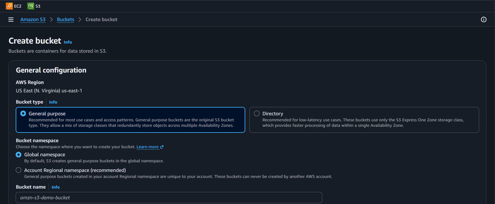
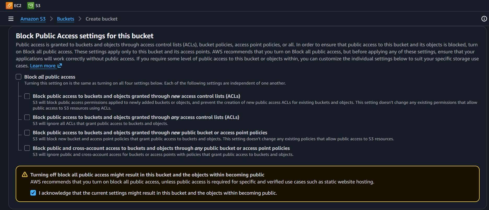
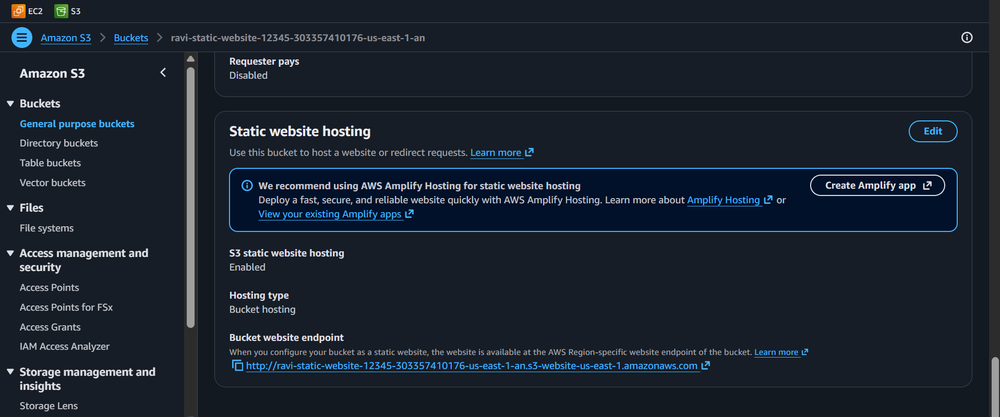
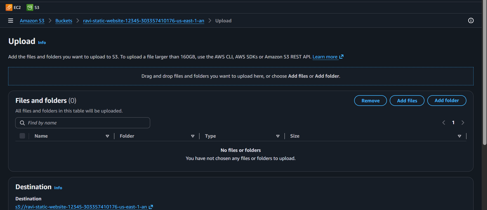
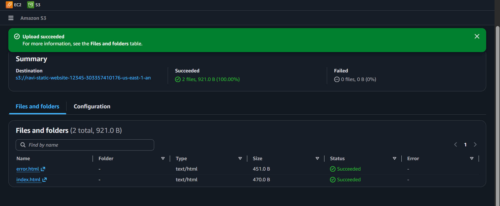
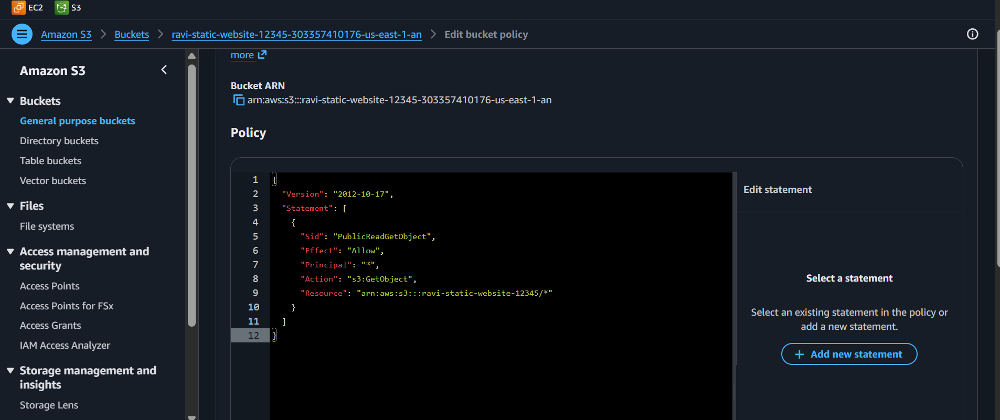
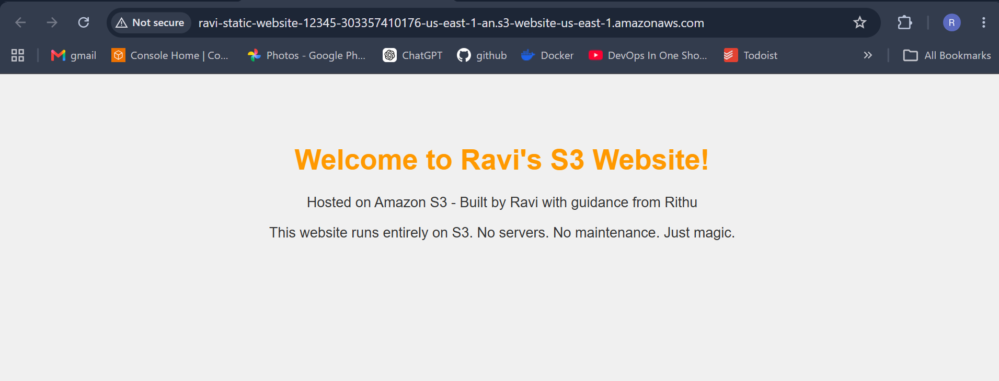
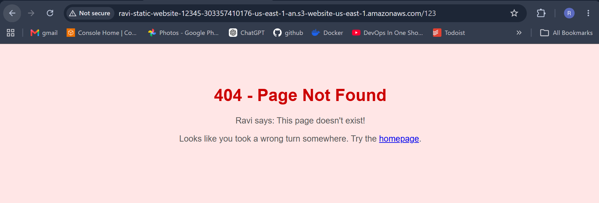

<div align="center">


</div>

<div align="center">

# Lab 05 — S3: Static Website Hosting


</div>

> *"S3 is like a magical empty filing cabinet in the sky. You can stuff files in it, and if you configure it right, the whole world can read them. Today, we're building a full static website inside that cabinet. No EC2. No Apache. Just S3."* — Rithu

---

<details>
<summary><b>🎭 Ravi & Rithu's Coffee Break Chat</b></summary>

**Ravi:** "Wait, I can host a WEBSITE on S3?!"

**Rithu:** "Yep! No server to manage, no OS to patch. Just pure static files served globally."

**Ravi:** "So S3 is basically a fancy USB stick that also hosts websites?"

**Rithu:** "That's... actually not a terrible analogy. I'm both proud and concerned."

</details>

---

## 📋 Table of Contents

- [🎯 Objective](#-objective)
- [📊 Lab Progress](#-lab-progress)
- [🤔 In Plain English](#-in-plain-english)
- [🧠 Prerequisites](#-prerequisites)
- [💰 Cost Warning](#-cost-warning)
- [🏗️ Architecture](#️-architecture)
- [🛠️ Step-by-Step Instructions](#️-step-by-step-instructions)
- [✅ Validation Checklist](#-validation-checklist)
- [🧹 Cleanup (IMPORTANT!)](#-cleanup-important)
- [🧠 Memory Tips](#-memory-tips)
- [🎓 What You Learned](#-what-you-learned)
- [🎮 Test Yourself](#-test-yourself-no-peeking-)
- [🆚 Pro Tip vs Noob Tip](#-pro-tip-vs-noob-tip)
- [🔗 What's Next?](#-whats-next)

---

<div align="center">

## 📊 Lab Progress

`[██░░░░░░░░░░░░░░░░░░] 5% — Let's Begin!`

</div>

---

## 🤔 In Plain English

> **What is this, really?** S3 is a **giant cloud filing cabinet**. You create a bucket (the drawer), upload files (the folders), and every file gets its own address on the internet. Flip on "static website hosting" and S3 becomes a tiny web server that serves your HTML files to anyone — **no EC2 instance needed**. 🗄️
>
> 🌍 **Why you should care:** Static sites (portfolios, landing pages, SPAs) are served to millions of users from S3 every day. It costs pennies, never goes down, and scales to infinity. This is the cheapest "hosting" you'll ever buy.

---

## 🎯 Objective

Create an S3 bucket, configure it for static website hosting, upload HTML files, set a bucket policy for public read access, and verify the site loads in a browser. You'll ALSO test the custom error document by trying to reach a non-existent page.

## 🧠 Prerequisites

- Completion of **[Lab 04 — AMI: Create and Clone](../04%20-%20AMI%20-%20Create%20and%20Clone/README.md)**
- Basic HTML knowledge (none required really)
- AWS Console familiarity

## 💰 Cost Warning

- S3 gives you 5 GB of standard storage FREE for the first 12 months; this lab uses ~0.01 GB.
- **Public access buckets** mean anyone with the URL can read your objects. This lab is intentionally public — real workloads need stricter controls.

**Still. DELETE THE BUCKET when done. Orphan buckets (especially public ones) are how breaches happen.**

> **Ravi's Mistake of the Day:** I enabled public access on an S3 bucket containing test data that had real customer emails in it. S3 misconfigurations are the #1 cause of AWS data breaches. Don't be like me.

## 🏗️ Architecture

```
┌───────────────────────────────────┐
│           S3 Bucket               │
│  ravi-static-website-12345        │
│  ┌─────────────────────────────┐  │
│  │ Bucket Policy               │  │
│  │ { "Principal": "*",         │  │
│  │   "Action": "s3:GetObject", │  │
│  │   "Resource": "arn:aws:...  │  │
│  │  "*"}                       │  │
│  └─────────────────────────────┘  │
│                                   │
│  Files:                           │
│  index.html  (root)               │
│  error.html  (custom error)       │
│                                   │
│  Website Endpoint:                │
│  http://ravi-static-website       │
│     -12345.s3-website-us-east-    │
│     1.amazonaws.com               │
└───────────────────────────────────┘
         │
         ▼
   Internet Browser
   http://<endpoint>       → index.html loads
    http://<endpoint>/nope  → error.html loads
```

> **Did You Know?** S3 stands for "Simple Storage Service." It was launched in 2006 and stores over 100 TRILLION objects. That's about 13,000 objects for every human on Earth.

## 🛠️ Step-by-Step Instructions

> 

1. AWS Management Console → search for **S3** → click it.
2. Click the orange **Create bucket** button.

📸 [Screenshot: S3 Console with the Create bucket button highlighted]


3. General configuration:

| Field | Value |
|-------|-------|
| Bucket type | **General purpose** (default) |
| Bucket name | `ravi-static-website-12345` |
| AWS Region | **US East (N. Virginia) us-east-1** |

> 
> The bucket name MUST be globally unique across **all** AWS accounts and regions — not just yours. If `ravi-static-website-12345` is taken (unlikely), add more numbers.

4. **Object Ownership:** Leave the default — **ACLs disabled** (Bucket owner enforced).

5. **Block Public Access settings for this bucket:**

   ⚠️ **This is the most important step.**

   - UNCHECK **Block all public access**.
   - A warning banner appears: "Turning off Block all public access might result in this bucket and the objects within becoming public."
   - Read the warning. Acknowledge it by checking: **I acknowledge that turning off Block all public access might result in this bucket and the objects within becoming public.**

   📸 [Screenshot: Block all public access section with all boxes UNCHECKED and the acknowledgment checked]
  


   > 
   > Normally you NEVER want a bucket public — but static websites need public access to reach browsers. In real life, most buckets stay private; use CloudFront (covered much later) to serve S3 content securely.

6. **Bucket Versioning:** Leave **Disable**.

7. **Tags (optional):** Add one or two:

   | Key | Value |
   |-----|-------|
   | Name | `ravi-static-website` |
   | Project | `AWS-Hands-On-Labs` |

8. **Default encryption:** Leave the default (**SSE-S3**). New S3 buckets are encrypted by default since January 2023 — there's no "Disable" option anymore, which is a good thing!

9. Click **Create bucket** at the bottom.

Congratulations, you own a cloud bucket! 🪣

> 

1. Click on your bucket name `ravi-static-website-12345`.
2. Go to the **Properties** tab.
3. Scroll down to the **Static website hosting** card.
4. Click **Edit**.

📸 [Screenshot: Properties tab showing Static website hosting section]

5. Configure:

| Field | Value |
|-------|-------|
| Static website hosting | **Enable** |
| Hosting type | **Host a static website** |
| Index document | `index.html` |
| Error document | `error.html` |

6. Click **Save changes**.

Now look at the **Static website hosting** card again. You'll see a **Bucket website endpoint**:

```
http://ravi-static-website-12345.s3-website-us-east-1.amazonaws.com
```

📸 [Screenshot: Static website hosting card showing the endpoint URL]


Copy that URL. You'll need it later.

> 
> Notice it's `http://` (unencrypted). S3 static website hosting doesn't support HTTPS natively. For HTTPS, you'd use CloudFront as a front CDN. File that away, young padawan.

> 

Create two HTML files on your LOCAL machine.

**index.html:**

```html
<!DOCTYPE html>
<html>
<head>
<title>Ravi's Website</title>
<style>
body {
  font-family: Arial, sans-serif;
  text-align: center;
  padding: 50px;
  background: #f0f0f0;
}
h1 {
  color: #ff9900;
}
p {
  color: #333;
}
</style>
</head>
<body>
<h1>Welcome to Ravi's S3 Website!</h1>
<p>Hosted on Amazon S3 - Built by Ravi with guidance from Rithu</p>
<p>This website runs entirely on S3. No servers. No maintenance. Just magic.</p>
</body>
</html>
```

**error.html:**

```html
<!DOCTYPE html>
<html>
<head>
<title>Oops - Not Found</title>
<style>
body {
  font-family: Arial, sans-serif;
  text-align: center;
  padding: 50px;
  background: #ffe6e6;
}
h1 {
  color: #cc0000;
}
p {
  color: #555;
}
</style>
</head>
<body>
<h1>404 - Page Not Found</h1>
<p>Ravi says: This page doesn't exist!</p>
<p>Looks like you took a wrong turn somewhere. Try the <a href="index.html">homepage</a>.</p>
</body>
</html>
```

> 
> Write them in any text editor (Notepad, VS Code, whatever). Just save them with a `.html` extension — not `.html.txt`.

> 

1. S3 Console → bucket `ravi-static-website-12345`.
2. Go to the **Objects** tab.
3. Click **Upload**.

📸 [Screenshot: Upload page in S3 Objects tab]


4. Click **Add files**.
5. Select **both** `index.html` and `error.html`.
6. Click **Upload** (blue button at bottom).

Alternative: drag and drop files from your computer onto the Upload panel.

Once uploaded, you should see both files listed in the Objects tab.

📸 [Screenshot: S3 Objects tab showing index.html and error.html listed, size ~300 bytes each]


> 

Objects are STILL private by default — unblocking public access doesn't make them readable. When a browser visits your website endpoint, S3 checks the bucket policy first.

1. S3 Console → your bucket **ravi-static-website-12345**.
2. Go to the **Permissions** tab.
3. Scroll to **Bucket Policy**.
4. Click **Edit**.
5. Paste the following:

```json
{
  "Version": "2012-10-17",
  "Statement": [
    {
      "Sid": "PublicReadGetObject",
      "Effect": "Allow",
      "Principal": "*",
      "Action": "s3:GetObject",
      "Resource": "arn:aws:s3:::ravi-static-website-12345/*"
    }
  ]
}
```

> 
> Decoding the JSON: `"Principal": "*"` means **anyone in the world**, `"Action": "s3:GetObject"` means **can read objects**, and the `/*` in the Resource means **every object in the bucket**. Exactly what a public static site needs.

6. Click **Save changes**.

> ⚠️ **Account-level Block Public Access:** Newer AWS accounts have "Block all public access" ON at the **account** level too — it silently overrides bucket settings. If saving fails, uncheck it under **S3 → Block Public Access settings** (account level), then save the policy again.

📸 [Screenshot: Bucket policy editor showing the JSON pasted and saved]


> 

1. Open a fresh browser tab.
2. Paste the **Bucket website endpoint** URL you copied earlier.
3. Press Enter.

You should see your custom HTML page — **"Welcome to Ravi's S3 Website!"**

📸 [Screenshot: Browser showing the index.html page loaded from S3 website endpoint]


**Now test the error page:**

1. Append `/nonexistent-page` to the URL in your browser:
   ```
   http://ravi-static-website-12345.s3-website-us-east-1.amazonaws.com/nonexistent-page
   ```
2. You should see your custom **404 - Page Not Found** page.

📸 [Screenshot: Browser showing the custom error page at a non-existent URL]


> 
> Without the error document configured, S3 would return a generic XML error page. Ugly. With `error.html` configured, S3 intercepts all 4xx errors and returns YOUR page. Your site, your branding.

### Alternative verification

In your terminal, you can also use `curl`:

```bash
curl http://ravi-static-website-12345.s3-website-us-east-1.amazonaws.com
```

## ✅ Validation Checklist

- [ ] 🪣 S3 bucket named `ravi-static-website-12345` created in us-east-1 ✅
- [ ] 🔓 Block all public access UNCHECKED and acknowledged ✅
- [ ] 🌐 Static website hosting ENABLED with index.html and error.html ✅
- [ ] 📄 index.html uploaded to bucket ✅
- [ ] ❌ error.html uploaded to bucket ✅
- [ ] 📜 Bucket policy granting `s3:GetObject` to `Principal: "*"` applied ✅
- [ ] 🖥️ index.html loads in browser at S3 website endpoint ✅
- [ ] ❌ error.html loads when visiting a non-existent path ✅
- [ ] 🌍 Website endpoint URL works for anyone on the internet ✅

> **POV:** Your S3 website is live and you tell everyone you're "basically a web developer now."

<div align="center">

> **Achievement Unlocked:** Web Host! Your first website is live on AWS!

</div>

## 🧹 Cleanup (IMPORTANT!)

> 🛑 **Don't skip cleanup!** Public buckets left running = potential bill and security risk.

1. 🗑️ **Delete objects:**
   - S3 Console → your bucket → **Objects** tab.
   - Select both `index.html` and `error.html`.
   - Click **Delete** → enter `permanently delete` in the confirmation → Click **Delete objects**.

2. 🪣 **Delete the bucket:**
   - Go back to bucket listing (S3 Console → Buckets).
   - Select `ravi-static-website-12345`.
   - Click **Delete**.
   - Enter the bucket name in the confirmation field: `ravi-static-website-12345`.
   - Click **Delete bucket**.

   > 
   > If the bucket contains objects that failed to delete previously, enable **Show versions** and delete ALL versions and ALL delete markers. Then try bucket deletion again. AWS won't let you delete a non-empty bucket.

## 🧠 Memory Tips

Stick these in your brain and they'll never leave. 🧲

| 🧠 Memory Hook | Remember it like... |
|---|---|
| **Bucket names are globally unique** | Like a **username for the entire internet** — someone on Earth owns every name you try. Add numbers if yours is taken. 🌍 |
| **index.html + error doc** | S3's deal: serve **`index.html`** at the root, and a custom error page (like `error.html`) when a file is missing. 📄 |
| **Bucket policy = door policy** | A JSON statement that says "everyone can **read** objects here" — required to make your site public. 🚪 |
| **Endpoint format** | `http://<bucket>.s3-website-<region>.amazonaws.com` — sing it like a song title. 🎵 |
| **Public ≠ private** | Public buckets are fine for websites, **disaster for private data**. If it's not meant for the world, keep it locked. 🔒 |

> 🗣️ **Rithu:** *"I once left a bucket public for 3 weeks. Lesson learned: public is a choice you make ON PURPOSE, not by accident."*

---

## 🎓 What You Learned

| Concept | Takeaway |
|---------|----------|
| Object storage | S3 stores files as objects in buckets, not as block devices |
| Globally unique bucket names | No two accounts can have the same bucket name |
| Static website hosting | S3 serves index.html at root and error.html for 404 |
| Bucket policies | JSON statements that grant/deny access at the BUCKET level |
| Public access | Useful for websites. Dangerous for private data. Use CloudFront |
| S3 website endpoint | URL format: `http://<bucket-name>.s3-website-<region>.amazonaws.com` |
| Custom error documents | Provide user-friendly 4xx pages |

## 🎮 Test Yourself! (No Peeking 👀)

**Q1:** Can two different AWS accounts create a bucket with the same name?

<details><summary>👀 Show answer</summary>

**A:** **No.** Bucket names are **globally unique across all AWS accounts worldwide**. That's why the lab makes you add random numbers. 🌍

</details>

**Q2:** You visit your S3 site and get **403 Forbidden**. What's the likely cause?

<details><summary>👀 Show answer</summary>

**A:** The bucket policy is missing/wrong, or objects are still private. Check: **Block Public Access** unchecked (at the **bucket AND account** level) + valid **bucket policy** with `/*` in the Resource. 🔧

</details>

**Q3:** Why does S3 make you upload `index.html` with that exact name?

<details><summary>👀 Show answer</summary>

**A:** Because static hosting treats **`index.html` as the homepage** — it's served automatically when someone visits the root URL. Rename it and you'll get a 404. 📄

</details>

### 🔥 Bonus Challenge

Make your **error page funny**: upload a custom `error.html` with a meme-style "404 — page not found, but coffee is still available ☕" and a broken link back to home. Then visit a random URL like `/does-not-exist` and show it off. 🎉

> 💪 **Rithu:** *"A good 404 page is the mark of a developer who cares about the little things."

---

### 🆚 Pro Tip vs Noob Tip

| | Approach |
|---|---|
| **Noob Tip** | Put private data in a public bucket "nobody knows the URL anyway" — until a bot finds it |
| **Pro Tip** | Public buckets only for websites; private data stays locked (or served via CloudFront) |

---

## 🔗 What's Next?

Excellent work hosting a static website! You've graduated from servers to serverless. The world, however, has MANY S3 superpowers.

Check out upcoming labs —
- **Lab 06** — S3 Versioning and Lifecycle Policies
- **Lab 07** — S3 Cross-Region Replication
- **Lab 08** — VPC: Build from Scratch

Or skip ahead. Whatever fuels your cloud engine. 🚀

<details>
<summary><strong>❓ Troubleshooting</strong></summary>

| 🔍 Problem | 💡 Likely Cause | 🔧 Fix |
|---------|-------------|------|
| 🚫 Browser shows **403 Forbidden** | Bucket policy missing or objects still private | Paste the Bucket Policy JSON exactly; verify object permissions |
| ❌ Browser shows **404 Not Found** | index.html filename wrong, or URL path wrong | Upload file named `index.html` exactly. Check S3 listing |
| 📄 Error.html appears as raw HTML | Error page URL doesn't match error document name | error.html must use `.html` or whatever you configured |
| 🌐 Bucket creation fails with "name already taken" | Someone else globally owns that bucket name | Add extra numbers/characters to bucket name |
| ⚠️ Bucket policy has warning yellow/red or won't save | Block Public Access is still ON | Uncheck ALL Block Public Access boxes at the **bucket** level (Permissions → Block Public Access) AND the **account** level (S3 → Block Public Access settings) |
| 🔄 `Unable to Update, the S3 web endpoint always returns "The specified bucket does not have a website configuration"` | Static website hosting NOT enabled | Properties → Static website hosting → Enable |
| 🔒 Internet users still get Access Denied | Bucket Policy syntax error or resource ARN mismatch | Double-check `Resource` ends with `/*` (the wildcard covers all objects) |
| 🛡️ Objects show ACLs disabled, bucket policy is wrong place | ACLs not needed for static sites | Bucket Owner Enforced + Bucket Policy = the way

</details>

---

<div align="center">


*Written by Rithu, after accidentally hosting a bucket named "rithu-fun-bucket-ohno" publicly for 3 weeks. Ravi's bucket maybe safer. maybe.*

</div>
