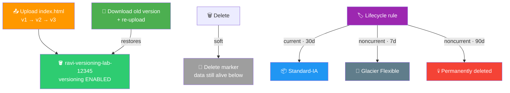
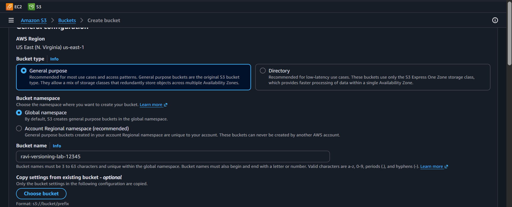
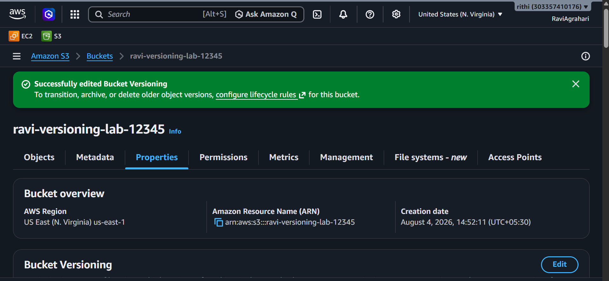
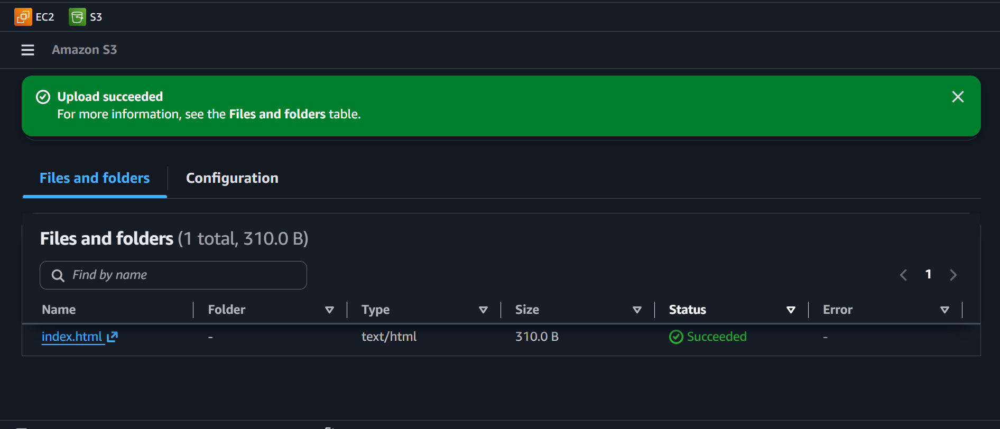
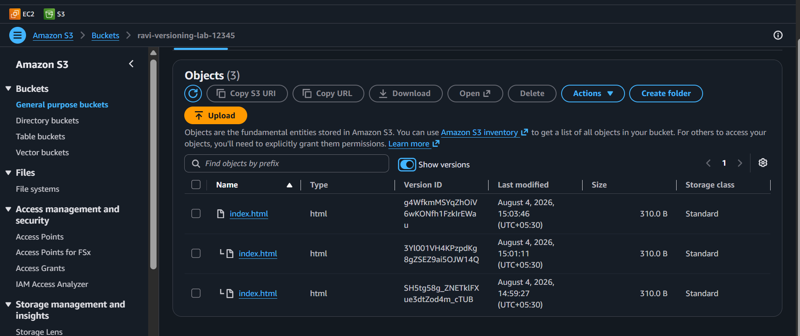
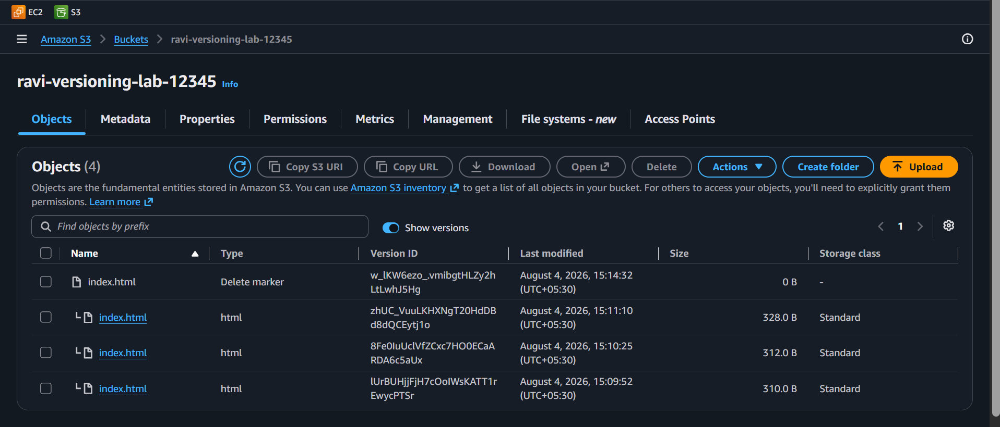
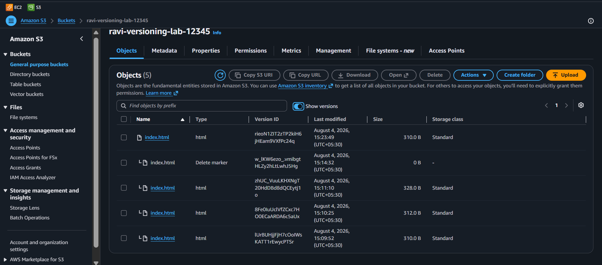
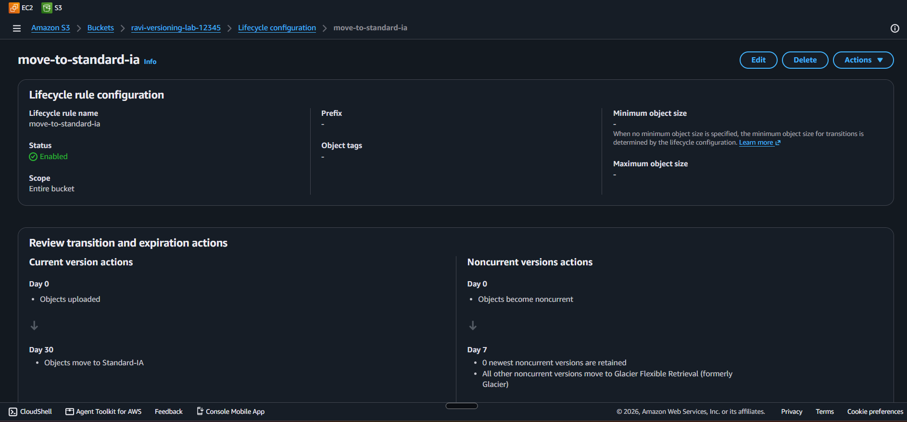

# ⏳ Lab 06 - S3: Versioning and Lifecycle Policies

> 📅 **Updated:** 21 August 2026 | ⏱️ **Duration:** ~20 minutes | 📊 **Level:** Beginner


> ### 🗣️ *"Versioning is like having a time machine for your files. Accidentally deleted something? No worries — it's still there!"*
> — **Rithu** 🚀

<details>
<summary><b>🎭 Ravi & Rithu's Coffee Break Chat</b></summary>

**Ravi:** "Versioning is like Ctrl+Z for S3?"

**Rithu:** "Yes! Except each version costs a tiny bit of storage. So it's Ctrl+Z with a bill."

**Ravi:** "Everything in AWS has a bill."

**Rithu:** "Welcome to the cloud, where even your undos cost money."

</details>

---

## 🎯 What You'll Master

| Skill | Description |
|-------|-------------|
| 🕰️ **Enable Versioning** | Every upload becomes a save point |
| 👻 **Soft Deletes** | Delete markers — hidden, not gone |
| 🔄 **Restore Versions** | Roll back like a video game |
| 🏷️ **Lifecycle Policies** | Money autopilot: Standard → IA → Glacier |
| 🗑️ **Versioned Cleanup** | The trap everyone falls into |

> 💡 **Pro Tip:** Accidental overwrites destroy careers; cheap storage saves budgets. Versioning + lifecycle are the two features every real-world S3 bucket should have from day one.

---

## 🚦 Before You Start

### ✅ Prerequisites Checklist
- [ ] ✅ **[Lab 05](../05%20-%20S3%20-%20Static%20Website%20Hosting/README.md)** complete
- [ ] 🌍 Region: us-east-1
- [ ] 📝 Text editor for a tiny HTML file

### 📦 What You Need (and Don't)
| Required | Optional |
|----------|----------|
| ~20 minutes | Glacier retrieval patience (not needed today!) |
| S3 console familiarity | |

---

## 💰 Cost & Safety First

> ✅ **Under $1 total.** But remember: S3 charges per GB-month, and transitions only save money if you actually need them.

> 💸 **Ravi's Mistake of the Day:** *"I turned on versioning but never set up lifecycle policies. After 6 months I had 10,000 versions of the same file and my S3 bill was... not happy."*

### 🏷️ Naming Convention

| Resource | Name |
|----------|------|
| 🪣 Bucket | `ravi-versioning-lab-12345` *(taken? change the number)* |
| 🏷️ Lifecycle rule | `move-to-standard-ia` |

---

## 🧠 How It All Fits Together



### 🔑 Key Concepts
| Component | Role |
|-----------|------|
| **Versioning** | Every overwrite = new Version ID; one-way valve (suspend ≠ undo) |
| **Delete marker** | Sticky note saying "pretend this doesn't exist" — data safe underneath |
| **Current vs noncurrent** | Checkmark = current; everything else waits in history |
| **Lifecycle transitions** | Standard $0.023 → Standard-IA $0.0125 → Glacier $0.004 /GB-month |
| **Versioned cleanup** | Bucket refuses deletion until ALL versions + markers are gone |

> 🧠 **Did You Know?** S3 Standard has 99.999999999% durability (11 nines). Store 10 million objects and you might lose ONE every 10,000 years. Probably fine.

---

## 🪜 Step-by-Step Guide

### 🟢 Step 1: Create the Bucket 🪣

<details>
<summary><b>🪣 Expand for creation steps</b></summary>

1. 🌐 Console → **S3** → ➕ **Create bucket**
2. 📝 Name: `ravi-versioning-lab-12345` · Region: `us-east-1`
3. Everything else default → ✅ **Create bucket**

</details>



> 🗣️ **Rithu's Tip:** *"Globally unique across ALL of AWS. The `12345` helps, but if it's taken, try different numbers!"*

---

### 🟢 Step 2: Enable Versioning 🕰️

<details>
<summary><b>🕰️ Expand for versioning steps</b></summary>

1. Open the bucket → **Properties** tab
2. Scroll to **Bucket Versioning** → ✏️ **Edit**
3. Select **Enable** → ✅ **Save changes** → green banner confirms

</details>



> 🗣️ **Rithu's Tip:** *"Once enabled, you can never go back to Unversioned — only suspend it, which stops NEW versions but keeps old ones. One-way valve!"*

---

### 🟢 Step 3: Upload Three Versions 📤

<details>
<summary><b>📤 Expand for the three uploads</b></summary>

Upload the SAME filename three times, editing between uploads:

```html
<h1>Hello from Version 1</h1>
```
```html
<h1>Hello from Version 2 — Updated!</h1>
```
```html
<h1>Hello from Version 3 — Final Version!</h1>
```

Each time: **Objects → Upload → Add files → Upload** → wait for the green banner.

Notice S3 never complains about "overwriting" — versioning creates a NEW version instead!

</details>



---

### 🟢 Step 4: See All Versions 👀

<details>
<summary><b>👀 Expand for version listing</b></summary>

1. Objects tab shows ONE file... 😏
2. Toggle **List versions** above the file list
3. 👀 THREE versions appear, each with its own **Version ID**
4. ✔️ The checkmark icon = the **current** version (v3)

</details>



> 🗣️ **Rithu's Tip:** *"It's like Git, but for your files! Wrong upload? Roll back to any previous version."*

---

### 🟢 Step 5: Soft Delete + Restore + Revive 🔄

<details>
<summary><b>🗑️ Expand for soft-delete steps</b></summary>

1. With **List versions** ON, select the CURRENT `index.html` (checkmark one)
2. 🗑️ **Delete** → choose **Delete** (NOT "Permanently delete") → type `delete` → confirm
3. 👀 File is STILL there! A **Delete marker** (grey x) now sits on top — the 3 versions remain below

</details>



<details>
<summary><b>🔄 Expand for restore steps</b></summary>

Pretend we panicked:

1. Find **v1** ("Hello from Version 1") → check its box
2. **Actions → Download** (or open via Version ID → Download)
3. Re-upload that downloaded file → S3 creates a NEW current version with v1's content

The console has no "make current" button (that's CLI territory: `aws s3api copy-object`). Download + re-upload is the console way.

</details>



<details>
<summary><b>✨ Expand for removing the delete marker</b></summary>

1. With **List versions** ON, select the **Delete marker** itself
2. 🗑️ **Delete** → type `delete` → confirm
3. ✨ The latest real version becomes "current" again — visible without listing versions

</details>

> 🗣️ **Rithu's Tip:** *"Imagine you deployed broken code to production. Versioning = restore last known good. No stress!"*

---

### 🟢 Step 6: Create the Lifecycle Rule 🏷️

<details>
<summary><b>🏷️ Expand for lifecycle steps</b></summary>

1. 🪣 Bucket → **Management** tab → **Lifecycle rules** → ➕ **Create lifecycle rule**

   > 📝 *Console note:* the editor is a single scrolling page — no wizard steps. Finish with **Create rule** at the bottom.

2. 📝 Configure:

   | Section | Setting |
   |---------|---------|
   | Rule name | `move-to-standard-ia` |
   | Scope | **Apply to all objects in the bucket** (+ acknowledge) |
   | Current versions | Move to **Standard-IA** after **30** days |
   | Noncurrent versions | Move to **Glacier Flexible Retrieval** after **7** days noncurrent |
   | Noncurrent versions | **Permanently delete** after **90** days noncurrent |

3. Review: current → IA @30d · noncurrent → Glacier @7d · noncurrent → delete @90d
4. ✅ **Create rule**

Why it saves money: rarely-accessed files auto-walk to cheaper shelves — up to 80%+ savings!

</details>



---

## ✅ Validation Checklist

| # | Check | Status |
|---|-------|--------|
| 1️⃣ | Bucket created in us-east-1 | ☐ ✅ |
| 2️⃣ | Versioning shows **Enabled** | ☐ ✅ |
| 3️⃣ | 3 versions of `index.html` listed with distinct IDs | ☐ ✅ |
| 4️⃣ | Delete created a marker, not a massacre | ☐ ✅ |
| 5️⃣ | Old version restored via download + re-upload | ☐ ✅ |
| 6️⃣ | Delete marker removed; file visible again | ☐ ✅ |
| 7️⃣ | Lifecycle rule `move-to-standard-ia` active with all 3 transitions | ☐ ✅ |

> 🏆 **Achievement Unlocked:** Time Traveler! Versioning means never losing data.

---

## 🧹 Cleanup (Follow Order!)

> ⚠️ **A versioned bucket REFUSES to delete until every version AND marker is gone!**

| Step | Action | Console Location |
|------|--------|------------------|
| 1️⃣ 👻 | Turn ON **List versions** | Bucket → Objects |
| 2️⃣ 🗑️ | Select ALL (incl. delete markers) → type `permanently delete` → confirm | Objects |
| 3️⃣ 🪣 | Select bucket → type name → **Delete bucket** | S3 → Buckets |

> 🗣️ **Rithu's Tip:** *"With versioning you can't just 'delete' objects — S3 makes you type `permanently delete` so you really mean it. Double-check!"*

---

## 🚀 Level Ups (Post-Core Lab)

| Challenge | What to Try | Notes |
|-----------|-------------|-------|
| 🕹️ **Break It On Purpose** | Overwrite 3×, restore v1, delete, resurrect | Full time-travel loop |
| 🧊 **Glacier Peek** | Try retrieving an object from Glacier Flexible | Feel the hours-long thaw |
| 📏 **Prefix Rules** | Scope a lifecycle rule to a `logs/` prefix only | Real buckets use prefixes |

---

## 🆘 Troubleshooting Quick Reference

| 🔍 Issue | 💡 Likely Cause | 🔧 Fix |
|-------|--------------|-----|
| 🔧 Bucket name rejected | Taken globally | Change number suffix (`ravi-versioning-lab-67890`) |
| 🕰️ Versioning toggle greyed out | Wrong tab | Use **Properties**, not Objects |
| 👀 No "List versions" toggle | Easy to miss | Small button/link just above the file list |
| 🏷️ Lifecycle rule won't save | Missing required fields | Fill days + storage class for each action |
| 🗑️ Can't delete bucket | Not truly empty | List versions ON → delete everything incl. markers |
| 🚫 Access Denied on lifecycle rule | IAM missing permission | Need `s3:PutLifecycleConfiguration` |

---

## 🎮 Test Yourself! (No Peeking 👀)

**Q1:** Versioning is ON. You delete a file. Gone forever?

<details><summary>👀 Show answer</summary>

**A:** **No!** S3 drops a **delete marker** — hidden, not destroyed. Remove the marker or restore the version. 👻

</details>

**Q2:** Why transition objects to Glacier after 90 days?

<details><summary>👀 Show answer</summary>

**A:** **Money.** Rarely-accessed data costs a fraction of Standard there, and the policy automates what humans forget. 💰

</details>

**Q3:** AWS won't delete your versioned bucket. What's missing?

<details><summary>👀 Show answer</summary>

**A:** **Versions + delete markers** still inside. Empty fully with "List versions" ON, then delete. 🗑️

</details>

> 💪 **Rithu:** *"Go break something on purpose. Versioning has your back — that's the whole point."*

---

## 📚 Official Documentation

- 🕰️ [Using Versioning in S3 Buckets](https://docs.aws.amazon.com/AmazonS3/latest/userguide/Versioning.html)
- 🏷️ [Managing Your Storage Lifecycle](https://docs.aws.amazon.com/AmazonS3/latest/userguide/object-lifecycle-mgmt.html)
- 📦 [Amazon S3 Storage Classes](https://docs.aws.amazon.com/AmazonS3/latest/userguide/storage-class-intro.html)

---

## 🎓 What You Learned

> **The time traveler's kit:**
> - 🕰️ **Versioning** → every overwrite is a save point
> - 👻 **Delete markers** → soft deletes; data alive underneath
> - 🔄 **Restore** → download old version, re-upload as new current
> - 🏷️ **Lifecycle** → Standard → IA → Glacier autopilot
> - 🗑️ **Cleanup trap** → versions + markers must ALL go first

**Golden Habit:** Versioning + lifecycle together from day one → bill stays tiny, data stays safe. 🧹

| | Approach |
|---|---|
| 👶 **Noob Way** | Versioning on, no lifecycle → storage bill quietly grows forever |
| 🧙 **Pro Way** | Both from day one: old versions auto-migrate to Glacier, bill stays tiny |

---

## ➡️ What's Next?

You can protect data within a region. Next: replicate it across regions for disaster recovery. 🌍

🎯 **[Lab 07 - S3: Cross-Region Replication](../07%20-%20S3%20-%20Cross-Region%20Replication/README.md)**

---

<div align="center">

### ⭐ Enjoyed this lab? Star the repo & share your feedback!

**Happy Learning!** 🚀☁️

</div>
