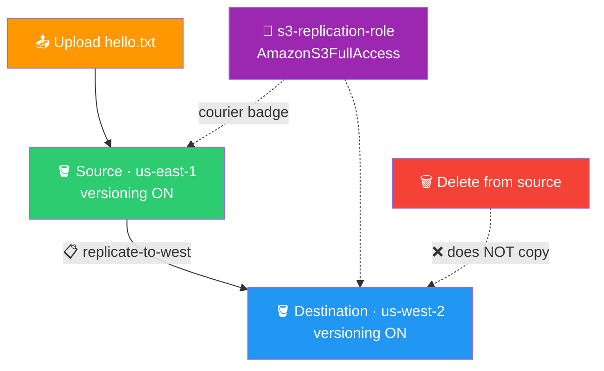

# 🌍 Lab 07 - S3: Cross-Region Replication

> 📅 **Updated:** 21 August 2026 | ⏱️ **Duration:** ~40 minutes | 📊 **Level:** Beginner+


> ### 🗣️ *"Disasters don't send calendar invites. Cross-region replication means your data is safe even if an entire region goes down!"*
> — **Rithu** 🌍

<details>
<summary><b>🎭 Ravi & Rithu's Coffee Break Chat</b></summary>

**Ravi:** "Why would I replicate data to another region?"

**Rithu:** "Disaster recovery! If us-east-1 has a meltdown, your data survives in us-west-2."

**Ravi:** "So it's like keeping a spare key at your friend's house?"

**Rithu:** "Exactly! Except your friend lives 2,500 miles away and charges $0.02/GB."

</details>

---

## 🎯 What You'll Master

| Skill | Description |
|-------|-------------|
| 🖨️ **Set Up CRR** | Upload once — AWS copies forever |
| 🔑 **IAM Roles for S3** | The courier badge that lets S3 copy across buckets |
| 💍 **Versioning Requirements** | Both buckets or nothing |
| 🛡️ **Deletion Semantics** | Why source deletes don't nuke your backup |
| ⏳ **Replication Patience** | First copies take minutes, not milliseconds |

> 💡 **Pro Tip:** CRR is essential for disaster recovery, compliance, and data locality. If a whole region catches fire, your second-region data survives.

---

## 🚦 Before You Start

### ✅ Prerequisites Checklist
- [ ] ✅ **[Lab 06](../06%20-%20S3%20-%20Versioning%20and%20Lifecycle%20Policies/README.md)** complete
- [ ] 🌍 Two regions: us-east-1 + us-west-2
- [ ] 🔐 Basic IAM familiarity (we'll walk through the role!)

### 📦 What You Need (and Don't)
| Required | Optional |
|----------|----------|
| ~40 minutes | ☕ coffee for the replication wait |
| A tiny text file | |

---

## 💰 Cost & Safety First

> ⚠️ **CRR stores your data in BOTH regions — you pay twice!** Pennies for this lab's tiny files; real money when replicating terabytes. Delete both buckets AND the IAM role when done.

> 💸 **Ravi's Mistake of the Day:** *"I set up CRR and thought it would be instant. It's not. It can take hours for large buckets. Patience is a virtue in the cloud."*

### 🏷️ Naming Convention

| Resource | Name |
|----------|------|
| 🪣 Source bucket (us-east-1) | `ravi-source-replication-12345` |
| 🪣 Destination bucket (us-west-2) | `ravi-dest-replication-12345` |
| 🔑 IAM Role | `s3-replication-role` |
| 📋 Replication rule | `replicate-to-west` |

---

## 🧠 How It All Fits Together



### 🔑 Key Concepts
| Component | Role |
|-----------|------|
| **Versioning on BOTH** | CRR's #1 requirement — needs Version IDs to track copies |
| **IAM Role** | Key card: read source → write destination |
| **Replication rule** | Scope (all objects), destination, role — one page, one Save |
| **Deletion behavior** | Deletes don't replicate by default = built-in backup safety |
| **Timing** | Rule init takes minutes; new objects usually ≤15 min |

> 🧠 **Did You Know?** CRR can replicate across different AWS accounts and even to buckets in different countries. Your data can literally have a passport.

---

## 🪜 Step-by-Step Guide

### 🟢 Step 1: Create Both Buckets (+ Versioning!) 🪣🪣

<details>
<summary><b>🪣 Expand for bucket steps</b></summary>

**Source:**

1. 🌐 S3 console → ➕ **Create bucket**
2. 📝 `ravi-source-replication-12345` · Region: `us-east-1` · defaults → ✅ Create
3. Open it → **Properties** → **Bucket Versioning** → Edit → **Enable** → Save

**Destination:**

4. ➕ **Create bucket**
5. 📝 `ravi-dest-replication-12345` · Region: `US West (Oregon) us-west-2` · defaults → ✅ Create
6. Open it → **Properties** → **Bucket Versioning** → Edit → **Enable** → Save

⚠️ **Versioning MUST be ON for both** — don't skip!

</details>


> 🗣️ **Rithu's Tip:** *"AWS won't let you replicate between non-versioned buckets — replication tracks each copy by Version ID."*

---

### 🟢 Step 2: Create the IAM Courier Badge 🔑

<details>
<summary><b>🔑 Expand for IAM role steps</b></summary>

1. 🌐 Console → search **IAM** → **Roles** → ➕ **Create role**
2. 👤 Trusted entity type: **AWS Service**
3. 🎯 Use case: **S3** → **Next**

   

4. 📜 Permissions: search & check **AmazonS3FullAccess** → **Next**

   > ⚠️ *Production note:* use a custom least-privilege policy — the managed policy is lab simplicity only.

   

5. 📝 Role name: `s3-replication-role` → ✅ **Create role**

</details>


> 🗣️ **Rithu's Tip:** *"IAM Roles are like key cards: this one tells S3 'read from source, write to destination.' Never grant more than needed in production!"*

---

### 🟢 Step 3: Create the Replication Rule 📋

<details>
<summary><b>📋 Expand for rule steps</b></summary>

1. 🪣 Source bucket → **Management** tab → **Replication rules** → ➕ **Create replication rule**
2. 📝 Configure (single scrolling page — no wizard):

   | Section | Setting |
   |---------|---------|
   | Rule name | `replicate-to-west` |
   | Scope | **Apply to all objects in the bucket** |
   | Destination | **Choose a bucket in this account** → `ravi-dest-replication-12345` |
   | IAM role | `s3-replication-role` from dropdown |
   | Additional options | Leave RTC unchecked (optional + costs more) |

3. Review: source ✓ destination ✓ rule name ✓ role ✓ → ✅ **Save**

</details>


> 🗣️ **Rithu's Tip:** *"Replication isn't instant — initialization takes a few minutes; new objects typically land within 15. Be patient, Ravi!"*

---

### 🟢 Step 4: Upload Test Files 📤

<details>
<summary><b>📤 Expand for upload steps</b></summary>

Create locally and upload to the SOURCE bucket:

```
Hello from the source bucket in N. Virginia!
```
*(save as `hello.txt`)*

```
Second file replicated automatically!
```
*(save as `file2.txt`)*

```html
<h1>Replicated HTML File</h1>
<p>This file was automatically copied to us-west-2</p>
```
*(save as `file3.html`)*

Upload all three → wait for success banners.

</details>


---

### 🟢 Step 5: Verify Replication ☕→🎉

<details>
<summary><b>🎉 Expand for verification steps</b></summary>

1. ⏳ Wait **2–5 minutes** (first-ever replication can take up to 15)
2. 🪣 Open `ravi-dest-replication-12345` → **Objects** tab
3. 👀 `hello.txt` should appear! Click it — same content, now living in Oregon
4. Check the other two files too — everything you upload from now on auto-copies!

Not there yet? Check rule status: source bucket → **Management → Replication rules**.

</details>


---

### 🟢 Step 6: The Deletion Surprise 🗑️

<details>
<summary><b>🗑️ Expand for deletion test</b></summary>

1. 🪣 Source bucket → select `hello.txt` → **Delete** → confirm
2. 🪣 Destination bucket → Objects tab
3. 😮 `hello.txt` is STILL THERE!

That's a safety feature: accidental source deletions leave destination copies intact. In production you can enable delete-marker replication if you want synced deletions.

</details>

---

## ✅ Validation Checklist

| # | Check | Status |
|---|-------|--------|
| 1️⃣ | Source bucket us-east-1, versioning ON | ☐ ✅ |
| 2️⃣ | Destination bucket us-west-2, versioning ON | ☐ ✅ |
| 3️⃣ | IAM role `s3-replication-role` created | ☐ ✅ |
| 4️⃣ | Rule `replicate-to-west` active | ☐ ✅ |
| 5️⃣ | Files appear in destination within ~15 min | ☐ ✅ |
| 6️⃣ | Source delete ≠ destination delete | ☐ ✅ |

> 🏆 **Achievement Unlocked:** Global Replicator! Data across continents.

---

## 🧹 Cleanup (Follow Order!)

> ⚠️ **Reverse order: objects → rules → buckets → roles.** Bucket-first leaves orphaned rules and confusing errors!

| Step | Action | Console Location |
|------|--------|------------------|
| 1️⃣ 🗑️ | Empty SOURCE: List versions ON → select ALL incl. markers → `permanently delete` | Source → Objects |
| 2️⃣ 🗑️ | Empty DESTINATION the same way | Destination → Objects |
| 3️⃣ 📋 | Delete rule `replicate-to-west` | Source → Management |
| 4️⃣ 🪣 | Delete both buckets (type names to confirm) | S3 → Buckets |
| 5️⃣ 🔑 | Delete `s3-replication-role` (type name to confirm) | IAM → Roles |

---

## 🚀 Level Ups (Post-Core Lab)

| Challenge | What to Try | Notes |
|-----------|-------------|-------|
| 🎤 **DR Story Drill** | Upload → replicate → delete source → prove destination survives | Interview-worthy demo |
| 👻 **Marker Sync** | Enable delete-marker replication option | Watch deletions start to sync |
| 🌐 **Prefix Scope** | Restrict the rule to a `critical/` prefix | Selective replication |

---

## 🆘 Troubleshooting Quick Reference

| 🔍 Issue | 💡 Likely Cause | 🔧 Fix |
|-------|--------------|-----|
| ❌ "Replication rule failed" | Versioning off on either bucket | Enable on BOTH — the #1 failure cause |
| ⏳ Files not replicating | Normal latency | Wait 5–15 min; check rule status in Management tab |
| 🚫 Access Denied creating role | Wrong policy/trust | Trusted entity = S3 service + `AmazonS3FullAccess` attached |
| 🔍 Can't pick destination | Not versioned / wrong region filter | Enable versioning; remember dest is us-west-2 |
| 🕰️ Rule shows "Pending" | Initialization running | Give it 5–10 min |
| 🗑️ Can't delete buckets | Versions/markers remain | List versions ON → delete everything first |

---

## 🎮 Test Yourself! (No Peeking 👀)

**Q1:** What's the #1 cause of CRR setup failure?

<details><summary>👀 Show answer</summary>

**A:** **Versioning not enabled on both buckets.** AWS won't even offer non-versioned destinations. 💍

</details>

**Q2:** You delete an object at the source. What happens at the destination?

<details><summary>👀 Show answer</summary>

**A:** **Nothing.** Deletions don't replicate by default — that's what makes it a real backup. 🛡️

</details>

**Q3:** Three real-world reasons companies enable CRR?

<details><summary>👀 Show answer</summary>

**A:** **Disaster recovery**, **compliance** (multi-region residency), **data locality** (faster access near users). 🌍

</details>

> 💪 **Rithu:** *"A backup you've never tested is a wish, not a backup. Test it. Delete something!"*

---

## 📚 Official Documentation

- 🌍 [Replicating Objects (CRR)](https://docs.aws.amazon.com/AmazonS3/latest/userguide/replication.html)
- ⚙️ [Configuring Replication](https://docs.aws.amazon.com/AmazonS3/latest/userguide/replication-configure.html)
- 🔑 [Granting S3 Permission to Replicate on Your Behalf](https://docs.aws.amazon.com/AmazonS3/latest/userguide/replication-walkthrough.html)

---

## 🎓 What You Learned

> **The global replicator's checklist:**
> - 💍 **Versioning everywhere** → no versioning, no replication
> - 📦 **IAM courier badge** → S3 borrows permission via role
> - 🖨️ **One rule, forever copies** → upload once, duplicated always
> - 🛡️ **Deletes stay local** → destination = snapshot-in-time backup
> - ☕ **Patience** → 5–15 minutes is normal

**Golden Habit:** Pick destination regions strategically → watch dual-region costs → TEST failover before you need it. 🧹

| | Approach |
|---|---|
| 👶 **Noob Way** | Set up CRR, forget the destination → duplicate bills, no DR story |
| 🧙 **Pro Way** | Strategic region choice, cost awareness, tested failover |

---

## ➡️ What's Next?

Storage mastered. Time for NETWORKING — you'll build a Virtual Private Cloud from scratch, the foundation of every AWS architecture. 🏗️

🎯 **[Lab 08 - VPC: Build from Scratch](../08%20-%20VPC%20-%20Build%20from%20Scratch/README.md)**

---

<div align="center">

### ⭐ Enjoyed this lab? Star the repo & share your feedback!

**Happy Learning!** 🚀☁️

</div>
