<div align="center">


</div>

<div align="center">

# Lab 07 — S3: Cross-Region Replication


</div>

> "Disasters don't send calendar invites. Cross-region replication means your data is safe even if an entire region goes down!" — Rithu 🌍

---

<details>
<summary><b>🎭 Ravi & Rithu's Coffee Break Chat</b></summary>

**Ravi:** "Why would I replicate data to another region?"

**Rithu:** "Disaster recovery! If us-east-1 has a meltdown, your data survives in us-west-2."

**Ravi:** "So it's like keeping a spare key at your friend's house?"

**Rithu:** "Exactly! Except your friend lives 2,500 miles away and charges $0.02/GB."

</details>

---

## 📋 Table of Contents

- [🎯 Objective](#-objective)
- [📊 Lab Progress](#-lab-progress)
- [🤔 In Plain English](#-in-plain-english)
- [🧠 Prerequisites](#-prerequisites)
- [💰 Cost Warning](#-cost-warning)
- [🏗️ Architecture](#️-architecture)
- [🛠️ Step-by-Step Instructions](#️-step-by-step-instructions)
- [✅ Validation Checklist](#-validation-checklist)
- [🧹 Cleanup (IMPORTANT!)](#-cleanup-important)
- [🧠 Memory Tips](#-memory-tips)
- [🎓 What You Learned](#-what-you-learned)
- [🎮 Test Yourself](#-test-yourself-no-peeking-)
- [🆚 Pro Tip vs Noob Tip](#-pro-tip-vs-noob-tip)
- [🔗 What's Next?](#-whats-next)

---

<div align="center">

## 📊 Lab Progress

`[██░░░░░░░░░░░░░░░░░░] 5% — Let's Begin!`

</div>

---

## 🤔 In Plain English

> **What is this, really?** Cross-Region Replication (CRR) is a **magical photocopier** — every file you drop in bucket A (say, `us-east-1`) gets automatically copied to bucket B in another region (say, `us-west-2`). You upload once, AWS duplicates it for you, in the background, forever. 🖨️
>
> 🌍 **Why you should care:** If a whole region catches fire (or a provider goes down), your data in the second region survives. That's called **disaster recovery** — and it's why CRR exists.

---

## 🎯 Objective

In this lab, you'll set up **Cross-Region Replication (CRR)** — a feature that automatically copies every object you upload in one S3 bucket to a bucket in a completely different AWS region. This is essential for disaster recovery, compliance, and reducing latency for users in different geographic locations.

---

## 🧠 Prerequisites

- [x] Completed [Lab 06 — S3 Versioning and Lifecycle Policies](../06%20-%20S3%20-%20Versioning%20and%20Lifecycle%20Policies/README.md)
- [x] AWS account with console access
- [x] Basic understanding of IAM roles (don't worry — we'll walk through it!)

---

## 💰 Cost Warning

> ⚠️ **CRR has storage costs in BOTH regions!** You're paying for the same data in two places. For our tiny test file, this is basically free. But in production, always calculate the cost of replicating terabytes of data across regions. **Delete both buckets and the IAM role when you're done!**

> **Ravi's Mistake of the Day:** I set up cross-region replication and thought it would be instant. It's not. It can take hours for large buckets. Patience is a virtue in the cloud.

---

## 🏗️ Architecture

```
┌──────────────────────┐          ┌──────────────────────┐
│   SOURCE BUCKET      │          │  DESTINATION BUCKET   │
│  us-east-1 (N.VA)    │ ──────▶  │  us-west-2 (OREGON)  │
│                      │  CRR     │                      │
│  ravi-source-        │  Rule    │  ravi-dest-           │
│  replication-12345   │          │  replication-12345    │
│                      │          │                      │
│  [Versioning: ON]    │          │  [Versioning: ON]     │
└──────────────────────┘          └──────────────────────┘
         ▲
         │
    ┌────┴────┐
    │ IAM Role│
    │s3-rep-  │
    │lication- │
    │role     │
    └─────────┘
```

> **Did You Know?** S3 Cross-Region Replication can replicate across different AWS accounts and even to buckets in different countries. Your data can literally have a passport.

---

## 🛠️ Step-by-Step Instructions

> 

1. Log in to the [AWS Management Console](https://console.aws.amazon.com/)
2. In the search bar, type **S3** and click on **S3**
3. Click **Create bucket**
4. Configure:
   - **Bucket name:** `ravi-source-replication-12345`
   - **AWS Region:** `US East (N. Virginia) us-east-1`
5. Leave all other settings as default
6. Click **Create bucket**

> 📸 [Screenshot: Source bucket created successfully]
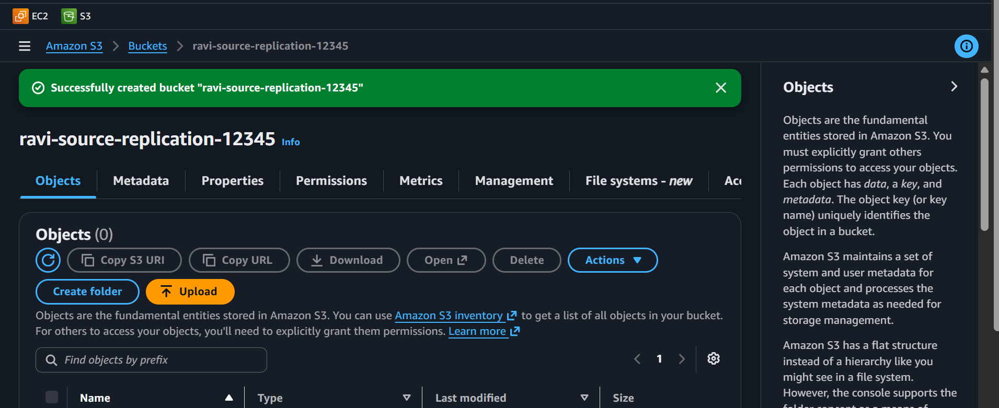

> 
> us-east-1 is the default region for most AWS services and often the cheapest. It's our "home base" for this lab!

---

> 

1. Click on `ravi-source-replication-12345`
2. Click the **Properties** tab
3. Find **Bucket Versioning** → click **Edit**
4. Select **Enable**
5. Click **Save changes**

> ⚠️ **IMPORTANT:** Versioning MUST be enabled on BOTH buckets for replication to work. Don't skip this!

---

> 

1. Go back to the S3 console (click **S3** in the breadcrumbs)
2. Click **Create bucket**
3. Configure:
   - **Bucket name:** `ravi-dest-replication-12345`
   - **AWS Region:** `US West (Oregon) us-west-2`
     - 📸 [Screenshot: Region dropdown showing Oregon selected]
4. Leave all other settings as default
5. Click **Create bucket**

---

> 

1. Click on `ravi-dest-replication-12345`
2. Click the **Properties** tab
3. Find **Bucket Versioning** → click **Edit**
4. Select **Enable**
5. Click **Save changes**

> 
> Both buckets now have versioning enabled. This is a hard requirement for CRR — AWS won't let you replicate between non-versioned buckets. Why? Because replication needs to track which version of each object to copy!

---

> 

Now we need to give S3 permission to read from one bucket and write to another. We do this with an IAM Role.

1. In the search bar at the top, type **IAM** and click on **IAM**
2. In the left sidebar, click **Roles**
3. Click the orange **Create role** button
4. Under **Trusted entity type**, select **AWS Service**
5. Under **Use case**, find and select **S3** (or type `S3` in the search box)
6. Click **Next**

> 📸 [Screenshot: Trusted entity selection showing S3]
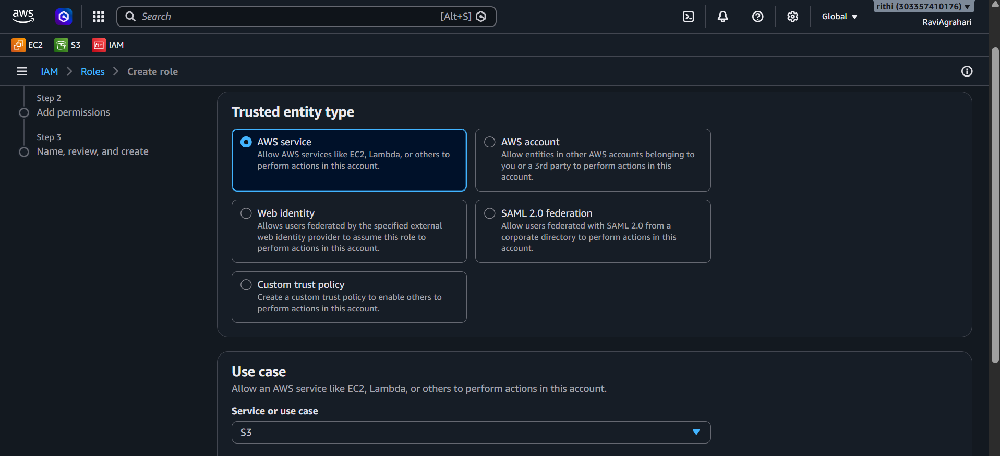

7. On the "Add permissions" page, search for `AmazonS3FullAccess`
8. Check the box next to **AmazonS3FullAccess**
   - ⚠️ **Note:** In a real production environment, you would create a custom policy with ONLY the specific permissions needed. For this lab, we're using the managed policy for simplicity.
9. Click **Next**

> 📸 [Screenshot: AmazonS3FullAccess policy selected]
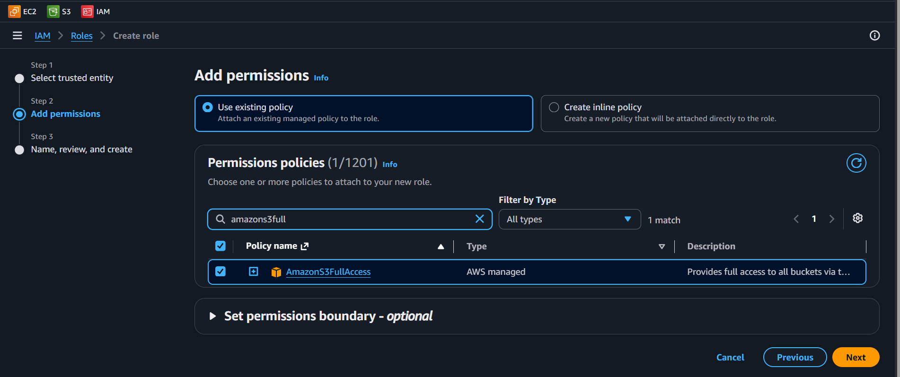

10. For **Role name**, type: `s3-replication-role`
11. Scroll down and click **Create role**

> 📸 [Screenshot: Role created successfully]
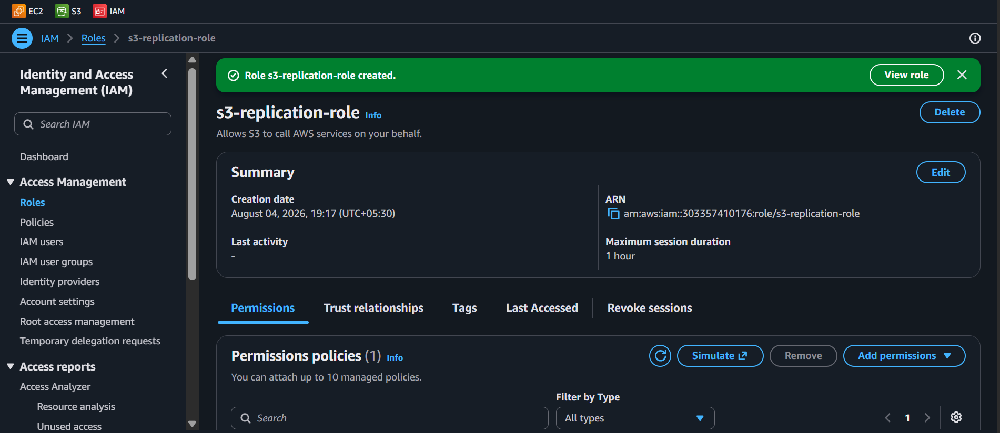

> 
> IAM Roles are like giving someone a key card to your building. The role says "S3 service, you have permission to read from the source bucket and write to the destination bucket." Never give more permissions than needed in production!

---

> 

1. Go back to **S3** console
2. Click on `ravi-source-replication-12345`
3. Click the **Management** tab
4. Scroll down to **Replication rules**
5. Click **Create replication rule**

#### Configure the Rule:

1. **Replication rule name:** `replicate-to-west`
2. Under **Scope**, select **Entire bucket** (replicate all objects)
3. Click **Next**

> 📸 [Screenshot: Rule name and scope configuration]
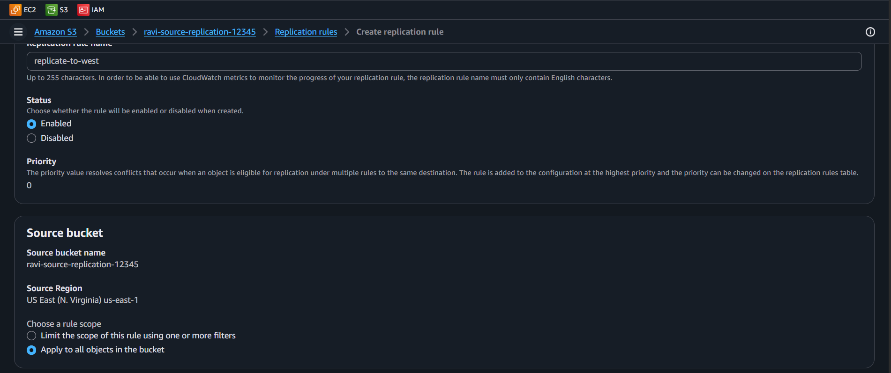

4. **Destination:** Select **Choose a bucket in this account**
5. Browse and select `ravi-dest-replication-12345`
   - 📸 [Screenshot: Destination bucket selected]
   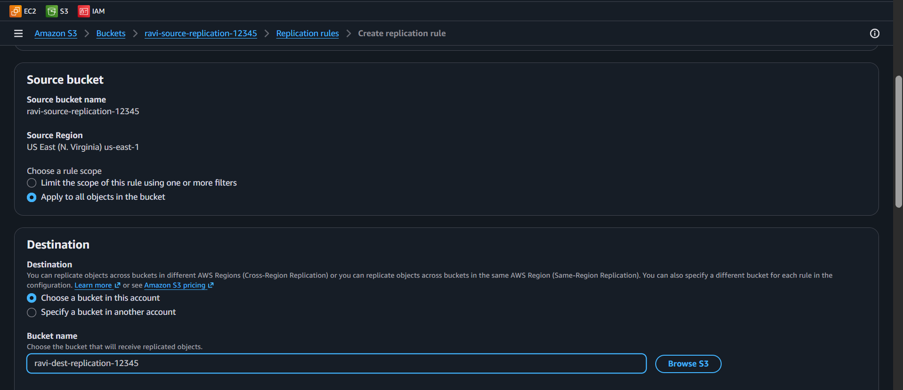

6. Click **Next**

7. **IAM Role:** Select `s3-replication-role` from the dropdown
   - 📸 [Screenshot: IAM role selected]
   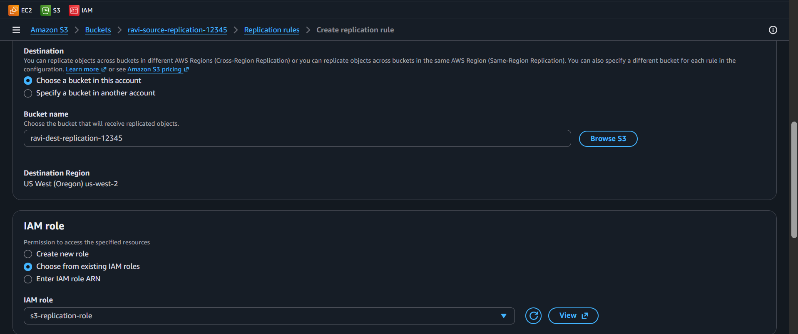

8. **Replication Time Control (RTC):** Leave unchecked (this is optional and adds cost)
9. Click **Next**

10. Review all settings:
    - Source: `ravi-source-replication-12345`
    - Destination: `ravi-dest-replication-12345`
    - Rule name: `replicate-to-west`
    - IAM Role: `s3-replication-role`
11. Click **Save**

> 📸 [Screenshot: Replication rule saved successfully]
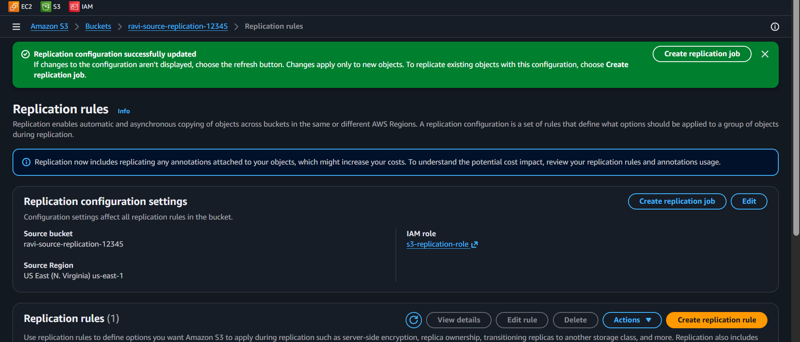

> 
> Replication doesn't happen instantly — it can take a few minutes to initialize. After that, new objects are typically replicated within 15 minutes. Be patient, Ravi!

---

> 

1. Click on `ravi-source-replication-12345` → **Objects** tab
2. Click **Upload**
3. Create a simple text file on your computer called `hello.txt` with the content:

```
Hello from the source bucket in N. Virginia!
```

4. Upload `hello.txt` to the source bucket
5. Wait for the upload to succeed

> 📸 [Screenshot: hello.txt uploaded to source bucket]
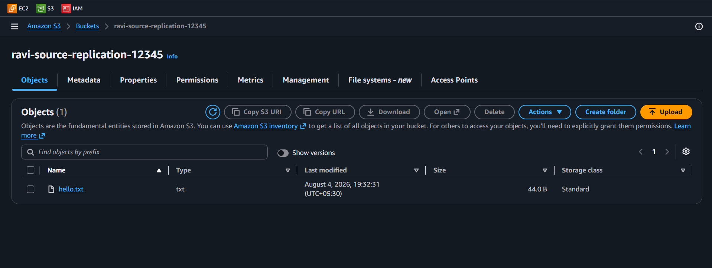

---

> 

1. Wait **2-5 minutes** (grab a coffee ☕ — replication takes a moment to kick in)
2. Go to the S3 console and click on `ravi-dest-replication-12345`
3. Click on the **Objects** tab
4. If all went well, you should see `hello.txt` in the destination bucket! 🎉
5. Click on `hello.txt` and check the details — it should show the same content

> 📸 [Screenshot: hello.txt appearing in the destination bucket in Oregon]
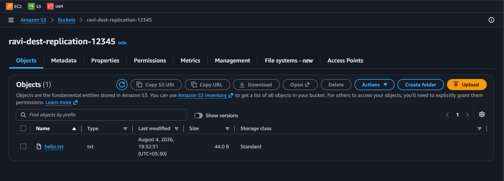

> 
> If you don't see the file immediately, wait a few more minutes. The first replication can take up to 15 minutes. Check the **Management** tab → **Replication rules** on the source bucket to see the rule status.

---

> 

Let's test with a few more files:

1. Go back to `ravi-source-replication-12345`
2. Create and upload these files:

**file2.txt:**
```
Second file replicated automatically!
```

**file3.html:**
```html
<h1>Replicated HTML File</h1>
<p>This file was automatically copied to us-west-2</p>
```

3. Wait 2-5 minutes
4. Check `ravi-dest-replication-12345` — both files should appear!

> 📸 [Screenshot: All files replicated to destination bucket]
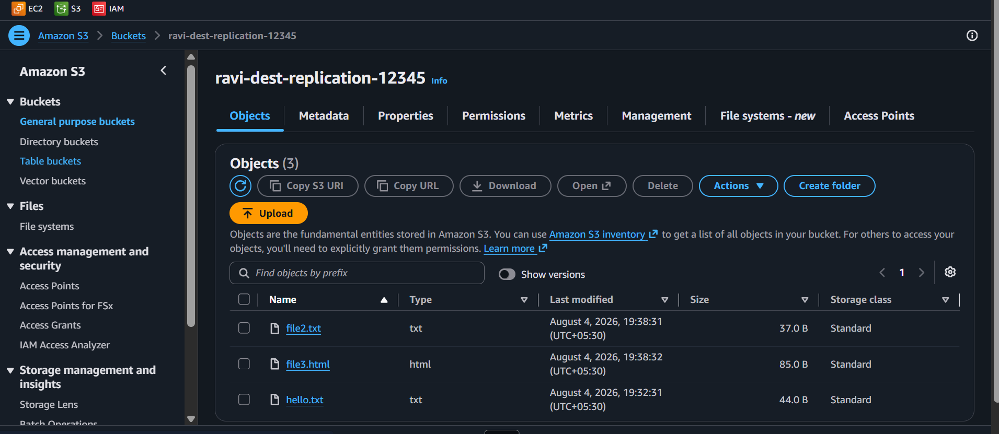

> 
> From now on, EVERY file you upload to the source bucket will be automatically copied to the destination. You don't need to do anything — S3 handles it all behind the scenes!

---

> 

Here's something interesting: **deleting from the source does NOT delete from the destination.**

1. Go to `ravi-source-replication-12345`
2. Select `hello.txt`
3. Click **Delete** → confirm deletion
4. Go to `ravi-dest-replication-12345`
5. Check — `hello.txt` is still there! 😮


> 
> This is a safety feature! If someone accidentally deletes files from the source, the copies in the destination are safe. In production, you can configure delete markers to replicate if you want synced deletions.

---

> 

- [ ] Source bucket `ravi-source-replication-12345` exists in us-east-1 with Versioning enabled
- [ ] Destination bucket `ravi-dest-replication-12345` exists in us-west-2 with Versioning enabled
- [ ] IAM Role `s3-replication-role` exists
- [ ] Replication rule `replicate-to-west` is active on the source bucket
- [ ] Files uploaded to source appear in destination after a few minutes
- [ ] Deleting files from source does NOT delete them from destination

---

## ✅ Validation Checklist

| # | Check | Status |
|---|-------|--------|
| 1 | Source bucket in us-east-1 with versioning | ☐ |
| 2 | Destination bucket in us-west-2 with versioning | ☐ |
| 3 | IAM Role `s3-replication-role` created | ☐ |
| 4 | Replication rule `replicate-to-west` active | ☐ |
| 5 | Files replicate from source to destination | ☐ |
| 6 | Deletion from source doesn't affect destination | ☐ |

<div align="center">

> **Achievement Unlocked:** Global Replicator! Data across continents.

</div>

---

## 🧹 Cleanup (IMPORTANT!)

> ⚠️ **This is critical!** You're paying for storage in TWO regions. Delete everything!

### Step 1: Delete All Objects from BOTH Buckets

**Source bucket:**
1. Go to `ravi-source-replication-12345` → **Objects** tab
2. Select all files → **Delete** → type `permanently delete` → confirm
3. If versioning is on, turn on "List versions" and delete ALL versions

**Destination bucket:**
4. Go to `ravi-dest-replication-12345` → **Objects** tab
5. Select all files → **Delete** → type `permanently delete` → confirm
6. Delete ALL versions if versioning is on

### Step 2: Delete the Replication Rule

1. Go to `ravi-source-replication-12345` → **Management** tab
2. Under **Replication rules**, select `replicate-to-west`
3. Click **Delete** → confirm

### Step 3: Delete Both Buckets

1. Go to S3 bucket list
2. Select `ravi-source-replication-12345` → **Delete** → type the bucket name → confirm
3. Select `ravi-dest-replication-12345` → **Delete** → type the bucket name → confirm

### Step 4: Delete the IAM Role

1. Go to **IAM** console → **Roles**
2. Search for `s3-replication-role`
3. Click on it → **Delete** → type `s3-replication-role` → confirm deletion


> 
> Always clean up in reverse order: objects → rules → buckets → IAM roles. If you delete the bucket first, the replication rule becomes orphaned and may cause confusing error messages!

---

## 🧠 Memory Tips

Stick these in your brain and they'll never leave. 🧲

| 🧠 Memory Hook | Remember it like... |
|---|---|
| **Versioning on BOTH buckets** | CRR's #1 rule — no versioning, no replication. It's the **"married couple must both be registered"** rule. 💍 |
| **Deletions don't copy** | Delete an object in the source? The **destination keeps its copy**. Your backup is a snapshot in time, not a mirror. 🛡️ |
| **IAM role = courier badge** | S3 needs a permission badge (IAM role) to read from source and write to destination. No badge, no delivery. 📦 |
| **Replication is lazy** | Not instant — give it **5–15 minutes**, especially the first batch. AWS does it in its own sweet time. ☕ |

> 🗣️ **Rithu:** *"First-time replicators always panic: 'where are my files?!' Wait 10 minutes, check the rule status. Patience is a cloud skill."*

---

## 🎓 What You Learned

- **Cross-Region Replication (CRR)** automatically copies objects from one bucket to another in a different region
- **Versioning is required** on both source and destination buckets for CRR to work
- **IAM Roles** provide the permissions S3 needs to read and write across buckets
- **Deletions don't replicate by default** — your destination acts as a backup
- **Replication isn't instant** — it can take a few minutes, especially for the first objects
- CRR is essential for **disaster recovery**, **compliance**, and **data locality**

---

## 🎮 Test Yourself! (No Peeking 👀)

**Q1:** What is the #1 cause of CRR setup failure?

<details><summary>👀 Show answer</summary>

**A:** **Versioning not enabled on both buckets.** CRR literally cannot work without it — AWS won't even let you pick a non-versioned destination. 💍

</details>

**Q2:** You delete an object in the source bucket. What happens in the destination?

<details><summary>👀 Show answer</summary>

**A:** **Nothing.** Deletions don't replicate by default — the destination keeps its copy. That's what makes it a real backup. 🛡️

</details>

**Q3:** Give three real-world reasons a company would enable CRR.

<details><summary>👀 Show answer</summary>

**A:** **Disaster recovery** (region failure), **compliance** (data must live in multiple regions), and **data locality** (users near the second region get faster access). 🌍

</details>

### 🔥 Bonus Challenge

Upload a file, wait for replication, then **delete it from the source** and show the destination still has it. Then enable **delete-marker replication** (optional) and watch that behavior change. You've now built a disaster-recovery story worth telling in an interview. 🎤

> 💪 **Rithu:** *"A backup you've never tested is a wish, not a backup. Test it. Delete something!"*

---

### 🆚 Pro Tip vs Noob Tip

| | Approach |
|---|---|
| **Noob Tip** | Set up CRR, forget about the destination region → duplicate bills and no real DR story |
| **Pro Tip** | Pick the destination region strategically (DR + latency), watch costs, and TEST failover |

---

## 🔗 What's Next?

Now that you understand S3 storage and data protection, let's dive into networking! You'll build a Virtual Private Cloud (VPC) from scratch — the foundation of every AWS architecture.

➡️ **[Lab 08 — VPC: Build from Scratch](../08%20-%20VPC%20-%20Build%20from%20Scratch/README.md)**

---

<details>
<summary><strong>❓ Troubleshooting</strong></summary>

| Problem | Solution |
|---------|----------|
| "Replication rule failed" | Make sure Versioning is enabled on BOTH buckets. This is the #1 cause of failure! |
| Files aren't replicating | Wait 5-15 minutes. First-time replication can be slow. Check the rule status in the Management tab |
| "Access Denied" when creating replication role | Make sure you selected `AmazonS3FullAccess` policy and the trusted entity is S3 |
| Can't select destination bucket | Make sure the destination bucket has Versioning enabled. AWS won't show non-versioned buckets as valid destinations |
| Destination bucket not listed | Ensure you're looking in the right region — the destination is in us-west-2 |
| Replication rule shows "Pending" | This is normal! It takes a few minutes to initialize. Give it 5-10 minutes |
| Can't delete bucket | Empty ALL versions first. Turn on "List versions" and delete everything, including delete markers |

> 
> The most common mistake is forgetting to enable versioning on one of the buckets. If something seems stuck, that's the first thing to check. You've got this! 🎯

</details>

---

<div align="center">


</div>
