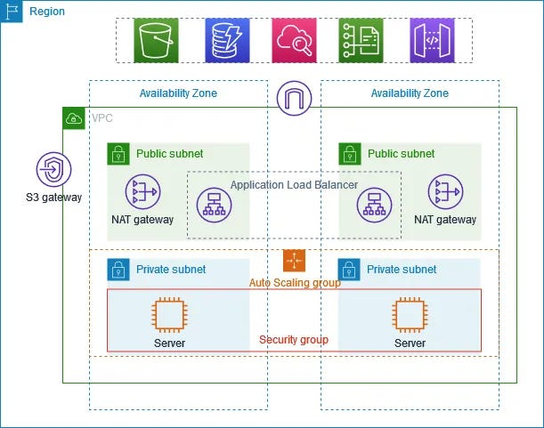
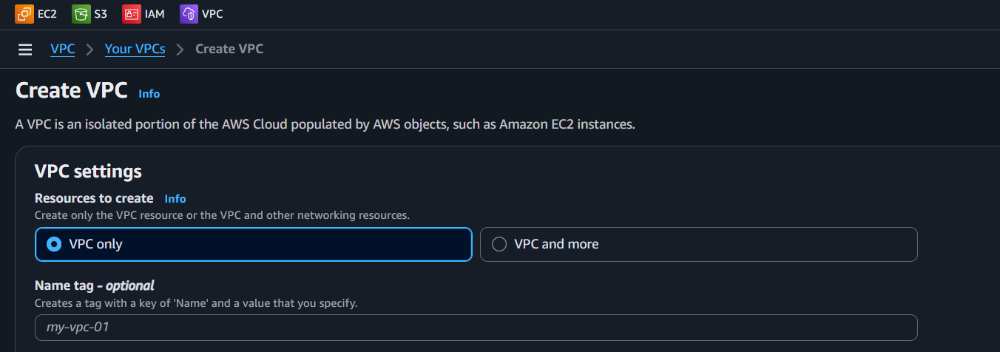
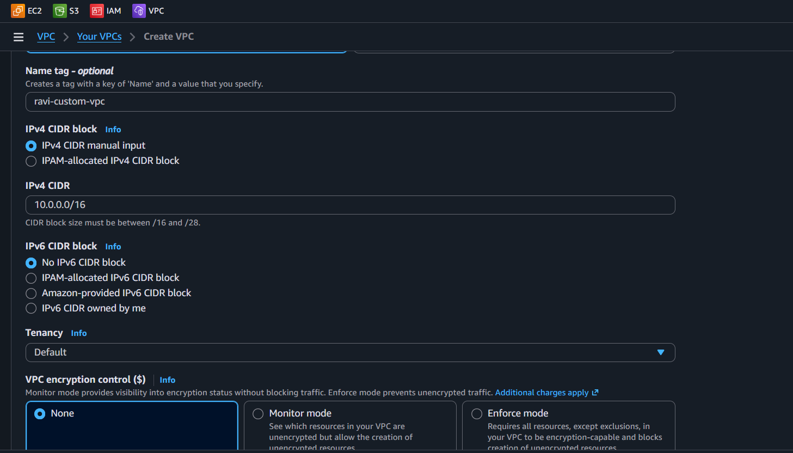
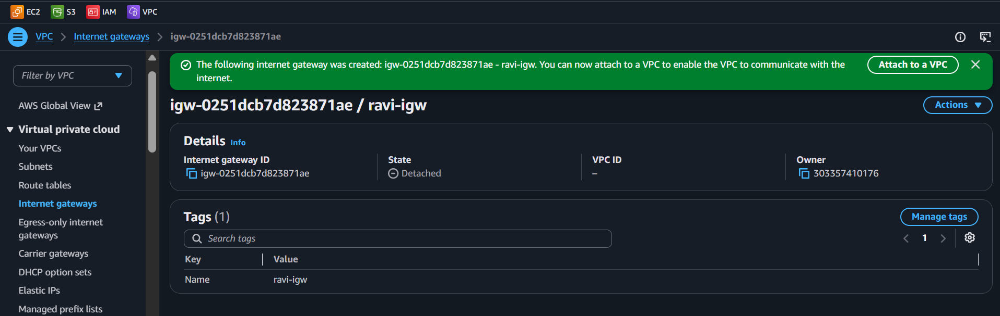
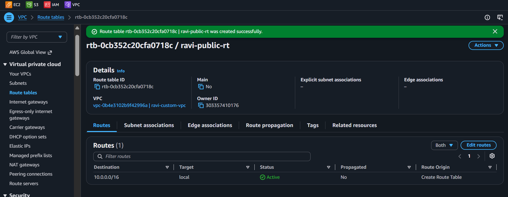
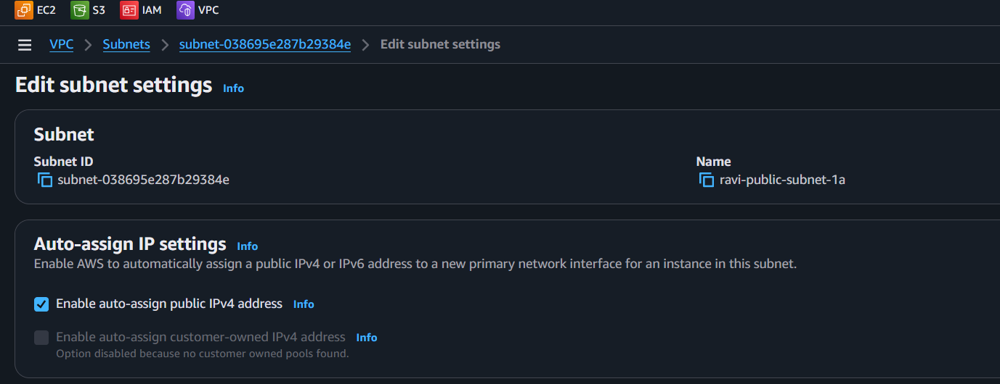
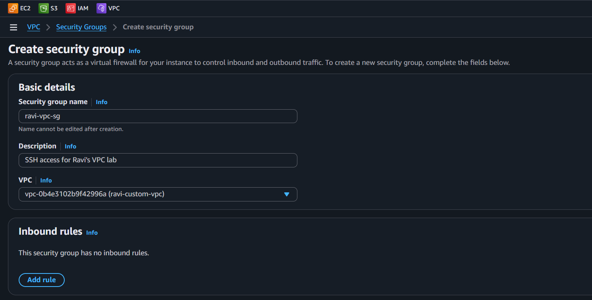
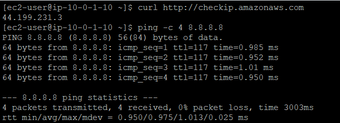

<div align="center">


# VPC: Build from Scratch


</div>

---

> **"A VPC is your private corner of the AWS cloud. Today we're building it from scratch - no defaults, no hand-holding. Well, maybe a little hand-holding."** - Rithu 🏗️

---

## 📋 Table of Contents

- [🎯 Objective](#-objective)
- [🧠 Prerequisites](#-prerequisites)
- [💰 Cost Warning](#-cost-warning)
- [🏗️ Architecture](#️-architecture)
- [🛠️ Step-by-Step Instructions](#️-step-by-step-instructions)
  - [Step 1: Create the VPC](#step-1-create-the-vpc)
  - [Step 2: Create a Public Subnet](#step-2-create-a-public-subnet)
  - [Step 3: Create an Internet Gateway](#step-3-create-an-internet-gateway)
  - [Step 4: Create a Route Table](#step-4-create-a-route-table)
  - [Step 5: Enable Auto-Assign Public IP on Subnet](#step-5-enable-auto-assign-public-ip-on-subnet)
  - [Step 6: Create a Security Group](#step-6-create-a-security-group)
  - [Step 7: Launch an EC2 Instance](#step-7-launch-an-ec2-instance)
  - [Step 8: Verify Your Work](#step-8-verify-your-work)
- [✅ Validation Checklist](#-validation-checklist)
- [🧹 Cleanup (IMPORTANT!)](#-cleanup-important)
- [🎓 What You Learned](#-what-you-learned)
- [🔗 What's Next?](#-whats-next)
- [❓ Troubleshooting](#-troubleshooting)

---

## 🎯 Objective

In this lab, you'll build a **Virtual Private Cloud (VPC)** completely from scratch. No default VPC, no magic — you'll create the VPC, subnets, internet gateway, route tables, security groups, and launch an EC2 instance inside it. This is the foundation of **EVERYTHING** in AWS networking.

---

## 🧠 Prerequisites

- [x] Completed [Lab 07 — S3 Cross-Region Replication](../07%20-%20S3%20-%20Cross-Region%20Replication/README.md)
- [x] AWS account with console access
- [x] An EC2 key pair from a previous lab (or create one now)
- [x] Basic understanding of IP addressing (CIDR notation)

---

## 💰 Cost Warning

> ⚠️ **This lab costs less than $2.** VPC itself is free — you only pay for what you run inside it (like EC2 instances). We're using a t2.micro which is free tier eligible. **Remember to terminate the EC2 instance when you're done!**

---

## 🏗️ Architecture

```
┌─────────────────────────────────────────────────────────────┐
│  VPC: ravi-custom-vpc (10.0.0.0/16)                         │
│                                                             │
│  ┌─────────────────────────────────────────────────────┐   │
│  │  Public Subnet: ravi-public-subnet-1a               │   │
│  │  CIDR: 10.0.1.0/24 | AZ: us-east-1a                │   │
│  │                                                     │   │
│  │  ┌─────────────────────┐                            │   │
│  │  │  EC2: vpc-ec2-test  │◄──── Internet ────┐       │   │
│  │  │  t2.micro           │                    │       │   │
│  │  └─────────────────────┘                    │       │   │
│  │        ▲                                    │       │   │
│  │        │ 10.0.1.0/24                       │       │   │
│  │  ┌─────┴──────┐    ┌─────────────────┐     │       │   │
│  │  │ Public RT   │───▶│ Internet Gateway │─────┘       │   │
│  │  │ 0.0.0.0/0 ─┼───▶│   ravi-igw      │             │   │
│  │  └────────────┘    └─────────────────┘             │   │
│  └─────────────────────────────────────────────────────┘   │
│                                                             │
│  ┌─────────────────────────────────────────────────────┐   │
│  │  Security Group: ravi-vpc-sg                        │   │
│  │  Inbound:  SSH (22) from My IP                      │   │
│  │  Outbound: All traffic                              │   │
│  └─────────────────────────────────────────────────────┘   │
└─────────────────────────────────────────────────────────────┘
```



---

## 🛠️ Step-by-Step Instructions

### Step 1: Create the VPC


1. Log in to the [AWS Management Console](https://console.aws.amazon.com/)
2. In the search bar, type **VPC** and click on **VPC** under Services
3. In the left sidebar, make sure you're on the **Your VPCs** page
4. Click the orange **Create VPC** button
5. Choose **VPC settings** → **VPC only** (NOT "VPC and more")



6. Configure the VPC:
   - **Name tag (optional):** `ravi-custom-vpc`
   - **IPv4 CIDR block:** `10.0.0.0/16`
   - **IPv6 CIDR block:** No IPv6 block
   - **Tenancy:** Default



>  **What does `10.0.0.0/16` mean?** It means you get 65,536 IP addresses (from 10.0.0.0 to 10.0.255.255). That's more than enough for any lab! The `/16` is the subnet mask — it tells AWS how many IPs are in this VPC.

7. Click **Create VPC**
8. You should see a success banner! Click on the VPC ID to view details.


---

### Step 2: Create a Public Subnet


A subnet is a smaller chunk of IP addresses within your VPC. We'll create a public subnet that can reach the internet.

1. In the left sidebar, click **Subnets**
2. Click the orange **Create subnet** button
3. **VPC ID:** Select `ravi-custom-vpc` from the dropdown
4. Configure the subnet:
   - **Subnet name:** `ravi-public-subnet-1a`
   - **Availability Zone:** `us-east-1a`
   - **IPv4 CIDR block:** `10.0.1.0/24`


>  A `/24` gives you 256 IP addresses (10.0.1.0 to 10.0.1.255). We put it in `us-east-1a` — one of many data centers (Availability Zones) in the region. **Always spread subnets across multiple AZs in production!**

5. Click **Create subnet**

---

### Step 3: Create an Internet Gateway


An Internet Gateway (IGW) is the bridge between your VPC and the internet. Without it, nothing in your VPC can reach the outside world!

1. In the left sidebar, click **Internet Gateways**
2. Click the orange **Create internet gateway** button
3. **Name tag:** `ravi-igw`
4. Click **Create internet gateway**



5. Now you need to **attach** it to your VPC:
   - Click on the newly created IGW
   - Click **Actions** → **Attach to VPC**
   - Select `ravi-custom-vpc` from the dropdown
   - Click **Attach internet gateway**


>  Creating an IGW doesn't automatically connect it to your VPC. You must explicitly attach it. It's like plugging a cable into a router — the cable exists, but it doesn't do anything until you plug it in!

---

### Step 4: Create a Route Table


A route table tells traffic where to go. Right now, even though we have an IGW, our subnet doesn't know about it. We need a route table to say "send internet traffic to the IGW!"

1. In the left sidebar, click **Route Tables**
2. Click the orange **Create route table** button
3. Configure:
   - **Name tag:** `ravi-public-rt`
   - **VPC:** `ravi-custom-vpc`
4. Click **Create route table**



5. Now add a route to the internet:
   - Click on `ravi-public-rt` to view details
   - Click the **Routes** tab
   - Click **Edit routes**
   - Click **Add route**
   - **Destination:** `0.0.0.0/0`
   - **Target:** Select **Internet Gateway** → choose `ravi-igw`
   - Click **Save changes**


>  `0.0.0.0/0` means "all traffic." This route says: "If you don't know where to send this packet, send it to the internet gateway." It's like telling the post office: "For any address not in this building, take it to the main post office!"

6. Associate the route table with the public subnet:
   - Click the **Subnet associations** tab
   - Click **Edit subnet associations**
   - Check the box next to `ravi-public-subnet-1a`
   - Click **Save associations**

---

### Step 5: Enable Auto-Assign Public IP on the Subnet


By default, new subnets DON'T assign public IPs to instances. We need to change that!

1. In the left sidebar, click **Subnets**
2. Click on `ravi-public-subnet-1a`
3. Click **Actions** → **Edit subnet settings**
4. Check the box: ✅ **Enable auto-assign public IPv4 address**
5. Click **Save**



>  Without this setting, any EC2 instance launched in this subnet won't get a public IP, and you won't be able to SSH into it. This is a **common gotcha!**

---

### Step 6: Create a Security Group


A security group acts as a virtual firewall. Let's create one that allows SSH access.

1. In the left sidebar, click **Security Groups**
2. Click the orange **Create security group** button
3. Configure:
   - **Security group name:** `ravi-vpc-sg`
   - **Description:** `SSH access for Ravi's VPC lab`
   - **VPC:** `ravi-custom-vpc`



4. Under **Inbound rules**, click **Add rule**:
   - **Type:** SSH
   - **Port range:** 22
   - **Source:** My IP (click the dropdown and select "My IP")

>  "My IP" automatically fills in YOUR public IP address. This means ONLY you can SSH into the instance. **In production, NEVER leave SSH open to `0.0.0.0/0` (the whole internet) — that's a security nightmare!**

5. Under **Outbound rules**, the default "Allow all traffic" rule is fine
6. Click **Create security group**

---

### Step 7: Launch an EC2 Instance in the New VPC


Time to test our network! Let's launch an EC2 instance inside our custom VPC.

1. In the search bar, type **EC2** and click on **EC2**
2. Click the orange **Launch instance** button
3. Configure the instance:
   - **Name:** `vpc-ec2-test`
4. Click **Amazon Linux** (or search for "Amazon Linux 2023")
5. Select **Amazon Linux 2023 AMI** (Free tier eligible)
6. Select **t2.micro** (Free tier eligible)
7. Select your existing key pair from a previous lab
   - If you don't have one, click **Create new key pair** → name it `ravi-vpc-key` → click **Create**

**Network settings:**

8. Click **Edit** next to "Network settings"
9. Configure:
   - **VPC:** Select `ravi-custom-vpc`
   - **Subnet:** Select `ravi-public-subnet-1a`
   - **Auto-assign public IP:** Enable
   - **Security group:** Select **Select existing security group** → choose `ravi-vpc-sg`


>  Notice how the dropdown only shows subnets and security groups that belong to `ravi-custom-vpc`? AWS keeps things organized for you!

**Storage:**

10. Leave the default 8 GB gp2 (Free tier)
11. Click **Launch instance**
12. Click **View all instances**
13. Wait for the instance state to change to **Running** and status checks to pass (1/2 or 2/2)


---

### Step 8: Verify Your Work


Now let's make sure everything works!

#### 8a: Check the Public IP

1. Select the `vpc-ec2-test` instance
2. In the details panel, find **Public IPv4 address**
3. Copy it

#### 8b: SSH into the Instance

Open your terminal (PowerShell, Terminal, or Git Bash) and run:

```bash
ssh -i "ravi-vpc-key.pem" ec2-user@<YOUR_PUBLIC_IP>
```

Replace `<YOUR_PUBLIC_IP>` with the actual IP address.

>  On Windows, make sure your key file (.pem) has the right permissions. If SSH gives you a "permissions too open" error, run:
> ```powershell
> icacls "ravi-vpc-key.pem" /inheritance:r /grant:r "$($env:USERNAME):R"
> ```

#### 8c: Test Internet Access

Once you're connected via SSH:

```bash
curl http://checkip.amazonaws.com
```

This should return your **instance's public IP** (which is the same as the Elastic IP/public IP shown in the console). ✅

```bash
ping -c 4 8.8.8.8
```

You should see replies! This confirms the instance has internet access through the IGW. ✅



#### 8d: View the VPC Diagram

1. Go back to the VPC console
2. Click on `ravi-custom-vpc`
3. Click **Resource Map** tab (if available)
4. You should see a visual diagram of your VPC, subnets, and route tables


>  Congratulations! You just built a VPC from scratch. In the real world, you'd have multiple subnets across multiple AZs, NAT gateways, NACLs, and more. But the fundamentals are exactly what you just did!

---

## ✅ Validation Checklist

| # | Check | Status |
|---|-------|--------|
| 1 | VPC `ravi-custom-vpc` created with CIDR `10.0.0.0/16` | ☐ |
| 2 | Public subnet `ravi-public-subnet-1a` in us-east-1a (`10.0.1.0/24`) | ☐ |
| 3 | Internet Gateway `ravi-igw` created and attached to VPC | ☐ |
| 4 | Route table `ravi-public-rt` with `0.0.0.0/0 → ravi-igw` | ☐ |
| 5 | Route table associated with public subnet | ☐ |
| 6 | Auto-assign public IP enabled on subnet | ☐ |
| 7 | Security group `ravi-vpc-sg` with SSH (22) from My IP | ☐ |
| 8 | EC2 instance `vpc-ec2-test` running in public subnet | ☐ |
| 9 | Can SSH into instance | ☐ |
| 10 | `curl checkip.amazonaws.com` returns public IP | ☐ |
| 11 | `ping 8.8.8.8` succeeds (internet access) | ☐ |

---

## 🧹 Cleanup (IMPORTANT!)

> ⚠️ **Delete everything in the right order!** Resources have dependencies — delete them in the correct order to avoid errors.

### 1️⃣ Terminate the EC2 Instance

1. Go to **EC2** → **Instances**
2. Select `vpc-ec2-test`
3. Click **Instance state** → **Terminate instance**
4. Click **Terminate**

### 2️⃣ Delete the Security Group

1. Go to **VPC** → **Security Groups**
2. Find `ravi-vpc-sg`
3. Select it → click **Actions** → **Delete security groups**
4. Type the security group name to confirm → click **Delete**

### 3️⃣ Disassociate the Route Table

1. Go to **VPC** → **Route Tables**
2. Click on `ravi-public-rt`
3. Click **Subnet associations** tab
4. Click **Edit subnet associations**
5. Uncheck `ravi-public-subnet-1a`
6. Click **Save**

### 4️⃣ Delete the Route Table

1. Still in **Route Tables**, select `ravi-public-rt`
2. Click **Actions** → **Delete route table**
3. Confirm and delete

### 5️⃣ Detach and Delete the Internet Gateway

1. Go to **VPC** → **Internet Gateways**
2. Click on `ravi-igw`
3. Click **Actions** → **Detach from VPC** → confirm
4. Click **Actions** → **Delete internet gateway** → confirm

### 6️⃣ Delete the Subnet

1. Go to **VPC** → **Subnets**
2. Select `ravi-public-subnet-1a`
3. Click **Actions** → **Delete subnet** → confirm

### 7️⃣ Delete the VPC

1. Go to **VPC** → **Your VPCs**
2. Select `ravi-custom-vpc`
3. Click **Actions** → **Delete VPC**
4. Type `ravi-custom-vpc` to confirm
5. Click **Delete**

>  If you get an error deleting the VPC, something is still attached to it. Double-check: all subnets deleted, IGW detached, security groups deleted, route tables deleted. AWS won't let you delete a VPC that still has stuff in it!

---

## 🎓 What You Learned

- **VPCs** are isolated virtual networks in AWS — you control everything inside them
- **Subnets** divide your VPC into smaller network segments
- **Internet Gateways** connect your VPC to the public internet
- **Route tables** direct traffic to the right destination
- **Security groups** act as virtual firewalls controlling inbound and outbound traffic
- **Auto-assign public IP** must be explicitly enabled on subnets
- **Resource dependencies** matter — you can't delete a VPC until everything inside it is removed

---

## 🔗 What's Next?

Now that you have a working VPC with a public subnet, let's add a private subnet and learn about NAT Gateways and VPC Endpoints!

➡️ **[Lab 09 — VPC: NAT Gateway and VPC Endpoints](../09%20-%20VPC%20-%20NAT%20Gateway%20and%20VPC%20Endpoints/README.md)**

---

## ❓ Troubleshooting

| Problem | Solution |
|---------|----------|
| Can't SSH — "Connection timed out" | Check: (1) Security group allows SSH from YOUR IP, (2) Instance has public IP, (3) You're using the correct key pair |
| "Permission denied (publickey)" | Make sure you're using the correct `.pem` file and the username is `ec2-user` |
| `ping 8.8.8.8` fails | Check route table: `0.0.0.0/0` → IGW must be set. Check IGW is attached to VPC |
| Can't delete VPC | Something is still attached. Delete all subnets, IGWs, security groups, and route tables first |
| EC2 launch fails | Make sure you selected the correct VPC and subnet. Also check the subnet has auto-assign public IP enabled |
| "No subnets available" error | You may be looking at the wrong VPC. Make sure you selected `ravi-custom-vpc` in the subnet dropdown |
| CIDR conflict error | The CIDR `10.0.0.0/16` may conflict with an existing VPC. Try `10.1.0.0/16` instead |

>  The #1 mistake in VPC labs is forgetting to enable auto-assign public IP on the subnet. If your instance has no public IP, you can't reach it from the internet. Check the subnet settings! 🔍

---

<div align="center">


*The foundation of AWS networking is now in your hands!*

</div>