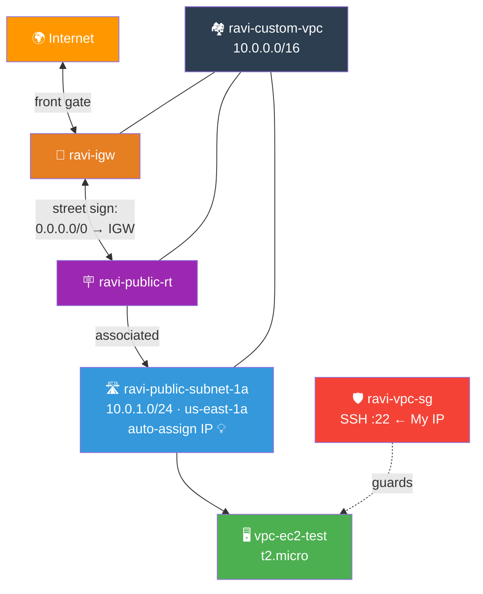
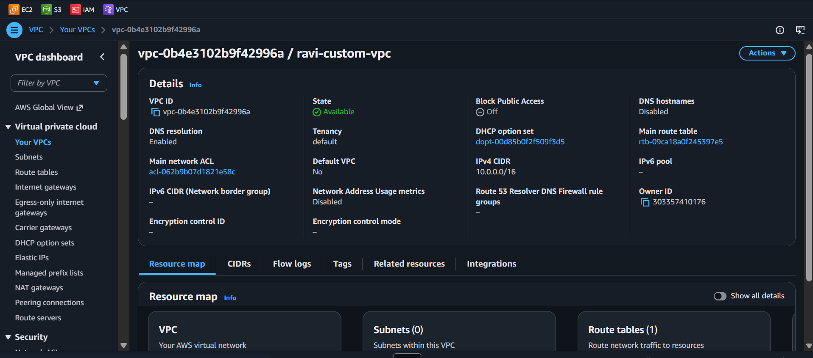
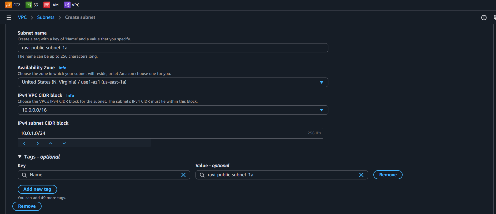
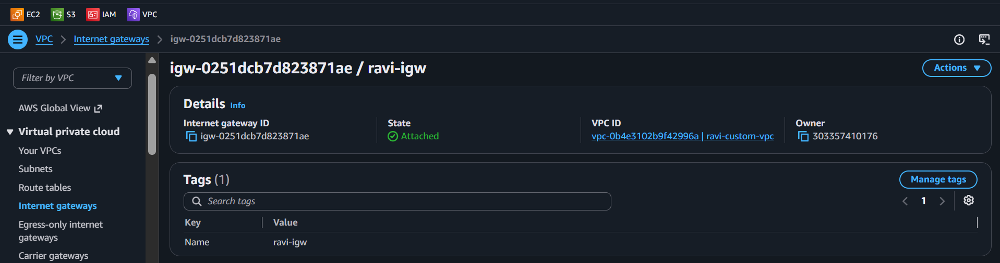
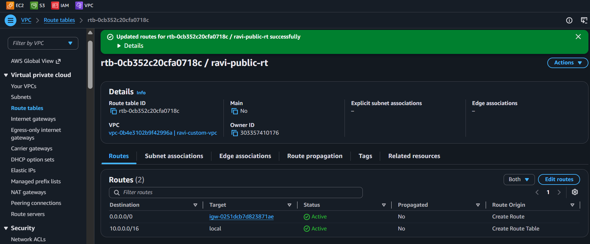
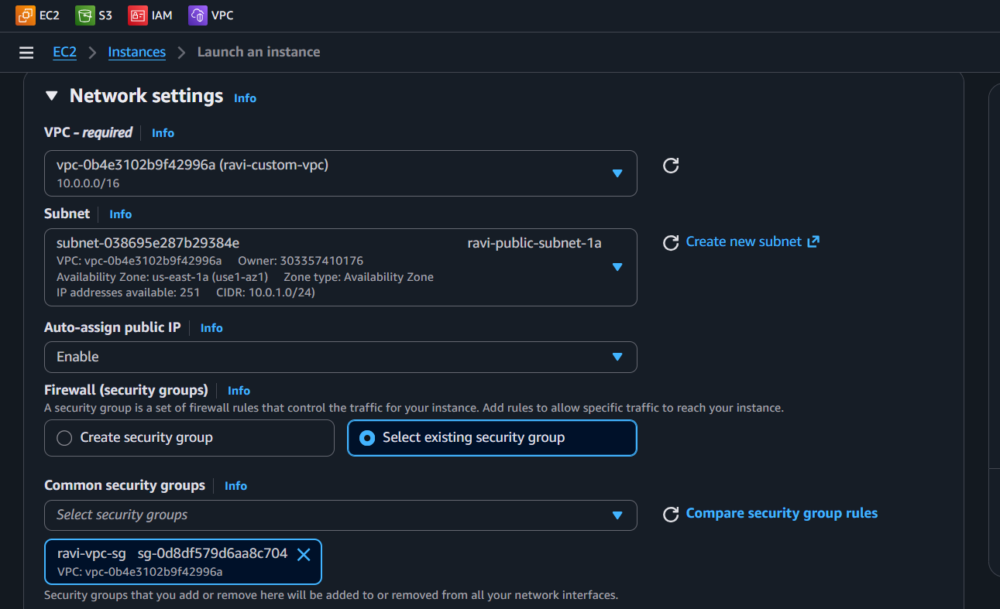
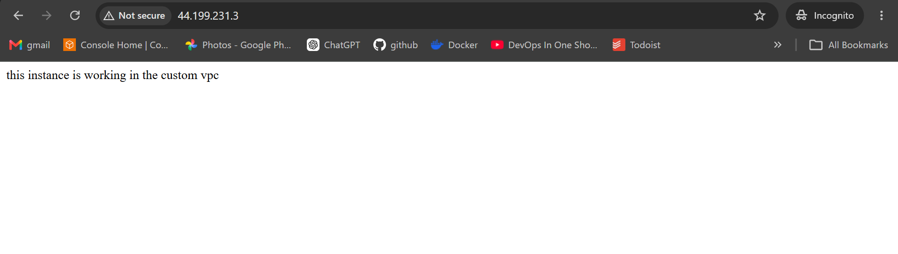
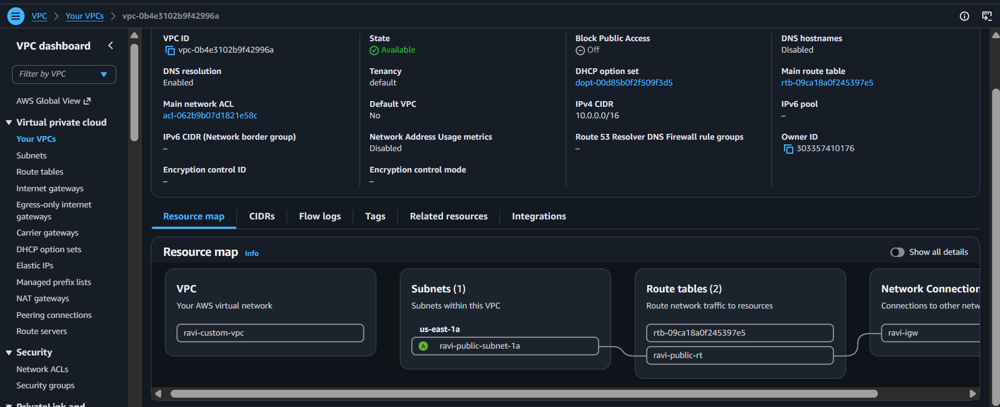

# 🏗️ Lab 08 - VPC: Build from Scratch

> 📅 **Updated:** 21 August 2026 | ⏱️ **Duration:** ~45 minutes | 📊 **Level:** Beginner+


> ### 🗣️ *"A VPC is your private corner of the AWS cloud. Today we're building it from scratch — no defaults, no hand-holding. Well, maybe a little hand-holding."*
> — **Rithu** 🏗️

<details>
<summary><b>🎭 Ravi & Rithu's Coffee Break Chat</b></summary>

**Ravi:** "What IS a VPC, in one sentence?"

**Rithu:** "Your own private fenced-off neighborhood inside AWS — with its own streets (subnets), street signs (route tables), and front gate (internet gateway)."

**Ravi:** "And the default VPC?"

**Rithu:** "A pre-built starter house AWS gives everyone. Useful, but you never learn how the plumbing works until you build your own. That's today!"

**Ravi:** "Build my own neighborhood? Let's go!" 🏘️

</details>

---

## 🎯 What You'll Master

| Skill | Description |
|-------|-------------|
| 🏘️ **Create a Custom VPC** | `VPC only` mode — no wizard shortcuts |
| 🛣️ **Carve Subnets** | CIDR math that actually makes sense |
| 🚪 **Hang the Front Gate** | Internet Gateway + attach (two steps!) |
| 🪧 **Write Street Signs** | Route tables + `0.0.0.0/0` |
| 💡 **Flip the Porch Light** | Auto-assign public IP gotcha |
| 🔥 **Guard the House** | Security group scoped to YOUR VPC |

> 💡 **Pro Tip:** Every serious AWS architecture runs inside a custom VPC. This lab is the foundation of literally everything else in AWS networking.

---

## 🚦 Before You Start

### ✅ Prerequisites Checklist
- [ ] ✅ **[Lab 07](../07%20-%20S3%20-%20Cross-Region%20Replication/README.md)** complete
- [ ] 🔑 Key pair from a previous lab (or create `ravi-vpc-key`)
- [ ] 🧮 Basic CIDR understanding (we'll explain as we go)

### 📦 What You Need (and Don't)
| Required | Optional |
|----------|----------|
| ~45 minutes | Napkin for drawing your neighborhood 📝 |
| us-east-1 Region | |

---

## 💰 Cost & Safety First

> ✅ **The VPC itself is FREE** — you only pay for what runs inside it. Our single `t2.micro` is Free Tier eligible. Terminate it when done!

### 🏷️ Naming Convention

| Resource | Name |
|----------|------|
| 🏘️ VPC | `ravi-custom-vpc` (`10.0.0.0/16`) |
| 🛣️ Subnet | `ravi-public-subnet-1a` (`10.0.1.0/24`, us-east-1a) |
| 🚪 Internet Gateway | `ravi-igw` |
| 🪧 Route Table | `ravi-public-rt` |
| 🛡️ Security Group | `ravi-vpc-sg` |
| 🖥️ Instance | `vpc-ec2-test` |

---

## 🧠 How It All Fits Together




### 🔑 Key Concepts
| Component | Role |
|-----------|------|
| **VPC `/16`** | 65,536 addresses (10.0.0.0 – 10.0.255.255) — your fence |
| **Subnet `/24`** | 256 addresses in ONE AZ — your street |
| **IGW** | The front door; creating ≠ attaching! |
| **Route `0.0.0.0/0 → IGW`** | "Any address not in this building → main post office" |
| **Auto-assign public IP** | Off by default on custom subnets — flip it ON |

---

## 🪜 Step-by-Step Guide

### 🟢 Step 1: Create the VPC 🏘️

<details>
<summary><b>🏘️ Expand for VPC steps</b></summary>

1. 🌐 Console → search **VPC** → **Your VPCs** → ➕ **Create VPC**
2. ⚙️ Resources to create: **VPC only** (NOT "VPC and more" — we're building by hand!)
3. 📝 Configure:

   | Field | Value |
   |-------|-------|
   | Name tag | `ravi-custom-vpc` |
   | IPv4 CIDR block | `10.0.0.0/16` |
   | IPv6 | None |
   | Tenancy | Default |

4. ✅ **Create VPC** → success banner → click the VPC ID to explore

</details>




> 🗣️ **Rithu's Tip:** *"`10.0.0.0/16` = 65,536 IPs. The `/16` is the subnet mask telling AWS how big your neighborhood is."*

---

### 🟢 Step 2: Create the Public Subnet 🛣️

<details>
<summary><b>🛣️ Expand for subnet steps</b></summary>

1. 🌐 Left sidebar → **Subnets** → ➕ **Create subnet**
2. 🏘️ VPC ID: select `ravi-custom-vpc`
3. 📝 Configure:

   | Field | Value |
   |-------|-------|
   | Subnet name | `ravi-public-subnet-1a` |
   | Availability Zone | `us-east-1a` |
   | IPv4 CIDR block | `10.0.1.0/24` |

4. ✅ **Create subnet**

</details>



> 🗣️ **Rithu's Tip:** *"A `/24` = 256 addresses in one data center (AZ). Production always spreads subnets across multiple AZs!"*

---

### 🟢 Step 3: Create + Attach the Internet Gateway 🚪

<details>
<summary><b>🚪 Expand for IGW steps</b></summary>

1. 🌐 Left sidebar → **Internet Gateways** → ➕ **Create internet gateway**
2. 📝 Name tag: `ravi-igw` → ✅ Create
3. 🔌 Select it → **Actions → Attach to VPC** → choose `ravi-custom-vpc` → ✅ Attach

</details>




> 🗣️ **Rithu's Tip:** *"Creating an IGW doesn't connect it — like buying a cable vs plugging it into the router. Two steps!"*

---

### 🟢 Step 4: Route Table + Association 🪧

<details>
<summary><b>🪧 Expand for route table steps</b></summary>

**Create:**

1. 🌐 Left sidebar → **Route Tables** → ➕ **Create route table**
2. 📝 Name: `ravi-public-rt` · VPC: `ravi-custom-vpc` → ✅ Create

**Add the internet route:**

3. Select `ravi-public-rt` → **Routes** tab → ✏️ **Edit routes** → ➕ **Add route**
4. Destination: `0.0.0.0/0` · Target: **Internet Gateway** → `ravi-igw` → ✅ Save

**Associate the subnet:**

5. **Subnet associations** tab → ✏️ **Edit subnet associations** → check `ravi-public-subnet-1a` → ✅ Save

</details>




---

### 🟢 Step 5: Flip the Porch Light 💡

<details>
<summary><b>💡 Expand for auto-assign steps</b></summary>

Custom subnets DON'T hand out public IPs by default:

1. 🌐 **Subnets** → select `ravi-public-subnet-1a`
2. **Actions → Edit subnet settings**
3. ✅ Check **Enable auto-assign public IPv4 address** → ✅ Save

Skip this and your instances launch invisible — no public IP, no SSH. Classic gotcha!

</details>


---

### 🟢 Step 6: Security Group 🛡️

<details>
<summary><b>🛡️ Expand for SG steps</b></summary>

1. 🌐 Left sidebar → **Security Groups** → ➕ **Create security group**
2. 📝 Configure:

   | Field | Value |
   |-------|-------|
   | Name | `ravi-vpc-sg` |
   | Description | `SSH access for Ravi's VPC lab` |
   | VPC | `ravi-custom-vpc` ← must match! |

3. ➕ Inbound rule: **SSH** · port 22 · Source: **My IP**
4. Outbound: default Allow-all is fine → ✅ **Create security group**

</details>


> 🗣️ **Rithu's Tip:** *"'My IP' fills in YOUR address so only you can SSH. Never `0.0.0.0/0` on port 22 in production — security nightmare!"*

---

### 🟢 Step 7: Launch an Instance Inside It 🖥️

<details>
<summary><b>🖥️ Expand for launch steps</b></summary>

1. 🌐 Console → **EC2** → ➕ **Launch instance**
2. 📝 Name: `vpc-ec2-test`
3. ⚙️ Amazon Linux 2023 · `t2.micro` · existing key pair (or create `ravi-vpc-key`)
4. 🌐 **Network settings → Edit:**

   | Setting | Value |
   |---------|-------|
   | VPC | `ravi-custom-vpc` |
   | Subnet | `ravi-public-subnet-1a` |
   | Auto-assign public IP | Enable |
   | Firewall | **Select existing** → `ravi-vpc-sg` |

5. 💾 Default 8 GB gp3 → ✅ **Launch** → wait for Running + checks passing

</details>





> 🗣️ **Rithu's Tip:** *"Notice the dropdown only shows subnets and SGs belonging to `ravi-custom-vpc`? AWS keeps your neighborhood organized."*

---

### 🟢 Step 8: Prove It All Works ✅

<details>
<summary><b>✅ Expand for verification steps</b></summary>

**SSH in** (copy the Public IPv4 from the console):

```bash
ssh -i "ravi-vpc-key.pem" ec2-user@<YOUR_PUBLIC_IP>
```

Windows key-permission fix if needed:

```powershell
icacls "ravi-vpc-key.pem" /inheritance:r /grant:r "$($env:USERNAME):R"
```

**Test internet access** through your front gate:

```bash
curl http://checkip.amazonaws.com   # returns the instance's public IP ✓
ping -c 4 8.8.8.8                    # replies = internet via IGW ✓
```

**See your neighborhood map:**

VPC console → `ravi-custom-vpc` → **Resource Map** tab — visual diagram of everything you built!

</details>




> 🗣️ **Rithu's Tip:** *"Congratulations — you built a VPC from scratch! Real-world adds multi-AZ subnets, NAT gateways, NACLs... but the fundamentals are exactly what you just did."*

---

## ✅ Validation Checklist

| # | Check | Status |
|---|-------|--------|
| 1️⃣ | VPC `ravi-custom-vpc` @ `10.0.0.0/16` | ☐ ✅ |
| 2️⃣ | Subnet `ravi-public-subnet-1a` @ `10.0.1.0/24`, us-east-1a | ☐ ✅ |
| 3️⃣ | `ravi-igw` created AND attached | ☐ ✅ |
| 4️⃣ | `ravi-public-rt` has `0.0.0.0/0 → ravi-igw` | ☐ ✅ |
| 5️⃣ | Route table associated with the subnet | ☐ ✅ |
| 6️⃣ | Auto-assign public IP enabled | ☐ ✅ |
| 7️⃣ | `ravi-vpc-sg`: SSH ← My IP | ☐ ✅ |
| 8️⃣ | Instance running in the public subnet | ☐ ✅ |
| 9️⃣ | SSH works | ☐ ✅ |
| 🔟 | `curl checkip.amazonaws.com` returns public IP | ☐ ✅ |
| 1️⃣1️⃣ | `ping 8.8.8.8` succeeds | ☐ ✅ |

---

## 🧹 Cleanup (Follow Order!)

> ⚠️ **Dependencies matter — empty the house before demolishing it!**

| Step | Action | Console Location |
|------|--------|------------------|
| 1️⃣ 🗑️ | Terminate `vpc-ec2-test` | EC2 → Instances |
| 2️⃣ 🛡️ | Delete `ravi-vpc-sg` (type name to confirm) | VPC → Security Groups |
| 3️⃣ 🔗 | Disassociate `ravi-public-rt` from the subnet | Route Tables → Subnet associations |
| 4️⃣ 🪧 | Delete `ravi-public-rt` | VPC → Route Tables |
| 5️⃣ 🚪 | Detach `ravi-igw` from VPC → then delete it | VPC → Internet Gateways |
| 6️⃣ 🛣️ | Delete `ravi-public-subnet-1a` | VPC → Subnets |
| 7️⃣ 🏘️ | Delete `ravi-custom-vpc` (type name) | VPC → Your VPCs |

> 🗣️ **Rithu's Tip:** *"VPC won't delete? Something's still inside — subnets, IGWs, SGs, route tables. Empty the house first!"*

---

## 🚀 Level Ups (Post-Core Lab)

| Challenge | What to Try | Notes |
|-----------|-------------|-------|
| 🏘️ **Multi-AZ** | Add a second public subnet in us-east-1b sharing the same IGW | One region, two escape routes |
| 🚫 **Private Street** | Add a subnet WITHOUT an internet route | Feel the isolation |
| 🎨 **Napkin Test** | Draw your whole VPC as a neighborhood from memory | If you can draw it, you know it |

---

## 🆘 Troubleshooting Quick Reference

| 🔍 Issue | 💡 Likely Cause | 🔧 Fix |
|-------|--------------|-----|
| 🔐 SSH connection timed out | SG wrong / no public IP / wrong key | Check all three; auto-assign first! |
| 🚫 Permission denied (publickey) | Wrong .pem or username | Correct file + user `ec2-user` |
| 📡 `ping 8.8.8.8` fails | Missing route or detached IGW | Verify `0.0.0.0/0 → IGW` + attachment |
| 🗑️ Can't delete VPC | Still occupied | Remove subnets, IGWs, SGs, route tables first |
| ❌ EC2 launch fails | Wrong VPC/subnet selection | Re-check network settings at launch |
| 🔍 "No subnets available" | Looking at wrong VPC | Select `ravi-custom-vpc` in dropdown |
| ⚠️ CIDR conflict | `10.0.0.0/16` already used | Try `10.1.0.0/16` instead |

---

## 🎮 Test Yourself! (No Peeking 👀)

**Q1:** What single component connects a VPC to the public internet?

<details><summary>👀 Show answer</summary>

**A:** The **Internet Gateway** — the front door. No IGW, no internet, period. 🚪

</details>

**Q2:** What does `0.0.0.0/0 → IGW` actually say?

<details><summary>👀 Show answer</summary>

**A:** "**Any destination** → out the front gate." It's the anywhere-wildcard of routing. 🌍

</details>

**Q3:** Instance launched, no public IP. What did you forget?

<details><summary>👀 Show answer</summary>

**A:** **Auto-assign public IP** — off by default on custom subnets. Flip the porch light! 💡

</details>

> 💪 **Rithu:** *"Single-AZ is single-point-of-failure. Multi-AZ is how real companies sleep at night."*

---

## 📚 Official Documentation

- 🏘️ [What Is Amazon VPC?](https://docs.aws.amazon.com/vpc/latest/userguide/what-is-amazon-vpc.html)
- 🛣️ [Subnet Sizing and Configuration](https://docs.aws.amazon.com/vpc/latest/userguide/subnet-sizing.html)
- 🚪 [Internet Gateways](https://docs.aws.amazon.com/vpc/latest/userguide/VPC_Internet_Gateway.html)

---

## 🎓 What You Learned

> **The neighborhood builder's blueprint:**
> - 🏘️ **VPC** → the fence around your private cloud
> - 🛣️ **Subnets** → streets carved from CIDR blocks
> - 🚪 **IGW** → front gate (create + attach!)
> - 🪧 **Route tables** → street signs directing traffic
> - 🛡️ **SGs** → house bouncers checking IDs
> - 💡 **Auto-assign** → porch light you must switch on yourself

**Golden Habit:** Build purpose-built VPCs → spread across AZs → clean up in dependency order. 🧹

| | Approach |
|---|---|
| 👶 **Noob Way** | Everything in the default VPC "because it's easier" |
| 🧙 **Pro Way** | Purpose-built VPCs with tailored subnets, routes, and security — exactly what you just did |

---

## ➡️ What's Next?

You have a working public subnet. Next: add a PRIVATE subnet and learn NAT Gateways + VPC Endpoints — how private resources reach the world without being exposed. 🕳️

🎯 **[Lab 09 - VPC: NAT Gateway and VPC Endpoints](../09%20-%20VPC%20-%20NAT%20Gateway%20and%20VPC%20Endpoints/README.md)**

---

<div align="center">

### ⭐ Enjoyed this lab? Star the repo & share your feedback!

**Happy Learning!** 🚀☁️

</div>
