# 🔒 Lab 09 - VPC: NAT Gateway & VPC Endpoints

> 📅 **Updated:** 21 August 2026 | ⏱️ **Duration:** ~40 minutes | 📊 **Level:** Beginner+


> ### 🗣️ *"Private subnets keep your instances hidden from the internet. NAT Gateways let them talk OUT without letting anyone talk IN. VPC Endpoints let them talk to AWS services without going through the internet at all!"*
> — **Rithu** 🔒

<details>
<summary><b>🎭 Ravi & Rithu's Coffee Break Chat</b></summary>

**Ravi:** "Why do I even need a private subnet?"

**Rithu:** "Because databases and backend servers should NOT be on the public internet. They're the vault, not the storefront."

**Ravi:** "But then how do they download updates?"

**Rithu:** "Through the NAT Gateway — a one-way door. You can leave the house, but nobody outside can come in."

**Ravi:** "And VPC Endpoints?"

**Rithu:** "A private tunnel straight to AWS services like S3. No internet involved — like a secret underground passage. 🕳️"

</details>

---

## 🎯 What You'll Master

| Skill | Description |
|-------|-------------|
| 🏘️ **Private Subnet** | No public IP, no inbound internet |
| 🪞 **NAT Gateway** | One-way mirror: outbound yes, inbound no |
| 🔑 **Bastion Host** | Jump box to SSH into private instances |
| 🕳️ **VPC Endpoint (Gateway)** | Free, private, fast path to S3 |
| 💸 **Cost Discipline** | NAT = ~$32/mo — delete it FIRST |

> 💡 **Pro Tip:** This is exactly how production networks are built — public in the front yard, sensitive stuff (databases!) locked in the basement.

---

## 🚦 Before You Start

### ✅ Prerequisites Checklist
- [ ] ✅ **[Lab 08](../08%20-%20VPC%20-%20Build%20from%20Scratch/README.md)** complete (or recreate — takes ~5 min)
- [ ] 🔑 Key pair ready
- [ ] 🛡️ `ravi-vpc-sg` (SSH ← My IP) exists or recreate

### 📦 What You Need (and Don't)
| Required | Optional |
|----------|----------|
| ~40 minutes | AWS CLI v2 install on private EC2 |
| Existing VPC from Lab 08 (or recreate) | |

---

## 💰 Cost & Safety First

> ⚠️ **NAT Gateway ≈ $0.045/hour (~$32/month) + data processing.** The priciest resource in this lab. Pennies for minutes; forget to delete = surprise bill. **DELETE IT IMMEDIATELY AFTER THE LAB.**

---

## 🧠 How It All Fits Together

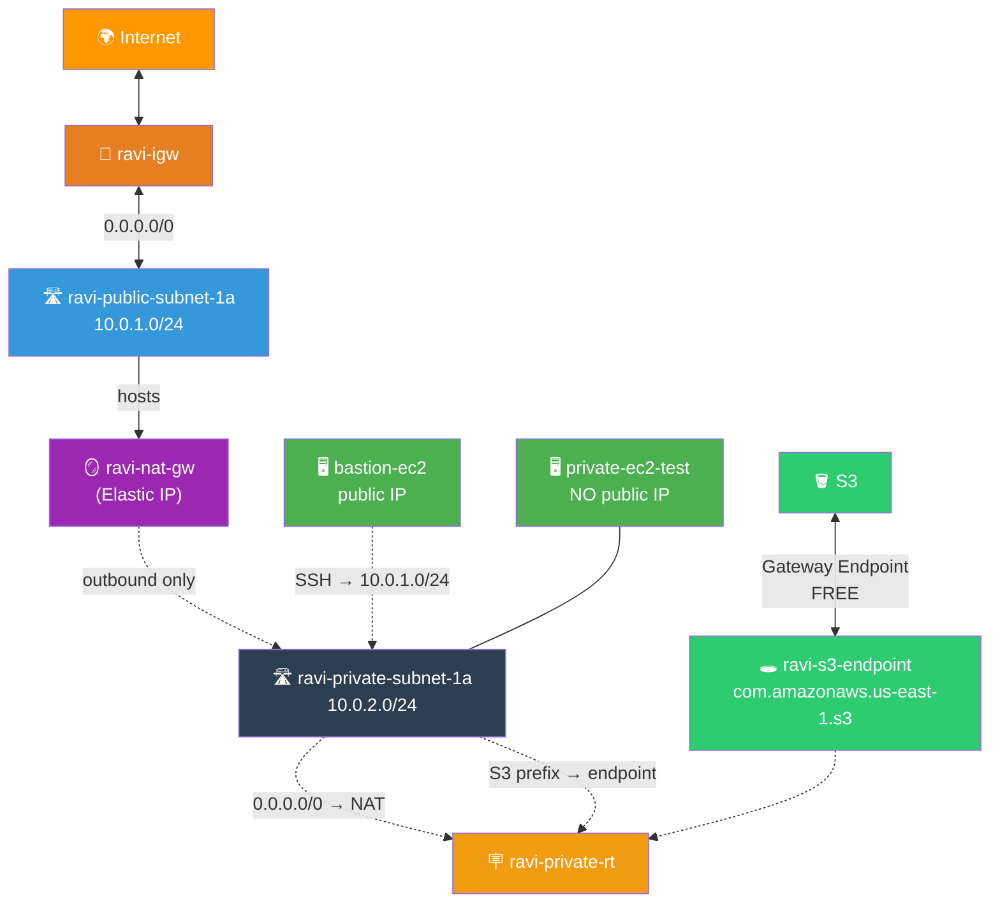

### 🔑 Key Concepts
| Component | Role |
|-----------|------|
| **Private subnet** | No auto-assign public IP; instances invisible from internet |
| **NAT Gateway in PUBLIC subnet** | Needs IGW route to relay traffic; the "receptionist in the lobby" |
| **Private route table** | `0.0.0.0/0 → NAT GW` (not IGW) = outbound-only |
| **Bastion host** | Public instance you jump through to reach private ones |
| **S3 Gateway Endpoint** | Free, faster, more secure — skips NAT, stays in AWS network |

---

## 🪜 Step-by-Step Guide

### 🟢 Step 0: Reuse or Recreate Lab 08 VPC 🏗️

<details>
<summary><b>🏗️ Expand if you need to rebuild</b></summary>

If you still have `ravi-custom-vpc` from Lab 08, skip to Step 1! Otherwise:

1. VPC only: `ravi-custom-vpc` / `10.0.0.0/16`
2. Public subnet: `ravi-public-subnet-1a` / `10.0.1.0/24` / us-east-1a
3. IGW `ravi-igw` → attach
4. RT `ravi-public-rt` → `0.0.0.0/0 → ravi-igw` → associate subnet
5. Auto-assign public IP ON
6. SG `ravi-vpc-sg` (SSH ← My IP)

</details>

> 🗣️ **Rithu's Tip:** *"Same 5-minute setup as Lab 08. If you have it, you're golden."*

---

### 🟢 Step 1: Create Private Subnet 🛣️

<details>
<summary><b>🛣️ Expand for private subnet steps</b></summary>

1. VPC → **Subnets** → ➕ **Create subnet**
2. VPC: `ravi-custom-vpc`
3. Configure:

   | Field | Value |
   |-------|-------|
   | Name | `ravi-private-subnet-1a` |
   | AZ | `us-east-1a` |
   | CIDR | `10.0.2.0/24` |

4. ✅ Create
5. **Disable auto-assign public IP** (should be off by default — verify):
   - Select subnet → Actions → Edit subnet settings → **UNCHECK** auto-assign public IPv4 → Save

</details>

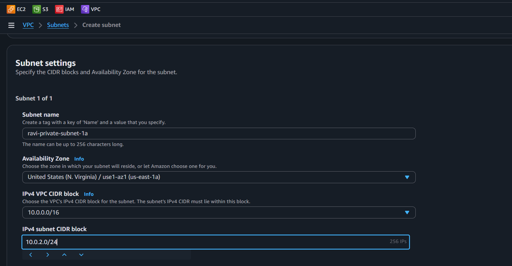

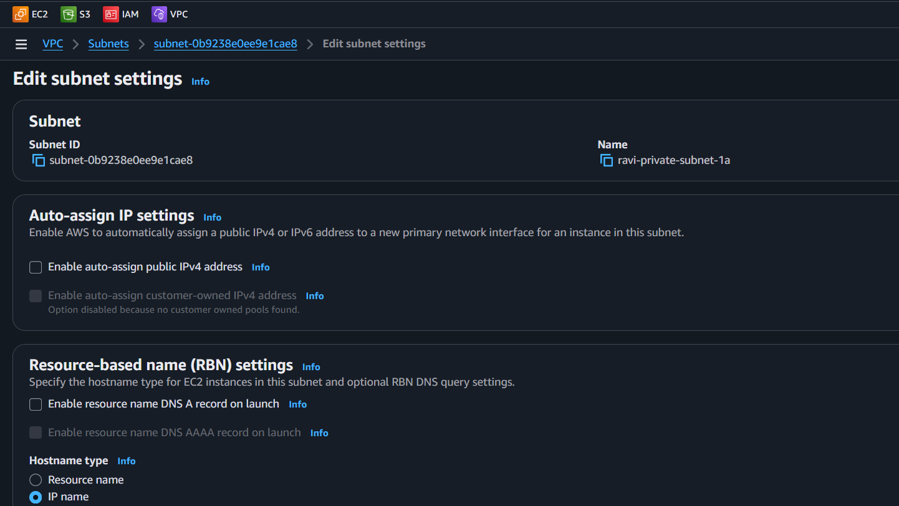

> 🗣️ **Rithu's Tip:** *"VPC = 65,536 IPs. Public takes 256 at .1.x, private takes another 256 at .2.x. CIDRs must NEVER overlap!"*

---

### 🟢 Step 2: Create NAT Gateway 🪞

<details>
<summary><b>🪞 Expand for NAT Gateway steps</b></summary>

1. VPC → **NAT Gateways** → ➕ **Create NAT Gateway**
2. 🔑 **Allocate Elastic IP** → gives the NAT a static public IP
3. Configure:

   | Field | Value |
   |-------|-------|
   | Name | `ravi-nat-gw` |
   | Subnet | `ravi-public-subnet-1a` ← MUST be public! |
   | Connectivity | Public |
   | Elastic IP | auto-filled |

4. ✅ **Create NAT Gateway** → wait for **Available** (~2–3 min)

</details>

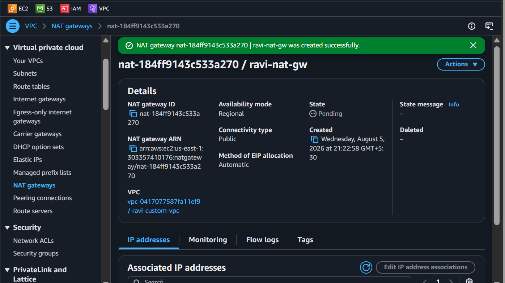

> 🗣️ **Rithu's Tip:** *"NAT lives in the PUBLIC subnet (the lobby) — it uses the IGW to reach the internet on behalf of private instances. Receptionist analogy!"*

---

### 🟢 Step 3: Private Route Table 🪧

<details>
<summary><b>🪧 Expand for private route table</b></summary>

1. VPC → **Route Tables** → ➕ **Create route table**
2. Name: `ravi-private-rt` · VPC: `ravi-custom-vpc` → Create
3. **Routes** tab → Edit routes → Add route:
   - Destination: `0.0.0.0/0`
   - Target: **NAT Gateway** → `ravi-nat-gw` → Save
4. **Subnet associations** → Edit → check `ravi-private-subnet-1a` → Save

</details>

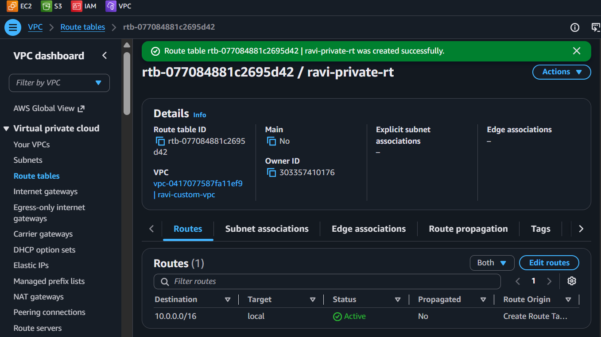

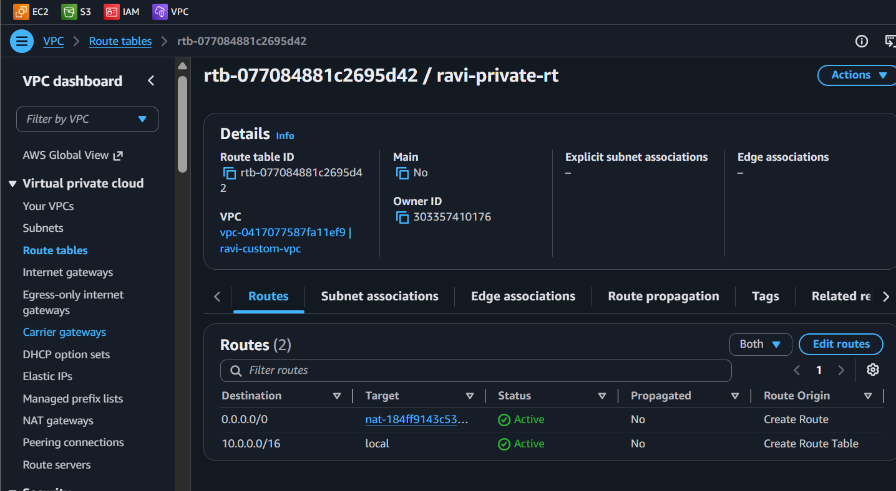

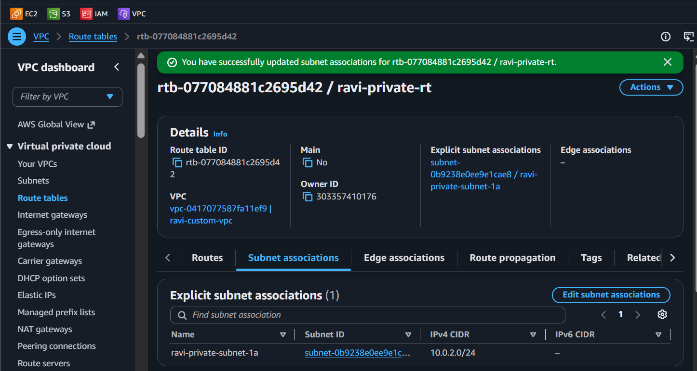

> 🗣️ **Rithu's Tip:** *"Private RT points to NAT, not IGW. That's what makes it 'private' — traffic goes out through the one-way door, never directly to the internet."*

---

### 🟢 Step 4: Private Security Group 🛡️

<details>
<summary><b>🛡️ Expand for private SG</b></summary>

1. VPC → **Security Groups** → ➕ **Create security group**
2. Name: `ravi-private-sg` · Description: `Private EC2 security group` · VPC: `ravi-custom-vpc`
3. **Inbound:** SSH (22) · Source: **Custom** → `10.0.1.0/24` (public subnet CIDR!)
4. Outbound: default Allow-all → Create

</details>

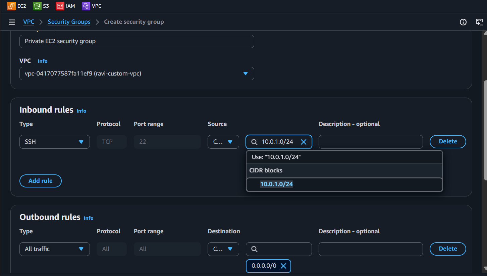

> 🗣️ **Rithu's Tip:** *"SSH only from the public subnet. You'll jump from bastion → private. Direct internet SSH = blocked. This IS the pattern!"*

---

### 🟢 Step 5: Launch Private EC2 🖥️

<details>
<summary><b>🖥️ Expand for private instance</b></summary>

1. EC2 → Launch instance
2. Name: `private-ec2-test` · AL2023 · t2.micro · your key pair
3. Network → Edit:
   - VPC: `ravi-custom-vpc`
   - Subnet: `ravi-private-subnet-1a`
   - Auto-assign public IP: **Disabled**
   - SG: `ravi-private-sg`
4. Launch → wait for Running

</details>

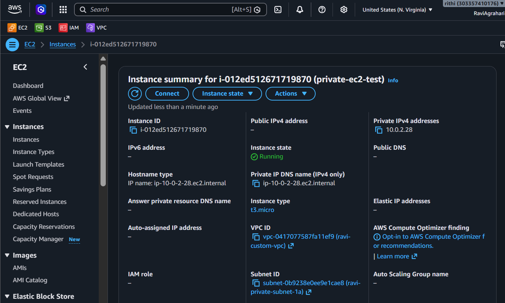

> 🗣️ **Rithu's Tip:** *"No public IP. You CAN'T SSH directly from your laptop. That's by design — we'll use the bastion."*

---

### 🟢 Step 6: Launch Bastion Host 🏰

<details>
<summary><b>🏰 Expand for bastion</b></summary>

1. EC2 → Launch instance
2. Name: `bastion-ec2` · AL2023 · t2.micro · your key pair
3. Network → Edit:
   - VPC: `ravi-custom-vpc`
   - Subnet: `ravi-public-subnet-1a`
   - Auto-assign public IP: **Enabled**
   - SG: `ravi-vpc-sg` (SSH ← My IP)
4. Launch → wait for Running + public IP

</details>

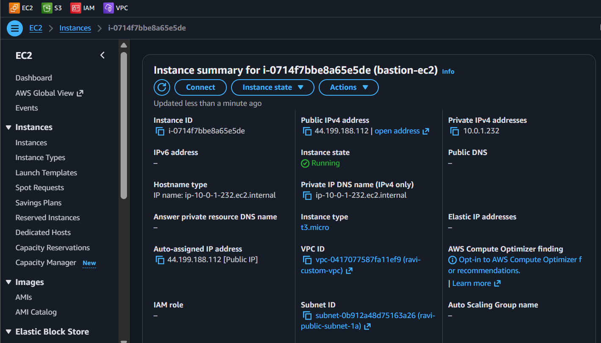

---

### 🟢 Step 7: SSH Private via Bastion 🔐

<details>
<summary><b>🔐 Expand for bastion SSH</b></summary>

1. Copy bastion's **public IP**
2. SSH with agent forwarding (so your key works on the next hop):

```bash
ssh -A -i "your-key.pem" ec2-user@<BASTION_PUBLIC_IP>
```

3. From bastion, SSH to private instance's **private IP**:

```bash
ssh ec2-user@<PRIVATE_EC2_PRIVATE_IP>
```

</details>

> 🗣️ **Rithu's Tip:** *"`-A` forwards your SSH agent — the bastion uses YOUR key to auth to the private instance. No copying .pem files around!"*

---

### 🟢 Step 8: Verify Internet via NAT 🌐

<details>
<summary><b>🌐 Expand for NAT verification</b></summary>

On the **private EC2** (via bastion):

```bash
curl http://checkip.amazonaws.com
```

The returned IP = **NAT Gateway's Elastic IP** — not the instance's (it has none!).

```bash
ping -c 4 8.8.8.8
```

Replies = outbound internet works through NAT. ✅

</details>

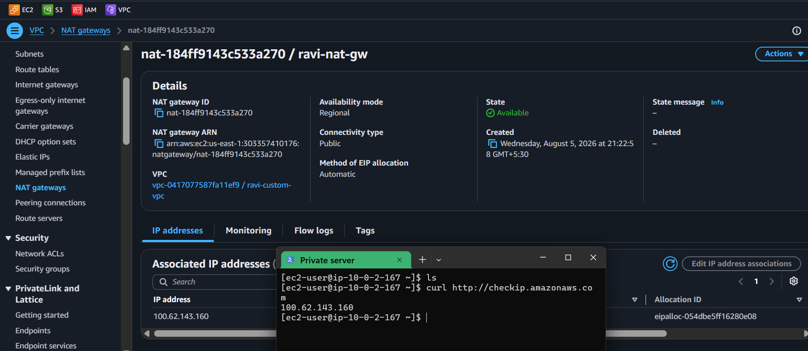

> 🗣️ **Rithu's Tip:** *"Private instance, no public IP, yet full outbound internet. The one-way door does its job — nobody can knock IN."*

---

### 🟢 Step 9: Create S3 VPC Endpoint 🕳️

<details>
<summary><b>🕳️ Expand for endpoint steps</b></summary>

1. VPC → **Endpoints** → ➕ **Create endpoint**
2. Configure:

   | Field | Value |
   |-------|-------|
   | Name | `ravi-s3-endpoint` |
   | Service | `com.amazonaws.us-east-1.s3` (Type: **Gateway**) |
   | VPC | `ravi-custom-vpc` |
   | Route tables | Check `ravi-private-rt` (auto-adds S3 prefix list) |
   | Policy | Full Access |

3. ✅ Create → wait for **Available**

</details>

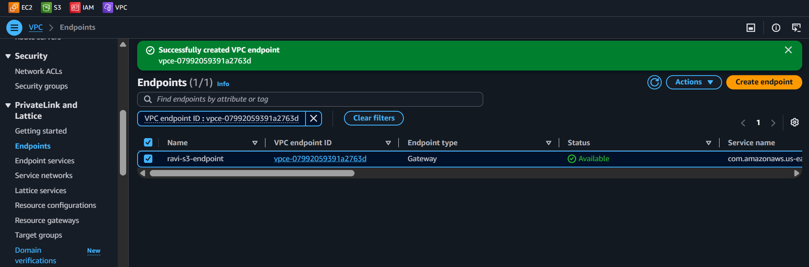

> 🗣️ **Rithu's Tip:** *"Gateway endpoint for S3 = **FREE**, faster, more secure. Traffic: Private EC2 → Endpoint → S3. No NAT, no internet, no NAT data fees!"*

---

### 🟢 Step 10: Verify S3 Access via Endpoint ✅

<details>
<summary><b>✅ Expand for S3 verification</b></summary>

On private EC2:

```bash
# Install AWS CLI v2
curl "https://awscli.amazonaws.com/awscli-exe-linux-x86_64.zip" -o "awscliv2.zip"
unzip awscliv2.zip
sudo ./aws/install
aws configure   # add keys, or better: attach IAM role with S3 read
aws s3 ls
```

Works = traffic went through the VPC Endpoint, not NAT. ✅

</details>

> 🗣️ **Rithu's Tip:** *"Without endpoint: EC2 → NAT → Internet → S3. With it: EC2 → Endpoint → S3. Free, faster, secure."*

---

## ✅ Validation Checklist

| # | Check | Status |
|---|-------|--------|
| 1️⃣ | Private subnet `10.0.2.0/24`, no auto-assign IP | ☐ ✅ |
| 2️⃣ | `ravi-nat-gw` Available with Elastic IP | ☐ ✅ |
| 3️⃣ | `ravi-private-rt` has `0.0.0.0/0 → NAT` + associated | ☐ ✅ |
| 4️⃣ | Private EC2 has NO public IP | ☐ ✅ |
| 5️⃣ | Private EC2 reaches internet (curl + ping via NAT) | ☐ ✅ |
| 6️⃣ | S3 Gateway Endpoint created + Available | ☐ ✅ |
| 7️⃣ | `aws s3 ls` works on private EC2 | ☐ ✅ |
| 8️⃣ | Bastion → private SSH works | ☐ ✅ |

---

## 🧹 Cleanup (Follow Order!)

> ⚠️ **DELETE NAT GATEWAY FIRST — it's the ~$32/mo expense!**

| Step | Action | Console Location |
|------|--------|------------------|
| 1️⃣ 🗑️ | Delete `ravi-nat-gw` (type name) | VPC → NAT Gateways |
| 2️⃣ 🔑 | Release Elastic IP | VPC → Elastic IPs |
| 3️⃣ 🕳️ | Delete `ravi-s3-endpoint` | VPC → Endpoints |
| 4️⃣ 🖥️ | Terminate `bastion-ec2` + `private-ec2-test` | EC2 → Instances |
| 5️⃣ 🛡️ | Delete `ravi-private-sg`, `ravi-vpc-sg` | VPC → Security Groups |
| 6️⃣ 🪧 | Disassociate + delete `ravi-private-rt`, `ravi-public-rt` | VPC → Route Tables |
| 7️⃣ 🚪 | Detach + delete `ravi-igw` | VPC → Internet Gateways |
| 8️⃣ 🛣️ | Delete `ravi-private-subnet-1a`, `ravi-public-subnet-1a` | VPC → Subnets |
| 9️⃣ 🏘️ | Delete `ravi-custom-vpc` | VPC → Your VPCs |

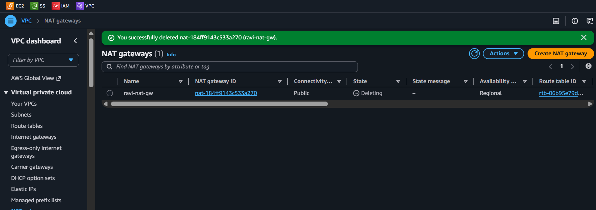

> 🗣️ **Rithu's Tip:** *"Most expensive mistake in this lab: leaving NAT running. Set a timer! ⏰💰"*

---

## 🚀 Level Ups (Post-Core Lab)

| Challenge | What to Try | Notes |
|-----------|-------------|-------|
| 🪞 **Break the Door** | Stop NAT → `dnf update` fails → recreate NAT → works | Feel what NAT actually does |
| 🔐 **Interface Endpoint** | Add `com.amazonaws.us-east-1.secretsmanager` (Interface type, ~$7.20/mo) | Not free, but private |
| 🏗️ **Multi-AZ NAT** | NAT per AZ for HA | Production requirement |

---

## 🆘 Troubleshooting Quick Reference

| 🔍 Issue | 💡 Likely Cause | 🔧 Fix |
|-------|--------------|-----|
| 🌐 Private EC2 no internet | NAT not Available / wrong RT / no association | Check all three; wait 2–3 min for NAT init |
| ⏳ `curl checkip` times out | NAT init / public subnet missing IGW route | Verify public subnet RT → IGW |
| 🔐 Can't SSH private from bastion | SG wrong / wrong VPC / key mismatch | SG must allow 10.0.1.0/24; same VPC; agent forward |
| 🪣 `aws s3 ls` fails | Endpoint not Available / not on private RT / no IAM | Endpoint on `ravi-private-rt` + IAM role/creds |
| ❌ Too many NAT Gateways | Limit 5/AZ | Delete unused |
| 🔑 EIP won't release | Still associated | Delete NAT first, wait, retry |
| 🕳️ Endpoint creation fails | Picked Interface type | Must be **Gateway** for S3 |

---

## 🎮 Test Yourself! (No Peeking 👀)

**Q1:** Which subnet does the NAT Gateway live in, and why?

<details><summary>👀 Show answer</summary>

**A:** The **public subnet** — it needs an internet path (via IGW) to relay traffic for private instances. 🏢

</details>

**Q2:** Can a hacker on the internet initiate a connection to your private instance behind NAT?

<details><summary>👀 Show answer</summary>

**A:** **No.** NAT is **outbound only**. That's the whole point. 🪞

</details>

**Q3:** Private instance needs S3. Cheaper: NAT Gateway or Gateway VPC Endpoint?

<details><summary>👀 Show answer</summary>

**A:** **Gateway VPC Endpoint — it's FREE!** NAT = hourly + data. Endpoint for the win. 🤑

</details>

> 💪 **Rithu:** *"Security is best understood by feeling the absence of it. Break it, fix it, learn it."*

---

## 📚 Official Documentation

- 🪞 [NAT Gateways](https://docs.aws.amazon.com/vpc/latest/userguide/vpc-nat-gateway.html)
- 🕳️ [VPC Endpoints](https://docs.aws.amazon.com/vpc/latest/userguide/vpc-endpoints.html)
- 🔐 [Bastion Hosts (AWS Best Practices)](https://docs.aws.amazon.com/whitepapers/latest/aws-security-best-practices/bastion-hosts.html)

---

## 🎓 What You Learned

> **The basement architect's blueprint:**
> - 🛣️ **Private subnet** → no public IP, invisible from internet
> - 🪞 **NAT Gateway** → outbound-only, lives in public subnet, costs real money
> - 🪧 **Private RT** → `0.0.0.0/0 → NAT` (not IGW!)
> - 🏰 **Bastion** → your ladder over the wall (SSH jump)
> - 🕳️ **S3 Gateway Endpoint** → free, fast, private, skips NAT entirely

**Golden Habit:** Private by default → NAT for outbound → Endpoints for AWS services → delete NAT immediately. 🧹

| | Approach |
|---|---|
| 👶 **Noob Way** | Everything public "to skip NAT setup" — easy target |
| 🧙 **Pro Way** | Private subnets + NAT for outbound + VPC Endpoints for AWS services. Secure AND connected |

---

## ➡️ What's Next?

Proper VPC with public + private done. Next: distribute traffic across multiple EC2s with an Application Load Balancer. ⚖️

🎯 **[Lab 10 - ELB: Application Load Balancer](../10%20-%20ELB%20-%20Application%20Load%20Balancer/README.md)**

---

<div align="center">

### ⭐ Enjoyed this lab? Star the repo & share your feedback!

**Happy Learning!** 🚀☁️

</div>