# ⚖️ Lab 10 - ELB: Application Load Balancer

> 📅 **Updated:** 21 August 2026 | ⏱️ **Duration:** ~40 minutes | 📊 **Level:** Beginner+


> ### 🗣️ *"An Application Load Balancer is like a traffic cop at a busy intersection — it takes incoming requests and spreads them across your servers so no single one gets overwhelmed. Let's build one!"*
> — **Rithu** ⚖️

<details>
<summary><b>🎭 Ravi & Rithu's Coffee Break Chat</b></summary>

**Ravi:** "Why can't users just hit the EC2 instances directly?"

**Rithu:** "Try telling a million users to remember three different IPs and guess which server is alive today."

**Ravi:** "...fair point."

**Rithu:** "The ALB gives them ONE address, spreads the load, and quietly retires sick servers without anyone noticing."

**Ravi:** "So it's a host who seats customers at tables only if the waiter is healthy?"

**Rithu:** "Exactly. And if a waiter collapses, the host just stops sending people to that table." 🍽️

</details>

---

## 🎯 What You'll Master

| Skill | Description |
|-------|-------------|
| 🚦 **Build an ALB** | Internet-facing, multi-AZ, single DNS name |
| 📋 **Target Groups** | The guest list — who the ALB may send traffic to |
| 💔→✅ **Health Checks** | Auto-detect sick servers, stop routing to them |
| 🛡️ **SG References** | EC2 accepts traffic ONLY from ALB's SG |
| 🔁 **Round-Robin Magic** | Watch requests alternate between servers |

> 💡 **Pro Tip:** Real web apps run on multiple servers — one server can't handle everything and can't survive a crash. The ALB is the front door that makes many servers look like one.

---

## 🚦 Before You Start

### ✅ Prerequisites Checklist
- [ ] ✅ **[Lab 09](../09%20-%20VPC%20-%20NAT%20Gateway%20and%20VPC%20Endpoints/README.md)** complete (or any VPC with 2+ public subnets in different AZs)
- [ ] 🔑 Key pair ready
- [ ] 🌍 Region: us-east-1 (or your Lab 09 VPC region)

### 📦 What You Need (and Don't)
| Required | Optional |
|----------|----------|
| ~40 minutes | Domain name (not needed — ALB gives DNS) |
| 2 public subnets in different AZs | |

---

## 💰 Cost & Safety First

| Item | Cost |
|------|------|
| 2× t2.micro | ✅ Free Tier eligible |
| ALB | ⚠️ ~$0.0225/hr — **delete when done, it runs even with no traffic!** |

> ⚠️ **Under $2 total if cleaned promptly. Don't forget the ALB!**

---

## 🧠 How It All Fits Together

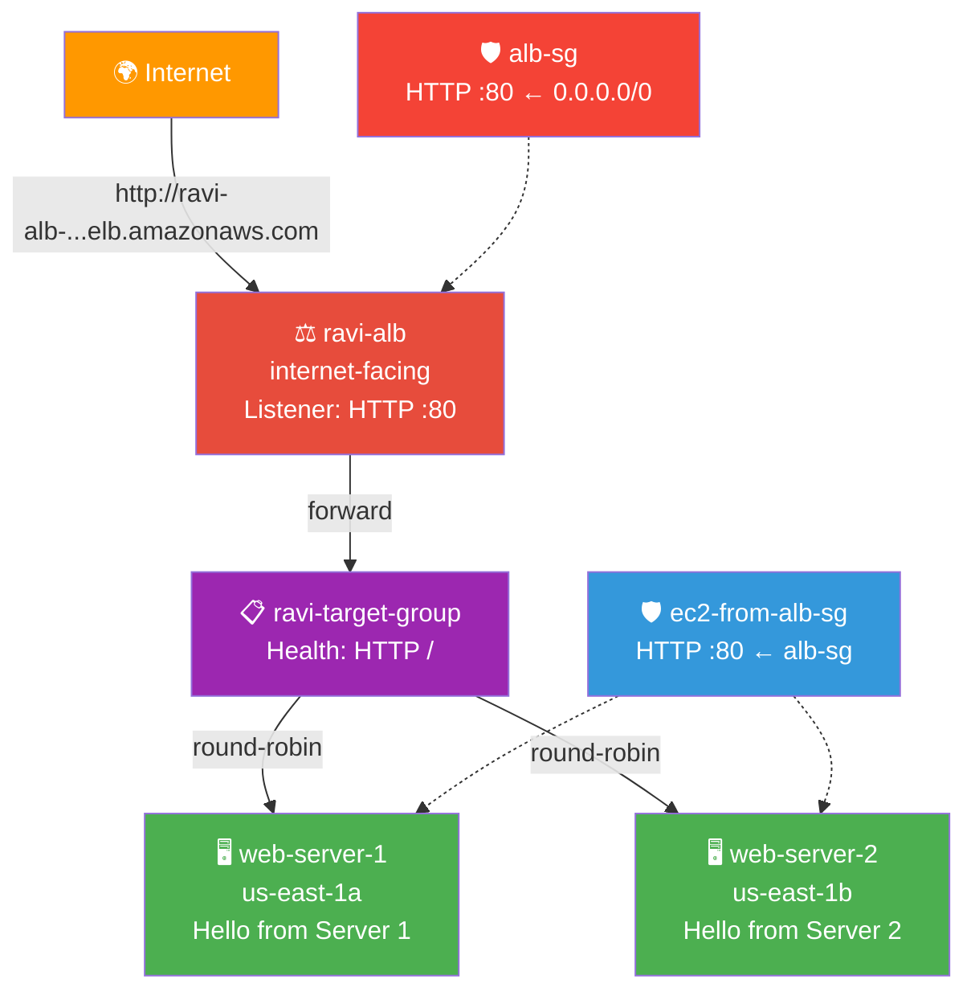

### 🔑 Key Concepts
| Component | Role |
|-----------|------|
| **ALB** | Layer 7 (HTTP/HTTPS) — understands URLs, headers, paths |
| **Target Group** | The list of instances the ALB is allowed to forward to |
| **Health Check** | HTTP GET on `/` every 30s; 3 failures = unhealthy (benched) |
| **SG Reference** | `ec2-from-alb-sg` allows HTTP ONLY from `alb-sg` — blocks direct internet |
| **Multi-AZ** | ALB spans ≥2 AZs; one AZ down → other keeps serving |

---

## 🪜 Step-by-Step Guide

### 🟢 Step 1: ALB Security Group 🛡️

<details>
<summary><b>🛡️ Expand for ALB SG</b></summary>

1. EC2 → **Security Groups** → ➕ **Create security group**
2. Configure:

   | Field | Value |
   |-------|-------|
   | Name | `alb-sg` |
   | Description | `Security group for Application Load Balancer` |
   | VPC | default VPC (or your Lab 09 VPC) |

3. **Inbound:** HTTP (80) ← `0.0.0.0/0` (internet)
4. Outbound: default Allow-all → ✅ Create

</details>

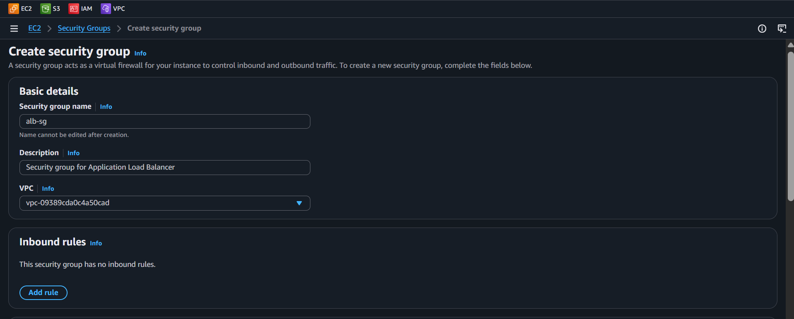

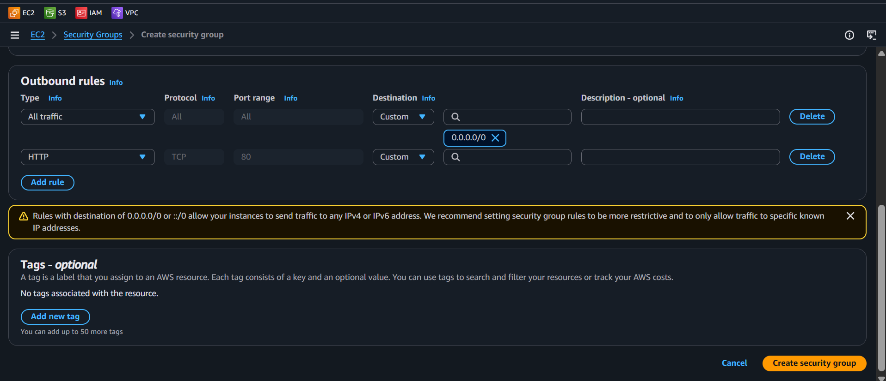

> 🗣️ **Rithu's Tip:** *"ALB accepts from the world — that's fine, it's the public face. The instances behind it stay hidden."*

---

### 🟢 Step 2: EC2 Security Group (SG Reference!) 🔗

<details>
<summary><b>🔗 Expand for EC2 SG with reference</b></summary>

1. ➕ **Create security group**
2. Name: `ec2-from-alb-sg` · Description: `Allow HTTP only from ALB security group` · **Same VPC**
3. **Inbound:** HTTP (80) · Source: **Custom** → type `alb-sg` → select it
4. Outbound: Allow-all → ✅ Create

</details>

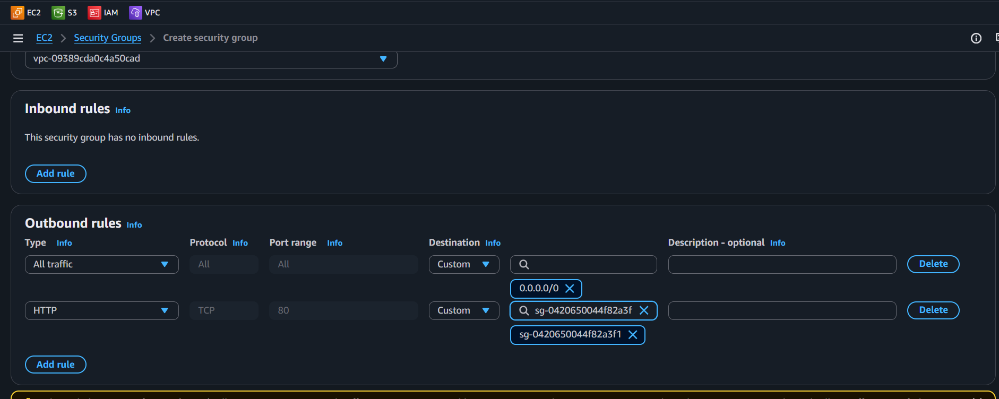

> 🗣️ **Rithu's Tip:** *"THIS is the pattern! Instead of `0.0.0.0/0` on EC2, allow ONLY from `alb-sg`. Means: ALB→EC2 ✅, Internet→EC2 ❌. Security group reference = one SG referencing another."*

---

### 🟢 Step 3: Create Target Group 📋

<details>
<summary><b>📋 Expand for target group</b></summary>

1. EC2 → **Target Groups** → ➕ **Create target group**
2. Configure:

   | Field | Value |
   |-------|-------|
   | Target type | Instances |
   | Name | `ravi-target-group` |
   | Protocol | HTTP |
   | Port | 80 |
   | VPC | Same VPC as SGs |

3. **Health checks:** HTTP, path `/` (defaults) → **Next**
4. **Register targets:** skip for now → **Create target group**

</details>

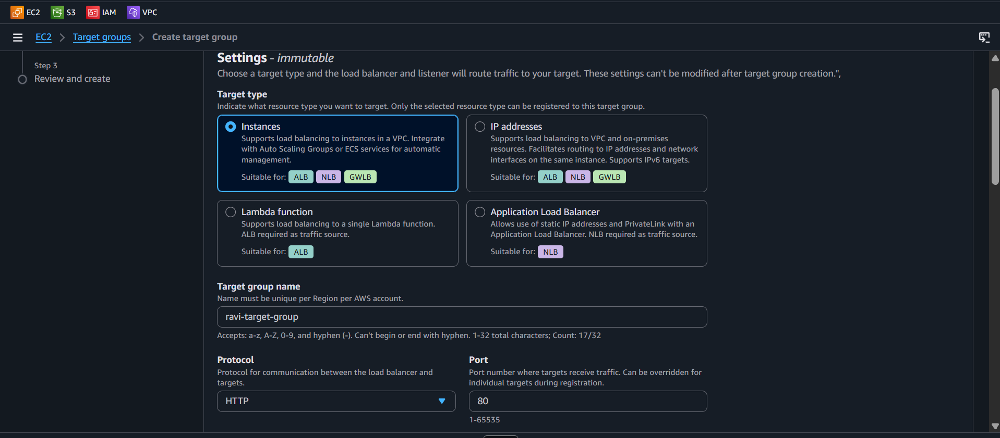

> 🗣️ **Rithu's Tip:** *"Health checks = 'Are you alive?' every 30s. 200 OK = healthy. Timeout/error = unhealthy → traffic stops. Self-healing infrastructure!"*

---

### 🟢 Step 4: Launch Web Server 1 🖥️

<details>
<summary><b>🖥️ Expand for server 1</b></summary>

1. EC2 → Launch instance
2. Name: `web-server-1` · AL2023 · t2.micro · your key pair
3. Network → Edit:
   - VPC: same
   - Subnet: public subnet in **us-east-1a**
   - Auto-assign public IP: Enable
   - SG: `ec2-from-alb-sg`
4. **User data** (Advanced details):

```bash
#!/bin/bash
dnf install -y httpd
systemctl start httpd
echo "<h1>Hello from Web Server 1! Hostname: $(hostname)</h1>" > /var/www/html/index.html
```

5. Launch → wait for Running + 2/2 checks

</details>

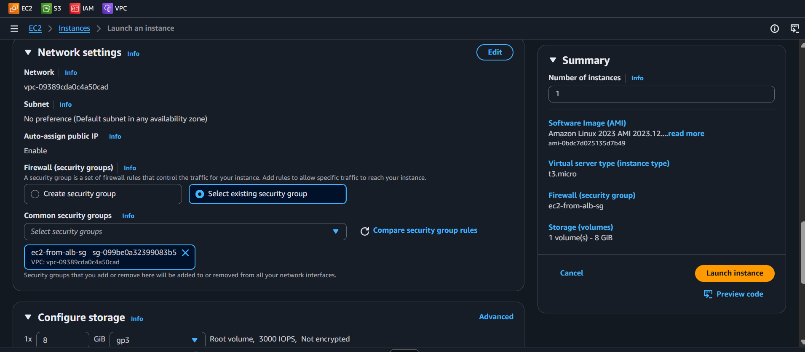

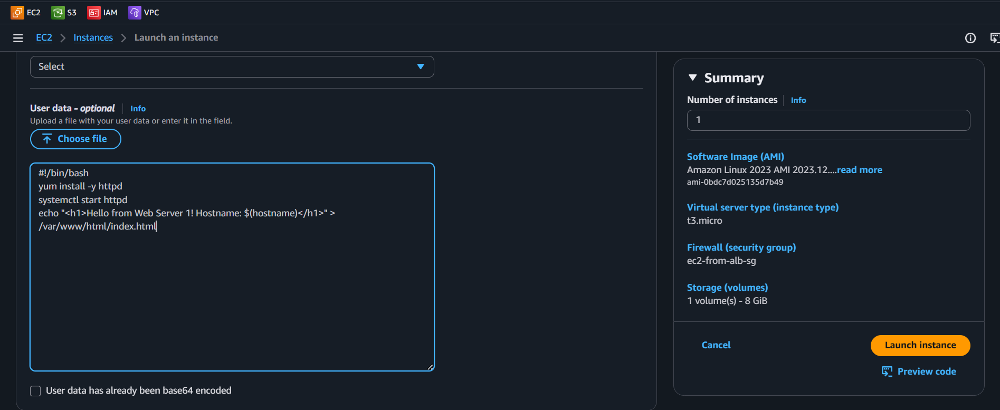

---

### 🟢 Step 5: Launch Web Server 2 (Different AZ!) 🖥️

<details>
<summary><b>🖥️ Expand for server 2</b></summary>

Same as Step 4, three changes:

| Field | Value |
|-------|-------|
| Name | `web-server-2` |
| Subnet | public subnet in **us-east-1b** |
| User data | `echo "<h1>Hello from Web Server 2! Hostname: $(hostname)</h1>"` |

Launch both → wait for Running + 2/2 checks.

</details>

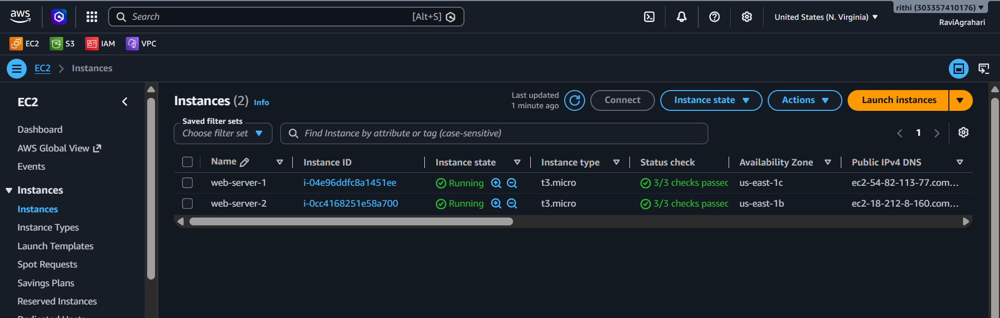

> 🗣️ **Rithu's Tip:** *"Production spreads across AZs — one zone dies, the other serves. That's why us-east-1a + us-east-1b!"*

---

### 🟢 Step 6: Register Targets 🎯

<details>
<summary><b>🎯 Expand for registration</b></summary>

1. EC2 → **Target Groups** → `ravi-target-group` → **Targets** tab
2. ➕ **Register target** → select both instances → **Include as pending below** → **Register pending targets**
3. Wait 30–60s → refresh → both show **healthy** ✅

</details>

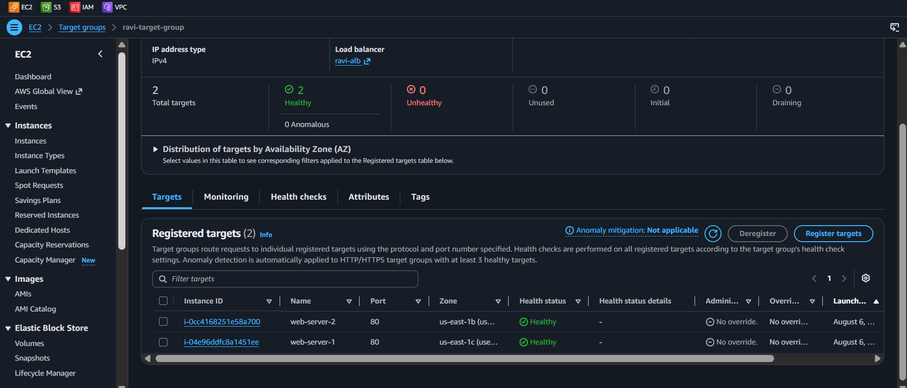

> 🗣️ **Rithu's Tip:** *"Unhealthy? Check: Apache running (user data), SG allows 80 from alb-sg, health path `/` returns 200. Give it 30+ seconds!"*

---

### 🟢 Step 7: Create the ALB ⚖️

<details>
<summary><b>⚖️ Expand for ALB creation</b></summary>

1. EC2 → **Load Balancers** → ➕ **Create Load Balancer**
2. Select **Application Load Balancer**
3. Configure:

   | Field | Value |
   |-------|-------|
   | Name | `ravi-alb` |
   | Scheme | Internet-facing |
   | IP type | IPv4 |

4. **Network mapping:** VPC same → check **us-east-1a** + **us-east-1b** (public subnets)
5. **Security groups:** remove default → select `alb-sg`
6. **Listener:** HTTP :80 → Forward to `ravi-target-group`
7. ✅ **Create load balancer** → wait for **Active** (2–5 min)

</details>

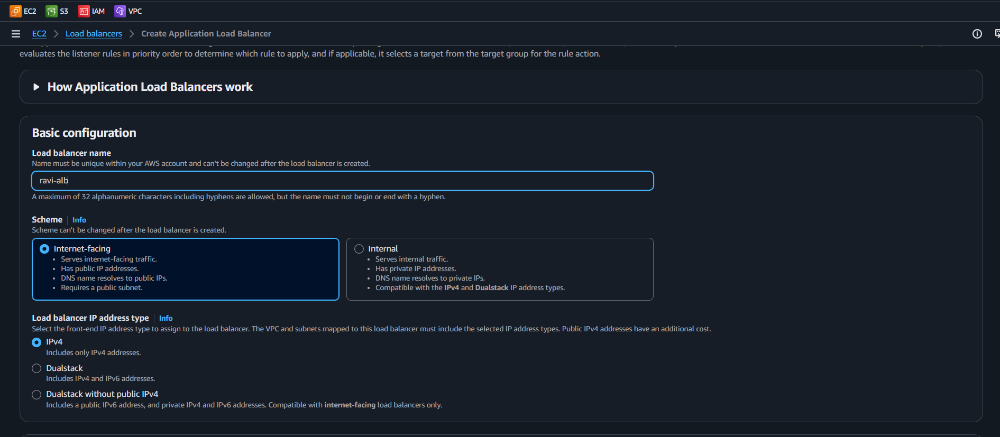

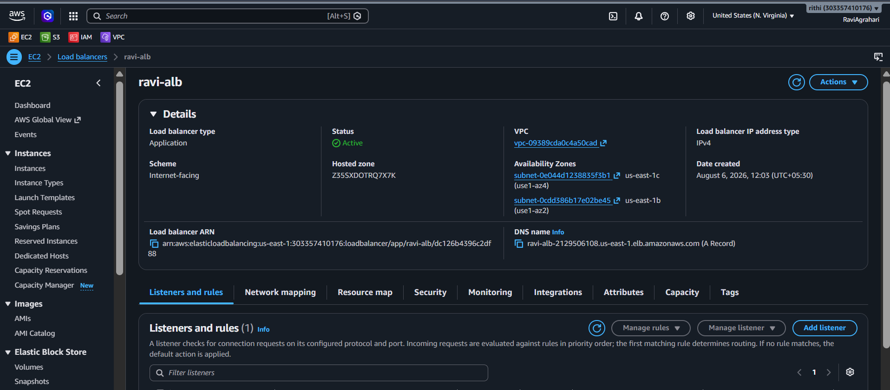

> 🗣️ **Rithu's Tip:** *"ALB MUST be in ≥2 AZs — it's a requirement, not a suggestion. One AZ down = ALB still works from the other."*

---

### 🟢 Step 8: Verify — Watch the Magic! 🎉

<details>
<summary><b>🎉 Expand for verification</b></summary>

1. Copy ALB **DNS name** (looks like `ravi-alb-1234567890.us-east-1.elb.amazonaws.com`)
2. Browser → paste DNS name
3. See: **"Hello from Web Server 1!"** or **"Hello from Web Server 2!"**
4. **REFRESH 5–10 times** → responses **alternate** between servers! 🔁

</details>

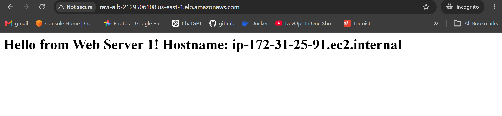


> 🗣️ **Rithu's Tip:** *"🎉 You just set up load balancing! Round-robin in action. One server crashes → ALB sends all to the healthy one. Traffic spike → add more servers. Users always get a response."*

---

### 🟢 Step 9: Check Target Group Health 💚

<details>
<summary><b>💚 Expand for health check</b></summary>

1. Target Groups → `ravi-target-group` → **Targets** tab
2. Both: **Status: healthy** ✅ · Description: `Target registration succeeded`

</details>

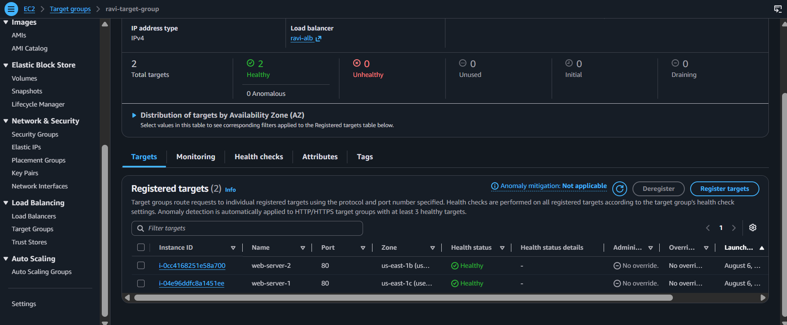

---

## ✅ Validation Checklist

| # | Check | Status |
|---|-------|--------|
| 1️⃣ | `alb-sg`: HTTP 80 ← `0.0.0.0/0` | ☐ ✅ |
| 2️⃣ | `ec2-from-alb-sg`: HTTP 80 ← `alb-sg` only | ☐ ✅ |
| 3️⃣ | `ravi-target-group` created, health checks on `/` | ☐ ✅ |
| 4️⃣ | `web-server-1` running Apache in us-east-1a | ☐ ✅ |
| 5️⃣ | `web-server-2` running Apache in us-east-1b | ☐ ✅ |
| 6️⃣ | Both instances registered + healthy | ☐ ✅ |
| 7️⃣ | `ravi-alb` Active, internet-facing | ☐ ✅ |
| 8️⃣ | ALB DNS loads page in browser | ☐ ✅ |
| 9️⃣ | Refresh alternates Server 1 ↔ Server 2 | ☐ ✅ |

---

## 🧹 Cleanup (Follow Order!)

> ⚠️ **Delete ALB FIRST — it has dependencies. Target group can't delete while ALB uses it!**

| Step | Action | Console Location |
|------|--------|------------------|
| 1️⃣ 🗑️ | Delete `ravi-alb` (type `confirm`) | EC2 → Load Balancers |
| 2️⃣ 📋 | Delete `ravi-target-group` | EC2 → Target Groups |
| 3️⃣ 🖥️ | Terminate `web-server-1`, `web-server-2` | EC2 → Instances |
| 4️⃣ 🛡️ | Delete `alb-sg`, `ec2-from-alb-sg` | EC2 → Security Groups |


---

## 🚀 Level Ups (Post-Core Lab)

| Challenge | What to Try | Notes |
|-----------|-------------|-------|
| 🩹 **Kill One** | Stop one instance → refresh ALB URL → all traffic to survivor → restart → rebalance | Self-healing demo |
| 🔐 **HTTPS Listener** | Add ACM cert, listener 443 → redirect HTTP→HTTPS | Real production pattern |
| 🛤️ **Path Routing** | `/api/*` → different target group | Layer 7 power |

---

## 🆘 Troubleshooting Quick Reference

| 🔍 Issue | 💡 Likely Cause | 🔧 Fix |
|-------|--------------|-----|
| ⏳ ALB stuck "Provisioning" | Normal — 2–5 min | Be patient |
| 🌐 "Site can't be reached" | ALB not Active / wrong DNS / HTTPS | Check state, use HTTP, copy full DNS |
| 🔁 Only one server shows | Not enough refreshes / other unhealthy | Refresh 10×; check target health |
| 💔 Target "unhealthy" | Apache not running / SG blocks 80 from alb-sg / health path | Verify SG reference + `systemctl status httpd` |
| ❌ "No instances registered" | Forgot to register | Target Group → Targets → Register |
| 🚫 "Invalid security group" | SGs in wrong VPC | All resources same VPC |
| ❌ User data didn't run | AMI/instance issue | SSH in, run commands manually |
| 🔗 Can't delete target group | ALB still attached | Delete ALB FIRST |
| 🛡️ SG won't delete | Still attached | Detach from instances/ALB first |

> 🗣️ **Rithu's Tip:** *"Most common issue = SG config. Double-check: 1) alb-sg allows HTTP from world, 2) ec2-from-alb-sg allows HTTP from alb-sg ONLY. Health checks fail if EC2 SG doesn't reference alb-sg!"*

---

## 🎮 Test Yourself! (No Peeking 👀)

**Q1:** What does a health check actually do?

<details><summary>👀 Show answer</summary>

**A:** **Pings each target** (HTTP GET on `/`) — if it fails enough checks, ALB **stops sending traffic** and marks it unhealthy. Sick servers benched automatically. 💔

</details>

**Q2:** At which OSI layer does an Application Load Balancer work?

<details><summary>👀 Show answer</summary>

**A:** **Layer 7** (HTTP/HTTPS) — understands URLs, headers, paths → enables path-based routing (`/api` vs `/web`). 📡

</details>

**Q3:** Why run instances in multiple AZs behind the ALB?

<details><summary>👀 Show answer</summary>

**A:** **High availability** — one AZ outage, the other keeps serving. No single point of failure. 🏙️

</details>

> 💪 **Rithu:** *"An ALB without a broken server to test against is an unproven ALB. Break one on purpose!"*

---

## 📚 Official Documentation

- ⚖️ [What Is an Application Load Balancer?](https://docs.aws.amazon.com/elasticloadbalancing/latest/application/introduction.html)
- 📋 [Target Groups](https://docs.aws.amazon.com/elasticloadbalancing/latest/application/load-balancer-target-groups.html)
- 💚 [Health Checks](https://docs.aws.amazon.com/elasticloadbalancing/latest/application/target-group-health-checks.html)

---

## 🎓 What You Learned

> **The traffic cop's playbook:**
> - ⚖️ **ALB** → one DNS name, many servers, round-robin
> - 📋 **Target Group** → the guest list of allowed instances
> - 💔→✅ **Health Checks** → auto-detect & remove sick servers
> - 🔗 **SG Reference** → EC2 trusts ONLY the ALB's SG
> - 🏙️ **Multi-AZ** → one zone dies, other serves

**Golden Habit:** Always front apps with ALB → health checks on → multi-AZ → single DNS name for clients. 🧹

| | Approach |
|---|---|
| 👶 **Noob Way** | Hand out instance IPs, hope nobody dies |
| 🧙 **Pro Way** | ALB always: one DNS, health checks, ready to scale |

---

## ➡️ What's Next?

Load balanced! Next: automatically add/remove servers based on traffic with Auto Scaling Groups. 📈

🎯 **[Lab 11 - Auto Scaling Group](../11%20-%20Auto%20Scaling%20Group/README.md)**

---

<div align="center">

### ⭐ Enjoyed this lab? Star the repo & share your feedback!

**Happy Learning!** 🚀☁️

</div>