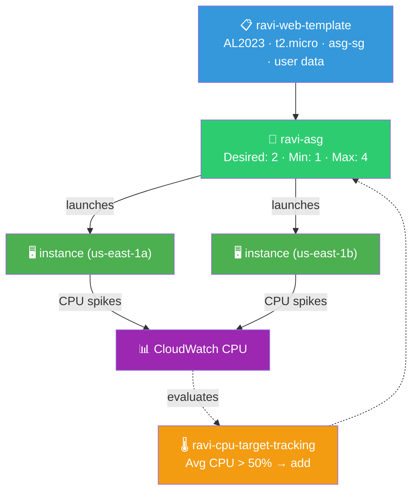
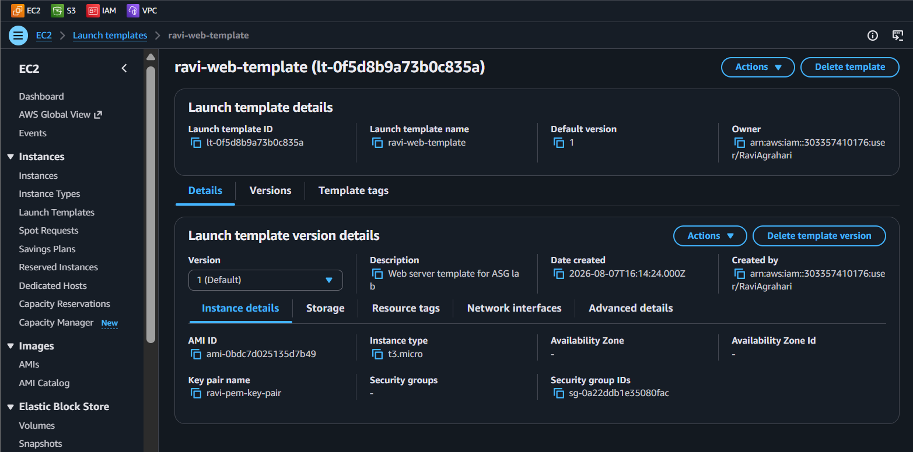
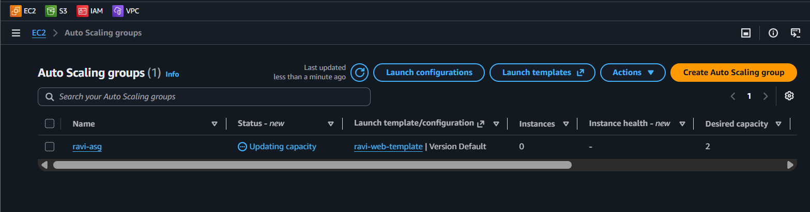
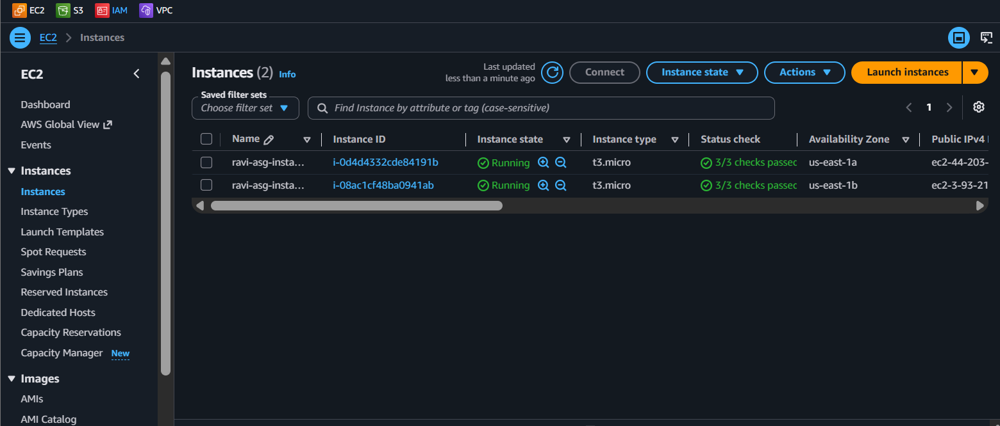
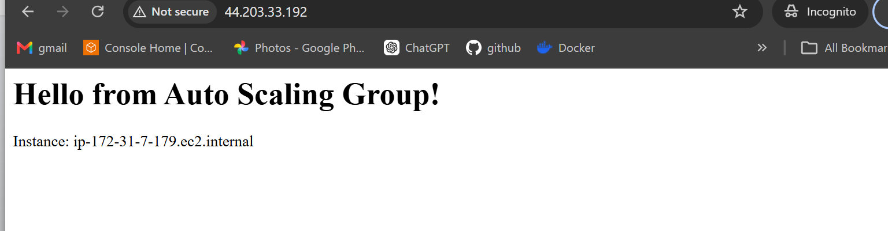
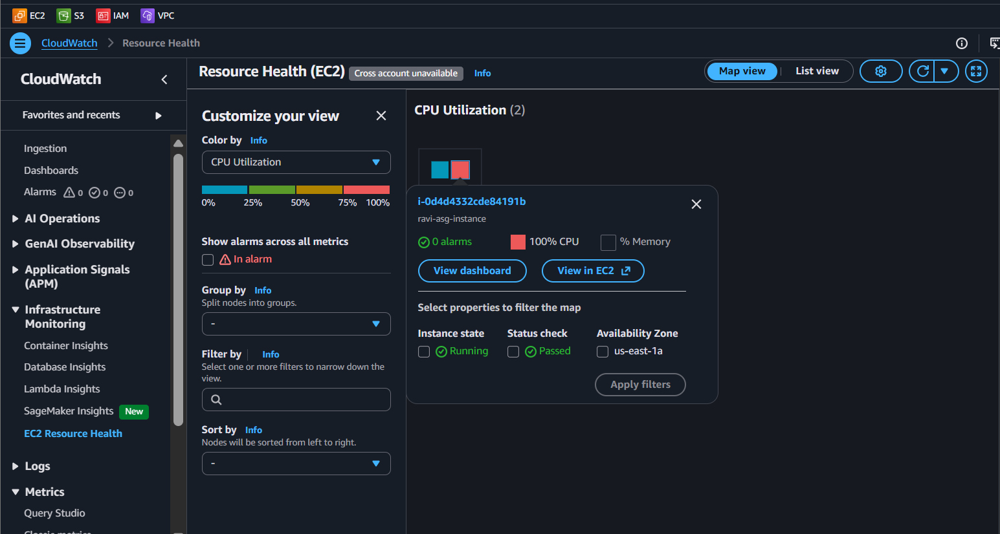

# 🤖 Lab 11 - Auto Scaling Group

> 📅 **Updated:** 21 August 2026 | ⏱️ **Duration:** ~35 minutes | 📊 **Level:** Beginner+


> ### 🗣️ *"Ravi, imagine never having to manually launch an EC2 instance again. Auto Scaling Groups are like having a robot intern who watches your servers and spins up new ones when things get busy. Let's build one!"*
> — **Rithu** 🤖

<details>
<summary><b>🎭 Ravi & Rithu's Coffee Break Chat</b></summary>

**Ravi:** "So the ASG just... hires more servers when it's busy?"

**Rithu:** "Exactly. And fires them when things calm down. All by itself. While you sleep."

**Ravi:** "What if a server randomly dies?"

**Rithu:** "The ASG notices and launches a replacement. It's like a plant-watering robot that also buys a new plant when one wilts."

**Ravi:** "How do I tell it what a 'server' looks like?"

**Rithu:** "With a Launch Template — the recipe card. AMI, instance type, security group, user data. The ASG just follows the recipe." 📋

</details>

---

## 🎯 What You'll Master

| Skill | Description |
|-------|-------------|
| 📋 **Launch Template** | The reusable recipe for every instance |
| 🤖 **Auto Scaling Group** | Robot ops manager: desired/min/max |
| 🌡️ **Target Tracking** | Thermostat: "keep CPU ~50%" |
| 🔁 **Scale Out / In** | Add when hot, remove when cold |
| 🏥 **Self-Healing** | Dead instance → auto-replaced |

> 💡 **Pro Tip:** This is how apps survive Black Friday and don't waste money in July. Automatic scaling = hobby → production.

---

## 🚦 Before You Start

### ✅ Prerequisites Checklist
- [ ] ✅ **[Lab 10](../10%20-%20ELB%20-%20Application%20Load%20Balancer/README.md)** complete (or any VPC with 2 public subnets)
- [ ] 🔑 `first-key-pair` ready
- [ ] 🌍 Region: us-east-1 (or your Lab 10 region)

### 📦 What You Need (and Don't)
| Required | Optional |
|----------|----------|
| ~35 minutes | CloudWatch curiosity |
| `stress` tool install | |

---

## 💰 Cost & Safety First

| Resource | Cost |
|----------|------|
| t2.micro instances | ✅ Free Tier (750 hrs/mo) |
| ASG itself | Free — only instances cost |
| Max 4 instances | < $2 for lab duration |

> ⚠️ **ASG is FREE** — you pay for what it launches. Clean up when done!

---

## 🧠 How It All Fits Together



### 🔑 Key Concepts
| Component | Role |
|-----------|------|
| **Launch Template** | Recipe: AMI, type, SG, key, user data — ASG bakes from it |
| **Desired / Min / Max** | Target count / floor / ceiling — ASG keeps fleet in range |
| **Target Tracking** | "Keep avg CPU at 50%" — like cruise control for servers |
| **Multi-AZ** | Spreads instances across us-east-1a + us-east-1b |
| **Self-Healing** | Instance dies → ASG launches replacement automatically |

---

## 🪜 Step-by-Step Guide

### 🟢 Step 1: Create Launch Template 📋

<details>
<summary><b>📋 Expand for launch template</b></summary>

1. EC2 Console → **Launch Templates** → ➕ **Create launch template**
2. Configure:

   | Field | Value |
   |-------|-------|
   | Name | `ravi-web-template` |
   | Version description | `Web server template for ASG lab` |
   | Auto Scaling guidance | ✅ Check |
   | AMI | Amazon Linux 2023 |
   | Instance type | `t2.micro` |
   | Key pair | `first-key-pair` |
   | Security group | Create `asg-sg` → HTTP 80 ← `0.0.0.0/0`, SSH 22 ← **My IP** |
   | User data | (see below) |

3. **User data:**

```bash
#!/bin/bash
dnf install -y httpd
systemctl start httpd
echo "<h1>Hello from Auto Scaling Group!</h1><p>Instance: $(hostname)</p>" > /var/www/html/index.html
```

4. ✅ **Create launch template**

</details>



> 🗣️ **Rithu's Tip:** *"Amazon Linux 2023 uses `dnf` (yum works but dnf is recommended). This user data runs on EVERY instance the ASG launches — magic!"*

---

### 🟢 Step 2: Create the Auto Scaling Group 🤖

<details>
<summary><b>🤖 Expand for ASG creation</b></summary>

1. EC2 Console → **Auto Scaling Groups** → ➕ **Create Auto Scaling group**
2. **Name & template:**

   | Field | Value |
   |-------|-------|
   | ASG name | `ravi-asg` |
   | Launch template | `ravi-web-template` |
   | Version | Default (latest) |

3. **Launch options:**
   - VPC: default VPC
   - Subnets: **us-east-1a** AND **us-east-1b** (both!) → Next

4. **Advanced options:**
   - Load balancing: **None** (keep simple)
   - Health check type: **EC2** (status checks)
   - Health check grace period: **300** seconds → Next

   > ⚠️ *If you ever attach an ALB later, switch health check to **ELB** — otherwise ASG ignores ALB health checks!*

5. **Group size & scaling:**

   | Setting | Value |
   |---------|-------|
   | Desired capacity | **2** |
   | Minimum capacity | **1** |
   | Maximum capacity | **4** |

6. **Scaling policies:** **Target tracking scaling policy**
   - Policy name: `ravi-cpu-target-tracking`
   - Metric: Average CPU utilization
   - Target value: **50** → Next

7. Notifications: Skip → Tags: `Name` = `ravi-asg-instance` (optional) → **Create**

</details>



> 🗣️ **Rithu's Tip:** *"50% target = thermostat. CPU > 50% → add instances. CPU < 50% → remove. Selecting 2 AZs = don't put all eggs in one basket 🧺."*

---

### 🟢 Step 3: Wait for Instances ⏳

<details>
<summary><b>⏳ Expand for wait</b></summary>

1. EC2 → **Instances** → 2 new instances launching (names contain "asg")
2. Wait for **Running** + **2/2 checks** (~2–3 min)

</details>



> 🗣️ **Rithu's Tip:** *"ASG automatically launched exactly 2 (desired) across 2 AZs. You did zero manual work. Automation!"*

---

### 🟢 Step 4: Verify Instances 🌐

<details>
<summary><b>🌐 Expand for verification</b></summary>

1. Copy public IP of one instance
2. Browser → `http://<IP>` → **"Hello from Auto Scaling Group! Instance: ip-..."**
3. Try the other IP too — both show the page

</details>



---

### 🟢 Step 5: Test Scaling — Break Things! 🔥

<details>
<summary><b>🔥 Expand for stress test</b></summary>

**⚠️ CRITICAL: Stress BOTH instances or average CPU won't exceed 50%!**

1. SSH into **BOTH** instances (two terminals):

```bash
ssh -i "first-key-pair.pem" ec2-user@<IP_1>
ssh -i "first-key-pair.pem" ec2-user@<IP_2>
```

2. On **both**, install stress:

```bash
sudo dnf install -y stress
```

3. On **both**, max CPU for 10 min:

```bash
stress --cpu 4 --timeout 600s
```

4. Watch ASG **Activity** tab → new instance launching after ~3–5 min!
5. EC2 → Instances → see **3 or 4** instances
6. CloudWatch → Metrics → EC2 → Per-Instance → CPUUtilization → watch spike!

</details>



> 🗣️ **Rithu's Tip:** *"t2.micro = burstable. Credits run out → throttles to ~10%. If CPU dips early, re-run `stress --cpu 4` (no timeout) on both."*

---

### 🟢 Step 6: Verify Scale-In ⏳

<details>
<summary><b>⏳ Expand for scale-in</b></summary>

1. Stop stress (Ctrl+C or wait 10 min)
2. Wait 5–10 min after CPU drops < 50%
3. ASG **scales in** — terminates extra instance automatically
4. ASG **Activity** tab shows: "Terminating an EC2 instance"
5. Instance count returns to **2** (desired)

</details>

---

## ✅ Validation Checklist

| # | Check | Status |
|---|-------|--------|
| 1️⃣ | Launch Template `ravi-web-template` exists with correct config | ☐ ✅ |
| 2️⃣ | SG `asg-sg`: HTTP 80 ← world, SSH 22 ← My IP | ☐ ✅ |
| 3️⃣ | ASG `ravi-asg` running 2 instances across 2 AZs | ☐ ✅ |
| 4️⃣ | Both instances healthy, web page accessible | ☐ ✅ |
| 5️⃣ | Stress test → ASG scaled out (3–4 instances) | ☐ ✅ |
| 6️⃣ | Stress stopped → ASG scaled in (back to 2) | ☐ ✅ |
| 7️⃣ | Activity tab shows scale-out + scale-in events | ☐ ✅ |

---

## 🧹 Cleanup (Follow Order!)

> ⚠️ **Delete ASG FIRST — it keeps launching if you delete other things first!**

| Step | Action | Console Location |
|------|--------|------------------|
| 1️⃣ 🗑️ | Delete `ravi-asg` (type `delete`) → wait for all instances to terminate | EC2 → Auto Scaling Groups |
| 2️⃣ 📋 | Delete `ravi-web-template` | EC2 → Launch Templates |
| 3️⃣ 🛡️ | Delete `asg-sg` | EC2 → Security Groups |

> 🗣️ **Rithu's Tip:** *"Order matters! Delete ASG first. If you delete SG while ASG runs, it'll fail to launch and leave you in a weird state."*

---

## 🚀 Level Ups (Post-Core Lab)

| Challenge | What to Try | Notes |
|-----------|-------------|-------|
| 🩹 **Kill One** | Terminate one ASG instance manually → watch replacement launch | Self-healing demo |
| 📊 **Step Scaling** | Add step scaling policy (e.g., CPU > 70% add 2, CPU < 30% remove 1) | More granular |
| 🔗 **Attach ALB** | Recreate ASG with Lab 10's ALB + target group | Health check = ELB |

---

## 🆘 Troubleshooting Quick Reference

| 🔍 Issue | 💡 Likely Cause | 🔧 Fix |
|-------|--------------|-----|
| 🤖 ASG launched 0 instances | Invalid template / no IPs in subnet / quota | Check Activity tab for errors; verify Service Quotas |
| 🔁 Same hostname on both IPs | Expected without ALB | Open each IP in separate tabs; or attach ALB |
| 🌡️ Stress didn't trigger scale | Only stressed ONE instance / not long enough | **Stress BOTH**; wait 5–10 min for evaluation period |
| 🛡️ SG won't delete | Instances still using it | Wait for ASG full termination first |
| ❌ "No capacity" error | EC2 instance limit hit | Service Quotas → EC2 → request increase (rare for t2.micro) |

---

## 🎮 Test Yourself! (No Peeking 👀)

**Q1:** Launch Template in one sentence?

<details><summary>👀 Show answer</summary>

**A:** A **reusable recipe** for instances — AMI, type, SG, key pair, user data. ASG uses it for every server it launches. 📋

</details>

**Q2:** CPU > target for 10 min → ASG does what?

<details><summary>👀 Show answer</summary>

**A:** **Scale out** — launches new instances to spread load and bring CPU back toward target. 🆕

</details>

**Q3:** You manually terminate an ASG instance. What happens?

<details><summary>👀 Show answer</summary>

**A:** ASG notices count < desired → **launches replacement** automatically. Self-healing by design. 🤖

</details>

> 💪 **Rithu:** *"Watching your first scale-out live is a core memory. Do it, don't skip it."*

---

## 📚 Official Documentation

- 📋 [Launch Templates](https://docs.aws.amazon.com/AWSEC2/latest/UserGuide/ec2-launch-templates.html)
- 🤖 [Auto Scaling Groups](https://docs.aws.amazon.com/autoscaling/ec2/userguide/auto-scaling-groups.html)
- 🌡️ [Target Tracking Scaling Policies](https://docs.aws.amazon.com/autoscaling/ec2/userguide/as-scaling-target-tracking.html)

---

## 🎓 What You Learned

> **The robot ops manager's manual:**
> - 📋 **Launch Template** → recipe for every instance
> - 🤖 **ASG** → desired/min/max, multi-AZ, self-healing
> - 🌡️ **Target Tracking** → "keep CPU at 50%" = cruise control
> - 🔁 **Scale Out/In** → add when hot, remove when cold
> - 🏥 **Self-Healing** → dead instance = auto-replaced

**Golden Habit:** Template → ASG with min/max → target tracking → stress test → clean up ASG first. 🧹

| | Approach |
|---|---|
| 👶 **Noob Way** | One big instance, pray it's enough |
| 🧙 **Pro Way** | ASG + target tracking: scale out on demand, scale in when quiet — pay only for what you need |

---

## ➡️ What's Next?

Auto scaling mastered! Next: direct traffic with DNS — Route 53 with automatic failover. 🌐

🎯 **[Lab 12 - Route 53: DNS and Failover](../12%20-%20Route%2053%20-%20DNS%20and%20Failover/README.md)**

---

<div align="center">

### ⭐ Enjoyed this lab? Star the repo & share your feedback!

**Happy Learning!** 🚀☁️

</div>