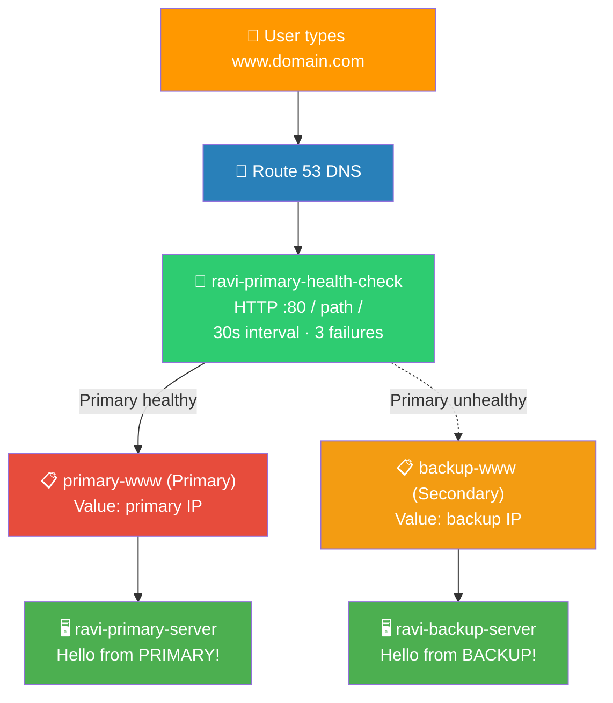

# 🌐 Lab 12 - Route 53: DNS & Failover

> 📅 **Updated:** 21 August 2026 | ⏱️ **Duration:** ~35 minutes | 📊 **Level:** Beginner+


> ### 🗣️ *"Ravi, every time you type google.com, DNS is working behind the scenes to find the right server. Today you become the DNS wizard. And yes, we'll also teach your domain to switch to a backup when the main server goes down — like a bat signal for your infrastructure!"*
> — **Rithu** 🦇

<details>
<summary><b>🎭 Ravi & Rithu's Coffee Break Chat</b></summary>

**Ravi:** "Wait, DNS is just a phonebook?"

**Rithu:** "The world's biggest phonebook, updated millions of times a day. You type a name, it hands back a number."

**Ravi:** "And failover routing?"

**Rithu:** "It's like having two doctors on call. If the primary doesn't answer the health check, the phonebook hands you the backup's number automatically."

**Ravi:** "So users never even notice the switch?"

**Rithu:** "That's the dream. Seamless. Invisible. Bat-signal level. 🦇"

</details>

---

## 🎯 What You'll Master

| Skill | Description |
|-------|-------------|
| 📖 **DNS Basics** | The internet's phonebook: name → IP |
| 💚 **Health Checks** | Route 53 pings your server — no answer = dead |
| 🔄 **Failover Routing** | Primary dies → backup takes over automatically |
| 🔁 **Failback** | Primary recovers → traffic returns |
| 💰 **Cost Choices** | Option A: real domain ($12/yr) / Option B: free practice |

> 💡 **Pro Tip:** When your primary crashes at 3 AM, failover keeps your site alive without you waking up. Also: it's called Route 53 because DNS uses port 53!

---

## 🚦 Before You Start

### ✅ Prerequisites Checklist
- [ ] ✅ **[Lab 11](../11%20-%20ASG%20-%20Auto%20Scaling%20Group/README.md)** complete
- [ ] 🖥️ Two EC2 instances ready (or launch fresh t2.micro AL2023)
- [ ] 🔑 `first-key-pair` for SSH
- [ ] 💰 Decision: Option A (register domain, ~$12) or Option B (free, health checks only)

### 📦 What You Need (and Don't)
| Required | Optional |
|----------|----------|
| ~35 minutes | Real domain ($12, non-refundable) |
| Two EC2 instances with httpd | DNS cache flush tools |

---

## 💰 Cost & Safety First

| Resource | Cost |
|----------|------|
| Health checks (≤50 on AWS endpoints) | ✅ **Free** |
| Hosted zone | ⚠️ $0.50/month (not Free Tier) |
| Domain registration | ⚠️ ~$12/yr — **cannot be deleted/refunded!** |
| DNS queries | ~$0.50/million |

> ⚠️ **Rithu says:** Domain registration = permanent $12. Option B (free) teaches the same concepts! Hosted zone = $0.50/mo. 10s health check = paid; we use free 30s standard.

### 🏷️ Naming Convention

| Resource | Name |
|----------|------|
| 🖥️ Primary instance | `ravi-primary-server` |
| 🖥️ Backup instance | `ravi-backup-server` |
| 🛡️ Security group | `route53-sg` |
| 💚 Health check | `ravi-primary-health-check` |
| 📋 Primary record ID | `primary-www` |
| 📋 Backup record ID | `backup-www` |

---

## 🧠 How It All Fits Together



### 🔑 Key Concepts
| Component | Role |
|-----------|------|
| **A record** | Name → IPv4 address (AAAA for IPv6) |
| **Health check** | 30s HTTP GET on `/`; 3 consecutive failures = Unhealthy |
| **Failover policy** | Primary record + health check; Secondary = plan B |
| **TTL 300s** | Cache lifetime — flush or wait for failover to propagate |
| **Failback** | Automatic — health recovers → primary takes over again |

---

## 🪜 Step-by-Step Guide

### 🟢 Step 1: Launch Two EC2 Instances 🖥️🖥️

<details>
<summary><b>🖥️ Expand for both instances</b></summary>

**Primary:**

1. EC2 → Launch instance
2. Name: `ravi-primary-server` · AL2023 · t2.micro · `first-key-pair`
3. SG: Create `route53-sg` → HTTP 80 ← `0.0.0.0/0`, SSH 22 ← **My IP**
4. **User data:**

```bash
#!/bin/bash
dnf install -y httpd
systemctl start httpd
echo "<h1>Hello from PRIMARY server!</h1><p>Instance: $(hostname)</p>" > /var/www/html/index.html
```

5. Launch

**Backup (same, three changes):**

| Field | Value |
|-------|-------|
| Name | `ravi-backup-server` |
| User data | `echo "<h1>Hello from BACKUP server!</h1><p>This is the failover instance.</p>"` |

6. Wait for both **Running + 2/2 checks** → note both public IPs

</details>


---

### 🟢 Step 2: Create Health Check 💚

<details>
<summary><b>💚 Expand for health check</b></summary>

1. Route 53 Console → **Health checks** → ➕ **Create health check**
2. Configure:

   | Field | Value |
   |-------|-------|
   | Name | `ravi-primary-health-check` |
   | What to monitor | Endpoint |
   | Specify by | IP address |
   | Protocol | HTTP |
   | Port | 80 |
   | IP address | Primary server's public IP |
   | Path | `/` |
   | Request interval | Standard (30 seconds) |
   | Failure threshold | 3 |

3. ✅ **Create** → wait ~1 min → status = **Healthy** ✅

</details>


> 🗣️ **Rithu's Tip:** *"30s interval = free. 10s = paid. Threshold 3 = prevents false alarms from one slow response."*

---

### 🟢 Step 3: Option A — Hosted Zone (if registered domain) 📍

<details>
<summary><b>📍 Expand if you registered a domain</b></summary>

1. Route 53 → **Hosted zones** → click your domain
2. NS and SOA records are default — normal

**Option B users:** Skip to Step 4 — you can't create records without a domain, but health checks work standalone!

</details>

---

### 🟢 Step 4: Simple Record Test (Option A only) 🧪

<details>
<summary><b>🧪 Expand for simple record</b></summary>

1. Hosted zone → **Create record**
2. Configure:

   | Field | Value |
   |-------|-------|
   | Record name | `www` |
   | Record type | **A** |
   | Value | Primary IP |
   | TTL | **300** |
   | Routing policy | **Simple routing** |

3. ✅ Create → test: `nslookup www.your-domain.com` + `curl http://www.your-domain.com`

**Option B:** You can't resolve DNS without a domain, but the failover concepts below still apply — follow along!

</details>

---

### 🟢 Step 5: Failover Routing — The Real Deal! 🔄

<details>
<summary><b>🔄 Expand for failover setup</b></summary>

**5a: Delete Simple Record** (if you created one — failover records need unique name+type)

**5b: Primary Failover Record**

1. Hosted zone → **Create record**

   | Field | Value |
   |-------|-------|
   | Record name | `www` |
   | Record type | **A** |
   | Value | Primary IP |
   | TTL | **300** |
   | Routing policy | **Failover** |
   | Failover record type | **Primary** |
   | Record ID | `primary-www` |
   | Health check | `ravi-primary-health-check` |

2. ✅ Create

**5c: Secondary Failover Record**

1. **Create record** again

   | Field | Value |
   |-------|-------|
   | Record name | `www` |
   | Record type | **A** |
   | Value | Backup IP |
   | TTL | **300** |
   | Routing policy | **Failover** |
   | Failover record type | **Secondary** |
   | Record ID | `backup-www` |
   | Health check | *(leave empty — recommended)* |

2. ✅ Create

</details>

> 🗣️ **Rithu's Tip:** *"Health check on PRIMARY is the trigger — without it, Route 53 never fails over. Record ID distinguishes the two `www` A records. Alias records for ALB? Different path — see bonus."*

---

### 🟢 Step 6: Test Failover — Break the Primary! 💥

<details>
<summary><b>💥 Expand for failover test</b></summary>

**6a: Verify Primary Works**
- Browser → `http://www.your-domain.com` (or primary IP directly) → **"Hello from PRIMARY server!"**

**6b: Kill Primary's Web Server**
1. SSH into primary:
   ```bash
   ssh -i "first-key-pair.pem" ec2-user@<PRIMARY_IP>
   ```
2. Stop Apache:
   ```bash
   sudo systemctl stop httpd
   ```
3. Verify: `curl http://localhost` → error
4. `exit`

**6c: Wait for Health Check to Fail**
- Route 53 → Health checks → watch `ravi-primary-health-check`
- Healthy → Unhealthy (~90s = 3 × 30s)

**6d: Test Failover**
- Fresh browser tab → `http://www.your-domain.com` → **"Hello from BACKUP server!"** 🎉

> ⏱️ *DNS cache + TTL 300s = wait a few minutes, or flush cache (see Troubleshooting).*

**6e: Test Failback (Primary Recovers)**
1. SSH primary → `sudo systemctl start httpd` → exit
2. Wait 1–2 min for health check → **Healthy**
3. Browser → **"Hello from PRIMARY server!"** ✅

</details>

---

## ✅ Validation Checklist

| # | Check | Status |
|---|-------|--------|
| 1️⃣ | Two EC2 instances running with different pages | ☐ ✅ |
| 2️⃣ | Health check `ravi-primary-health-check` monitoring primary :80 | ☐ ✅ |
| 3️⃣ | Two A records `www`: Primary (with HC) + Secondary (no HC) | ☐ ✅ |
| 4️⃣ | Stop httpd on primary → HC fails → traffic to backup | ☐ ✅ |
| 5️⃣ | Start httpd on primary → HC recovers → traffic to primary | ☐ ✅ |

---

## 🧹 Cleanup (Follow Order!)

> ⚠️ **Domain registrations CANNOT BE DELETED** — let expire or disable auto-renew.

| Step | Action | Console Location |
|------|--------|------------------|
| 1️⃣ 🗑️ | Delete custom records (`www` A records) | Route 53 → Hosted zones |
| 2️⃣ 💚 | Delete `ravi-primary-health-check` | Route 53 → Health checks |
| 3️⃣ 📍 | Delete hosted zone (if manually created) | Route 53 → Hosted zones |
| 4️⃣ 🖥️ | Terminate `ravi-primary-server`, `ravi-backup-server` | EC2 → Instances |
| 5️⃣ 🛡️ | Delete `route53-sg` | EC2 → Security Groups |

---

## 🚀 Level Ups (Post-Core Lab)

| Challenge | What to Try | Notes |
|-----------|-------------|-------|
| 🦇 **Break Instance** | Terminate primary instance (not just stop httpd) | Watch full instance failover |
| 🔗 **Alias Records** | Point `www` at ALB DNS name with "Evaluate target health" | Tracks ALB, works at zone apex |
| 🌍 **Geolocation** | Route users to nearest region | Global apps |

---

## 🆘 Troubleshooting Quick Reference

| 🔍 Issue | 💡 Likely Cause | 🔧 Fix |
|-------|--------------|-----|
| 💚 HC stays Unhealthy | SG blocks 80 / httpd not running / wrong IP | Verify SG, `systemctl status httpd`, check HC IP |
| 🌐 DNS not changing after failover | DNS cache / TTL not expired | `ipconfig /flushdns` (Win) / `sudo dscacheutil -flushcache` (Mac); wait 300s |
| 📍 Can't delete hosted zone | Registered domain / non-default records remain | Delete all custom records first; registered domains = can't delete |
| 🔄 Failover doesn't switch | HC not attached to Primary / httpd not stopped / not 3 failures | Attach HC; `systemctl stop httpd`; wait ~90s for 3 failures |
| 🖥️ Backup shows wrong page | User data wrong / httpd not restarted | SSH backup, check `curl localhost`, restart httpd |

---

## 🎮 Test Yourself! (No Peeking 👀)

**Q1:** Why is Route 53 called "Route 53"?

<details><summary>👀 Show answer</summary>

**A:** Because **DNS uses port 53** — Route 53 is the route for DNS traffic. A perfect pun for a phonebook service. 📖

</details>

**Q2:** What record maps a domain name to an IPv4 address?

<details><summary>👀 Show answer</summary>

**A:** An **A record** ("Address" record). For IPv6 it's AAAA — four times the A! 🅰️

</details>

**Q3:** Primary server crashes. What does failover routing do?

<details><summary>👀 Show answer</summary>

**A:** Health check fails → Route 53 **switches traffic to the backup server** automatically. Users keep browsing like nothing happened. 🦇

</details>

> 💪 **Rithu:** *"Don't skip the deliberate breakage. Watching the health check go red is the whole lesson."*

---

## 📚 Official Documentation

- 🌐 [What Is Route 53?](https://docs.aws.amazon.com/Route53/latest/DeveloperGuide/Welcome.html)
- 💚 [Health Checks](https://docs.aws.amazon.com/Route53/latest/DeveloperGuide/dns-failover-determine-health-of-endpoints.html)
- 🔄 [Failover Routing](https://docs.aws.amazon.com/Route53/latest/DeveloperGuide/routing-policy-failover.html)

---

## 🎓 What You Learned

> **The DNS wizard's spellbook:**
> - 📖 **DNS** → phonebook: name → IP (A record = IPv4)
> - 💚 **Health Check** → pings server; 3 failures = dead
> - 🔄 **Failover** → Primary (with HC) + Secondary = auto-plan B
> - 🔁 **Failback** → Primary recovers → traffic returns
> - 🎲 **Route 53** → DNS runs on port 53!

**Golden Habit:** Health checks on critical endpoints → failover routing → test by breaking things → document TTL expectations. 🧹

| | Approach |
|---|---|
| 👶 **Noob Way** | One DNS record → one server. Server dies → site dies |
| 🧙 **Pro Way** | Health checks + failover: phonebook fixes outage before users notice |

---

## ➡️ What's Next?

Traffic directed. Next: managed databases — RDS MySQL without patch/backup/infrastructure worries. 🗄️

🎯 **[Lab 13 - RDS: MySQL on AWS](../13%20-%20RDS%20-%20MySQL%20on%20AWS/README.md)**

---

<div align="center">

### ⭐ Enjoyed this lab? Star the repo & share your feedback!

**Happy Learning!** 🚀☁️

</div>