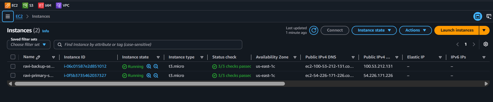
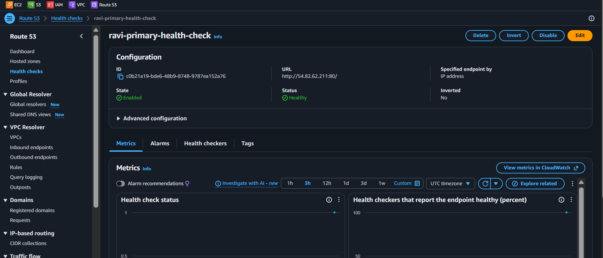

<div align="center">


</div>

<div align="center">


</div>

> "Ravi, every time you type google.com, DNS is working behind the scenes to find the right server. Today you become the DNS wizard. And yes, we'll also teach your domain to switch to a backup when the main server goes down — like a bat signal for your infrastructure!" — Rithu

---

<details>
<summary><b>🎭 Ravi & Rithu's Coffee Break Chat</b></summary>

**Ravi:** "Wait, DNS is just a phonebook?"

**Rithu:** "The world's biggest phonebook, updated millions of times a day. You type a name, it hands back a number."

**Ravi:** "And failover routing?"

**Rithu:** "It's like having two doctors on call. If the primary doesn't answer the health check, the phonebook hands you the backup's number automatically."

**Ravi:** "So users never even notice the switch?"

**Rithu:** "That's the dream. Seamless. Invisible. Bat-signal level. 🦇"

</details>

---

## 📋 Table of Contents

- [🎯 Objective](#-objective)
- [📊 Lab Progress](#-lab-progress)
- [🤔 In Plain English](#-in-plain-english)
- [🧠 Prerequisites](#-prerequisites)
- [💰 Cost Warning](#-cost-warning)
- [🏗️ Architecture](#️-architecture)
- [🛠️ Step-by-Step Instructions](#️-step-by-step-instructions)
- [✅ Validation Checklist](#-validation-checklist)
- [🧹 Cleanup (IMPORTANT!)](#-cleanup-important)
- [🧠 Memory Tips](#-memory-tips)
- [🎓 What You Learned](#-what-you-learned)
- [🎮 Test Yourself](#-test-yourself-no-peeking-)
- [🆚 Pro Tip vs Noob Tip](#-pro-tip-vs-noob-tip)
- [🔗 What's Next?](#-whats-next)
- [❓ Troubleshooting](#-troubleshooting)

---

<div align="center">

## 📊 Lab Progress

`[██░░░░░░░░░░░░░░░░░░] 5% — Let's Begin!`

</div>

---

## 🤔 In Plain English

> **What is this, really?** DNS is the **phonebook of the internet** — it translates human names (`myapp.com`) into machine addresses (IPs). Route 53 is AWS's phonebook. Add a **health check** and it becomes a smarter phonebook: if your main server stops answering, Route 53 **automatically hands users the backup server's number**. That's failover. 📖
>
> 🌍 **Why you should care:** When your primary server crashes at 3 AM, failover is what keeps your website alive without you waking up. Also — fun fact: it's called Route 53 because DNS uses port 53!

---

## 🎯 Objective

In this lab, you will:

- Understand how **DNS** works and why Route 53 is AWS's DNS service
- Create a **Health Check** that monitors your server's availability
- Set up a **Simple Routing** record pointing to your EC2 instance
- Configure **Failover Routing** so traffic automatically switches to a backup server when the primary goes down
- Test the failover by deliberately breaking your primary server

---

## 🧠 Prerequisites

Before you start, make sure you have:

- ✅ Completed **Lab 11** (Auto Scaling Groups)
- ✅ An AWS account with Route 53 access
- ✅ At least one **running EC2 instance** with a public IP (you can launch a fresh t2.micro Amazon Linux 2023 if needed)
- ✅ Apache (httpd) installed and running on that EC2 instance
- ✅ Your key pair ready for SSH

---

## 💰 Cost Warning

| Resource | Cost |
|----------|------|
| Route 53 Health Checks | **Free** for up to 50 checks on your own AWS endpoints (e.g., your EC2 instance) |
| Hosted Zone | $0.50/month per zone |
| DNS Queries | ~$0.50 per million queries |
| **Domain Registration** | **~$12/year** (if you register a new domain) |

> ⚠️ **CRITICAL — Rithu says:** Domain registration costs ~$12 and **cannot be refunded or deleted** once registered. If you don't want to spend that, use **Option B** below — the learning is the same either way! A hosted zone costs $0.50/month (not Free Tier), and the 10-second "fast" health check interval is a paid add-on, so we use the standard 30-second interval — free on your own EC2 endpoints.

### Choose Your Path:

- **Option A:** Register a real domain (~$12) — Great if you want your own `.com`!
- **Option B:** Skip domain registration and practice with health checks only (**Free**) — The failover concepts still apply!

> 
> I recommend Option B for your first time. You can always register a domain later. The important thing is understanding how DNS and failover routing work!

---

## 🏗️ Architecture

```
        User types: www.ravi-labs.com
                    │
                    ▼
        ┌──────────────────────┐
        │     Route 53 DNS     │
        │    Health Check      │
        │    monitors:80       │
        └──────────┬───────────┘
                   │
         ┌─────────┴─────────┐
         │   Failover Policy  │
         │                    │
    ┌────▼────┐        ┌────▼────┐
    │Primary  │  ──▶   │Secondary│
    │EC2 (OK) │        │EC2(BU) │
    │  :80    │        │  :80    │
    └─────────┘        └─────────┘

    If Primary health check fails →
    Route 53 returns Secondary IP!
```

---

## 🛠️ Step-by-Step Instructions

### Step 1: Prepare Your EC2 Instances

> 

You need **two EC2 instances** for failover routing — a primary and a secondary.

**Launch Instance 1 (Primary):**

1. Go to **EC2 Console** → **Launch Instance**
2. Configure:

| Field | Value |
|-------|-------|
| Name | `ravi-primary-server` |
| AMI | Amazon Linux 2023 |
| Instance type | t2.micro |
| Key pair | first-key-pair |
| Security group | Create new: `route53-sg` |
| Security group rules | HTTP (80) from Anywhere, SSH (22) from My IP |

3. Under **Advanced details** → **User data**, paste:

```bash
#!/bin/bash
dnf install -y httpd
systemctl start httpd
echo "<h1>Hello from PRIMARY server!</h1><p>Instance: $(hostname)</p>" > /var/www/html/index.html
```

4. Click **Launch Instance**

**Launch Instance 2 (Secondary/Backup):**

Repeat the same steps, name it `ravi-backup-server`, and change the user data page text:

```bash
#!/bin/bash
dnf install -y httpd
systemctl start httpd
echo "<h1>Hello from BACKUP server!</h1><p>This is the failover instance.</p>" > /var/www/html/index.html
```

Click **Launch Instance**.

5. Wait for both instances to be **Running** and **2/2 status checks passed**

6. Note down both **Public IPs:**
   - Primary IP: `________________`
   - Backup IP: `________________`

📸 **[Screenshot: Two EC2 instances running — primary and backup]**


---

### Step 2: Create a Health Check

> 

Route 53 uses health checks to know if your server is alive. Let's create one for the primary server.

1. Go to **Route 53 Console** → left sidebar → **Health checks**
2. Click **Create health check**
3. Configure:

| Field | Value |
|-------|-------|
| Health check name | `ravi-primary-health-check` |
| What to monitor | **Endpoint** |
| Specify endpoint by | **IP address** |
| Protocol | **HTTP** |
| Port | **80** |
| IP address | Paste your **primary server's public IP** |
| Path | `/` |
| Request interval | **Standard (30 seconds)** |
| Failure threshold | **3** |

4. Click **Create health check**

> 
> Route 53 checks the server every 30 seconds (the fast 10-second interval is a paid add-on). "Failure threshold 3" means it must fail 3 checks in a row before being marked unhealthy — that prevents false alarms from a single slow response.

5. Wait about 1 minute, then check the health check status. It should show **Healthy** (green)

📸 **[Screenshot: Health check showing "Healthy" status]**


---

### Step 3: Create a Hosted Zone (Option A Only)

> 

> ⏭️ **Skip this step if you chose Option B** (no domain registration)

If you registered a domain in Step 1:

1. Go to **Route 53** → **Hosted zones**
2. Your domain should already have a hosted zone. Click on it.
3. You'll see default NS and SOA records — those are normal

---

### Step 4: Create a Simple DNS Record (Testing)

> 

Let's first point our domain to the primary server to make sure DNS is working.

> ⚠️ **Option B users:** Without a registered domain, you can't fully test DNS resolution. But you CAN still create health checks and understand the failover concepts by following along!

**If you have a domain (Option A):**

1. In your hosted zone, click **Create record**
2. Configure:

| Field | Value |
|-------|-------|
| Record name | `www` |
| Record type | **A** |
| Value | Primary server's public IP |
| TTL | **300** seconds |
| Routing policy | **Simple routing** |

3. Click **Create records**

4. Test DNS resolution:

```bash
nslookup www.your-domain.com
curl http://www.your-domain.com
```

You should see the primary server's response! 🎉

---

### Step 5: Set Up Failover Routing — The Real Deal!

> 

Now let's set up automatic failover. This is where Route 53 really shines!

**Step 5a: Delete the Simple Record**

Route 53 won't let the failover records share the name and type (`www`, A) of the simple record from Step 4 — a simple record must be unique in the zone. In the hosted zone, select the `www` A record and click **Delete records**, then confirm.

**Step 5b: Create the PRIMARY Failover Record**

1. Click **Create record**

| Field | Value |
|-------|-------|
| Record name | `www` |
| Record type | **A** |
| Value | **Primary** server's public IP |
| TTL | **300** |
| Routing policy | **Failover** |
| Failover record type | **Primary** |
| Record ID | `primary-www` |
| Health check | Select `ravi-primary-health-check` |

2. Click **Create records**

> 
> The health check on the PRIMARY record is what triggers failover — without it, Route 53 treats the primary as always healthy and never fails over.

**Step 5c: Create the SECONDARY Failover Record**

1. Click **Create record** again

| Field | Value |
|-------|-------|
| Record name | `www` |
| Record type | **A** |
| Value | **Backup** server's public IP |
| TTL | **300** |
| Routing policy | **Failover** |
| Failover record type | **Secondary** |
| Record ID | `backup-www` |
| Health check | **Leave empty** (recommended — the backup is used whenever the primary is unhealthy) |

2. Click **Create records**

> 
> Both records share the name `www` but differ by failover type (Primary vs Secondary); the **Record ID** is what distinguishes them. Route 53 answers with the Primary while it's healthy and only returns the Secondary when the Primary's health check fails — an automatic plan B! 🔄
>
> Real-world twist: if your targets were AWS resources like an ALB, you'd use an **alias record** pointed at the ALB's DNS name (with "Evaluate target health" on) instead of typing an IP. Aliases are also the only way to put a record at the zone apex — a CNAME can't live there.

---

### Step 6: Test Failover — Let's Break the Primary! 💥

> 

Time to simulate a disaster and watch Route 53 save the day!

**Step 6a: Verify Primary is Serving Traffic**

1. Open your browser: `http://www.your-domain.com` (or use the primary IP directly if Option B)
2. You should see: **"Hello from PRIMARY server!"**

**Step 6b: Kill the Primary Server's Web Service**

1. SSH into your **primary** server:

```bash
ssh -i "first-key-pair.pem" ec2-user@<PRIMARY_PUBLIC_IP>
```

2. Stop Apache:

```bash
sudo systemctl stop httpd
```

3. Verify it's down:

```bash
curl http://localhost
```

You should get an error — no response from the web server!

4. Exit the SSH session: `exit`

**Step 6c: Wait for Health Check to Fail**

1. Go to **Route 53** → **Health checks**
2. Watch `ravi-primary-health-check` status change:
   - It will go from **Healthy** → **Unhealthy** (after ~90 seconds = 3 checks × 30 seconds)
3. 📸 **[Screenshot: Health check showing "Unhealthy" status]**

**Step 6d: Test Failover**

1. Open a fresh browser tab: `http://www.your-domain.com`
2. You should now see: **"Hello from BACKUP server!"** 🎉

> 
> Failover takes effect once the health check fails **and** cached DNS answers expire. With a 300-second TTL, give it a few minutes (or flush your DNS cache — see Troubleshooting) before the browser shows the backup. 🦇

> 🎉 **Ravi, this is HUGE!** Your DNS automatically redirected traffic to the backup server without any manual intervention. In production, this means your users barely notice an outage!

**Step 6e: Test Failback (Primary Comes Back)**

1. SSH back into the **primary** server:

```bash
ssh -i "first-key-pair.pem" ec2-user@<PRIMARY_PUBLIC_IP>
```

2. Start Apache:

```bash
sudo systemctl start httpd
```

3. Exit SSH: `exit`

4. Wait 1-2 minutes for the health check to recover
5. Check Route 53 health check — it should show **Healthy** again
6. Open `http://www.your-domain.com` — you should see **"Hello from PRIMARY server!"** again!

---

### Step 7: Verify Your Work

> 

Let's make sure everything is set up correctly:

- [ ] Two EC2 instances are running (primary and backup)
- [ ] Health check exists and shows appropriate status
- [ ] Route 53 records: Two A records with same name, different failover types
- [ ] Primary record points to primary IP with the health check attached
- [ ] Secondary record points to backup IP
- [ ] Stopping httpd on primary causes health check to fail
- [ ] After health check fails, DNS returns backup IP
- [ ] Restarting httpd on primary causes health check to recover
- [ ] After health check recovers, DNS returns primary IP

---

## ✅ Validation Checklist

- [ ] Two EC2 instances running with different web pages (primary vs backup) ✅
- [ ] Security group allows HTTP (80) and SSH (22) ✅
- [ ] Health check created and monitoring primary server on port 80 ✅
- [ ] Simple routing record tested in Step 4 (if you have a domain) ✅
- [ ] Primary failover record created with health check attached ✅
- [ ] Secondary failover record created pointing to backup server ✅
- [ ] Stopping httpd on primary → health check fails → traffic goes to backup ✅
- [ ] Restarting httpd on primary → health check recovers → traffic returns to primary ✅

---

## 🧹 Cleanup (IMPORTANT!)

> ⚠️ **Domain registrations cannot be deleted!** They expire after 1 year. If you registered a domain, just let it expire or disable auto-renew.

1. 🗑️ **Delete Route 53 Records:**
   - Go to **Route 53** → **Hosted zones** → click your domain
   - Select the `www` record(s) → **Delete**
   - Type `delete` to confirm
   - Delete ALL records you created (keep the default NS and SOA if the domain is registered)

2. 🛑 **Delete Health Check:**
   - Go to **Route 53** → **Health checks**
   - Select `ravi-primary-health-check`
   - Click **Delete** → Confirm

3. 🗑️ **Delete Hosted Zone (if you created one separately):**
   - Go to **Route 53** → **Hosted zones**
   - Select the zone → **Delete hosted zone**
   - Type the domain name to confirm

4. 💻 **Terminate EC2 Instances:**
   - Go to **EC2** → **Instances**
   - Select `ravi-primary-server` and `ravi-backup-server`
   - Click **Instance state** → **Terminate instance**
   - Confirm

5. 🔐 **Delete Security Group:**
   - Go to **EC2** → **Security Groups**
   - Select `route53-sg` → **Actions** → **Delete security group**
   - Confirm

📸 **[Screenshot: All Route 53 resources deleted, EC2 instances terminated]**

---

## 🧠 Memory Tips

Stick these in your brain and they'll never leave. 🧲

| 🧠 Memory Hook | Remember it like... |
|---|---|
| **Why "53"?** | Because **DNS runs on port 53**! Route 53 = the DNS route. The name is a pun, not a coincidence. 🎲 |
| **A record = name → IP** | "**A**ddress" record: point a name at an IPv4 address. Like a phonebook entry. 📖 |
| **Health check = is it alive?** | Route 53 pings the server; no answer = flagged dead. 💀 |
| **Failover = two doctors on call** | Primary answers → users go there. Primary silent → **backup takes over automatically**. 🦇 |
| **Failback** | When the primary recovers, traffic **returns to it**. The phonebook goes back to normal. 🔁 |

> 🗣️ **Rithu:** *"Interview question you'll definitely hear: 'Why is it called Route 53?' Now you know the answer and you'll smile instead of panic."

---

## 🎓 What You Learned

| Concept | What You Now Know |
|---------|-------------------|
| **DNS Basics** | How domain names get translated to IP addresses |
| **Route 53** | AWS's highly available DNS service and how to use it |
| **Health Checks** | How Route 53 monitors your servers and detects failures |
| **Simple Routing** | How to create a basic DNS record pointing to an IP |
| **Failover Routing** | How to set up automatic DNS failover when a server goes down |
| **Primary/Secondary** | How Route 53 prioritizes records and switches between them |
| **Failback** | How traffic returns to the primary server after it recovers |
| **Alias Records** | Point a name at an AWS resource (like an ALB) instead of a fixed IP — the DNS name tracks the resource automatically |

---

## 🎮 Test Yourself! (No Peeking 👀)

**Q1:** Why is Route 53 called "Route 53"?

<details><summary>👀 Show answer</summary>

**A:** Because **DNS uses port 53** — Route 53 is the route for DNS traffic. A perfect pun for a phonebook service. 📖

</details>

**Q2:** What kind of record maps a domain name to an IPv4 address?

<details><summary>👀 Show answer</summary>

**A:** An **A record** ("Address" record). For IPv6 it's AAAA — four times the A! 🅰️

</details>

**Q3:** Your primary server crashes. What does failover routing do for your users?

<details><summary>👀 Show answer</summary>

**A:** The health check fails → Route 53 **switches traffic to the secondary/backup server** automatically. Users keep browsing like nothing happened. 🦇

</details>

### 🔥 Bonus Challenge

**Break your primary server on purpose** (stop the instance). Watch Route 53's health check turn red, then refresh your domain and confirm traffic is now served by the backup. Then start the primary again and watch **failback** happen. You're now a DNS wizard. 🧙

> 💪 **Rithu:** *"Don't skip the deliberate breakage. Watching the health check go red is the whole lesson."

---

### 🆚 Pro Tip vs Noob Tip

| | Approach |
|---|---|
| **Noob Tip** | One DNS record pointing at one server. Server dies → site dies |
| **Pro Tip** | Health checks + failover routing: the phonebook fixes the outage before users notice |

---

## 🔗 What's Next?

Now that you can direct traffic to instances, let's learn about managing databases in the cloud:

➡️ **Lab 13 — RDS: MySQL on AWS** — Learn how to run a managed MySQL database in the cloud without worrying about patches, backups, or infrastructure!

---

## ❓ Troubleshooting

<details>
<summary><strong>Click to expand Troubleshooting Section</strong></summary>

### 🔍 My health check stays "Unhealthy" even though the server is running

- 🔍 Verify the security group allows inbound HTTP (port 80) from anywhere (`0.0.0.0/0`)
- 🔧 Check that Apache is actually running: SSH in and run `sudo systemctl status httpd`
- 🔍 Make sure the health check IP matches the primary server's public IP exactly
- 💡 Try changing the health check path to something simpler like `/`
- ⏱️ Wait at least 1 minute for the status to update

### 🔍 DNS resolution is not changing after failover

- 🔍 DNS caching! Your computer may be caching the old IP
- 🧹 Flush your DNS cache:
  - Windows: `ipconfig /flushdns`
  - Mac: `sudo dscacheutil -flushcache`
- 🔧 Try using `nslookup` or `dig` instead of browser (browsers cache more aggressively)
- ⏱️ The TTL is set to 300 seconds — wait that long for caches to expire

### 🔍 I can't delete my hosted zone

- 🔍 Make sure all non-default records are deleted first (NS and SOA are default for registered domains)
- 💡 You cannot delete the hosted zone for a registered domain — it's automatically managed
- 🔧 For manually created hosted zones, delete all custom records first, then delete the zone

### 🔍 Failover doesn't switch — both records return Primary

- 🔍 Check that the health check is actually attached to the Primary record
- 🔍 Confirm the health check is still enabled and shows **Healthy** when the primary is running
- 🔧 Make sure you stopped httpd (not just the instance) — `sudo systemctl stop httpd`
- ⏱️ The health check must fail 3 consecutive times (~90 seconds with the standard 30s interval)

### 🔍 My secondary server doesn't show the backup page

- 🔍 Make sure you used the correct user data when launching the backup instance
- 🔧 SSH into the backup and check: `curl http://localhost`
- 🔧 If it shows the default page, restart httpd: `sudo systemctl restart httpd`

</details>

> 🎉 **Fantastic work, Ravi!** DNS and failover routing are fundamental to building resilient applications. You now know how to automatically redirect traffic when something goes wrong — a skill that separates beginners from real cloud engineers. Next up, let's tackle databases! 🚀

---

<div align="center">


</div>
