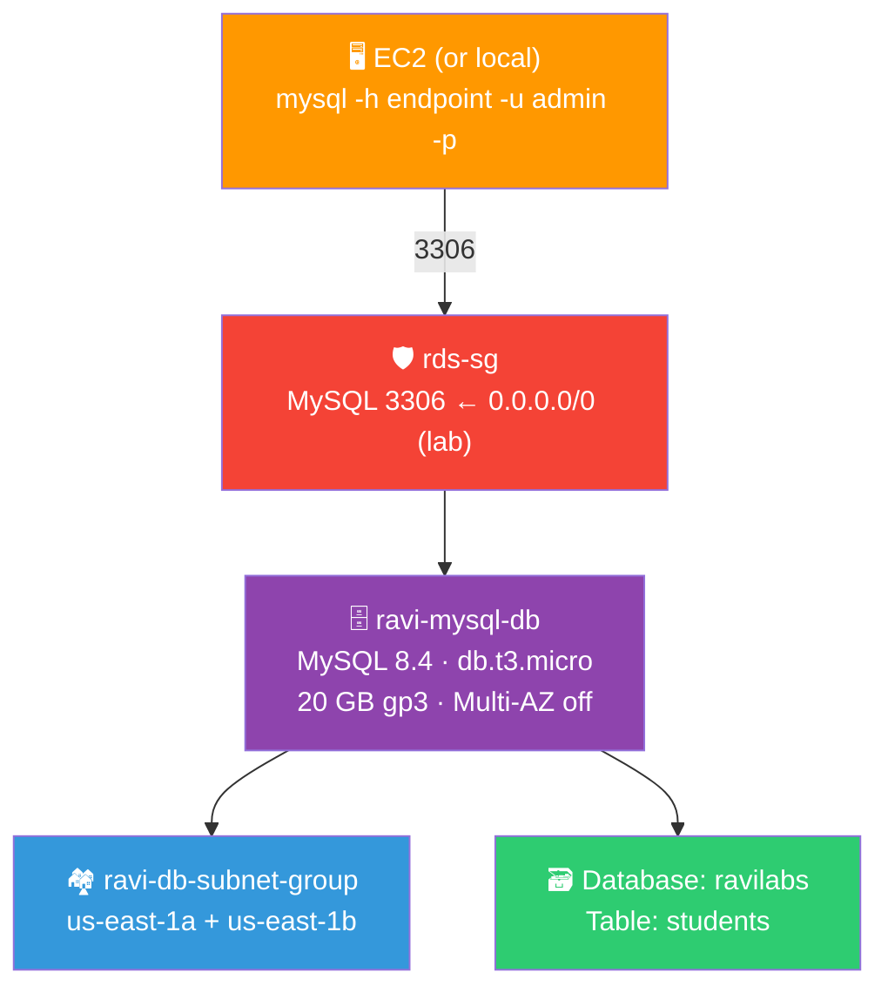
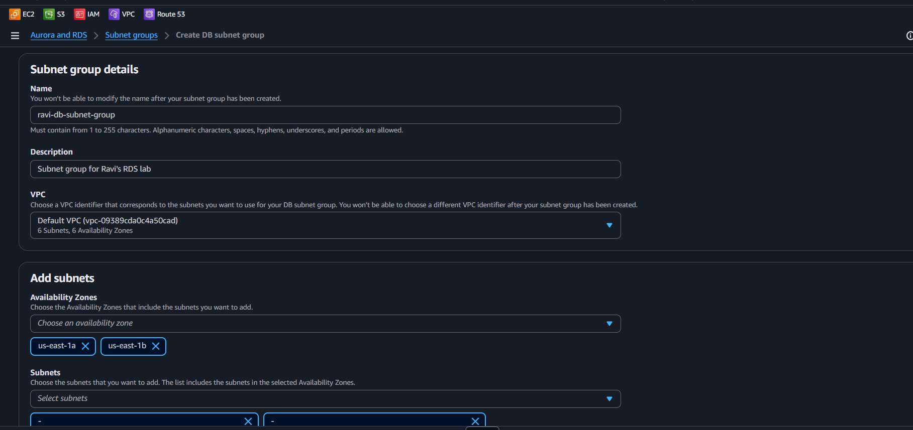
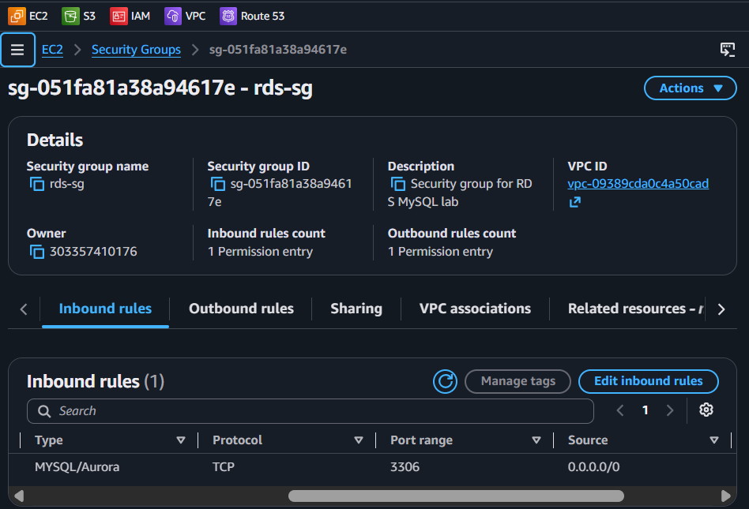
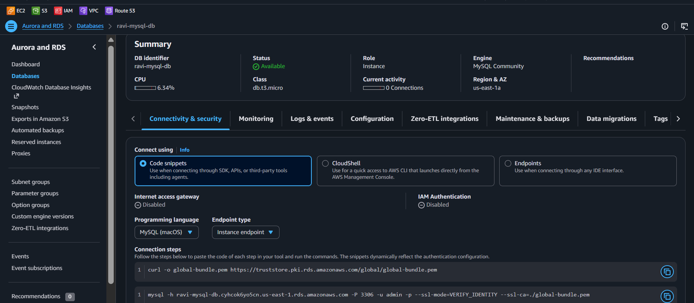
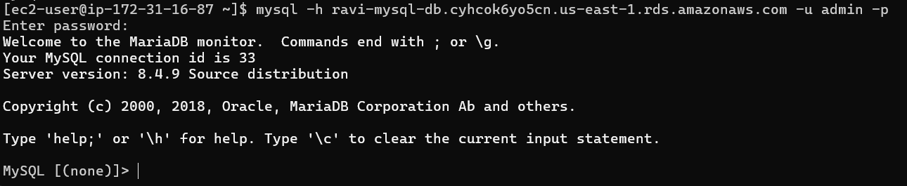
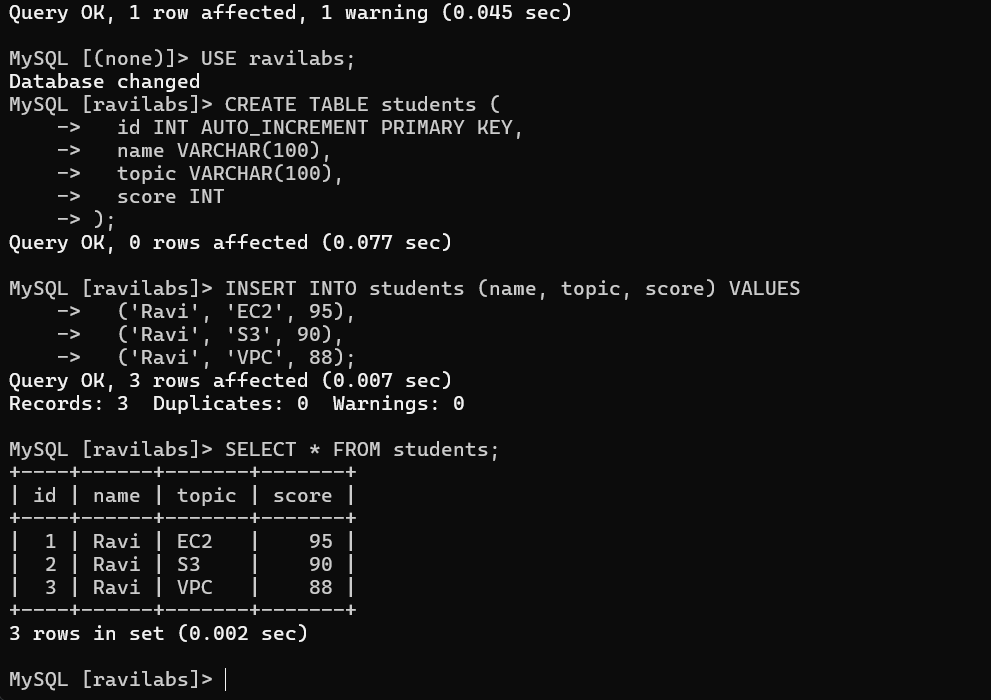
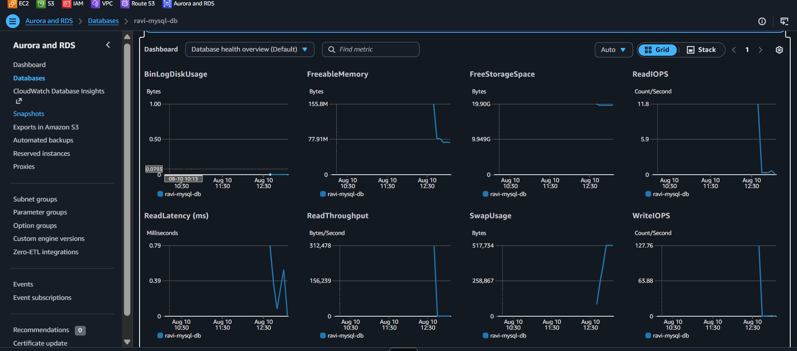

# 🗄️ Lab 13 - RDS: MySQL on AWS

> 📅 **Updated:** 21 August 2026 | ⏱️ **Duration:** ~35 minutes | 📊 **Level:** Beginner+


> ### 🗣️ *"Ravi, installing MySQL on your laptop is like building a shelf from IKEA instructions — possible, but painful. Amazon RDS gives you a fully managed MySQL database in the cloud. No patching, no backing up at 3 AM, no drama. Just pure database joy!"*
> — **Rithu** 😴

<details>
<summary><b>🎭 Ravi & Rithu's Coffee Break Chat</b></summary>

**Ravi:** "Why not just install MySQL on my EC2 instance?"

**Rithu:** "You can! And then YOU patch it, YOU back it up, YOU babysit the backups, YOU handle failover at 3 AM."

**Ravi:** "...that sounds like a lot of YOU."

**Rithu:** "Exactly why RDS exists. AWS does all the boring-but-critical parts. You just write SQL and sleep."

**Ravi:** "Sleep? In this economy?"

**Rithu:** "With RDS? Yes. That's the whole point."

</details>

---

## 🎯 What You'll Master

| Skill | Description |
|-------|-------------|
| 🏘️ **DB Subnet Group** | Tells RDS which AZs it may live in |
| 🛡️ **RDS Security Group** | Locks 3306 to your app servers only |
| 🗄️ **Launch Managed MySQL** | Free Tier db.t3.micro, gp3 storage |
| 🔌 **Connect & Query** | mysql client from EC2 → RDS endpoint |
| 📊 **CloudWatch Metrics** | CPU, connections, storage, IOPS auto-tracked |

> 💡 **Pro Tip:** Running your own database is a full-time job. RDS turns it into a 5-minute setup — that's why nearly every production app on AWS uses it.

---

## 🚦 Before You Start

### ✅ Prerequisites Checklist
- [ ] ✅ **[Lab 12](../12%20-%20Route%2053%20-%20DNS%20and%20Failover/README.md)** complete
- [ ] 🖥️ EC2 instance ready for mysql client (or local machine)
- [ ] 🔑 `first-key-pair` for SSH
- [ ] 🔐 Strong password ready for master user

### 📦 What You Need (and Don't)
| Required | Optional |
|----------|----------|
| ~35 minutes | Coffee while RDS provisions ☕ |
| Default VPC with 2+ AZs | |

---

## 💰 Cost & Safety First

| Resource | Cost |
|----------|------|
| db.t3.micro | ~$0.017/hr (~$12/mo) |
| 20 GB gp3 storage | ~$2.30/mo |
| **Lab total** | **< $3** if cleaned within an hour |

> ⚠️ **CRITICAL:** RDS charges even when **stopped** — storage persists! You MUST **DELETE** the instance after the lab.

> 💸 **Free Tier dual-track:** Legacy accounts (pre-Jul-2025) = 750 hrs/mo db.t3.micro free for 12 months. New accounts (Jul-2025+) = up to $200 credits, 6-month Free Plan window. Storage/backups beyond allowance still cost.

### 🏷️ Naming Convention

| Resource | Name |
|----------|------|
| 🏘️ DB Subnet Group | `ravi-db-subnet-group` |
| 🛡️ Security Group | `rds-sg` |
| 🗄️ RDS Instance | `ravi-mysql-db` |
| 🗃️ Database | `ravilabs` |
| 👤 Master User | `admin` |

---

## 🧠 How It All Fits Together



### 🔑 Key Concepts
| Component | Role |
|-----------|------|
| **DB Subnet Group** | Real estate choice: which AZs/subnets RDS may use |
| **Publicly Accessible** | Lab = Yes (with SG); Production = **No** — private only |
| **Free Tier Template** | db.t3.micro, Multi-AZ off, automated backups off |
| **Managed = No SSH** | You speak SQL only — no OS access |
| **gp3 Storage** | Current default — cheaper & faster than gp2 |

---

## 🪜 Step-by-Step Guide

### 🟢 Step 1: Create DB Subnet Group 🏘️

<details>
<summary><b>🏘️ Expand for DB subnet group</b></summary>

1. RDS Console → **Subnet groups** → ➕ **Create DB subnet group**
2. Configure:

   | Field | Value |
   |-------|-------|
   | Name | `ravi-db-subnet-group` |
   | Description | `Subnet group for Ravi's RDS lab` |
   | VPC | Default VPC |

3. **Add subnets:** select **us-east-1a** AND **us-east-1b** (both!) → ✅ **Create**

</details>



> 🗣️ **Rithu's Tip:** *"Span 2 AZs so RDS can place the DB where it wants. Multi-AZ failover needs this (Free Tier leaves it off, but good practice!)"*

---

### 🟢 Step 2: Create RDS Security Group 🛡️

<details>
<summary><b>🛡️ Expand for RDS SG</b></summary>

1. EC2 Console → **Security Groups** → ➕ **Create security group**
2. Configure:

   | Field | Value |
   |-------|-------|
   | Name | `rds-sg` |
   | Description | `Security group for RDS MySQL lab` |
   | VPC | Default VPC |

3. **Inbound:** MySQL/Aurora (3306) ← `0.0.0.0/0` (lab only!)
4. Outbound: default → ✅ **Create**

</details>



> ⚠️ **Production Reality Check:** Never `0.0.0.0/0` on 3306 in production — lock to app server's SG only!

---

### 🟢 Step 3: Launch the RDS Instance 🗄️

<details>
<summary><b>🗄️ Expand for RDS creation</b></summary>

1. RDS Console → **Databases** → ➕ **Create database**
2. **Standard create** (not Easy create)
3. **Engine:** MySQL · **Version:** 8.4 (LTS) · **Template:** **Free tier** ✅
4. **Settings:**

   | Field | Value |
   |-------|-------|
   | DB identifier | `ravi-mysql-db` |
   | Master username | `admin` |
   | Master password | **Strong! Write it down!** |

5. **Instance config:**

   | Field | Value |
   |-------|-------|
   | Class | **db.t3.micro** |
   | Storage | **gp3** |
   | Allocated | **20 GB** |
   | Autoscaling | ❌ Uncheck |

6. **Connectivity:**

   | Field | Value |
   |-------|-------|
   | VPC | Default VPC |
   | DB subnet group | `ravi-db-subnet-group` |
   | Public access | **Yes** (lab only!) |
   | Security group | `rds-sg` |
   | AZ | Don't specify |

7. **Database options:**

   | Field | Value |
   |-------|-------|
   | Initial DB name | `ravilabs` |
   | Backups | **Disable** (lab) |

8. ✅ **Create database** → wait **5–10 min** ☕

</details>

> 🗣️ **Rithu's Tip:** *"Go grab coffee! RDS is setting up MySQL, networking, SG — the 'managed' part means AWS does the boring stuff."*

---

### 🟢 Step 4: Wait for Available & Grab Endpoint 🔗

<details>
<summary><b>🔗 Expand for endpoint</b></summary>

1. RDS → Databases → click `ravi-mysql-db`
2. Status: **Creating** → **Available** (no "Backing up" stage since disabled)
3. Copy **Endpoint**: `ravi-mysql-db.xxxxxxxxxxxx.us-east-1.rds.amazonaws.com`
4. **Port:** `3306`

</details>



---

### 🟢 Step 5: Connect from EC2 🔌

<details>
<summary><b>🔌 Expand for connection</b></summary>

**Option A (local):** `mysql -h <endpoint> -u admin -p`

**Option B (EC2 — recommended):**

1. SSH into EC2 (t2.micro AL2023):
   ```bash
   ssh -i "first-key-pair.pem" ec2-user@<EC2_IP>
   ```
2. Install MariaDB client (provides `mysql` cmd, compatible with MySQL):
   ```bash
   sudo dnf install -y mariadb105
   ```
3. Connect:
   ```bash
   mysql -h <endpoint> -u admin -p
   ```
4. Enter password → `mysql>` prompt ✅

</details>



> 🗣️ **Rithu's Tip:** *"Amazon Linux 2023: `mysql` pkg unavailable; `mariadb105` is AWS's recommended client. Access denied? Check password. Can't connect? Check SG allows 3306 from your IP/EC2 private IP."*

---

### 🟢 Step 6: Create Tables & Run Queries 📝

<details>
<summary><b>📝 Expand for SQL</b></summary>

```sql
CREATE DATABASE IF NOT EXISTS ravilabs;
USE ravilabs;

CREATE TABLE students (
  id INT AUTO_INCREMENT PRIMARY KEY,
  name VARCHAR(100),
  topic VARCHAR(100),
  score INT
);

INSERT INTO students (name, topic, score) VALUES
  ('Ravi', 'EC2', 95),
  ('Ravi', 'S3', 90),
  ('Ravi', 'VPC', 88);

SELECT * FROM students;
```

Result:
```
+----+------+-------+-------+
| id | name | topic | score |
+----+------+-------+-------+
|  1 | Ravi | EC2   |    95 |
|  2 | Ravi | S3    |    90 |
|  3 | Ravi | VPC   |    88 |
+----+------+-------+-------+
```

**More practice:**
```sql
SELECT COUNT(*) AS total_records FROM students;
SELECT name, topic, MAX(score) AS highest_score FROM students GROUP BY name;
UPDATE students SET score = 98 WHERE topic = 'EC2' AND name = 'Ravi';
SELECT * FROM students WHERE name = 'Ravi';
EXIT;
```

</details>



---

### 🟢 Step 7: View CloudWatch Metrics 📊

<details>
<summary><b>📊 Expand for metrics</b></summary>

1. RDS → Databases → `ravi-mysql-db` → **Monitoring** tab
2. See: CPU Utilization, Database connections, Free storage, Read/Write IOPS
3. **View all CloudWatch metrics** for more detail

</details>



> 🗣️ **Rithu's Tip:** *"Production = alarms on CPU > 80%, free storage < 1 GB. Lab 15 covers that!"*

---

## ✅ Validation Checklist

| # | Check | Status |
|---|-------|--------|
| 1️⃣ | DB Subnet Group spans 2 AZs | ☐ ✅ |
| 2️⃣ | `rds-sg` allows MySQL 3306 inbound | ☐ ✅ |
| 3️⃣ | `ravi-mysql-db` status = **Available** | ☐ ✅ |
| 4️⃣ | Endpoint + port noted | ☐ ✅ |
| 5️⃣ | Connected via mysql client | ☐ ✅ |
| 6️⃣ | `ravilabs` DB + `students` table created | ☐ ✅ |
| 7️⃣ | Data inserted, SELECT works | ☐ ✅ |
| 8️⃣ | CloudWatch metrics visible | ☐ ✅ |

---

## 🧹 Cleanup (Follow Order!)

> ⚠️ **RDS KEEPS CHARGING EVEN WHEN STOPPED. DELETE IT!**

| Step | Action | Console Location |
|------|--------|------------------|
| 1️⃣ 🗑️ | Delete `ravi-mysql-db` (UNCHECK final snapshot) | RDS → Databases |
| 2️⃣ 🏘️ | Delete `ravi-db-subnet-group` | RDS → Subnet groups |
| 3️⃣ 🛡️ | Delete `rds-sg` | EC2 → Security Groups |
| 4️⃣ 🖥️ | Terminate EC2 (if launched for this lab) | EC2 → Instances |

> 🗣️ **Rithu's Tip:** *"Deletion takes 5–10 min. Charges stop immediately after. Double-check RDS console shows no `ravi-mysql-db` and EC2 instances terminated."*

---

## 🚀 Level Ups (Post-Core Lab)

| Challenge | What to Try | Notes |
|-----------|-------------|-------|
| 🔗 **JOINs** | Second table + foreign key + `SELECT ... JOIN` | Real DB engineering |
| 🔄 **Multi-AZ** | Recreate with Multi-AZ = on | HA with standby |
| 🔐 **Secrets Manager** | Store master password in Secrets Manager | No hardcoded creds |

---

## 🆘 Troubleshooting Quick Reference

| 🔍 Issue | 💡 Likely Cause | 🔧 Fix |
|-------|--------------|-----|
| 🔌 "Can't connect" | Status not Available / SG blocks 3306 / public access off | Verify Available, SG allows 3306 from your IP, Public=Yes |
| 🔐 "Access denied" | Wrong password / wrong user | Check password (case-sensitive!); user = `admin` |
| ⏳ Stuck "Creating" >15 min | Events tab errors / VPC lacks 2 AZs / quota | Check Events; ensure default VPC has 2+ AZ subnets |
| 🔒 "Public access" greyed out | Subnet group only has private subnets | Add public subnets to DB subnet group |
| 💾 Storage filling | RDS doesn't auto-delete data | Manage manually; enable autoscaling with max in prod |

---

## 🎮 Test Yourself! (No Peeking 👀)

**Q1:** What does a DB Subnet Group actually control?

<details><summary>👀 Show answer</summary>

**A:** **Which Availability Zones** your database may be placed in (and which subnets it uses). Multi-AZ DBs survive single-AZ outages. 🏘️

</details>

**Q2:** Which port does MySQL listen on, and where should you open it?

<details><summary>👀 Show answer</summary>

**A:** **3306** — open only to your app server's security group (or My IP for lab), never to the world. 🔑

</details>

**Q3:** Why pay for RDS instead of self-managed MySQL on EC2?

<details><summary>👀 Show answer</summary>

**A:** AWS handles **patching, backups, monitoring, failover** automatically. No 3 AM backup alarms, no manual upgrades. Worth every penny. 💰

</details>

> 💪 **Rithu:** *"A database is only as good as the queries you can write. Go JOIN something."*

---

## 📚 Official Documentation

- 🗄️ [Amazon RDS User Guide](https://docs.aws.amazon.com/AmazonRDS/latest/UserGuide/Welcome.html)
- 📋 [Creating a MySQL DB Instance](https://docs.aws.amazon.com/AmazonRDS/latest/UserGuide/CHAP_MySQL.html)
- 🔌 [Connecting to a DB Instance](https://docs.aws.amazon.com/AmazonRDS/latest/UserGuide/USER_ConnectToInstance.html)

---

## 🎓 What You Learned

> **The managed DB admin's checklist:**
> - 🏘️ **DB Subnet Group** → AZs where DB may live
> - 🛡️ **SG** → 3306 locked to app servers only
> - 🗄️ **RDS** → managed MySQL, no SSH, just SQL
> - 🔌 **Endpoint** → host:port for mysql client
> - 💸 **Delete it** → charges persist even when stopped

**Golden Habit:** Subnet group (2 AZs) → SG (least privilege) → Free Tier template → connect → query → **DELETE**. 🧹

| | Approach |
|---|---|
| 👶 **Noob Way** | SG 3306 open to world "so I can connect from anywhere" |
| 🧙 **Pro Way** | Lock 3306 to app server's SG only. Databases are the crown jewels |

---

## ➡️ What's Next?

Relational DB mastered. Next: AWS's serverless NoSQL — DynamoDB with automatic scaling and generous Free Tier. ⚡

🎯 **[Lab 14 - DynamoDB: CRUD Operations](../14%20-%20DynamoDB%20-%20CRUD%20Operations/README.md)**

---

<div align="center">

### ⭐ Enjoyed this lab? Star the repo & share your feedback!

**Happy Learning!** 🚀☁️

</div>