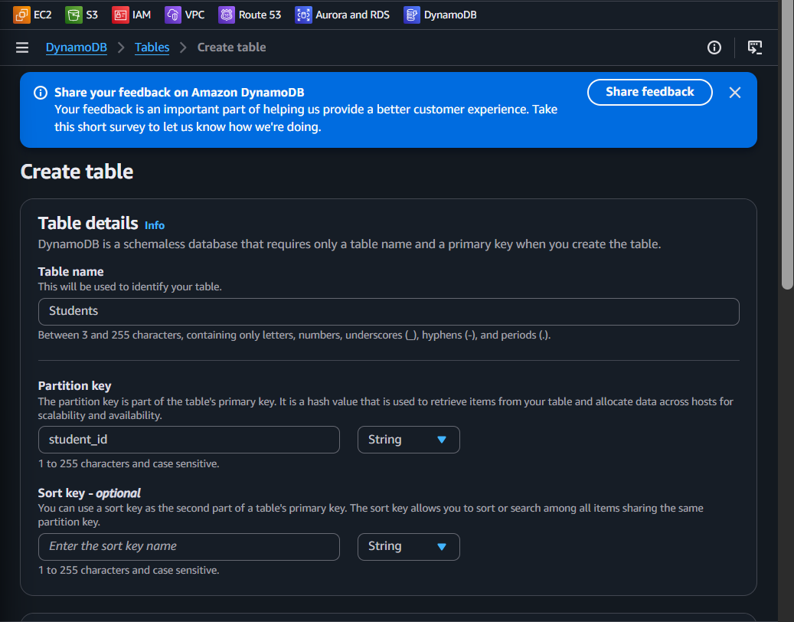
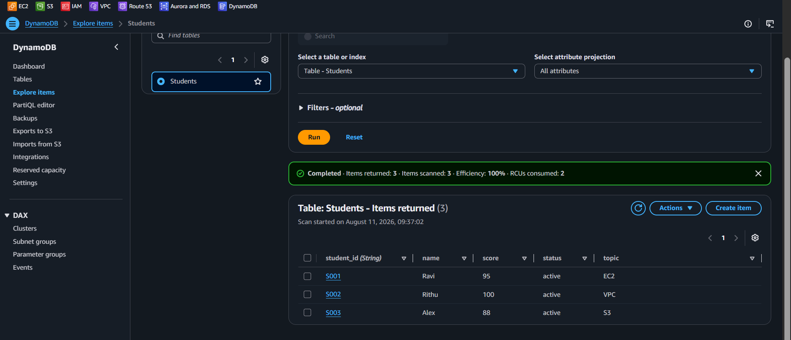
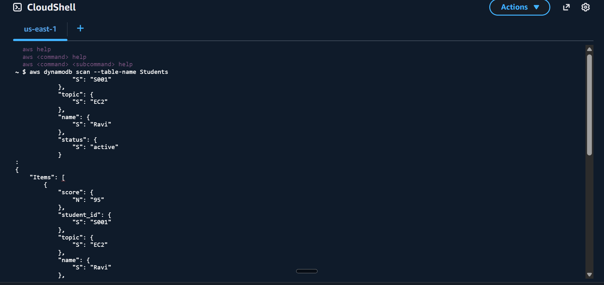
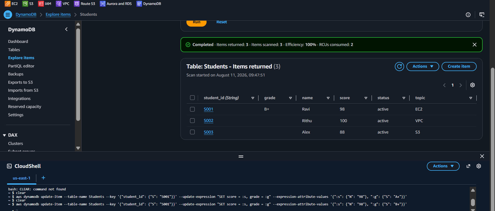
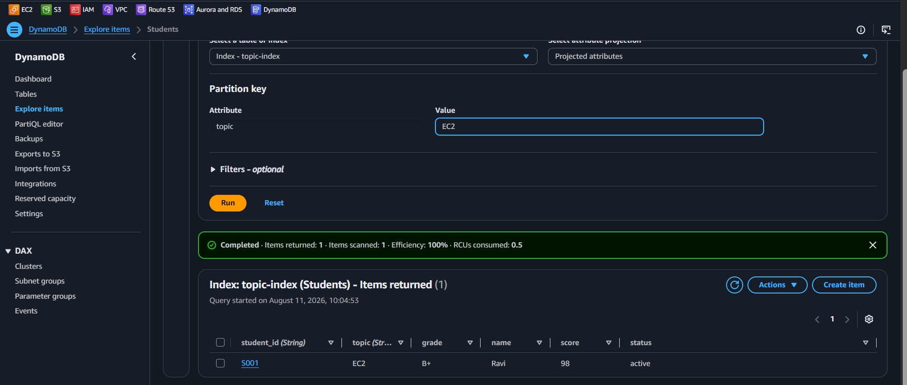
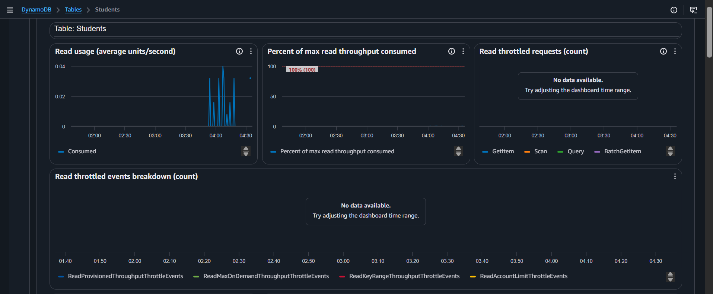

<div align="center">


# Lab 14 — DynamoDB: CRUD Operations — NoSQL Made Simple


</div>

> "Ravi, if RDS is like a filing cabinet with strict rules, DynamoDB is like a magical backpack that holds anything you throw in it. No schemas, no SQL, just raw key-value power. And the Free Tier? Chef's kiss!" — Rithu

---

<details>
<summary><b>🎭 Ravi & Rithu's Coffee Break Chat</b></summary>

**Ravi:** "So DynamoDB is just a fancy dictionary?"

**Rithu:** "A dictionary that lives on thousands of servers, answers in milliseconds, and never needs a schema. Close enough!"

**Ravi:** "What if two items have totally different fields?"

**Rithu:** "No problem. In DynamoDB every item is its own little snowflake — it doesn't have to match its neighbors."

**Ravi:** "NoSQL sounds scary though."

**Rithu:** "NoSQL just means 'no strict table rules.' Think magical backpack instead of rigid filing cabinet. 🎒"

</details>

---

## 📋 Table of Contents

- [🎯 Objective](#-objective)
- [📊 Lab Progress](#-lab-progress)
- [🤔 In Plain English](#-in-plain-english)
- [🧠 Prerequisites](#-prerequisites)
- [💰 Cost Warning](#-cost-warning)
- [🏗️ Architecture](#️-architecture)
- [🛠️ Step-by-Step Instructions](#️-step-by-step-instructions)
- [✅ Validation Checklist](#-validation-checklist)
- [🧹 Cleanup (IMPORTANT!)](#-cleanup-important)
- [🧠 Memory Tips](#-memory-tips)
- [🎓 What You Learned](#-what-you-learned)
- [🎮 Test Yourself](#-test-yourself-no-peeking-)
- [🆚 Pro Tip vs Noob Tip](#-pro-tip-vs-noob-tip)
- [🔗 What's Next?](#-whats-next)
- [❓ Troubleshooting](#-troubleshooting)

---

<div align="center">

## 📊 Lab Progress

`[██░░░░░░░░░░░░░░░░░░] 5% — Let's Begin!`

</div>

---

## 🤔 In Plain English

> **What is this, really?** DynamoDB is a **fully managed NoSQL database** — think a giant key-value dictionary with millisecond reads. No schema to design, no servers to manage, and every item can have different fields (like a magical backpack that fits anything). You give it a key, it gives you the value. Instantly. 🎒
>
> 🌍 **Why you should care:** When RDS (SQL) gets too rigid or slow at massive scale, companies switch to DynamoDB. It powers things like gaming leaderboards, shopping carts, and IoT data — at any scale.

---

## 🎯 Objective

In this lab, you will:

- Create a **DynamoDB table** with a simple primary key
- Perform all four **CRUD operations**: Create, Read, Update, Delete
- Use both the **AWS Console** and **AWS CLI** to interact with DynamoDB
- Create a **Global Secondary Index (GSI)** to query data differently
- Explore **CloudWatch metrics** for your table
- Understand when to choose DynamoDB over RDS

---

## 🧠 Prerequisites

Before you start, make sure you have:

- ✅ Completed **Lab 13** (RDS)
- ✅ An AWS account with DynamoDB access
- ✅ AWS CLI configured (for CLI commands)
- ✅ Basic understanding of what NoSQL means (don't worry, we'll explain!)

---

## 💰 Cost Warning

| Resource | Cost |
|----------|------|
| DynamoDB Storage (25 GB) | Free Tier |
| Write Capacity Units (25 WCU) | Free Tier |
| Read Capacity Units (25 RCU) | Free Tier |
| **Estimated total** | **$0 — completely free!** |

> 🎉 **Rithu says:** DynamoDB has one of the most generous Free Tier offerings in all of AWS! 25 GB of storage, 25 write capacity units, and 25 read capacity units — all free forever (not just 12 months). You'd have to be a heavy user to exceed this. 😄

> ⚠️ **Note:** **On-demand** (pay-per-request) is AWS's recommended mode for modern apps, but it isn't covered by the Free Tier. We'll use **Provisioned** (default settings) to stay free — on-demand would still cost fractions of a cent at this scale.

---

## 🏗️ Architecture

```
        ┌──────────────────────────────────────────┐
        │              DynamoDB Table               │
        │              "Students"                   │
        │                                           │
        │  Partition Key: student_id (String)        │
        │                                           │
        │  ┌─────────┬──────────┬────────┬───────┐  │
        │  │student_id│  name    │ topic  │ score │  │
        │  ├─────────┼──────────┼────────┼───────┤  │
        │  │  S001   │  Ravi    │  EC2   │  95   │  │
        │  │  S002   │  Rithu   │  VPC   │ 100   │  │
        │  │  S003   │  Alex    │  S3    │  88   │  │
        │  └─────────┴──────────┴────────┴───────┘  │
        │                                           │
        │  GSI: topic-index (query by topic)         │
        └──────────────────────────────────────────┘
```

---

## 🛠️ Step-by-Step Instructions

> 

1. Go to the **DynamoDB Console** → left sidebar → click **Tables**
2. Click **Create table**
3. Configure:

| Field | Value |
|-------|-------|
| Table name | `Students` |
| Partition key | `student_id` |
| Partition key type | **String** |
| Settings | **Use default settings** ✅ |

> 
> In DynamoDB, the partition key is like the primary key in SQL — it uniquely identifies each item. Unlike SQL though, DynamoDB doesn't enforce a schema, so each item can have different attributes!

4. Click **Create table**
5. Wait for the table status to change from **Creating** to **Active** ⏱️ (about 30 seconds)

📸 **[Screenshot: DynamoDB table creation page with Students table name and student_id partition key]**


> 
> "Default settings" uses **Provisioned** capacity with 5 RCU and 5 WCU — well inside the Free Tier (up to 5 reads and 5 writes per second). Plenty for this lab!

---

> 

Let's add some data! We'll use both the Console and CLI.

**Method A: Using the AWS Console**

1. In the **Students** table, click **Explore table items**
2. Click **Create item**
3. You'll see a form. The `student_id` field is already there (it's the partition key)
4. Fill in:

| Field | Value |
|-------|-------|
| student_id | `S001` |
| name | `Ravi` |
| topic | `EC2` |
| score | `95` |
| status | `active` |

5. To add each attribute, click the **Add new attribute** dropdown and select the type (String, Number, etc.)
6. Click **Create item**

7. Create a second item:

| Field | Value |
|-------|-------|
| student_id | `S002` |
| name | `Rithu` |
| topic | `VPC` |
| score | `100` |
| status | `active` |

8. Click **Create item**

**Method B: Using the AWS CLI**

Open your terminal and run:

```bash
aws dynamodb put-item \
  --table-name Students \
  --item '{"student_id": {"S": "S003"}, "name": {"S": "Alex"}, "topic": {"S": "S3"}, "score": {"N": "88"}, "status": {"S": "active"}}'
```

> 
> Notice the CLI syntax! Each value needs a type descriptor: `"S"` for String, `"N"` for Number. DynamoDB is very strict about types — `"95"` (string) is different from `95` (number). This trips up beginners a lot!

---

> 

Let's read back what we just inserted!

**Method A: Using the AWS Console**

1. Go to **Students** table → **Explore table items**
2. You should see all 3 items listed
3. To query by partition key:
   - Click **Run** in the query section
   - In the **Partition key** field, enter the value `S001` (the console fills in `student_id` as the key name for you)
   - You'll see only Ravi's record

📸 **[Screenshot: DynamoDB table showing all 3 items]**


**Method B: Using the AWS CLI**

**Scan the entire table:**

```bash
aws dynamodb scan --table-name Students
```

You'll see all items in JSON format:

```json
{
    "Items": [
        {"student_id": {"S": "S001"}, "name": {"S": "Ravi"}, "topic": {"S": "EC2"}, "score": {"N": "95"}, "status": {"S": "active"}},
        {"student_id": {"S": "S002"}, "name": {"S": "Rithu"}, "topic": {"S": "VPC"}, "score": {"N": "100"}, "status": {"S": "active"}},
        {"student_id": {"S": "S003"}, "name": {"S": "Alex"}, "topic": {"S": "S3"}, "score": {"N": "88"}, "status": {"S": "active"}}
    ],
    "Count": 3,
    "ScannedCount": 3
} 
```
📸 **[Screenshot: CLI scan output showing all items]**


**Query a specific item:**

```bash
aws dynamodb query \
  --table-name Students \
  --key-condition-expression "student_id = :id" \
  --expression-attribute-values '{":id": {"S": "S001"}}'
```

You'll get only Ravi's record:

```json
{
    "Items": [
        {"student_id": {"S": "S001"}, "name": {"S": "Ravi"}, "topic": {"S": "EC2"}, "score": {"N": "95"}, "status": {"S": "active"}}
    ],
    "Count": 1,
    "ScannedCount": 1
}
```

**Fetch one item directly (get-item):**

```bash
aws dynamodb get-item --table-name Students --key '{"student_id": {"S": "S001"}}'
```

> 
> **Query vs Scan** — Query uses the partition key to find only what you need (fast, cheap). Scan reads EVERY item — slow and expensive at scale. Always prefer Query! Add `--projection-expression "name, score"` to return only the attributes you need.

---

> 

Let's update Ravi's score and add a new attribute!

**Method A: Using the AWS Console**

1. Go to **Students** → **Explore table items**
2. Find the item with `student_id = "S001"`
3. Click on the item to open it
4. Change `score` from `95` to `98`
5. Click **Add new attribute** → String → add `grade` = `A+`
6. Click **Save changes**

**Method B: Using the AWS CLI**

```bash
aws dynamodb update-item \
  --table-name Students \
  --key '{"student_id": {"S": "S001"}}' \
  --update-expression "SET score = :s, grade = :g" \
  --expression-attribute-values '{":s": {"N": "98"}, ":g": {"S": "A+"}}'
```

Verify the update:

```bash
aws dynamodb query \
  --table-name Students \
  --key-condition-expression "student_id = :id" \
  --expression-attribute-values '{":id": {"S": "S001"}}'
```

You should now see the updated score and the new `grade` attribute:

```json
{
    "Items": [
        {"student_id": {"S": "S001"}, "name": {"S": "Ravi"}, "topic": {"S": "EC2"}, "score": {"N": "98"}, "status": {"S": "active"}, "grade": {"S": "A+"}}
    ],
    "Count": 1,
    "ScannedCount": 1
}
```

> 
> Notice that the `grade` attribute didn't exist before, but we just added it with an update! In SQL, you'd need to ALTER TABLE first. In DynamoDB, each item can have completely different attributes. This is the beauty (and danger) of NoSQL! 🎨

📸 **[Screenshot: Terminal showing the update-item command and the updated query result]**


---

> 

Let's remove Alex (S003) from the table.

**Method A: Using the AWS Console**

1. Go to **Students** → **Explore table items**
2. Find the item with `student_id = "S003"`
3. Select the checkbox next to it
4. Click **Delete item**
5. Confirm deletion

**Method B: Using the AWS CLI**

```bash
aws dynamodb delete-item \
  --table-name Students \
  --key '{"student_id": {"S": "S003"}}'
```

Verify the deletion:

```bash
aws dynamodb scan --table-name Students
```

You should now see only **2 items**:

```json
{
    "Items": [
        {"student_id": {"S": "S001"}, "name": {"S": "Ravi"}, ...},
        {"student_id": {"S": "S002"}, "name": {"S": "Rithu"}, ...}
    ],
    "Count": 2,
    "ScannedCount": 2
}
```

📸 **[Screenshot: DynamoDB table showing only 2 items after deletion]**

---

> 

Let's add a **Global Secondary Index (GSI)** to query by `topic`!

**Create a GSI:**

1. Go to **Students** table → **Overview** tab → scroll to the **Indexes** section
2. Click **Create index**
3. Configure:

| Field | Value |
|-------|-------|
| Partition key | `topic` |
| Partition key type | String |
| Index name | `topic-index` |
| Projection | All attributes |
| Capacity | Default settings |

4. Click **Create index**
5. Wait for it to become **Active** ⏱️


**Query using the GSI:**

In the console:
1. Go to **Students** → **Explore table items**
2. Switch from Scan to **Query** and select index `topic-index`
3. For **Partition key**, enter `EC2` (the console fills in `topic` from the index)
4. Click **Run** — you'll see only Ravi's EC2 record!

📸 **[Screenshot: Console query against the topic-index GSI]**


Via CLI:

```bash
aws dynamodb query \
  --table-name Students \
  --index-name topic-index \
  --key-condition-expression "topic = :t" \
  --expression-attribute-values '{":t": {"S": "EC2"}}'
```

> 
> GSIs are like having multiple "views" of your data. Without a GSI, you can only query by partition key (`student_id`). With a GSI on `topic`, you can efficiently query by topic too. Think of it as creating a shortcut to your data! 🗺️

**Try TTL (free auto-delete):**

1. Go to **Students** → **Additional settings** → **Time to Live (TTL)** → enable it on an attribute like `expires_at` (unix epoch in seconds)
2. Expired items are deleted automatically, usually within ~48 hours — no code, no cost

**View CloudWatch Metrics:**

1. Go to **DynamoDB** → **Tables** → `Students`
2. Click the **Metrics** tab
3. You'll see:
   - Read/Write Capacity Units consumed
   - Throttled requests (should be 0)
   - Storage size

> 💡 **Contributor Insights** (which attributes are "hot") is a paid add-on — skip it for this lab.

📸 **[Screenshot: DynamoDB CloudWatch metrics showing read/write capacity]**


---

> 

- [ ] DynamoDB table `Students` is active
- [ ] Table has correct partition key: `student_id` (String)
- [ ] 3 items were created (S001, S002, S003)
- [ ] S001 was updated: score changed to 98, grade attribute added
- [ ] S003 was deleted — only 2 items remain
- [ ] GSI `topic-index` exists and is active
- [ ] Query on `topic-index` returns correct results
- [ ] CloudWatch metrics show activity on the table

📸 **[Screenshot: Final table state with 2 items and the GSI visible]**

---

## ✅ Validation Checklist

- [ ] Students table created with `student_id` as partition key ✅
- [ ] 3 items successfully inserted (Console and CLI) ✅
- [ ] Query by partition key returns correct item ✅
- [ ] Scan returns all items ✅
- [ ] Update modifies existing item and adds new attribute ✅
- [ ] Delete removes the correct item ✅
- [ ] GSI on `topic` attribute created and queryable ✅
- [ ] CloudWatch metrics visible ✅

---

## 🧹 Cleanup (IMPORTANT!)

DynamoDB's Free Tier is generous, but let's clean up anyway!

1. 🗑️ **Delete the Table:**
   - Go to **DynamoDB Console** → **Tables**
   - Select `Students`
   - Click **Delete**
   - Type `delete` to confirm
   - Click **Delete table**

2. 🧹 Wait for the table to disappear from the list

> 
> Unlike RDS, DynamoDB doesn't charge you for empty tables — but it's still good practice to clean up so the Free Tier capacity stays available for future labs.

📸 **[Screenshot: DynamoDB console with no tables listed]**

---

## 🧠 Memory Tips

Stick these in your brain and they'll never leave. 🧲

| 🧠 Memory Hook | Remember it like... |
|---|---|
| **Partition key = index tab** | How DynamoDB decides *where* an item lives — the tab in your filing cabinet. 🗂️ |
| **Query vs Scan** | **Query** = uses the index (fast, cheap, precise). **Scan** = reads EVERY item (slow, expensive). Always prefer Query! 🎯 |
| **GSI = extra index tab** | Want to look things up by a different field? Build a **Global Secondary Index**. More tabs, more ways to find stuff. 🔖 |
| **Items are snowflakes** | No two items need the same attributes. Schema-free freedom! ❄️ |
| **Free Tier = 25 GB + 25 WCU/RCU** | Generous forever-free allowance. Chef's kiss indeed. 😘 |

> 🗣️ **Rithu:** *"If you Scan a million-item table 'because it's easier', your bill and your latency will both cry. Query or go home."

---

## 🎓 What You Learned

| Concept | What You Now Know |
|---------|-------------------|
| **DynamoDB Basics** | A fully managed NoSQL key-value and document database |
| **Partition Keys** | How DynamoDB organizes data for fast lookups |
| **CRUD Operations** | Create, Read, Update, Delete items in DynamoDB |
| **Console vs CLI** | How to interact with DynamoDB using both methods |
| **Item Flexibility** | Items in DynamoDB don't need to have the same attributes |
| **GSIs** | How to create secondary indexes for querying on non-key attributes |
| **Query vs Scan** | Query is efficient (uses indexes), Scan reads everything (expensive) |
| **Free Tier** | DynamoDB's generous free tier: 25 GB, 25 WCU, 25 RCU |

---

## 🎮 Test Yourself! (No Peeking 👀)

**Q1:** Which is more efficient: a Query or a Scan?

<details><summary>👀 Show answer</summary>

**A:** **Query** — it uses an index to find only the matching items. A **Scan** reads every item in the table, which is slow and expensive at scale. 🎯

</details>

**Q2:** What is a Global Secondary Index (GSI) for?

<details><summary>👀 Show answer</summary>

**A:** It lets you **query on a different attribute** than the main partition key — an extra index tab for a different way of looking things up. 🔖

</details>

**Q3:** Do all items in a DynamoDB table need to have the same attributes?

<details><summary>👀 Show answer</summary>

**A:** **No!** Items are schema-free — each one can have different fields. That's the NoSQL flexibility superpower. ❄️

</details>

### 🔥 Bonus Challenge

Create a **GSI** on a non-key attribute (like a `status` field), insert items with different statuses, then run a **Query against the GSI**. You've just designed a fast lookup path that didn't exist before — exactly how real apps scale their search patterns. 🔍

> 💪 **Rithu:** *"If you can explain when to use DynamoDB vs RDS in an interview, you're already better than half the candidates."

---

### 🆚 Pro Tip vs Noob Tip

| | Approach |
|---|---|
| **Noob Tip** | Scan the whole table because "it's a small test anyway" — wait until it's 10M items |
| **Pro Tip** | Design your keys and GSIs upfront, and always Query what you need |

---

## 🔗 What's Next?

You've covered compute, networking, DNS, and databases. Now let's learn how to monitor everything:

➡️ **Lab 15 — CloudWatch: Alarms and Dashboards** — Learn how to create alarms that notify you when things go wrong, and dashboards that give you a bird's eye view of your entire infrastructure!

---

## ❓ Troubleshooting

<details>
<summary><strong>🔍 ResourceNotFoundException: Requested table not found</strong></summary>

- 🔍 Make sure you're in the correct AWS region (check the URL — it should end with `us-east-1` or wherever you created the table)
- 🔍 Verify the table name is exactly `Students` (case-sensitive!)
- ⏱️ Wait a few seconds after creation — tables take a moment to become active

</details>

<details>
<summary><strong>🔍 ProvisionedThroughputExceededException</strong></summary>

- 🔍 You've exceeded the read or write capacity
- 💡 For this lab, you shouldn't hit this with 5 WCU/5 RCU
- ⏱️ If you see this, wait a few seconds and retry
- 🔧 Solution: Use the default provisioned capacity or switch to On-Demand mode

</details>

<details>
<summary><strong>🔍 ValidationException: The provided key element does not match the schema</strong></summary>

- 🔍 DynamoDB requires ALL key attributes in every operation
- 🔍 For put-item, query, and delete, you must provide `student_id`
- 🔧 Check the type — `"S"` for String, `"N"` for Number

</details>

<details>
<summary><strong>🔍 CLI command returns "Unknown option"</strong></summary>

- 🔍 Make sure JSON values are properly quoted
- 🔍 Use single quotes around the entire JSON on Linux/Mac
- 💡 On Windows PowerShell, use double quotes and escape inner quotes: `\"` 
- 🔧 Or save the JSON to a file and use `--cli-input-json file://params.json`

</details>

<details>
<summary><strong>🔍 GSI query returns empty results</strong></summary>

- 🔍 Make sure the GSI is **Active** (not "Updating")
- 🔍 Verify you're querying with the correct attribute name and type
- 🔍 Check that the items actually have the `topic` attribute

</details>

<details>
<summary><strong>🔍 Items have different attributes — is that okay?</strong></summary>

- ✅ Yes! That's the beauty of DynamoDB — each item can have different attributes
- 💡 Unlike SQL tables where every row must have the same columns
- 🎉 This flexibility is why DynamoDB is great for applications with evolving data models

</details>

---

<div align="center">


> 🎉 **Fantastic work, Ravi!** You've conquered both relational (RDS) and non-relational (DynamoDB) databases. You now have a solid understanding of when to use each. DynamoDB's simplicity and power make it a favorite for serverless applications. Next up, let's learn how to keep an eye on everything with CloudWatch! 🚀

</div>

