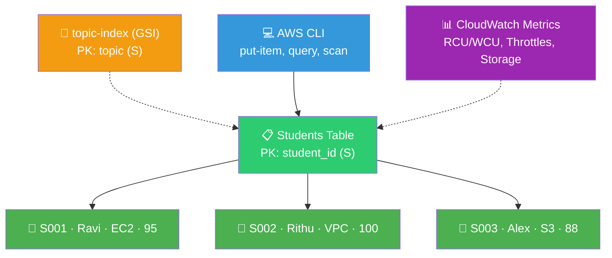

# ⚡ Lab 14 - DynamoDB: CRUD Operations

> 📅 **Updated:** 21 August 2026 | ⏱️ **Duration:** ~25 minutes | 📊 **Level:** Beginner


> ### 🗣️ *"Ravi, if RDS is like a filing cabinet with strict rules, DynamoDB is like a magical backpack that holds anything you throw in it. No schemas, no SQL, just raw key-value power. And the Free Tier? Chef's kiss!"*
> — **Rithu** 🎒

<details>
<summary><b>🎭 Ravi & Rithu's Coffee Break Chat</b></summary>

**Ravi:** "So DynamoDB is just a fancy dictionary?"

**Rithu:** "A dictionary that lives on thousands of servers, answers in milliseconds, and never needs a schema. Close enough!"

**Ravi:** "What if two items have totally different fields?"

**Rithu:** "No problem. In DynamoDB every item is its own little snowflake — it doesn't have to match its neighbors."

**Ravi:** "NoSQL sounds scary though."

**Rithu:** "NoSQL just means 'no strict table rules.' Think magical backpack instead of rigid filing cabinet."

</details>

---

## 🎯 What You'll Master

| Skill | Description |
|-------|-------------|
| 📋 **Create Table** | Partition key `student_id` (String) |
| 📝 **CRUD** | Create, Read, Update, Delete via Console + CLI |
| 🔖 **GSI** | Query by `topic` with Global Secondary Index |
| 🎯 **Query vs Scan** | Index = fast/cheap, Scan = slow/expensive |
| 💰 **Free Tier** | 25 GB + 25 WCU/RCU — forever free! |

> 💡 **Pro Tip:** When RDS gets too rigid or slow at massive scale, companies switch to DynamoDB. It powers gaming leaderboards, shopping carts, IoT — at any scale.

---

## 🚦 Before You Start

### ✅ Prerequisites Checklist
- [ ] ✅ **[Lab 13](../13%20-%20RDS%20-%20MySQL%20on%20AWS/README.md)** complete
- [ ] 🔧 AWS CLI configured (`aws configure`)
- [ ] 🧠 NoSQL = "no strict table rules" mindset

### 📦 What You Need (and Don't)
| Required | Optional |
|----------|----------|
| ~25 minutes | CloudWatch curiosity |
| AWS Console + CLI | |

---

## 💰 Cost & Safety First

| Resource | Cost |
|----------|------|
| Storage (25 GB) | ✅ Free Tier |
| Write Capacity (25 WCU) | ✅ Free Tier |
| Read Capacity (25 RCU) | ✅ Free Tier |
| **Lab total** | **$0 — completely free!** |

> 🎉 **Rithu says:** DynamoDB has one of the most generous Free Tier offerings in AWS — 25 GB, 25 WCU, 25 RCU **forever free** (not just 12 months).

> ⚠️ **Provisioned** (default) = Free Tier. **On-demand** (pay-per-request) = not Free Tier, but pennies at lab scale.

---

## 🧠 How It All Fits Together



### 🔑 Key Concepts
| Component | Role |
|-----------|------|
| **Partition Key** | The "index tab" — decides where item lives; uniquely identifies each |
| **Provisioned** | 5 RCU / 5 WCU default — inside Free Tier |
| **Item = Snowflake** | No schema — each item can have different attributes |
| **Query** | Uses index (PK or GSI) — fast, cheap, precise |
| **Scan** | Reads EVERY item — slow, expensive at scale |
| **GSI** | Extra index tab for a different lookup pattern |
| **Free Tier** | 25 GB storage + 25 WCU + 25 RCU — forever |

---

## 🪜 Step-by-Step Guide

### 🟢 Step 1: Create the Table 📋

<details>
<summary><b>📋 Expand for table creation</b></summary>

1. DynamoDB Console → **Tables** → ➕ **Create table**
2. Configure:

   | Field | Value |
   |-------|-------|
   | Table name | `Students` |
   | Partition key | `student_id` |
   | Type | **String** |
   | Settings | **Use default settings** ✅ |

3. ✅ **Create table** → wait for **Active** (~30s)

</details>


> 🗣️ **Rithu's Tip:** *"Partition key = primary key in SQL. But unlike SQL, no schema enforced — each item can have different attributes! Default = Provisioned 5 RCU/5 WCU (Free Tier)."*

---

### 🟢 Step 2: CREATE — Add Items 📝

<details>
<summary><b>📝 Expand for Create (Console + CLI)</b></summary>

**Console:**
1. `Students` → **Explore table items** → **Create item**
2. Add attributes:

   | Field | Value |
   |-------|-------|
   | student_id (S) | `S001` |
   | name (S) | `Ravi` |
   | topic (S) | `EC2` |
   | score (N) | `95` |
   | status (S) | `active` |

3. **Create item** → repeat for `S002` (Rithu, VPC, 100) and `S003` (Alex, S3, 88)

**CLI:**
```bash
aws dynamodb put-item \
  --table-name Students \
  --item '{"student_id": {"S": "S003"}, "name": {"S": "Alex"}, "topic": {"S": "S3"}, "score": {"N": "88"}, "status": {"S": "active"}}'
```

> 🗣️ **Rithu's Tip:** *"CLI needs type descriptors: `S`=String, `N`=Number. `"95"` (string) ≠ `95` (number) — trips up beginners!"*

</details>

---

### 🟢 Step 3: READ — Query & Scan 🔍

<details>
<summary><b>🔍 Expand for Read (Console + CLI)</b></summary>

**Console:** `Explore table items` → see all 3 → **Query** → Partition key `student_id` = `S001`

**CLI — Scan (all items):**
```bash
aws dynamodb scan --table-name Students
```

**CLI — Query (one item by PK):**
```bash
aws dynamodb query \
  --table-name Students \
  --key-condition-expression "student_id = :id" \
  --expression-attribute-values '{":id": {"S": "S001"}}'
```

**CLI — GetItem (single item):**
```bash
aws dynamodb get-item --table-name Students --key '{"student_id": {"S": "S001"}}'
```

</details>


> 🗣️ **Rithu's Tip:** *"Query uses index (fast, cheap). Scan reads everything (slow, expensive). Always prefer Query! Add `--projection-expression "name, score"` to return only needed attributes."*

---

### 🟢 Step 4: UPDATE — Modify & Add Attributes ✏️

<details>
<summary><b>✏️ Expand for Update</b></summary>

**Console:** Open `S001` → change `score` to `98` → **Add new attribute** → `grade` (S) = `A+` → **Save**

**CLI:**
```bash
aws dynamodb update-item \
  --table-name Students \
  --key '{"student_id": {"S": "S001"}}' \
  --update-expression "SET score = :s, grade = :g" \
  --expression-attribute-values '{":s": {"N": "98"}, ":g": {"S": "A+"}}'
```

Verify:
```bash
aws dynamodb query --table-name Students --key-condition-expression "student_id = :id" --expression-attribute-values '{":id": {"S": "S001"}}'
```

</details>


> 🗣️ **Rithu's Tip:** *"`grade` didn't exist before — we just added it! In SQL you'd ALTER TABLE first. In DynamoDB, items are schema-free snowflakes ❄️."*

---

### 🟢 Step 5: DELETE — Remove an Item 🗑️

<details>
<summary><b>🗑️ Expand for Delete</b></summary>

**Console:** Select `S003` → **Delete item** → Confirm

**CLI:**
```bash
aws dynamodb delete-item --table-name Students --key '{"student_id": {"S": "S003"}}'
```

Verify:
```bash
aws dynamodb scan --table-name Students   # only 2 items remain
```

</details>

---

### 🟢 Step 6: GSI — Query by Topic 🔖

<details>
<summary><b>🔖 Expand for GSI</b></summary>

1. `Students` → **Overview** → **Indexes** → **Create index**
2. Configure:

   | Field | Value |
   |-------|-------|
   | Partition key | `topic` |
   | Type | String |
   | Index name | `topic-index` |
   | Projection | All attributes |
   | Capacity | Default |

3. ✅ **Create index** → wait **Active**
4. **Query by topic:** Console → **Query** → select `topic-index` → `topic` = `EC2`

**CLI:**
```bash
aws dynamodb query \
  --table-name Students \
  --index-name topic-index \
  --key-condition-expression "topic = :t" \
  --expression-attribute-values '{":t": {"S": "EC2"}}'
```

</details>


> 🗣️ **Rithu's Tip:** *"GSI = extra index tab for a different lookup pattern. Without it, you can only query by `student_id`. With it, query by `topic` efficiently!"*

---

### 🟢 Step 7: TTL & CloudWatch Metrics ⏱️📊

<details>
<summary><b>⏱️📊 Expand for TTL + Metrics</b></summary>

**TTL (free auto-delete):**
1. `Students` → **Additional settings** → **Time to Live** → enable on `expires_at` (epoch seconds)
2. Expired items auto-deleted within ~48h — no code, no cost

**CloudWatch Metrics:**
1. `Students` → **Metrics** tab → Read/Write Capacity, Throttles, Storage

</details>


---

## ✅ Validation Checklist

| # | Check | Status |
|---|-------|--------|
| 1️⃣ | Table `Students` active, PK `student_id` (String) | ☐ ✅ |
| 2️⃣ | 3 items created (S001, S002, S003) | ☐ ✅ |
| 3️⃣ | Query by PK returns correct item | ☐ ✅ |
| 4️⃣ | Scan returns all items | ☐ ✅ |
| 5️⃣ | Update: S001 score→98, `grade` added | ☐ ✅ |
| 6️⃣ | Delete: S003 removed, 2 items remain | ☐ ✅ |
| 7️⃣ | GSI `topic-index` active, queryable | ☐ ✅ |
| 8️⃣ | CloudWatch metrics show activity | ☐ ✅ |

---

## 🧹 Cleanup (Follow Order!)

| Step | Action | Console Location |
|------|--------|------------------|
| 1️⃣ 🗑️ | Delete `Students` table (type `delete`) | DynamoDB → Tables |
| 2️⃣ 🧹 | Wait for table to disappear | — |

> 🗣️ **Rithu's Tip:** *"DynamoDB doesn't charge for empty tables, but cleaning up keeps Free Tier capacity available for future labs."*

---

## 🚀 Level Ups (Post-Core Lab)

| Challenge | What to Try | Notes |
|-----------|-------------|-------|
| 🔖 **More GSIs** | GSI on `status` field, query by status | Multiple lookup paths |
| 📊 **BatchWrite** | `batch-write-item` for bulk inserts | Efficient bulk ops |
| ⚡ **On-Demand** | Switch to On-Demand mode | No capacity planning |

---

## 🆘 Troubleshooting Quick Reference

| 🔍 Issue | 💡 Likely Cause | 🔧 Fix |
|-------|--------------|-----|
| ❌ `ResourceNotFoundException` | Wrong region / table name case / not active yet | Check region in URL, name=`Students`, wait a few sec |
| ⚡ `ProvisionedThroughputExceeded` | Exceeded RCU/WCU | Wait/retry; increase capacity or On-Demand |
| 🔑 `ValidationException` key mismatch | Missing PK / wrong type | Must provide `student_id`; `S` for string, `N` for number |
| 💻 CLI "Unknown option" | JSON quoting | Linux/Mac: single quotes around JSON; Windows: escape inner `\"` or use `--cli-input-json file://params.json` |
| 🔖 GSI returns empty | Not Active / wrong attr name / items lack attr | Wait for Active; check attr name/type; verify items have `topic` |
| ❄️ Items have different attrs | — | **That's okay!** Schema-free flexibility = DynamoDB superpower |

---

## 🎮 Test Yourself! (No Peeking 👀)

**Q1:** Which is more efficient: Query or Scan?

<details><summary>👀 Show answer</summary>

**A:** **Query** — uses index to find only matching items. **Scan** reads every item = slow/expensive at scale. 🎯

</details>

**Q2:** What is a Global Secondary Index (GSI) for?

<details><summary>👀 Show answer</summary>

**A:** Lets you **query on a different attribute** than the main partition key — an extra index tab for a different lookup pattern. 🔖

</details>

**Q3:** Do all items in a DynamoDB table need the same attributes?

<details><summary>👀 Show answer</summary>

**A:** **No!** Items are schema-free — each can have different fields. That's the NoSQL flexibility superpower. ❄️

</details>

> 💪 **Rithu:** *"If you can explain when to use DynamoDB vs RDS in an interview, you're already better than half the candidates."*

---

## 📚 Official Documentation

- ⚡ [What Is DynamoDB?](https://docs.aws.amazon.com/amazondynamodb/latest/developerguide/Introduction.html)
- 📝 [Working with Items](https://docs.aws.amazon.com/amazondynamodb/latest/developerguide/WorkingWithItems.html)
- 🔖 [Global Secondary Indexes](https://docs.aws.amazon.com/amazondynamodb/latest/developerguide/GSI.html)

---

## 🎓 What You Learned

> **The NoSQL ninja's toolkit:**
> - 📋 **Partition Key** → index tab for fast lookups
> - 📝 **CRUD** → put-item, get-item/query/scan, update-item, delete-item
> - 🎯 **Query > Scan** → index = fast/cheap; scan = slow/expensive
> - 🔖 **GSI** → extra index tabs for different query patterns
> - ❄️ **Snowflake items** → no schema, each item different
> - 💰 **Free Tier** → 25 GB + 25 WCU/RCU forever

**Golden Habit:** Design keys/GSIs upfront → always Query → never Scan at scale → TTL for auto-expiry. 🧹

| | Approach |
|---|---|
| 👶 **Noob Way** | Scan whole table "because it's small test" — wait until 10M items |
| 🧙 **Pro Way** | Design keys/GSIs upfront, always Query what you need |

---

## ➡️ What's Next?

Compute, networking, DNS, databases covered. Next: monitoring — CloudWatch alarms & dashboards. 📊

🎯 **[Lab 15 - CloudWatch: Alarms and Dashboards](../15%20-%20CloudWatch%20-%20Alarms%20and%20Dashboards/README.md)**

---

<div align="center">

### ⭐ Enjoyed this lab? Star the repo & share your feedback!

**Happy Learning!** 🚀☁️

</div>