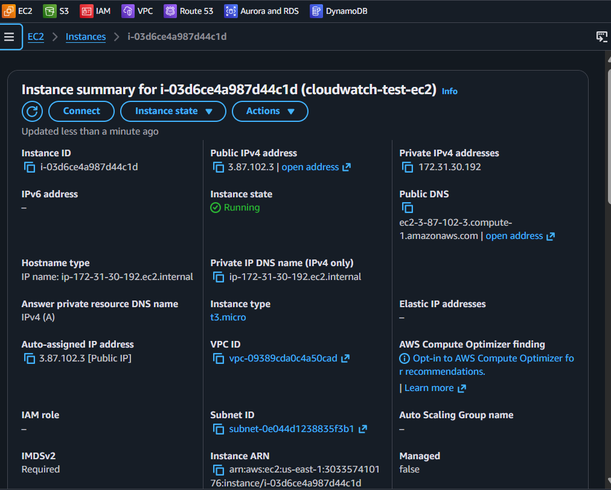
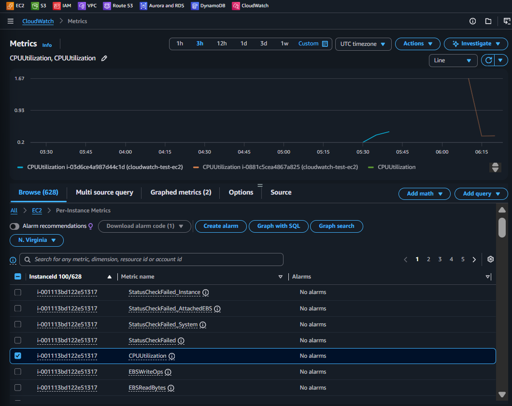
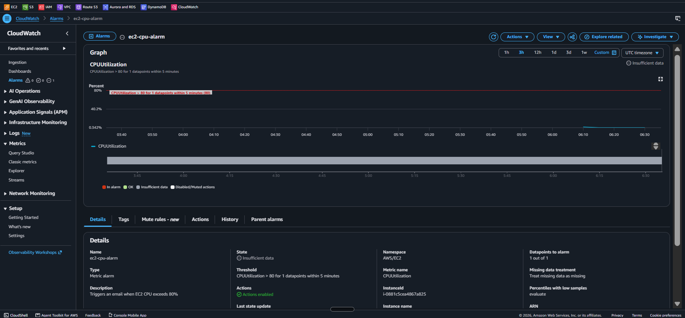
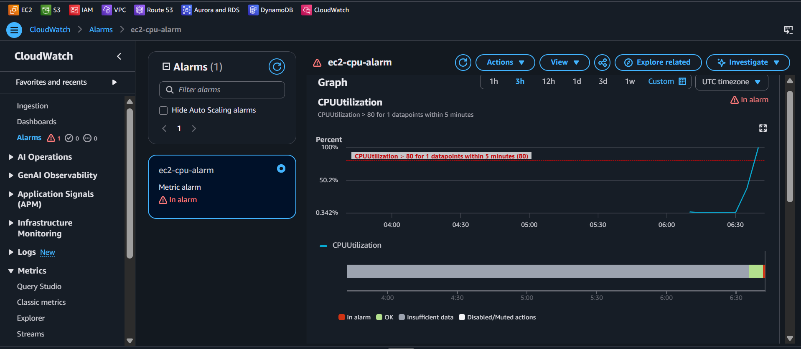
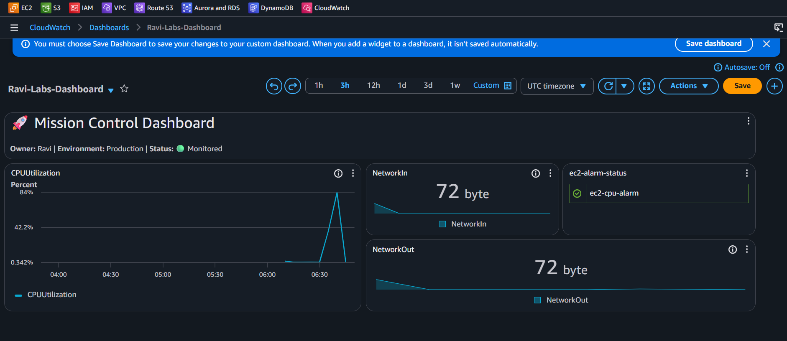
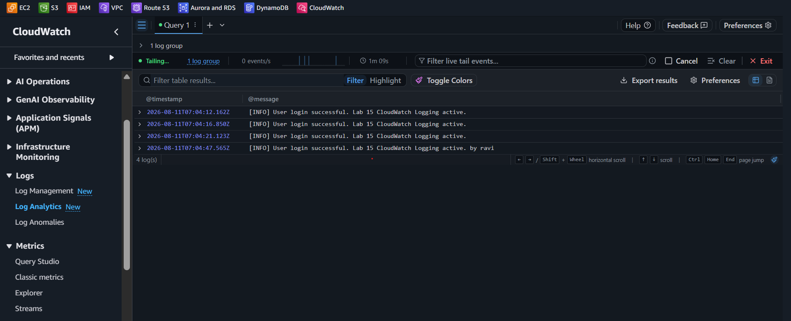

<div align="center">


# Lab 15 — CloudWatch: Alarms and Dashboards — Your Infrastructure's Control Center


</div>

> "Ravi, you've built amazing infrastructure in the last 14 labs. But how do you know when something breaks at 3 AM? CloudWatch is your 24/7 security camera, fire alarm, and health monitor all rolled into one. Let me show you how to navigate the modern AWS CloudWatch Console!" — Rithu

---

<details>
<summary><b>🎭 Ravi & Rithu's Coffee Break Chat</b></summary>

**Ravi:** "CloudWatch is like a security camera for my servers?"

**Rithu:** "More like a security camera + fitness tracker + health monitor + automatic fire extinguisher system."

**Ravi:** "That's a lot of features."

**Rithu:** "That's a lot of servers to keep track of. Trust me, every cloud architect relies on this daily."

</details>

## 📋 Table of Contents

- [🎯 Objective](#-objective)
- [📊 Lab Progress](#-lab-progress)
- [🤔 In Plain English](#-in-plain-english)
- [🧠 Prerequisites](#-prerequisites)
- [💰 Cost Warning](#-cost-warning)
- [🏗️ Architecture](#️-architecture)
- [🛠️ Step-by-Step Instructions](#️-step-by-step-instructions)
  - [Step 1: Launch a Test EC2 Instance](#step-1-launch-a-test-ec2-instance)
  - [Step 2: Explore CloudWatch Metrics (Modern Console UI)](#step-2-explore-cloudwatch-metrics-modern-console-ui)
  - [Step 3: Create a CloudWatch Alarm (4-Step Wizard)](#step-3-create-a-cloudwatch-alarm-4-step-wizard)
  - [Step 4: Stress CPU & Trigger the Alarm](#step-4-stress-cpu--trigger-the-alarm)
  - [Step 5: Build a Custom Dashboard (Modern Widget Picker)](#step-5-build-a-custom-dashboard-modern-widget-picker)
  - [Step 6: Centralize Logs, Use Logs Insights & Live Tail](#step-6-centralize-logs-use-logs-insights--live-tail)
- [✅ Validation Checklist](#-validation-checklist)
- [🧹 Cleanup (IMPORTANT!)](#-cleanup-important)
- [🧠 Memory Tips](#-memory-tips)
- [🎓 What You Learned](#-what-you-learned)
- [🎮 Test Yourself](#-test-yourself-no-peeking-)
- [🆚 Pro Tip vs Noob Tip](#-pro-tip-vs-noob-tip)
- [🔗 What's Next?](#-whats-next)
- [❓ Troubleshooting](#-troubleshooting)

---

<div align="center">

## 📊 Lab Progress

`[███████████████░░░░░] 75% — Monitoring Your Cloud Estate!`

</div>

---

## 🤔 In Plain English

> **What is this, really?** CloudWatch is the **heart monitor + security cameras + black box** of your AWS account. It automatically collects performance metrics (CPU usage, network traffic, status checks) from AWS services, fires automated alarms ("CPU > 80%!"), shows metrics on mission-control dashboards, and aggregates application logs for instant troubleshooting. 📊
>
> 🌍 **Why you should care:** You can't fix what you can't see. CloudWatch surfaces issues *before* customers notice downtime.

---

## 🎯 Objective

In this lab, you will:

- Navigate the **modern CloudWatch Console** to explore metrics across namespaces.
- Differentiate **Basic Monitoring** (hypervisor level, free) from **OS-level monitoring** (CloudWatch Agent).
- Create a **CloudWatch Alarm** (4-step wizard) that emails alerts via **Amazon SNS**.
- Generate high CPU load on Amazon Linux 2023 with `stress-ng` (or a zero-dependency Python script).
- Build a **CloudWatch Dashboard** with 4 widget types: **Line**, **Number**, **Alarm status**, and **Markdown Text**.
- Create a **Log Group**, stream test logs, and query them with **Logs Insights** and **Live Tail**.

---

## 🧠 Prerequisites

Before starting, ensure you have:

- ✅ Completed **Lab 14** (DynamoDB)
- ✅ An active AWS account with permissions for CloudWatch, EC2, and SNS
- ✅ An active email address for receiving SNS alarm notifications
- ✅ An SSH key pair created in EC2

---

## 💰 Cost Warning

| Resource | Cost Model |
|----------|------------|
| EC2 Basic Monitoring metrics (5-min) | **Free** (automatic) |
| CloudWatch Alarms | **10 free**; then ~$0.10 per alarm / month |
| CloudWatch Dashboards | **3 free**; then ~$3.00 per dashboard / month |
| CloudWatch Logs | First 5 GB ingested & stored free |
| SNS Notifications | Free for email subscriptions |
| **Estimated Total** | **~$0 (within Free Tier)** |

> ⚠️ **Rithu's Cost Alert:** Dashboards and alarms are free only within the Free Tier limits — delete them in the **Cleanup** section when you're done. 🧹

> **Ravi's Mistake of the Day:** I created a CloudWatch alarm connected to SNS, but forgot to click "Confirm Subscription" in the email AWS sent me. The alarm went into alarm state... and notified nobody! Always confirm your SNS subscription! 📧

---

## 🏗️ Architecture

```
┌─────────────────────────────────────────────────────────────────────────────────┐
│                              Amazon CloudWatch                                  │
│                                                                                 │
│  ┌────────────────────┐    ┌─────────────────────┐   ┌──────────────────────┐  │
│  │ CloudWatch Metrics │    │  CloudWatch Alarms  │   │ CloudWatch Dashboards│  │
│  │ (AWS/EC2 Namespace)│    │   (4-Step Wizard)   │   │  (Interactive Grid)  │  │
│  │                    │    │                     │   │                      │  │
│  │ • CPUUtilization   │───▶│ Condition: > 80%    │──▶│ • CPU Line Chart     │  │
│  │ • NetworkIn/Out    │    │ Datapoints: 1 / 1   │   │ • Network In Number  │  │
│  │ • StatusCheckFailed│    │ Evaluation: 5 min   │   │ • Alarm Status Badge │  │
│  └────────────────────┘    └──────────┬──────────┘   │ • Markdown Title Bar │  │
│                                       │              └──────────────────────┘  │
│                                       ▼                                         │
│                            ┌────────────────────┐                               │
│                            │  Amazon SNS Topic  │                               │
│                            │  "ec2-cpu-alerts"  │                               │
│                            └──────────┬─────────┘                               │
│                                       │                                         │
│                                       ▼                                         │
│                            ┌────────────────────┐                               │
│                            │  📧 Email Alert    │                               │
│                            │ (Confirmed Endpt)  │                               │
│                            └────────────────────┘                               │
└─────────────────────────────────────────────────────────────────────────────────┘
```

---

## 🛠️ Step-by-Step Instructions

### Step 1: Launch a Test EC2 Instance

If you don't have a test EC2 instance running, launch one using Amazon Linux 2023:

1. Open the **EC2 Console** → click **Launch Instance**.
2. Fill out the configuration fields:

| Panel | Field | Setting / Value |
|-------|-------|-----------------|
| **Name and tags** | Name | `cloudwatch-test-ec2` |
| **Application and OS Images** | AMI | **Amazon Linux 2023 AMI** (Free tier eligible) |
| **Instance type** | Instance type | `t2.micro` (or `t3.micro`) |
| **Key pair** | Key pair name | Select your existing key pair |
| **Network settings** | Security group | **Create security group** → Name: `cloudwatch-sg` |
| | Inbound Rules | **SSH** (Port 22) from *My IP*, **HTTP** (Port 80) from *Anywhere* |

3. Scroll down to **Advanced details** → **User data** box, and paste the following startup script:

```bash
#!/bin/bash
dnf update -y
dnf install -y httpd stress-ng || dnf install -y httpd stress
systemctl start httpd
systemctl enable httpd
```

> 
> Amazon Linux 2023 uses `dnf` as its package manager and includes `stress-ng` in its default repositories. Installing it in User Data ensures our CPU stress generator is ready immediately! 🚀

4. Click **Launch Instance**.
5. Wait until the instance state changes to **Running** and **2/2 status checks passed**.

📸 **[Screenshot: EC2 instance cloudwatch-test-ec2 in running state]**


---

### Step 2: Explore CloudWatch Metrics (Modern Console UI)

Let's see how AWS publishes hypervisor metrics to CloudWatch in the modern console.

1. Open the **CloudWatch Console**.
2. In the left navigation menu under **Metrics**, note the 4 options:
   - **Query studio**: Run Prometheus (PromQL) or SQL queries on metrics.
   - **Classic metrics**: Browse standard namespaces by service (e.g., `AWS/EC2`). *(Labeled "All metrics" in older consoles)*.
   - **Explorer**: Create tag-based dynamic visualizations.
   - **Streams**: Stream metrics to Firehose or third-party destinations.
3. Click **Classic metrics**.
4. In the main window, notice the top navigation tabs:
   - **Browse**: Explore metrics grouped by AWS service namespaces (`AWS/EC2`, `AWS/RDS`, `AWS/DynamoDB`, etc.).
   - **Graphed metrics**: Adjust the statistic (Average, Max, Sum), period, color, and Y-axis for selected metrics.
   - **Query**: Run SQL queries using **CloudWatch Metrics Insights**.
5. Click the **Browse** tab → under **AWS namespaces**, select **EC2** → click **Per-Instance Metrics**.
6. Locate `cloudwatch-test-ec2` in the table:
   - Check the box next to **CPUUtilization** (Percentage of allocated compute units in use).
   - Observe other hypervisor metrics: **NetworkIn**, **NetworkOut**, **DiskReadBytes**, **StatusCheckFailed**.
7. Inspect the graph panel at the top:
   - Use the time-range picker to view **1h** or **3h**.
   - Note that default hypervisor metrics publish every **5 minutes** for FREE (Basic Monitoring).

📸 **[Screenshot: CloudWatch metrics page showing CPU utilization graph for the EC2 instance]**


> 
>
> | Metric Level | Metrics Collected | Requires Agent? | Interval / Cost |
> |--------------|-------------------|-----------------|-----------------|
> | **Hypervisor (Basic)** | CPU utilization, Network bytes in/out, Disk I/O ops, Status check failures | ❌ No (Built-in) | Every **5 min** (Free) |
> | **Hypervisor (Detailed)** | CPU utilization, Network bytes in/out | ❌ No | Every **1 min** (Paid) |
> | **OS / Guest Level** | Memory (RAM) % free/used, Disk space % free/used, Swap usage, Process count | ✅ **Yes** (Unified CloudWatch Agent) | Configurable (1s - 60s) |

---

### Step 3: Create a CloudWatch Alarm (4-Step Wizard)

We will now configure a CloudWatch Alarm that emails you when CPU utilization exceeds 80%.

1. In the CloudWatch Console left menu under **Alarms**, click **All alarms**.
2. Click the orange **Create alarm** button.

#### 🔹 Step 3a: Step 1 of Wizard — Specify Metric and Conditions
1. Click **Select metric** → select **EC2** → **Per-Instance Metrics**.
2. Find `cloudwatch-test-ec2`, select **CPUUtilization**, and click **Select metric**.
3. Set **Statistic**: `Average` and **Period**: `5 minutes`.
4. Configure threshold conditions:

| Setting | Value | Explanation |
|---------|-------|-------------|
| **Threshold type** | **Static** | Trigger based on a fixed value (not AI anomaly detection) |
| **Whenever CPUUtilization is...** | **Greater** (`>`) | Triggers when metric goes above threshold |
| **than...** | `80` | 80% CPU threshold |
| **Datapoints to alarm** | `1` out of `1` | Triggers after 1 evaluation period above 80% |
| **Missing data treatment** | **Treat missing data as missing** | Prevents false alarms if metrics delay |

5. Click **Next**.

#### 🔹 Step 3b: Step 2 of Wizard — Configure Actions
1. Under **Alarm state trigger**, choose **In alarm**.
2. Under **Send a notification to...**, select **Create new topic**:

| Field | Value |
|-------|-------|
| **Create a new topic...** | `ec2-cpu-alerts` |
| **Email endpoints...** | Enter **YOUR real email address** |

3. Click **Create topic**.
4. 🛑 **CRITICAL STEP — CONFIRM SNS SUBSCRIPTION:**
   - Check your email inbox for a message from `AWS Notifications <no-reply@sns.amazonaws.com>`.
   - Subject: *"AWS Notification - Subscription Confirmation"*.
   - Click the **Confirm subscription** link inside the email!

> ⚠️ **Warning:** If you do not click the confirmation link, AWS will drop alarm notifications!

5. Click **Next**.

#### 🔹 Step 3c: Step 3 of Wizard — Add Name and Description
1. **Alarm name:** `ec2-cpu-alarm` — **Alarm description:** `Triggers an email when EC2 CPU exceeds 80%`
2. Click **Next**.

#### 🔹 Step 3d: Step 4 of Wizard — Preview and Create
1. Review all settings, then click **Create alarm** at the bottom right.

📸 **[Screenshot: Alarm creation page showing all configured settings]**


---

### Step 4: Stress CPU & Trigger the Alarm

Let's push CPU usage to 100% and watch the alarm trigger!

1. Connect to your EC2 instance via SSH:

```bash
ssh -i "your-key.pem" ec2-user@<PUBLIC_IP>
```

2. Run `stress-ng` to generate heavy CPU load across 4 processes:

```bash
stress-ng --cpu 4 --timeout 600s
```

> 💡 **Fallback Command (Zero Dependencies):** If `stress-ng` is not installed, run this Python script to max out CPU cores:
> ```bash
> python3 -c "import multiprocessing as m; [m.Process(target=lambda: [0 for _ in iter(int, 1)]).start() for _ in range(m.cpu_count()*2)]"
> ```

3. Observe metric updates in CloudWatch:
   - Go to **CloudWatch Console** → **Metrics** → **Classic metrics** → **Browse** → **EC2** → **Per-Instance Metrics**.
   - Check **CPUUtilization** for `cloudwatch-test-ec2`. The line graph climbs to 100%! 📈

4. Track the Alarm State transition:
   - Go to **CloudWatch** → **Alarms** → **All alarms**.
   - State transition sequence: 🟢 **OK** → 🟡 **Insufficient data** → 🔴 **In alarm**.
   - Within ~5–10 minutes, check your email inbox for the SNS alert detailing the breach. 📧

📸 **[Screenshot: Alarm showing "In alarm" state in the CloudWatch console]**


5. Stop the stress generator once confirmed (Press `Ctrl + C` in your SSH terminal).

---

### Step 5: Build a Custom Dashboard (Modern Widget Picker)

Let's build a multi-widget operational dashboard to monitor your infrastructure.

1. In the CloudWatch Console left menu, click **Dashboards**.
2. Click **Create dashboard** → Name: `Ravi-Labs-Dashboard` → Click **Create dashboard**.
3. In the **Add widget** modal, add 4 distinct widgets:

#### 📈 Widget 1: Line Chart (CPU Utilization)
- Select **Line** → Click **Next** → Choose **Metrics**.
- Navigate: **EC2** → **Per-Instance Metrics** → select `CPUUtilization` for `cloudwatch-test-ec2`.
- Click **Create widget**.

#### 🔢 Widget 2: Number Widget (Network In Bytes)
- Click the **+** (Add widget) icon at top right.
- Select **Number** → Click **Next** → Choose **Metrics**.
- Navigate: **EC2** → **Per-Instance Metrics** → select `NetworkIn`.
- Click **Create widget**.

#### 🚨 Widget 3: Alarm Status Widget
- Click **Add widget** → Select **Alarm status** → Click **Next**.
- Check the box for your alarm: `ec2-cpu-alarm`.
- Click **Create widget**.

#### 📝 Widget 4: Markdown Text Header
- Click **Add widget** → Select **Text** → Click **Next**.
- Paste the following Markdown content:
  ```markdown
  # 🚀 Mission Control Dashboard
  **Owner:** Ravi | **Environment:** Production | **Status:** 🟢 Monitored
  ```
- Click **Create widget**.

4. Drag and resize the widgets to arrange your layout, then click **Save dashboard** at the top right.

📸 **[Screenshot: Complete Ravi-Labs-Dashboard with all 4 widgets visible]**

---

### Step 6: Centralize Logs, Use Logs Insights & Live Tail

Applications generate logs locally on servers. CloudWatch Logs aggregates them into a central, queryable repository.

1. Go to **CloudWatch Console** → left menu: **Logs** → **Log groups**.
2. Click **Create log group**:
   - **Log group name:** `ravi-app-logs`
   - **Retention setting:** `7 days` *(avoid "Never expire" to control storage costs)*
3. Click **Create**.

4. Open `ravi-app-logs` → click **Create log stream** → Name: `test-stream` → click **Create**.

5. Send a test log entry using AWS CLI (or AWS CloudShell):

```bash
aws logs put-log-events \
  --log-group-name ravi-app-logs \
  --log-stream-name test-stream \
  --log-events timestamp=$(date +%s000),message="[INFO] User login successful. Lab 15 CloudWatch Logging active."
```

6. **Analyze Logs with CloudWatch Logs Insights:**
   - In the left menu under **Logs**, click **Logs Insights**.
   - In the log group selector, choose `ravi-app-logs`.
   - Run the default query:
     ```sql
     fields @timestamp, @message
     | sort @timestamp desc
     | limit 20
     ```
   - Click **Run query** to see your log events.

7. **Monitor Real-Time Logs with Live Tail:**
   - In the left menu under **Logs**, click **Live Tail**.
   - Select `ravi-app-logs` to stream incoming events live to your browser.

📸 **[Screenshot: CloudWatch Logs showing the test log message]**


---

## ✅ Validation Checklist

- [ ] EC2 instance `cloudwatch-test-ec2` launched and running
- [ ] CloudWatch Metrics explored under the **Browse** tab
- [ ] Alarm `ec2-cpu-alarm` created using the 4-step wizard
- [ ] SNS Topic `ec2-cpu-alerts` created & email subscription confirmed
- [ ] CPU stress test executed and alarm state transitioned to 🔴 **In alarm**
- [ ] Email notification received in your inbox
- [ ] Dashboard `Ravi-Labs-Dashboard` created with Line, Number, Alarm Status, and Text widgets
- [ ] Log Group `ravi-app-logs` created with 7-day retention & queried in Logs Insights

---

## 🧹 Cleanup (IMPORTANT!)

Avoid unwanted charges by cleaning up CloudWatch resources after testing:

1. **Delete Dashboard:**
   - CloudWatch → **Dashboards** → select `Ravi-Labs-Dashboard` → click **Delete** → confirm.
2. **Delete Alarm:**
   - CloudWatch → **Alarms** → **All alarms** → select `ec2-cpu-alarm` → click **Actions** → **Delete** → confirm.
3. **Delete SNS Topic:**
   - Search **SNS** in the top bar → **Topics** → select `ec2-cpu-alerts` → click **Delete** → type `delete` → confirm.
4. **Delete Log Group:**
   - CloudWatch → **Logs** → **Log groups** → select `ravi-app-logs` → click **Actions** → **Delete log group** → confirm.
5. **Terminate EC2 Instance:**
   - EC2 Console → **Instances** → select `cloudwatch-test-ec2` → click **Instance state** → **Terminate instance**.
6. **Delete Security Group:**
   - EC2 Console → **Security Groups** → select `cloudwatch-sg` → click **Actions** → **Delete security group**.

---

## 🧠 Memory Tips

| 🧠 Concept | Plain English Analogy | Key Takeaway |
|------------|-----------------------|--------------|
| **Basic Monitoring** | Free 5-minute camera snapshots | Collects hypervisor CPU, Network, Disk I/O automatically. |
| **Detailed Monitoring** | Paid 1-minute video feed | 1-minute granularity for mission-critical resources. |
| **CloudWatch Agent** | Internal diagnostic scanner | Required to track OS metrics (RAM usage, free disk space %). |
| **Alarms + SNS** | Smoke detector connected to your phone | Alarms evaluate conditions → push alerts to SNS topics. |
| **Log Retention** | Automatic paper shredder | Set retention (e.g. 7 days) so old log storage doesn't inflate your bill. |

---

## 🎓 What You Learned

| Feature | Key Skill Acquired |
|---------|--------------------|
| **Metrics Browsing** | Navigating AWS namespaces and graphing metrics over time |
| **Alarm Configuration** | Defining static thresholds, evaluation periods, and missing data rules |
| **SNS Alarm Actions** | Linking alarms to SNS topics for instant email notifications |
| **Custom Dashboards** | Assembling operational cockpits using Line, Number, Alarm, and Text widgets |
| **Log Management** | Creating Log Groups, configuring log retention, and querying via Logs Insights |

---

## 🎮 Test Yourself! (No Peeking 👀)

**Q1:** Basic monitoring publishes hypervisor metrics every how many minutes?

<details><summary>👀 Show answer</summary>

**A:** Every **5 minutes** (Free). Detailed monitoring publishes every **1 minute** (Paid). 📷

</details>

**Q2:** Does CloudWatch collect Memory (RAM) utilization by default without an agent?

<details><summary>👀 Show answer</summary>

**A:** **No!** RAM and disk space are OS-level metrics. You must install the **Unified CloudWatch Agent** inside the guest OS. 🧠

</details>

**Q3:** What AWS service is used by CloudWatch Alarms to send email notifications?

<details><summary>👀 Show answer</summary>

**A:** **Amazon SNS (Simple Notification Service)**. The alarm triggers an SNS topic, which delivers the email. 📟

</details>

---

### 🆚 Pro Tip vs Noob Tip

| | Practice |
|---|---|
| ❌ **Noob Tip** | Leaving Log Group retention on "Never expire" and ignoring SNS confirmation emails. |
| ✅ **Pro Tip** | Set Log Group retention to 7/30 days, install the CloudWatch Agent for RAM monitoring, and link Alarms to SNS for instant automated alerts! |

---

## 🔗 What's Next?

➡️ **Proceed to [Lab 16 — IAM: Users, Groups, Roles, Policies](../16%20-%20IAM%20-%20Users,%20Groups,%20Roles,%20Policies/README.md)** — Learn how to secure your AWS infrastructure with fine-grained identity and access control!

---

## ❓ Troubleshooting

<details>
<summary><strong>"dnf install stress" fails on Amazon Linux 2023</strong></summary>

- Amazon Linux 2023 repositories package `stress-ng` instead of `stress`. Run `sudo dnf install -y stress-ng`.
- Alternatively, run the zero-dependency Python script provided in Step 4.

</details>

<details>
<summary><strong>Alarm remains in "Insufficient Data"</strong></summary>

- CloudWatch needs at least 1 evaluation period (5 minutes) of data points before evaluating status.

</details>

<details>
<summary><strong>No email notification received</strong></summary>

- Check your spam folder.
- Ensure you opened the email from `no-reply@sns.amazonaws.com` and clicked **Confirm subscription**.

</details>

---

<div align="center">


> 🎉 **AMAZING WORK, Ravi!** You've mastered Amazon CloudWatch metrics, 4-step alarm workflows, operational dashboards, and centralized logging. You're fully equipped to monitor production cloud environments! 🚀✨

</div>
