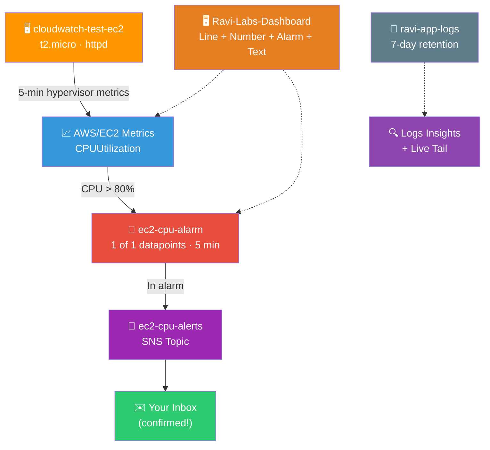

# 📊 Lab 15 - CloudWatch: Alarms and Dashboards

> 📅 **Updated:** 21 August 2026 | ⏱️ **Duration:** ~25 minutes | 📊 **Level:** Beginner


> ### 🗣️ *"Ravi, you've built amazing infrastructure in the last 14 labs. But how do you know when something breaks at 3 AM? CloudWatch is your 24/7 security camera, fire alarm, and health monitor all rolled into one."*
> — **Rithu** 📊

<details>
<summary><b>🎭 Ravi & Rithu's Coffee Break Chat</b></summary>

**Ravi:** "CloudWatch is like a security camera for my servers?"

**Rithu:** "More like a security camera + fitness tracker + health monitor + automatic fire extinguisher system."

**Ravi:** "That's a lot of features."

**Rithu:** "That's a lot of servers to keep track of. Trust me, every cloud architect relies on this daily."

</details>

---

## 🎯 What You'll Master

| Skill | Description |
|-------|-------------|
| 📈 **Explore Metrics** | Modern console: Classic metrics, Browse tab, namespaces |
| 🚨 **Create Alarms** | 4-step wizard: metric → condition → SNS action → create |
| 📧 **SNS Notifications** | Email alerts when CPU > 80% (confirm subscription!) |
| 🔥 **Stress Testing** | `stress-ng` to trigger the alarm live |
| 🖥️ **Custom Dashboards** | Line, Number, Alarm status, Markdown widgets |
| 📝 **Logs + Insights** | Log groups, Logs Insights queries, Live Tail |

> 💡 **Pro Tip:** You can't fix what you can't see. CloudWatch surfaces issues *before* customers notice downtime.

---

## 🚦 Before You Start

### ✅ Prerequisites Checklist
- [ ] ✅ **[Lab 14](../14%20-%20DynamoDB%20-%20CRUD%20Operations/README.md)** complete
- [ ] 📧 Active email address for SNS notifications
- [ ] 🔑 SSH key pair in EC2
- [ ] 🔐 Permissions for CloudWatch, EC2, SNS

### 📦 What You Need (and Don't)
| Required | Optional |
|----------|----------|
| ~25 minutes | CloudWatch Agent (RAM metrics — advanced) |
| Real email inbox access | |

---

## 💰 Cost & Safety First

| Resource | Cost |
|----------|------|
| EC2 Basic Monitoring (5-min) | ✅ Free, automatic |
| CloudWatch Alarms | ✅ 10 free; then ~$0.10/alarm/mo |
| Dashboards | ✅ 3 free; then ~$3/dashboard/mo |
| CloudWatch Logs | ✅ First 5 GB free |
| SNS email | ✅ Free |
| **Lab total** | **~$0 within Free Tier** |

> 💸 **Ravi's Mistake of the Day:** *"I created an alarm connected to SNS but forgot to click 'Confirm Subscription' in the email. The alarm went into alarm state... and notified nobody! ALWAYS confirm your SNS subscription."* 📧

### 🏷️ Naming Convention

| Resource | Name |
|----------|------|
| 🖥️ Instance | `cloudwatch-test-ec2` |
| 🛡️ Security Group | `cloudwatch-sg` |
| 🚨 Alarm | `ec2-cpu-alarm` |
| 📧 SNS Topic | `ec2-cpu-alerts` |
| 🖥️ Dashboard | `Ravi-Labs-Dashboard` |
| 📝 Log Group | `ravi-app-logs` |

---

## 🧠 How It All Fits Together



### 🔑 Key Concepts
| Component | Role |
|-----------|------|
| **Basic Monitoring** | Free 5-min snapshots — CPU, Network, Disk I/O, Status checks |
| **Detailed Monitoring** | Paid 1-min feed for mission-critical resources |
| **CloudWatch Agent** | Required for OS-level metrics (RAM %, disk space %) |
| **Alarm → SNS** | Smoke detector wired to your phone |
| **Log Retention** | Paper shredder — set 7 days so storage doesn't inflate the bill |

---

## 🪜 Step-by-Step Guide

### 🟢 Step 1: Launch the Test Instance 🖥️

<details>
<summary><b>🖥️ Expand for launch steps</b></summary>

1. EC2 Console → ➕ **Launch instance**
2. Configure:

   | Field | Value |
   |-------|-------|
   | Name | `cloudwatch-test-ec2` |
   | AMI | Amazon Linux 2023 |
   | Type | `t2.micro` |
   | Key pair | your existing key pair |
   | SG | Create `cloudwatch-sg`: SSH 22 ← My IP, HTTP 80 ← Anywhere |

3. **User data:**

```bash
#!/bin/bash
dnf update -y
dnf install -y httpd stress-ng || dnf install -y httpd stress
systemctl start httpd
systemctl enable httpd
```

4. ✅ Launch → wait for **Running + 2/2 checks**

</details>


> 🗣️ **Rithu's Tip:** *"AL2023 ships `stress-ng` in its repos — installing it in user data means our CPU stress generator is ready immediately!"*

---

### 🟢 Step 2: Explore Metrics (Modern Console) 📈

<details>
<summary><b>📈 Expand for metrics exploration</b></summary>

1. CloudWatch Console → left nav under **Metrics**, note the options:
   - **Query studio** — PromQL/SQL queries
   - **Classic metrics** — browse by namespace *(labeled "All metrics" in older consoles)*
   - **Explorer** — tag-based dynamic visualizations
   - **Streams** — stream to Firehose/third parties
2. Click **Classic metrics** → top tabs:
   - **Browse** — namespaces (`AWS/EC2`, `AWS/RDS`, `AWS/DynamoDB`)
   - **Graphed metrics** — adjust statistic, period, color, Y-axis
   - **Query** — SQL via Metrics Insights
3. **Browse** → **EC2** → **Per-Instance Metrics**
4. Find `cloudwatch-test-ec2` → check **CPUUtilization**
5. Also note: **NetworkIn/Out**, **DiskReadBytes**, **StatusCheckFailed**
6. Time-range picker → view **1h** or **3h** — default = every **5 min** (Basic Monitoring, FREE)

</details>


> 🗣️ **Rithu's Tip:** *"Hypervisor metrics are FREE every 5 min. RAM/disk-space are OS-level — they need the CloudWatch Agent. Hypervisor can't see inside the guest!"*

---

### 🟢 Step 3: Create the Alarm (4-Step Wizard) 🚨

<details>
<summary><b>🚨 Expand for alarm wizard</b></summary>

**Step 1 — Specify metric & conditions:**

1. CloudWatch → **Alarms → All alarms** → ➕ **Create alarm** → **Select metric**
2. **EC2 → Per-Instance Metrics** → find `cloudwatch-test-ec2` → check **CPUUtilization** → **Select metric**
3. Statistic: `Average` · Period: `5 minutes`
4. Conditions:

   | Setting | Value |
   |---------|-------|
   | Threshold type | Static |
   | Condition | Greater `>` than `80` |
   | Datapoints to alarm | `1` out of `1` |
   | Missing data | Treat missing data as missing |

→ **Next**

**Step 2 — Actions:**

5. Alarm state trigger: **In alarm**
6. Send notification → **Create new topic**: `ec2-cpu-alerts` · Email: **YOUR real email** → **Create topic**
7. 🛑 **CONFIRM SUBSCRIPTION:** check inbox for `no-reply@sns.amazonaws.com` → click **Confirm subscription** link!

   > ⚠️ *Skip this and AWS drops all alarm notifications!*

→ **Next**

**Step 3 — Name & description:**

8. Name: `ec2-cpu-alarm` · Description: `Triggers an email when EC2 CPU exceeds 80%` → **Next**

**Step 4 — Preview & create:**

9. Review → ✅ **Create alarm**

</details>


---

### 🟢 Step 4: Stress CPU & Trigger It 🔥

<details>
<summary><b>🔥 Expand for stress test</b></summary>

1. SSH in:

```bash
ssh -i "your-key.pem" ec2-user@<PUBLIC_IP>
```

2. Max out CPU across 4 processes:

```bash
stress-ng --cpu 4 --timeout 600s
```

Zero-dependency fallback:

```bash
python3 -c "import multiprocessing as m; [m.Process(target=lambda: [0 for _ in iter(int, 1)]).start() for _ in range(m.cpu_count()*2)]"
```

3. Watch CPU climb: **Metrics → Classic metrics → Browse → EC2 → Per-Instance** → CPUUtilization hits ~100%! 📈
4. Watch the alarm: **OK** 🟢 → **Insufficient data** 🟡 → **In alarm** 🔴 (~5–10 min)
5. Check your inbox for the SNS alert 📧
6. Stop stress: `Ctrl+C`

</details>


---

### 🟢 Step 5: Build the Dashboard 🖥️

<details>
<summary><b>🖥️ Expand for dashboard widgets</b></summary>

1. CloudWatch → **Dashboards** → ➕ **Create dashboard** → Name: `Ravi-Labs-Dashboard` → Create
2. Add 4 widgets from the **Add widget** modal:

   | Widget | Type | Metric |
   |--------|------|--------|
   | 📈 1 | **Line** | EC2 → Per-Instance → `CPUUtilization` |
   | 🔢 2 | **Number** | EC2 → Per-Instance → `NetworkIn` |
   | 🚨 3 | **Alarm status** | `ec2-cpu-alarm` |
   | 📝 4 | **Text** | Markdown header (below) |

3. Text widget markdown:

```markdown
# 🚀 Mission Control Dashboard
**Owner:** Ravi | **Environment:** Production | **Status:** 🟢 Monitored
```

4. Drag/resize widgets → ✅ **Save dashboard**

</details>


---

### 🟢 Step 6: Logs, Insights & Live Tail 📝

<details>
<summary><b>📝 Expand for logging steps</b></summary>

**Create log group + stream:**

1. CloudWatch → **Logs → Log groups** → ➕ **Create log group**
2. Name: `ravi-app-logs` · Retention: **7 days** (avoid "Never expire"!) → Create
3. Open it → **Create log stream** → Name: `test-stream` → Create

**Send a test event (CLI or CloudShell):**

```bash
aws logs put-log-events \
  --log-group-name ravi-app-logs \
  --log-stream-name test-stream \
  --log-events timestamp=$(date +%s000),message="[INFO] User login successful. Lab 15 CloudWatch Logging active."
```

**Query with Logs Insights:**

4. **Logs → Logs Insights** → select `ravi-app-logs` → run:

```sql
fields @timestamp, @message
| sort @timestamp desc
| limit 20
```

**Watch it live with Live Tail:**

5. **Logs → Live Tail** → select `ravi-app-logs` → events stream into your browser in real time!

</details>


---

## ✅ Validation Checklist

| # | Check | Status |
|---|-------|--------|
| 1️⃣ | `cloudwatch-test-ec2` running with 2/2 checks | ☐ ✅ |
| 2️⃣ | Metrics explored via Browse tab (Per-Instance) | ☐ ✅ |
| 3️⃣ | Alarm `ec2-cpu-alarm` created via 4-step wizard | ☐ ✅ |
| 4️⃣ | SNS topic created + subscription CONFIRMED | ☐ ✅ |
| 5️⃣ | Stress test → alarm transitioned to 🔴 In alarm | ☐ ✅ |
| 6️⃣ | Email notification received | ☐ ✅ |
| 7️⃣ | Dashboard with Line + Number + Alarm + Text widgets | ☐ ✅ |
| 8️⃣ | Log group queried via Logs Insights + Live Tail | ☐ ✅ |

---

## 🧹 Cleanup (Follow Order!)

| Step | Action | Console Location |
|------|--------|------------------|
| 1️⃣ 🗑️ | Delete `Ravi-Labs-Dashboard` | CloudWatch → Dashboards |
| 2️⃣ 🚨 | Delete `ec2-cpu-alarm` | CloudWatch → Alarms |
| 3️⃣ 📧 | Delete `ec2-cpu-alerts` topic (type `delete`) | SNS → Topics |
| 4️⃣ 📝 | Delete `ravi-app-logs` log group | CloudWatch → Log groups |
| 5️⃣ 🖥️ | Terminate `cloudwatch-test-ec2` | EC2 → Instances |
| 6️⃣ 🛡️ | Delete `cloudwatch-sg` | EC2 → Security Groups |

---

## 🚀 Level Ups (Post-Core Lab)

| Challenge | What to Try | Notes |
|-----------|-------------|-------|
| 🧠 **RAM Monitoring** | Install Unified CloudWatch Agent, collect memory % | OS-level metrics |
| 📐 **Composite Alarm** | Combine multiple alarms into one | Reduce alert noise |
| ⏱️ **Anomaly Detection** | Rebuild alarm with anomaly threshold instead of static | ML-powered bands |

---

## 🆘 Troubleshooting Quick Reference

| 🔍 Issue | 💡 Likely Cause | 🔧 Fix |
|-------|--------------|-----|
| ❌ `dnf install stress` fails | AL2023 packages `stress-ng`, not `stress` | `sudo dnf install -y stress-ng` or use the Python fallback |
| 🟡 Alarm stuck "Insufficient Data" | Needs 1 full evaluation period | Wait ~5 min of datapoints |
| 📧 No email received | Subscription not confirmed / spam folder | Confirm via `no-reply@sns.amazonaws.com` email; check spam |

---

## 🎮 Test Yourself! (No Peeking 👀)

**Q1:** Basic monitoring publishes hypervisor metrics how often?

<details><summary>👀 Show answer</summary>

**A:** Every **5 minutes** (Free). Detailed monitoring = every **1 minute** (Paid). 📷

</details>

**Q2:** Does CloudWatch collect RAM usage without an agent?

<details><summary>👀 Show answer</summary>

**A:** **No!** Memory/disk-space are OS-level — requires the **Unified CloudWatch Agent**. 🧠

</details>

**Q3:** Which service delivers CloudWatch alarm emails?

<details><summary>👀 Show answer</summary>

**A:** **Amazon SNS** — the alarm triggers a topic, which sends the email. 📟

</details>

---

## 📚 Official Documentation

- 📊 [What Is Amazon CloudWatch?](https://docs.aws.amazon.com/AmazonCloudWatch/latest/monitoring/WhatIsCloudWatch.html)
- 🚨 [Using Amazon CloudWatch Alarms](https://docs.aws.amazon.com/AmazonCloudWatch/latest/monitoring/AlarmThatSendsEmail.html)
- 📝 [CloudWatch Logs Insights](https://docs.aws.amazon.com/AmazonCloudWatch/latest/logs/AnalyzingLogData.html)

---

## 🎓 What You Learned

> **The mission control operator's panel:**
> - 📈 **Metrics** → Browse namespaces, graph over time (5-min free)
> - 🚨 **Alarms** → static thresholds, evaluation periods, missing-data rules
> - 📧 **SNS actions** → alarms wired to email (confirm the subscription!)
> - 🖥️ **Dashboards** → Line + Number + Alarm + Text widgets
> - 📝 **Logs** → groups, retention, Insights queries, Live Tail

**Golden Habit:** Retention on everything → confirm SNS subs → agent for RAM → dashboards for daily ops. 🧹

| | Approach |
|---|---|
| 👶 **Noob Way** | Retention "Never expire", ignore SNS confirmation emails |
| 🧙 **Pro Way** | 7/30-day retention, agent for RAM, alarms linked to SNS for instant alerts |

---

## ➡️ What's Next?

You can see everything now. Next: control WHO can do WHAT — IAM users, groups, roles, and policies. 🔐

🎯 **[Lab 16 - IAM: Users, Groups, Roles, Policies](../16%20-%20IAM%20-%20Users,%20Groups,%20Roles,%20Policies/README.md)**

---

<div align="center">

### ⭐ Enjoyed this lab? Star the repo & share your feedback!

**Happy Learning!** 🚀☁️

</div>