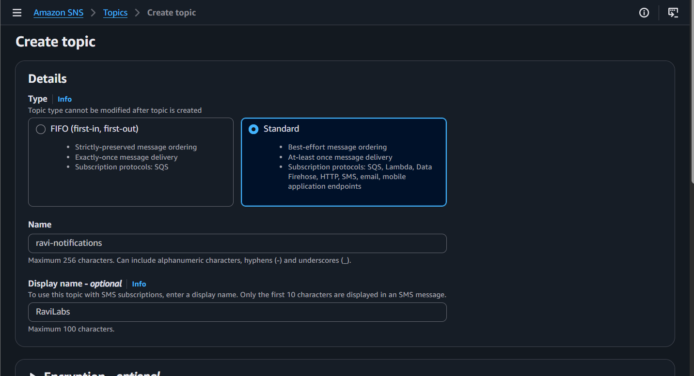
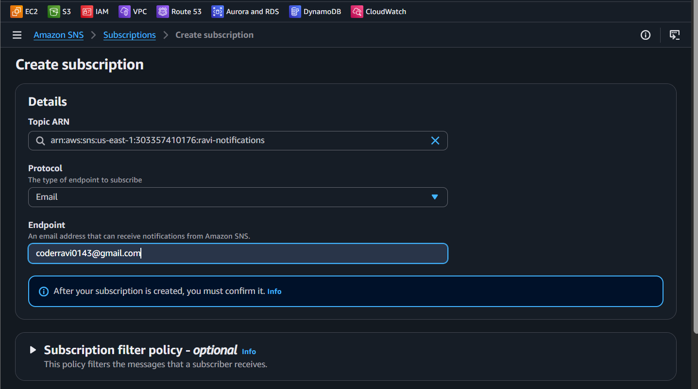
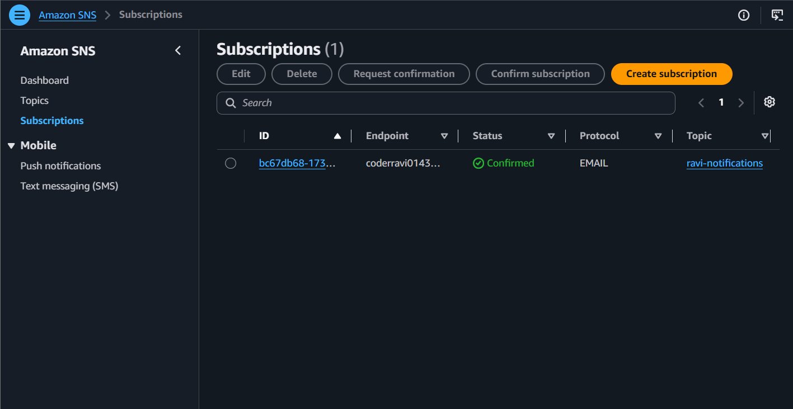
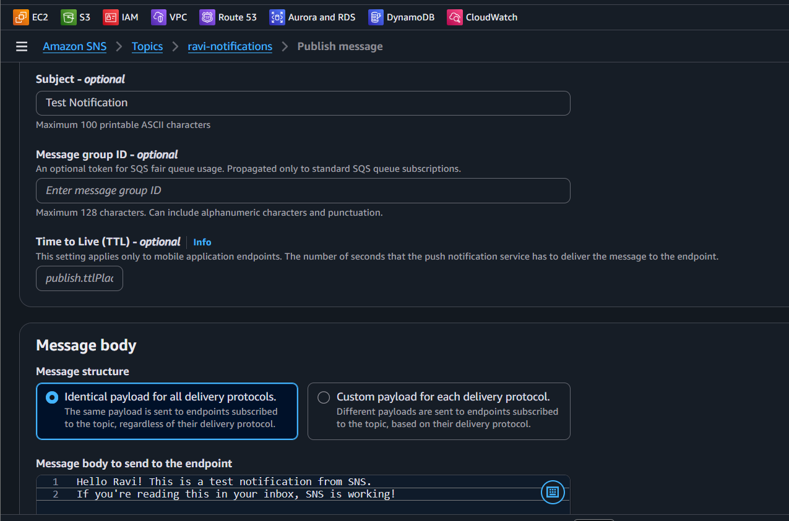
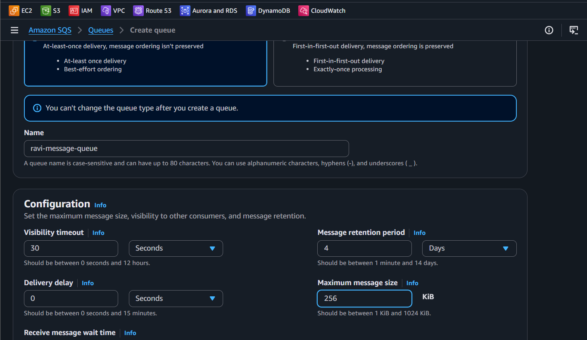
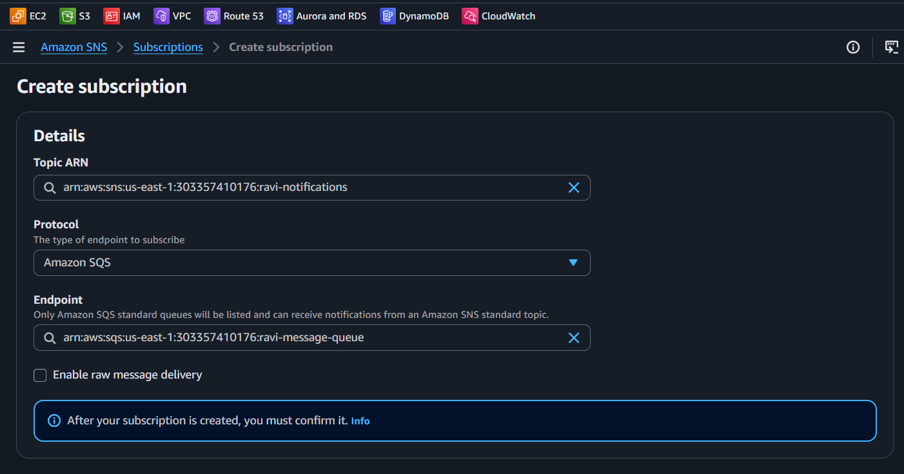
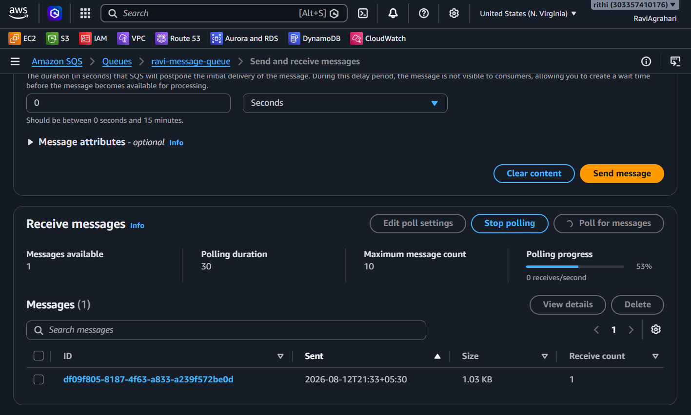
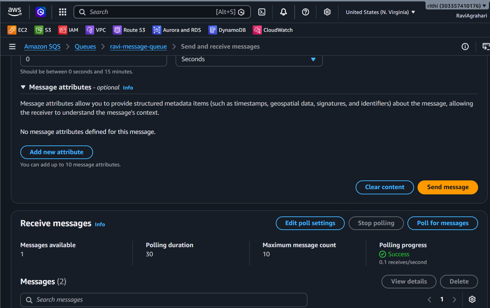
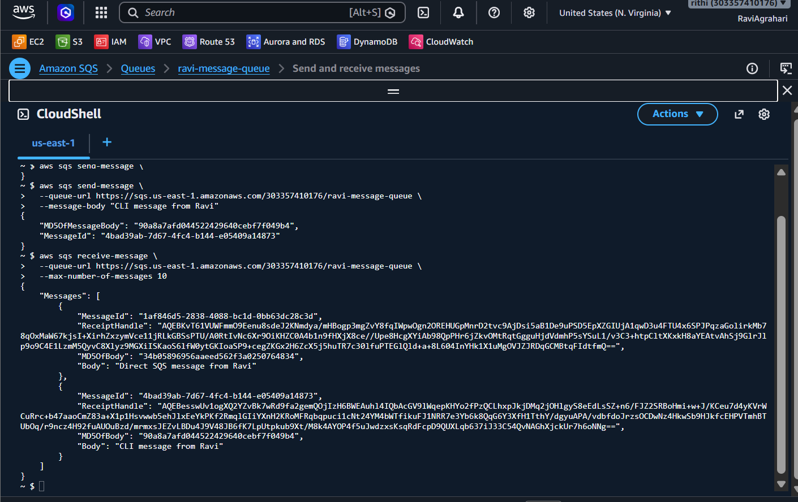

<div align="center">


# Lab 17 — SNS and SQS: Messaging


</div>

> "SNS is like a megaphone — one message, everyone hears it. SQS is like a mailbox — messages wait until you're ready." — Rithu

---

<details>
<summary><b>🎭 Ravi & Rithu's Coffee Break Chat</b></summary>

**Ravi:** "SNS and SQS sound like a law firm."

**Rithu:** "SNS is like a megaphone - screams to everyone. SQS is like a mailbox - messages wait until someone picks them up."

**Ravi:** "So SNS is loud, SQS is patient?"

**Rithu:** "That's... actually poetic. I'll allow it."

</details>

## 📋 Table of Contents

- [🎯 Objective](#-objective)
- [📊 Lab Progress](#-lab-progress)
- [🤔 In Plain English](#-in-plain-english)
- [🧠 Prerequisites](#-prerequisites)
- [💰 Cost Warning](#-cost-warning)
- [🏗️ Architecture](#️-architecture)
- [🛠️ Step-by-Step Instructions](#️-step-by-step-instructions)
- [✅ Validation Checklist](#-validation-checklist)
- [🧹 Cleanup (IMPORTANT!)](#-cleanup-important)
- [🧠 Memory Tips](#-memory-tips)
- [🎓 What You Learned](#-what-you-learned)
- [🎮 Test Yourself](#-test-yourself-no-peeking-)
- [🆚 Pro Tip vs Noob Tip](#-pro-tip-vs-noob-tip)
- [🔗 What's Next?](#-whats-next)
- [❓ Troubleshooting](#-troubleshooting)

---

<div align="center">

## 📊 Lab Progress

`[██░░░░░░░░░░░░░░░░░░] 5% — Let's Begin!`

</div>

---

## 🤔 In Plain English

> **What is this, really?** Two cousins with different jobs. **SNS** is a **loudspeaker** — it *pushes* one message to many subscribers instantly (email, SMS, Lambda, SQS...). **SQS** is a **mailbox** — it *stores* messages until a worker *pulls* them. Together (SNS → SQS) they form the **fan-out pattern**: one announcement, many listeners, zero lost messages. 📣
>
> 🌍 **Why you should care:** Every big system decouples its parts with messages — order placed → email sent → inventory updated — so a slow worker never blocks the whole shop.

---

## 🎯 Objective

In this lab, you will explore two of AWS's core messaging services: **Simple Notification Service (SNS)** and **Simple Queue Service (SQS)**. You'll create topics, subscriptions, and queues — and connect them together to build a real **fan-out messaging pattern**.

**By the end of this lab you will be able to:**
- Create and publish to an SNS topic
- Subscribe to an SNS topic via email
- Create an SQS queue
- Connect SNS to SQS (fan-out pattern)
- Send and receive messages via the SQS console and AWS CLI

---

## 🧠 Prerequisites

- [ ] Completed [Lab 16 — IAM: Users, Groups, Roles, Policies](../16%20-%20IAM%20-%20Users%2C%20Groups%2C%20Roles%2C%20Policies/README.md)
- [ ] AWS account with root or admin access
- [ ] A working email address you can check in real-time
- [ ] AWS CLI configured (for Step 8)

> 
> If you don't have AWS CLI configured yet, that's okay — Steps 1 through 7 use the console only. Step 8 is CLI-only and is optional.

---

## 💰 Cost Warning

**This lab costs less than $1!** 💸

- **SNS:** Free Tier includes 1 million publishes, 100,000 HTTP deliveries, and 1,000 email deliveries per month.
- **SQS:** Free Tier includes 1 million requests per month.

⚠️ **IMPORTANT:** Delete all resources (topic, subscriptions, queue) after the lab to avoid any unexpected charges. A forgotten SQS queue receiving test messages can add up over months!

> **Ravi's Mistake of the Day:** I published a message to an SNS topic with 10,000 subscribers and tested it 50 times. SNS charges $0.50 per 100,000 notifications. My "quick test" cost more than my lunch.

---

## 🏗️ Architecture

```
                    ┌──────────────────┐
                    │   SNS Topic       │
                    │ ravi-notifications│
                    └────────┬─────────┘
                             │
              ┌──────────────┼──────────────┐
              │              │              │
              ▼              ▼              ▼
     ┌─────────────┐ ┌──────────────┐ ┌──────────────┐
     │  Email       │ │  SQS Queue   │ │  (Future:    │
     │ Subscription │ │ravi-message  │ │  Lambda,     │
     │              │ │   -queue     │ │  HTTP, etc.) │
     └─────────────┘ └──────────────┘ └──────────────┘

          This is the FAN-OUT pattern:
          One message → multiple subscribers
```

> **Did You Know?** SQS can hold an unlimited number of messages for up to 14 days. Messages wait in the queue until a consumer processes them. It's like a to-do list that never forgets.

---

## 🛠️ Step-by-Step Instructions

> 

1. Sign in to the **AWS Management Console**.
2. In the search bar at the top, type **SNS** and click on **Simple Notification Service**.
3. In the left navigation pane, click **Topics**.
4. Click the orange **Create topic** button.
5. **Type:** ⚫ Standard (not FIFO — Standard is fine for this lab)
6. **Name:** `ravi-notifications`
7. **Display name:** `RaviLabs`
   - The display name appears in the "From" field of email notifications.
8. Leave all other settings as default.
9. Click **Create topic**.

> 📸 [Screenshot: The SNS topic creation form with ravi-notifications filled in]


You should see a success message: "Topic ravi-notifications created successfully."

> 
> SNS Standard topics support at-least-once delivery and are best for most use cases. FIFO topics guarantee order but cost more. For labs and learning, Standard is perfect!

---

> 

1. You should be on the `ravi-notifications` topic page after creation. If not, go to **SNS → Topics → ravi-notifications**.
2. Click the **Create subscription** button.
3. **Protocol:** Select **Email** from the dropdown.
4. **Endpoint:** Type your real email address (e.g., `ravi@example.com`).
   - ⚠️ Use a real email you can check RIGHT NOW!
5. Click **Create subscription**.

> 📸 [Screenshot: The subscription creation form showing Email protocol with your email address]


6. The subscription will appear with a **Pending confirmation** status.

#### ⚡ CONFIRM THE EMAIL (Critical Step!):

1. Go to your email inbox.
2. Look for an email from **"AWS Notifications"** with the subject **"AWS Notification - Subscription Confirmation"**.
3. Open the email and click the **"Confirm subscription"** link.
4. You'll see a page saying "You have subscribed to this topic."

> ⚠️ If you don't see the email, check your **spam/junk folder**! AWS notification emails sometimes end up there.

5. Go back to the SNS console → **Subscriptions** → You should now see the status change to **Confirmed**.

> 📸 [Screenshot: The confirmed subscription showing status "Confirmed" in the SNS console]


> 
> SNS uses a "confirm the owner" pattern — this prevents people from subscribing random email addresses to topics. Think of it like a double opt-in for newsletters, but for AWS!

---

> 

1. Go to **SNS → Topics → ravi-notifications**.
2. Click the **Publish message** button.
3. **Subject (optional):** `Test Notification`
4. **Message body:** Type:
   ```
   Hello Ravi! This is a test notification from SNS.
   If you're reading this in your inbox, SNS is working!
   ```
5. Leave other settings as default.
6. Click **Publish message**.
7. You should see a success message: "Your message has been published."

> 📸 [Screenshot: The publish message form filled out with the test message]


8. **Check your email inbox** — you should receive the notification within seconds!

> 🎉 If you received the email, 恭喜! (That means "congratulations" in Chinese!) Your SNS topic and subscription are working!

> 
> In the real world, SNS is used for everything from alerting on-call engineers when a server goes down, to sending SMS notifications to customers, to triggering Lambda functions. It's a Swiss Army knife of notifications!

---

> 

1. In the AWS search bar, type **SQS** and click on **Simple Queue Service**.
2. Click the orange **Create queue** button.
3. **Type:** ⚫ Standard (not FIFO)
4. **Name:** `ravi-message-queue`
5. Leave all other configuration settings as **defaults** (these are fine for the lab).
   - Visibility timeout: 30 seconds ✅
   - Message retention period: 4 days ✅
   - Maximum message size: 256 KB ✅
   - Delivery delay: 0 seconds ✅
6. Click **Create queue**.

> 📸 [Screenshot: The SQS queue creation page showing ravi-message-queue with default settings]


> 
> Think of SQS like a To-Do list that persists. Messages sit in the queue until someone (or something) picks them up and processes them. Even if the consumer crashes, the message stays there and can be retried. Reliable!

---

> 

This is where the magic happens! We'll make SNS automatically forward messages to SQS.

1. Go to **SNS → Topics → ravi-notifications**.
2. Click **Create subscription**.
3. **Protocol:** Select **SQS** from the dropdown.
4. **Endpoint:** Select `ravi-message-queue` from the dropdown list.
   - If it doesn't appear, type the ARN manually: `arn:aws:sqs:us-east-1:<your-account-id>:ravi-message-queue`
5. Click **Create subscription**.

> 📸 [Screenshot: The subscription form showing SQS protocol with ravi-message-queue selected]


6. Wait a few seconds — the subscription status should change to **Confirmed** automatically.
   - SNS-to-SQS subscriptions confirm automatically (no email click needed!) because AWS handles the authentication internally.

**What is Fan-out?**

```
Fan-out Pattern:
    ┌─────────────┐
    │  SNS Topic   │
    └──────┬──────┘
           │ ONE message published
     ┌─────┼─────┬──────────┐
     ▼     ▼     ▼          ▼
   Email  SQS  Lambda    HTTP
   (you) (queue) (func)  (webhook)

Each subscriber gets a COPY of the same message!
```

> 
> The fan-out pattern is incredibly powerful. Imagine you publish one event — "New user signed up" — and SNS simultaneously:
> - Sends a welcome email (email subscription)
> - Adds the user to a processing queue (SQS subscription)
> - Triggers a Lambda to create their profile (Lambda subscription)
> - Notifies a webhook for analytics (HTTP subscription)
>
> All from ONE publish. That's the power of decoupled architecture!

---

> 

1. Go to **SNS → Topics → ravi-notifications**.
2. Click **Publish message**.
3. **Subject:** `Fan-out Test`
4. **Message body:**
   ```
   This message should appear in BOTH:
   1. Ravi's email inbox
   2. The SQS queue ravi-message-queue
   ```
5. Click **Publish message**.

#### Check Email:
- Check your inbox — you should receive the email notification.

#### Check SQS:
1. Go to **SQS → Queues → ravi-message-queue**.
2. Click **Send and receive messages**.
3. Click **Poll for messages** (bottom of the page).
4. Wait a few seconds — you should see the message appear!

> 📸 [Screenshot: SQS "Send and receive messages" page showing the message received from SNS]



5. Click on the message to view its body. You'll see:
   - The original message body
   - SNS metadata (topic ARN, subscription ARN, etc.)
   - Message ID, timestamps, etc.

🎉 **The fan-out pattern is working!** One message published to SNS arrived at BOTH the email subscription AND the SQS queue!

> 
> Notice how the SQS message has extra metadata from SNS? That's how you know the message came through the fan-out pattern vs. being sent directly to SQS. In a real application, you can use this metadata to trace the message origin.

---

> 

SQS can also receive messages directly (without SNS).

1. Go to **SQS → Queues → ravi-message-queue**.
2. Click **Send and receive messages**.
3. Scroll up to the **Send message** section.
4. **Message body:** Type:
   ```
   Direct SQS message from Ravi
   ```
5. Click **Send message**.
6. Scroll down to **Receive messages** section.
7. Click **Poll for messages**.
8. You should see **2 messages** in the queue (the SNS-forwarded one + this direct one).

> 📸 [Screenshot: SQS showing 2 messages — one from SNS, one direct]


> 
> In real applications, direct SQS messages are often used for task queues. For example, when you upload a video to YouTube, a message gets sent to SQS saying "process this video." A fleet of workers then picks up these messages and processes them in parallel.

---

> 

Let's also interact with SQS using the command line.

1. Open your terminal (with AWS CLI configured).

#### Get the Queue URL:
```bash
aws sqs get-queue-url --queue-name ravi-message-queue
```
Copy the `QueueUrl` from the output — you'll need it for the next commands.

#### Send a Message:
```bash
aws sqs send-message \
  --queue-url <YOUR-QUEUE-URL> \
  --message-body "CLI message from Ravi"
```

Expected output:
```json
{
    "MD5OfMessageBody": "abc123...",
    "MessageId": "12345678-1234-1234-1234-123456789012"
}
```

#### Receive Messages:
```bash
aws sqs receive-message \
  --queue-url <YOUR-QUEUE-URL> \
  --max-number-of-messages 10
```

You should see messages in the output, each with a `ReceiptHandle`.

#### Delete a Message (important — otherwise it stays visible again after visibility timeout):
```bash
aws sqs delete-message \
  --queue-url <YOUR-QUEUE-URL> \
  --receipt-handle <RECEIPT-HANDLE-FROM-ABOVE>
```

> 📸 [Screenshot: Terminal showing all three SQS CLI commands and their output]


> 
> Always delete messages after processing them! If you don't, the message becomes visible again after the visibility timeout (30 seconds by default), and another worker might process it again. This is called "at-least-once delivery" — it means the message might be delivered more than once, so your code should be idempotent (handling the same message twice shouldn't cause problems).

---

> 

Let's confirm everything is working:

1. **SNS Topic exists:** Go to SNS → Topics → `ravi-notifications` should appear.
2. **SNS Subscriptions exist:** 2 subscriptions — one Email (confirmed), one SQS (confirmed).
3. **SQS Queue exists:** Go to SQS → Queues → `ravi-message-queue` should appear.
4. **Email received:** You received at least one email notification from SNS.
5. **SQS has messages:** Poll the queue and see messages from both SNS and direct sends.

---

## ✅ Validation Checklist

| # | Check | Status |
|---|-------|--------|
| 1 | SNS topic `ravi-notifications` created | ☐ |
| 2 | Email subscription created and confirmed | ☐ |
| 3 | Test email received after publishing to SNS | ☐ |
| 4 | SQS queue `ravi-message-queue` created | ☐ |
| 5 | SNS-to-SQS subscription created and auto-confirmed | ☐ |
| 6 | Fan-out message appeared in both email AND SQS | ☐ |
| 7 | Direct message sent to SQS and received via polling | ☐ |
| 8 | CLI send/receive/delete worked (Step 8) | ☐ |

---

> **Achievement Unlocked:** Message Master! SNS and SQS operational.

---

## 🧹 Cleanup (IMPORTANT!)

**Clean up all SNS and SQS resources to avoid ongoing charges!**

### Delete SQS Queue:
1. Go to **SQS → Queues**.
2. Select `ravi-message-queue`.
3. Click **Delete** → Type `ravi-message-queue` to confirm → **Delete**.

### Delete SNS Subscriptions:
1. Go to **SNS → Subscriptions**.
2. Select both subscriptions (Email and SQS).
3. Click **Delete** → Confirm → **Delete**.
   - ⚠️ You must delete subscriptions BEFORE you can delete the topic!

### Delete SNS Topic:
1. Go to **SNS → Topics**.
2. Select `ravi-notifications`.
3. Click **Delete** → Type `ravi-notifications` to confirm → **Delete**.

> 
> The order matters! You can't delete an SNS topic that has active subscriptions. Always delete subscriptions first, then the topic. It's like cleaning your room — you have to pick up the clothes before you can vacuum the floor. 🧹

---

## 🧠 Memory Tips

Stick these in your brain and they'll never leave. 🧲

| 🧠 Memory Hook | Remember it like... |
|---|---|
| **SNS = loudspeaker (PUSH)** | One shout, many ears. Subscribers get it **immediately**, whether they asked or not. 📣 |
| **SQS = mailbox (PULL)** | Messages **wait** in the queue until a worker comes to fetch them. Nobody pushes. 📬 |
| **Fan-out pattern** | One message in SNS → delivered to **multiple subscribers at once** (email + SQS + Lambda). 🌊 |
| **Visibility timeout = "I'm eating this"** | While a worker processes a message, it's **hidden** from other workers. If it crashes, the message comes back. 🍽️ |
| **SNS pushes, SQS polls** | If they ask "who pushes?" → SNS. "Who pulls?" → SQS. Commit it to memory. 🧠 |

> 🗣️ **Rithu:** *"SNS is a megaphone, SQS is a post office. Once you get that, every messaging architecture makes sense."

---

## 🎓 What You Learned

In this lab, you learned:

1. **SNS (Simple Notification Service)** — A pub/sub messaging service that pushes notifications to subscribers.
2. **SNS Topics** — Logical access points for publishing messages.
3. **SNS Subscriptions** — Endpoints that receive messages (email, SQS, Lambda, HTTP, SMS, etc.).
4. **SQS (Simple Queue Service)** — A managed message queue that stores messages until consumed.
5. **Fan-out Pattern** — Publishing one message to SNS and having it delivered to multiple subscribers simultaneously.
6. **Message Polling** — SQS consumers poll for messages (pull-based model).
7. **Message Lifecycle** — Messages are hidden during processing (visibility timeout) and deleted after successful processing.

---

## 🎮 Test Yourself! (No Peeking 👀)

**Q1:** Which service *pushes* messages to subscribers, and which one *pulls* them?

<details><summary>👀 Show answer</summary>

**A:** **SNS pushes** (loudspeaker 📣) and **SQS pulls** (mailbox 📬). Push = proactive delivery; pull = waiting for a worker to poll.

</details>

**Q2:** What is the fan-out pattern?

<details><summary>👀 Show answer</summary>

**A:** Publishing **one message to SNS** and having it **delivered to many subscribers at once** — email, SQS queues, Lambda, SMS. One-to-many. 🌊

</details>

**Q3:** A worker grabs a message but crashes halfway. What happens to the message?

<details><summary>👀 Show answer</summary>

**A:** The **visibility timeout** expires and the message **returns to the queue** for another worker. No message is ever lost. 🍽️→📬

</details>

### 🔥 Bonus Challenge

Add a **second SQS queue** as another SNS subscriber. Publish ONE message and watch BOTH queues receive it — the fan-out pattern in action. Then process the same message from each queue and see the lifecycle (available → in flight → deleted). 🌀

> 💪 **Rithu:** *"If you can draw the fan-out diagram on a whiteboard, you understand distributed systems better than you think."

---

### 🆚 Pro Tip vs Noob Tip

| | Approach |
|---|---|
| **Noob Tip** | Connect services directly — one slow service blocks the whole pipeline |
| **Pro Tip** | Decouple with SNS/SQS. Slow workers just drain the queue; nothing breaks |

---

## 🔗 What's Next?

You now understand messaging! Let's use those skills to build something more advanced — a **serverless function triggered by S3 events**.

👉 **[Lab 18 — Lambda: S3 Triggered Function](../18%20-%20Lambda%20-%20S3%20Triggered%20Function/README.md)**

In the next lab, you'll write a Lambda function in Python that automatically processes files uploaded to S3!

---

## ❓ Troubleshooting

<details>
<summary><strong>"Subscription confirmation" email never arrives</strong></summary>

**Cause:** AWS notification emails sometimes go to spam.
**Fix:** Check your spam/junk folder. If still not there, wait 5 minutes and try creating the subscription again. Make sure the email address is correct.

</details>

<details>
<summary><strong>SNS-to-SQS subscription shows "Pending" and never confirms</strong></summary>

**Cause:** The SQS queue ARN might be incorrect, or the queue policy doesn't allow SNS.
**Fix:** Check the queue policy. Go to SQS → ravi-message-queue → Permissions → make sure SNS is allowed. AWS usually auto-configures this, but if it fails, you can add a policy allowing the SNS topic to send messages.

</details>

<details>
<summary><strong>SQS "Poll for messages" shows nothing</strong></summary>

**Cause:** The message might have already been received by another poll, or the visibility timeout hasn't expired.
**Fix:** Wait 30 seconds (the default visibility timeout) and try polling again. Also check that you're polling the correct queue.

</details>

<details>
<summary><strong>CLI commands fail with "queue does not exist"</strong></summary>

**Cause:** The queue URL is wrong or the region is different.
**Fix:** Use `aws sqs get-queue-url --queue-name ravi-message-queue --region us-east-1` to get the correct URL.

</details>

<details>
<summary><strong>"AccessDenied" on CLI commands</strong></summary>

**Cause:** Your IAM user/role doesn't have SQS permissions.
**Fix:** Attach the `AmazonSQSFullAccess` policy to your IAM user/role (for lab purposes only — in production, use least-privilege policies).

</details>

> 
> Messaging services are all about retries and idempotency. If something goes wrong, the message stays in the queue and can be retried. Design your message handlers to handle duplicates gracefully!

---

<div align="center">


> 🎉 **Amazing work, Ravi!** You've mastered SNS and SQS — the messaging backbone of AWS. The fan-out pattern is used in countless real-world architectures. You're building serious cloud skills! 🚀

</div>
