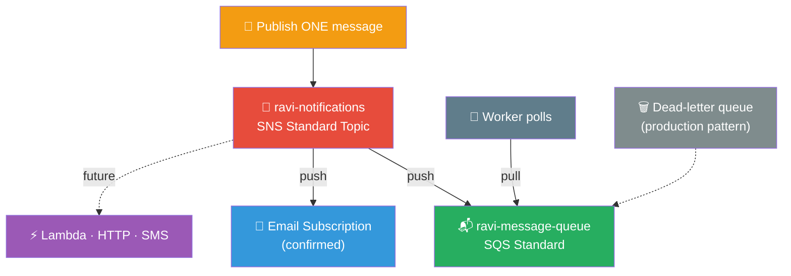

# 📬 Lab 17 - SNS and SQS: Messaging

> 📅 **Updated:** 21 August 2026 | ⏱️ **Duration:** ~25 minutes | 📊 **Level:** Beginner


> ### 🗣️ *"SNS is like a megaphone — one message, everyone hears it. SQS is like a mailbox — messages wait until you're ready."*
> — **Rithu** 📣

<details>
<summary><b>🎭 Ravi & Rithu's Coffee Break Chat</b></summary>

**Ravi:** "SNS and SQS sound like a law firm."

**Rithu:** "SNS is like a megaphone — screams to everyone. SQS is like a mailbox — messages wait until someone picks them up."

**Ravi:** "So SNS is loud, SQS is patient?"

**Rithu:** "That's... actually poetic. I'll allow it."

</details>

---

## 🎯 What You'll Master

| Skill | Description |
|-------|-------------|
| 📣 **SNS Topics** | Create + publish to `ravi-notifications` |
| 📧 **Email Subscriptions** | Double opt-in confirmation flow |
| 📬 **SQS Queues** | Standard queue, polling for messages |
| 🌊 **Fan-out Pattern** | One publish → email AND queue simultaneously |
| 💻 **CLI Messaging** | send / receive / delete via AWS CLI |

> 💡 **Pro Tip:** Every big system decouples its parts with messages — order placed → email sent → inventory updated — so a slow worker never blocks the whole shop.

---

## 🚦 Before You Start

### ✅ Prerequisites Checklist
- [ ] ✅ **[Lab 16](../16%20-%20IAM%20-%20Users,%20Groups,%20Roles,%20Policies/README.md)** complete
- [ ] 📧 Real email you can check RIGHT NOW
- [ ] 💻 AWS CLI configured *(only Step 8 — Steps 1–7 are console-only)*

### 📦 What You Need (and Don't)
| Required | Optional |
|----------|----------|
| ~25 minutes | CLI configured |
| Inbox access for confirmation emails | |

---

## 💰 Cost & Safety First

**Under $1!** 💸

- **SNS Free Tier:** 1M publishes, 100K HTTP deliveries, 1K email deliveries/month
- **SQS Free Tier:** 1M requests/month

> ⚠️ Delete everything after the lab — a forgotten queue receiving test messages adds up over months!

> 💸 **Ravi's Mistake of the Day:** *"I published to a topic with 10,000 subscribers 50 times — 500,000 notifications. At $0.50/million that's pocket change, but at real-world scale those 'quick tests' add up fast."*

### 🏷️ Naming Convention

| Resource | Name |
|----------|------|
| 📣 SNS Topic | `ravi-notifications` (display name: `RaviLabs`) |
| 📬 SQS Queue | `ravi-message-queue` |

---

## 🧠 How It All Fits Together



### 🔑 Key Concepts
| Concept | Remember It Like... |
|---------|---------------------|
| **SNS = loudspeaker (PUSH)** | One shout, many ears — delivered immediately whether asked or not 📣 |
| **SQS = mailbox (PULL)** | Messages wait until a worker fetches them 📬 |
| **Fan-out** | One message → multiple subscribers get copies at once 🌊 |
| **Visibility timeout = "I'm eating this"** | Message hidden while processed; comes back if worker crashes 🍽️ |
| **Retention** | SQS holds messages up to 14 days — a to-do list that never forgets |

---

## 🪜 Step-by-Step Guide

### 🟢 Step 1: Create the SNS Topic 📣

<details>
<summary><b>📣 Expand for topic creation</b></summary>

1. Console search → **Simple Notification Service**
2. Left nav → **Topics** → ➕ **Create topic**
3. Type: ⚫ **Standard** (not FIFO)
4. Name: `ravi-notifications`
5. Display name: `RaviLabs` *(appears in the "From" field of emails)*
6. Defaults everywhere else → ✅ **Create topic**

</details>


> 🗣️ **Rithu's Tip:** *"Standard topics = at-least-once delivery, best for most cases. FIFO guarantees order but costs more. For labs, Standard is perfect!"*

---

### 🟢 Step 2: Add an Email Subscription 📧

<details>
<summary><b>📧 Expand for subscription steps</b></summary>

1. On the `ravi-notifications` topic page → **Create subscription**
2. Protocol: **Email** · Endpoint: your real inbox address
3. ✅ **Create subscription** → status shows **Pending confirmation**

**⚡ CONFIRM THE EMAIL (critical!):**

4. Check your inbox for **"AWS Notification - Subscription Confirmation"** from AWS Notifications
5. Click **Confirm subscription** → browser says *"You have subscribed to this topic."*
6. Back in SNS console → status flips to **Confirmed** ✅

   > ⚠️ No email? Check spam/junk!

</details>


> 🗣️ **Rithu's Tip:** *"It's a 'confirm the owner' pattern — stops people subscribing random addresses. Double opt-in for newsletters, but for AWS!"*

---

### 🟢 Step 3: Publish a Test Message 🚀

<details>
<summary><b>🚀 Expand for publishing</b></summary>

1. **Topics → ravi-notifications** → **Publish message**
2. Subject: `Test Notification`
3. Body:

```
Hello Ravi! This is a test notification from SNS.
If you're reading this in your inbox, SNS is working!
```

4. ✅ **Publish message** → check your inbox within seconds! 🎉

</details>


> 🗣️ **Rithu's Tip:** *"In the real world, SNS alerts on-call engineers, sends SMS to customers, and triggers Lambdas — the Swiss Army knife of notifications!"*

---

### 🟢 Step 4: Create the SQS Queue 📬

<details>
<summary><b>📬 Expand for queue creation</b></summary>

1. Console search → **Simple Queue Service** → ➕ **Create queue**
2. Type: ⚫ **Standard** · Name: `ravi-message-queue`
3. Keep all defaults:

   | Setting | Default |
   |---------|---------|
   | Visibility timeout | 30 s (max 12 h) |
   | Message retention | 4 days (max 14) |
   | Max message size | 256 KB |
   | Delivery delay | 0 s |

4. ✅ **Create queue**

</details>


> 🗣️ **Rithu's Tip:** *"SQS is a to-do list that never forgets — consumer crashes? Message stays and retries. In production, pair queues with a dead-letter queue (DLQ): after maxReceiveCount failures, messages move there for inspection instead of vanishing."*

---

### 🟢 Step 5: Connect SNS → SQS (Fan-out!) 🌊

<details>
<summary><b>🌊 Expand for fan-out wiring</b></summary>

1. **SNS → Topics → ravi-notifications** → **Create subscription**
2. Protocol: **SQS** · Endpoint: select `ravi-message-queue` from the dropdown
   - Not listed? Paste the ARN manually: `arn:aws:sqs:us-east-1:<account-id>:ravi-message-queue`
3. ✅ **Create subscription** → auto-confirms in seconds!

   > 💡 SNS→SQS subscriptions confirm automatically — no email click. AWS handles auth internally.

**Why fan-out rocks:** publish ONE event — "New user signed up" — and SNS simultaneously sends the welcome email, queues the user for processing, triggers a profile-building Lambda, and pings an analytics webhook. All from ONE publish!

</details>


---

### 🟢 Step 6: Test the Fan-out 🧪

<details>
<summary><b>🧪 Expand for the integration test</b></summary>

1. **Publish** on `ravi-notifications`: Subject `Fan-out Test`, body:

```
This message should appear in BOTH:
1. Ravi's email inbox
2. The SQS queue ravi-message-queue
```

2. ✅ **Check email** → notification arrives
3. ✅ **Check SQS:** Queues → `ravi-message-queue` → **Send and receive messages** → **Poll for messages** (long polling, waits up to 20 s)
4. Open the message — you'll see the original body **plus SNS metadata** (topic ARN, subscription ARN)

🎉 **One publish arrived at BOTH subscribers!**

</details>


> 🗣️ **Rithu's Tip:** *"The SNS metadata inside the message tells you it arrived via fan-out vs a direct send — use it to trace message origin in real apps!"*

---

### 🟢 Step 7: Send Directly to SQS ✉️

<details>
<summary><b>✉️ Expand for direct sends</b></summary>

1. **SQS → ravi-message-queue** → **Send and receive messages**
2. **Send message** section → body: `Direct SQS message from Ravi` → **Send message**
3. **Poll for messages** → you should see **2 messages** (the SNS-forwarded one + this direct one)

</details>


> 🗣️ **Rithu's Tip:** *"Direct SQS messages power task queues — upload a video, SQS gets 'process this video,' a fleet of workers chews through them in parallel."*

---

### 🟢 Step 8: SQS via AWS CLI 💻

<details>
<summary><b>💻 Expand for CLI commands</b></summary>

**Get the queue URL:**

```bash
aws sqs get-queue-url --queue-name ravi-message-queue
```

**Send a message:**

```bash
aws sqs send-message \
  --queue-url <YOUR-QUEUE-URL> \
  --message-body "CLI message from Ravi"
```

```json
{
    "MD5OfMessageBody": "abc123...",
    "MessageId": "12345678-1234-1234-1234-123456789012"
}
```

**Receive messages:**

```bash
aws sqs receive-message \
  --queue-url <YOUR-QUEUE-URL> \
  --max-number-of-messages 10
```

**Delete a message** (otherwise it reappears after the visibility timeout!):

```bash
aws sqs delete-message \
  --queue-url <YOUR-QUEUE-URL> \
  --receipt-handle <RECEIPT-HANDLE-FROM-ABOVE>
```

</details>


> 🗣️ **Rithu's Tip:** *"Always delete after processing! Otherwise the message becomes visible again post-timeout and another worker may double-process — that's 'at-least-once delivery.' Make handlers idempotent so duplicates cause zero harm."*

---

## ✅ Validation Checklist

| # | Check | Status |
|---|-------|--------|
| 1️⃣ | SNS topic `ravi-notifications` created | ☐ ✅ |
| 2️⃣ | Email subscription created + confirmed | ☐ ✅ |
| 3️⃣ | Test email received after publishing | ☐ ✅ |
| 4️⃣ | SQS queue `ravi-message-queue` created | ☐ ✅ |
| 5️⃣ | SNS→SQS subscription auto-confirmed | ☐ ✅ |
| 6️⃣ | Fan-out message hit BOTH email AND queue | ☐ ✅ |
| 7️⃣ | Direct message sent + polled successfully | ☐ ✅ |
| 8️⃣ | CLI send/receive/delete worked | ☐ ✅ |

---

## 🧹 Cleanup (Follow Order!)

Order matters — you can't delete a topic with active subscriptions! 🧹

| Step | Action | Console Location |
|------|--------|------------------|
| 1️⃣ 📬 | Delete `ravi-message-queue` (type name to confirm) | SQS → Queues |
| 2️⃣ 🔗 | Delete BOTH subscriptions (email + SQS) | SNS → Subscriptions |
| 3️⃣ 📣 | Delete `ravi-notifications` topic (type name to confirm) | SNS → Topics |

> 🗣️ **Rithu's Tip:** *"Subscriptions first, then the topic — like cleaning your room: pick up the clothes before you vacuum the floor."* 🧹

---

## 🚀 Level Ups (Post-Core Lab)

| Challenge | What to Try | Notes |
|-----------|-------------|-------|
| 🌀 **Double Fan-out** | Add a second SQS queue as another subscriber; publish once, watch both fill | Then process each and watch available → in flight → deleted |
| ⚰️ **DLQ Setup** | Add a dead-letter queue with maxReceiveCount = 3 | Production-grade resilience |
| 🔐 **Queue Policy** | Inspect the auto-generated policy allowing SNS to send | Understand the IAM behind fan-out |

---

## 🆘 Troubleshooting Quick Reference

| 🔍 Issue | 💡 Likely Cause | 🔧 Fix |
|-------|--------------|-----|
| 📧 Confirmation email never arrives | Spam folder / wrong address | Check junk; wait 5 min; recreate subscription |
| 🔗 SNS→SQS stuck "Pending" | Wrong queue ARN or missing queue policy | Check queue Permissions tab allows SNS; AWS usually auto-configures |
| 📬 Poll returns nothing | Already received / hidden by visibility timeout | Wait 30 s and re-poll; use Purge to wipe the queue |
| ❌ CLI "queue does not exist" | Wrong URL or region | `aws sqs get-queue-url --queue-name ravi-message-queue --region us-east-1` |
| 🚫 CLI AccessDenied | Missing SQS permissions | Attach `AmazonSQSFullAccess` (lab only — least privilege in prod!) |

> 🗣️ **Rithu's Tip:** *"Messaging is all about retries and idempotency. The message stays queued when things go wrong — design handlers that shrug off duplicates!"*

---

## 🎮 Test Yourself! (No Peeking 👀)

**Q1:** Which service pushes, which pulls?

<details><summary>👀 Show answer</summary>

**A:** **SNS pushes** (loudspeaker 📣), **SQS pulls** (mailbox 📬). Push = proactive delivery; pull = workers poll.

</details>

**Q2:** What's the fan-out pattern?

<details><summary>👀 Show answer</summary>

**A:** One message published to SNS → delivered to many subscribers at once (email, SQS, Lambda, SMS). One-to-many. 🌊

</details>

**Q3:** Worker grabs a message, crashes halfway. What happens?

<details><summary>👀 Show answer</summary>

**A:** Visibility timeout expires → message **returns to the queue** for another worker. Nothing lost. 🍽️→📬

</details>

---

## 📚 Official Documentation

- 📣 [What Is Amazon SNS?](https://docs.aws.amazon.com/sns/latest/dg/welcome.html)
- 📬 [What Is Amazon SQS?](https://docs.aws.amazon.com/AWSSimpleQueueService/latest/SQSDeveloperGuide/welcome.html)
- 🌊 [Fanout to SQS Queues](https://docs.aws.amazon.com/sns/latest/dg/sns-sqs-as-subscriber.html)

---

## 🎓 What You Learned

> **The messaging backbone:**
> - 📣 **SNS** → pub/sub push notifications (topics + subscriptions)
> - 📬 **SQS** → managed pull queues (polling, visibility timeout, deletion)
> - 🌊 **Fan-out** → one publish, many subscribers, each gets a copy
> - 🔁 **Lifecycle** → hidden while processing, deleted after success, retried on failure

**Golden Habit:** Decouple with SNS/SQS — slow workers just drain the queue; nothing breaks. 📬

| | Approach |
|---|---|
| 👶 **Noob Way** | Wire services directly — one slow service blocks the whole pipeline |
| 🧙 **Pro Way** | Decouple with SNS/SQS so slow components never break the chain |

---

## ➡️ What's Next?

Messaging mastered! Next: put those skills to work — a serverless function triggered by S3 events. ⚡

🎯 **[Lab 18 - Lambda: S3 Triggered Function](../18%20-%20Lambda%20-%20S3%20Triggered%20Function/README.md)**

---

<div align="center">

### ⭐ Enjoyed this lab? Star the repo & share your feedback!

**Happy Learning!** 🚀☁️

</div>