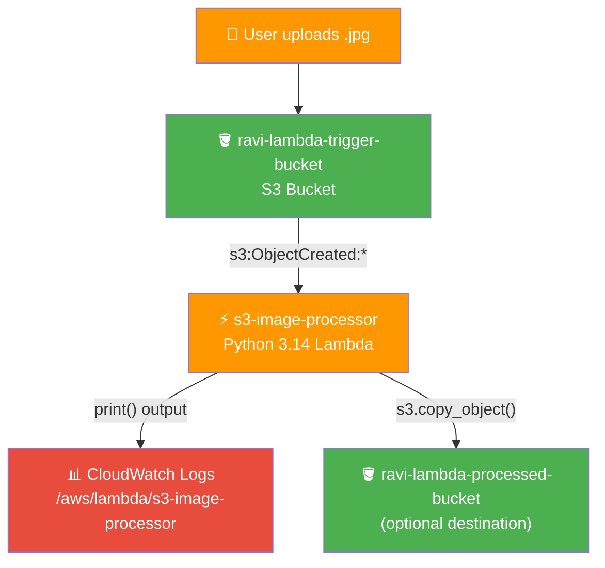
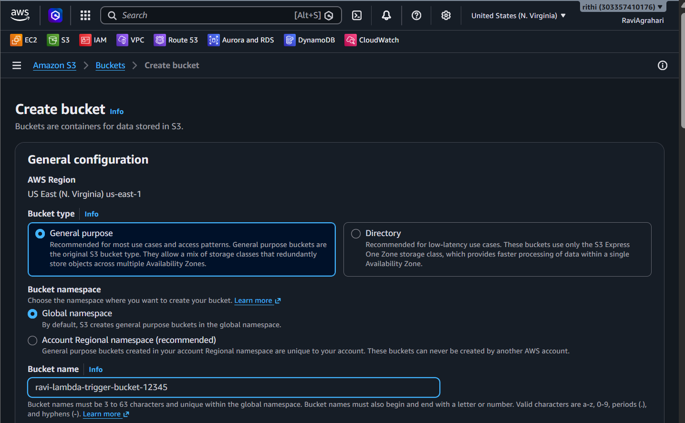
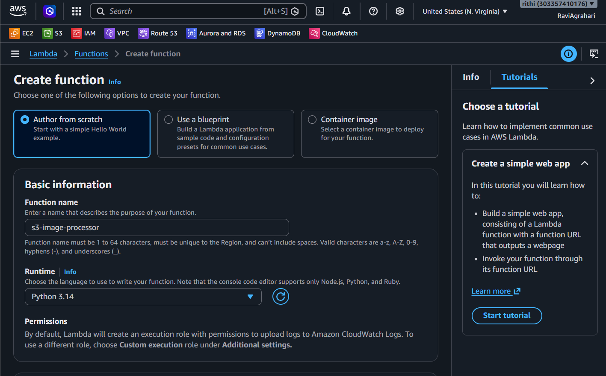
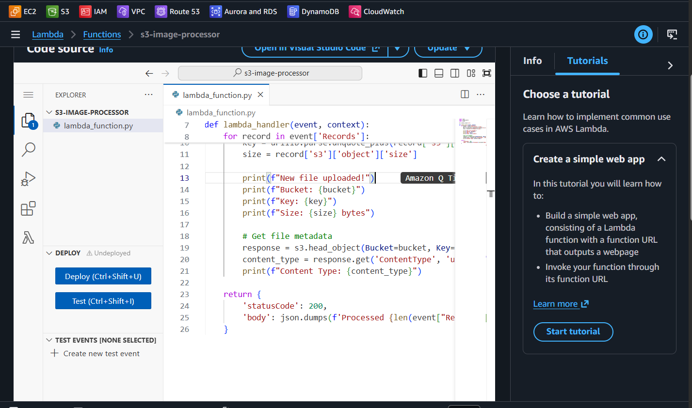
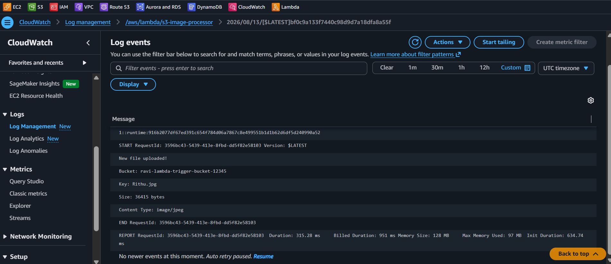
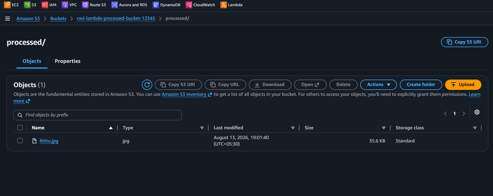

# ⚡ Lab 18 - Lambda: S3 Triggered Function

> 📅 **Updated:** 21 August 2026 | ⏱️ **Duration:** ~35 minutes | 📊 **Level:** Intermediate


> ### 🗣️ *"Lambda is like a vending machine — put something in, get something out, and you don't have to worry about what's inside the machine."*
> — **Rithu** 🎰

<details>
<summary><b>🎭 Ravi & Rithu's Coffee Break Chat</b></summary>

**Ravi:** "Lambda runs code without a server?"

**Rithu:** "Correct! It's like ordering takeout - you get the food without owning a kitchen."

**Ravi:** "What if my code crashes?"

**Rithu:** "Lambda just retries. No servers were harmed in the making of your bug."

</details>

---

## 🎯 What You'll Master

| Skill | Description |
|-------|-------------|
| ⚡ **Lambda Functions** | Write and deploy Python code that runs on demand |
| 🪣 **S3 Event Triggers** | Fire Lambda automatically on file upload |
| 📝 **CloudWatch Logs** | Read `print()` output for debugging Lambda |
| 🔐 **Lambda Execution Role** | IAM role granting Lambda access to S3 |
| 🔄 **Event-Driven Architecture** | React to S3 events without polling |

> 💡 **Pro Tip:** Event-driven serverless is how modern apps process images, resize videos, validate uploads, and trigger pipelines — paying only for the milliseconds the code actually runs.

---

## 🚦 Before You Start

### ✅ Prerequisites Checklist
- [ ] ✅ **[Lab 17](../17%20-%20SNS%20and%20SQS%20-%20Messaging/README.md)** complete
- [ ] 🌍 AWS account with root or admin access
- [ ] 🖼️ A `.jpg` or `.png` image file to upload (any image, even a small one)
- [ ] 🐍 Basic familiarity with Python (don't worry — we'll provide the code!)

### 📦 What You Need (and Don't)
| Required | Optional |
|----------|----------|
| AWS Account (Free Tier friendly) | Postman for API testing |
| A `.jpg` or `.png` image file | Basic Python knowledge |

> 💡 You don't need to be a Python expert for this lab. The code is provided — your job is to understand what it does and how it connects to S3.

---

## 💰 Cost & Safety First

> ⚠️ **Real resources = Real charges.** Lambda itself is generous on Free Tier, but abandoned resources accumulate costs over time.

### 💵 Estimated Cost

| Resource | Cost |
|----------|------|
| ⚡ Lambda (always free) | 1M requests/mo + 400K GB-seconds/mo |
| 🪣 S3 (12 months free tier) | 5 GB storage + 20K GET + 2K PUT/mo |
| 📊 CloudWatch Logs | First 5 GB free |
| **Total** | **< $1** ✨ |

> ⚠️ **IMPORTANT:** Delete the Lambda function, S3 bucket, and IAM role after the lab.

> 💸 **Ravi's Mistake of the Day:** *"I wrote a Lambda function that made an HTTP call to an external API, but forgot to handle timeouts. The function ran for 15 minutes (max timeout), burning memory the whole time."*

### 🏷️ Naming Convention

| Resource | Name |
|----------|------|
| 🪣 S3 Trigger Bucket | `ravi-lambda-trigger-bucket-*` |
| ⚡ Lambda Function | `s3-image-processor` |
| 🔐 IAM Role | `lambda-s3-role` |
| 🪣 Processed Bucket | `ravi-lambda-processed-bucket-*` |

---

## 🧠 How It All Fits Together



### 🔑 Key Concepts
| Component | Role |
|-----------|------|
| **Lambda = serverless code** | No servers to patch — code runs, vanishes, you pay only for milliseconds |
| **S3 Event Notification** | Fires when objects are created, deleted, or modified |
| **Lambda Handler** | `lambda_handler(event, context)` — the front door of every Python Lambda |
| **Execution Role** | IAM role granting Lambda permission to access S3/CloudWatch |
| **Event Payload** | JSON story about what happened (bucket, key, size) — your function reads it like a detective |

---

## 🪜 Step-by-Step Guide

> 🗺️ **Build order:** S3 bucket → Lambda function → Write code → Add trigger → Add IAM permissions → Test → (Optional) Transform

### 🟢 Step 1: Create the S3 Bucket 🪣

<details>
<summary><b>🪣 Expand for bucket creation</b></summary>

1. Console search → **S3** → **Create bucket**
2. **Bucket name:** `ravi-lambda-trigger-bucket-12345` (replace `12345` with random digits — globally unique!)
3. **Region:** `us-east-1` (N. Virginia)
4. **Block Public Access:** Keep all ✅ ON (default — safest!)
5. Leave other settings as defaults
6. ✅ **Create bucket**

</details>



> 🗣️ **Rithu's Tip:** *"Bucket names can only contain lowercase letters, numbers, hyphens, and periods. No spaces, no underscores, no capital letters. Think of it like a DNS name — it has to be globally unique!"*

---

### 🟢 Step 2: Create the Lambda Function ⚡

<details>
<summary><b>⚡ Expand for Lambda creation</b></summary>

1. Console search → **Lambda** → **Create function**
2. **Author from scratch** (default)
3. **Function name:** `s3-image-processor`
4. **Runtime:** **Python 3.14**
5. **Architecture:** `x86_64`
6. **Execution role:**
   - ⚫ **Create a new role with basic Lambda permissions**
   - **Role name:** `lambda-s3-role`
7. ✅ **Create function**

</details>



> 🗣️ **Rithu's Tip:** *"'Serverless' doesn't mean there's no server — it means YOU don't manage the server. AWS handles everything: the OS, the patches, the scaling, the availability. You just write code and deploy it. Like getting a taxi instead of owning a car — someone else handles the maintenance!" 🚕*

---

### 🟢 Step 3: Write the Lambda Code 📝

<details>
<summary><b>📝 Expand for code setup</b></summary>

1. Scroll to **Code source** → `lambda_function.py`
2. **Delete all existing code** and **replace** with:

```python
import json
import urllib.parse
import boto3

s3 = boto3.client('s3')

def lambda_handler(event, context):
    for record in event['Records']:
        bucket = record['s3']['bucket']['name']
        key = urllib.parse.unquote_plus(record['s3']['object']['key'])
        size = record['s3']['object']['size']

        print(f"New file uploaded!")
        print(f"Bucket: {bucket}")
        print(f"Key: {key}")
        print(f"Size: {size} bytes")

        # Get file metadata
        response = s3.head_object(Bucket=bucket, Key=key)
        content_type = response.get('ContentType', 'unknown')
        print(f"Content Type: {content_type}")

    return {
        'statusCode': 200,
        'body': json.dumps(f'Processed {len(event["Records"])} file(s)')
    }
```

3. Click **Deploy**

</details>



**What does this code do?**

| Line | Purpose |
|------|---------|
| `import json, urllib.parse, boto3` | Import AWS SDK and utilities |
| `s3 = boto3.client('s3')` | Create an S3 client to interact with S3 |
| `for record in event['Records']` | Loop through each S3 event (one per file) |
| `record['s3']['bucket']['name']` | Get the bucket name |
| `urllib.parse.unquote_plus(...)` | Get the file name (object key), URL-decoded |
| `record['s3']['object']['size']` | Get the file size |
| `s3.head_object(...)` | Get metadata (content type, etc.) |
| `print(...)` | Write to CloudWatch Logs for debugging |

> 🗣️ **Rithu's Tip:** *"The `event` parameter is the star of the show. When S3 triggers Lambda it passes a JSON payload describing what happened — which bucket, which file, what action, etc. S3 URL-encodes object keys, so we decode them with `unquote_plus()`: a space becomes `%20` and a `+` becomes `%2B` in the payload. Without decoding, the key wouldn't match the real filename!"*

---

### 🟢 Step 4: Add the S3 Trigger 🔗

<details>
<summary><b>🔗 Expand for trigger setup</b></summary>

1. **Function overview** → click **+ Add trigger**
2. **Source:** Select **S3**
3. **Bucket:** `ravi-lambda-trigger-bucket-12345`
4. **Event type:** ⚫ All object create events (`s3:ObjectCreated:*`)
5. **Suffix (optional filter):** `.jpg` — Lambda only runs for `.jpg` files
6. ⚠️ You'll see a **Recursive invocation** warning — check the acknowledgment box
7. ✅ **Add**

> 💡 Adding the trigger here also creates the bucket's event notification and grants S3 permission to invoke your function — no manual IAM policy needed for the trigger itself.

</details>

> 🗣️ **Rithu's Tip:** *"That recursive invocation warning is no joke! If your Lambda writes a file back to the same bucket, it triggers itself again — forever, until AWS sends you an angry bill. Always use separate input and output buckets in production!"*

---

### 🟢 Step 5: Add IAM Permission 🔐

<details>
<summary><b>🔐 Expand for IAM policy</b></summary>

The default Lambda role only includes CloudWatch Logs access. To read object metadata, add S3 read access:

1. **IAM → Roles** → search `lambda-s3-role`
2. **Add permissions → Attach policies**
3. Search `AmazonS3ReadOnlyAccess` → check → **Add permissions**

> ⚠️ This lab uses `AmazonS3ReadOnlyAccess` for learning. In real projects, use a least-privilege policy scoped to the specific bucket.

</details>

> 🗣️ **Rithu's Tip:** *"The basic Lambda role only includes CloudWatch Logs access. The `s3:GetObject` permission we just added allows the function to read the uploaded file's metadata. If you do the bonus copy step later, the role also needs `s3:PutObject` on the destination bucket."*

---

### 🟢 Step 6: Test It! 🧪

<details>
<summary><b>🧪 Expand for testing</b></summary>

**Upload a file:**

1. **S3 → Buckets → ravi-lambda-trigger-bucket-12345** → **Upload**
2. **Add files** → select any `.jpg` image
3. ✅ **Upload**

**Check Lambda logs:**

4. **Lambda → Functions → s3-image-processor** → **Monitor** → **Logs** → **Log groups**
5. Open `/aws/lambda/s3-image-processor`
6. Open the **most recent log stream** (topmost timestamp)
7. Look for:

```
New file uploaded!
Bucket: ravi-lambda-trigger-bucket-12345
Key: your-image-name.jpg
Size: 12345 bytes
Content Type: image/jpeg
```

**Test with another file:**

8. Upload another `.jpg` to the bucket
9. Refresh the log stream — a new entry should appear!

</details>



> 🗣️ **Rithu's Tip:** *"CloudWatch Logs are your best friend when debugging Lambda. If something doesn't work, check the logs first. You can also use the **Test** tab to invoke the function manually with a sample event."*

---

### 🟢 Step 7: Simple Transformation (Optional) 🔄

<details>
<summary><b>🔄 Expand for file copy transformation</b></summary>

Want to take it further? Modify the Lambda to **copy the uploaded file to a destination bucket**.

**Create a destination bucket:**
1. **S3 → Create bucket** → `ravi-lambda-processed-bucket-12345` (unique name)
2. Keep all defaults → **Create bucket**

**Update the Lambda role for write access:**
1. **IAM → Roles → lambda-s3-role** → **Add permissions → Attach policies**
2. Search **AmazonS3FullAccess** → attach (for lab only — least privilege in production!)

**Update the Lambda code:**

```python
import json
import urllib.parse
import boto3

s3 = boto3.client('s3')

DESTINATION_BUCKET = 'ravi-lambda-processed-bucket-12345'  # Replace with your bucket name

def lambda_handler(event, context):
    for record in event['Records']:
        source_bucket = record['s3']['bucket']['name']
        key = urllib.parse.unquote_plus(record['s3']['object']['key'])
        size = record['s3']['object']['size']

        print(f"Processing: {key} ({size} bytes) from {source_bucket}")

        # Copy file to destination bucket
        copy_source = {'Bucket': source_bucket, 'Key': key}
        destination_key = f"processed/{key}"
        s3.copy_object(
            Bucket=DESTINATION_BUCKET,
            CopySource=copy_source,
            Key=destination_key
        )

        print(f"Copied to: {DESTINATION_BUCKET}/{destination_key}")

    return {
        'statusCode': 200,
        'body': json.dumps(f'Processed {len(event["Records"])} file(s)')
    }
```

3. **Deploy** → upload a new `.jpg` → check the processed bucket!

</details>



> 🗣️ **Rithu's Tip:** *"This pattern — copy file, process it, save to another location — is exactly how real-world data pipelines work. Think about Instagram: you upload a photo, Lambda resizes it into multiple sizes (thumbnail, medium, large), and stores them all. That's Lambda + S3 in production!"*

---

## ✅ Validation Checklist

| # | Check | Status |
|---|-------|--------|
| 1️⃣ | S3 bucket `ravi-lambda-trigger-bucket-*` created | ☐ ✅ |
| 2️⃣ | Lambda function `s3-image-processor` with Python 3.14 | ☐ ✅ |
| 3️⃣ | Lambda code deployed with S3 event processing logic | ☐ ✅ |
| 4️⃣ | S3 trigger configured with `.jpg` suffix filter | ☐ ✅ |
| 5️⃣ | Uploading a `.jpg` triggers the Lambda | ☐ ✅ |
| 6️⃣ | CloudWatch Logs show file metadata (bucket, key, size, content type) | ☐ ✅ |
| 7️⃣ | IAM role `lambda-s3-role` has S3 permissions | ☐ ✅ |
| 8️⃣ | (Optional) Processed file copied to destination bucket | ☐ ✅ |

---

## 🧹 Cleanup (Follow Order!)

> ⚠️ **Delete in this order to avoid dependency errors!** Lambda is cheap but abandoned resources accumulate costs.

| Step | Action | Console Location |
|------|--------|------------------|
| 1️⃣ 🗑️ | Delete Lambda function `s3-image-processor` | Lambda → Functions → Actions → Delete |
| 2️⃣ 🧹 | Remove S3 trigger (if not auto-deleted) | Lambda → Configuration → Triggers |
| 3️⃣ 💾 | **Empty** + delete S3 buckets (trigger + processed) | S3 → Buckets |
| 4️⃣ 🔐 | Delete IAM role `lambda-s3-role` | IAM → Roles |
| 5️⃣ 📝 | Delete CloudWatch log group `/aws/lambda/s3-image-processor` | CloudWatch → Log groups |

> 🗣️ **Rithu's Tip:** *"Always empty S3 buckets before deleting them — AWS won't let you delete a bucket that still has objects in it. And don't forget CloudWatch logs — they're sneaky costs that accumulate quietly!"*

---

## 🚀 Level Ups (Post-Core Lab)

| Challenge | What to Try | Notes |
|-----------|-------------|-------|
| 🔀 **Cross-account Trigger** | Trigger Lambda from an S3 bucket in a different AWS account | Cross-account IAM roles |
| 🖼️ **Image Resize** | Use Pillow to resize uploaded images to thumbnail size | Python Lambda layer for Pillow |
| ⏱️ **Step Functions** | Chain multiple Lambda steps with AWS Step Functions | Multi-step serverless workflows |
| 📧 **SNS Notification** | After processing, publish to an SNS topic | Fan-out pattern |

---

## 🆘 Troubleshooting Quick Reference

| 🔍 Issue | 💡 Likely Cause | 🔧 Fix |
|---------|--------------|-----|
| Lambda doesn't trigger on upload | S3 trigger not configured / suffix filter mismatch | Lambda → Configuration → Triggers → verify S3 trigger exists; check suffix matches `.jpg` |
| CloudWatch Logs are empty | Lambda not invoked / wrong region | Check same region; verify S3 trigger is configured |
| `AccessDeniedException` | Lambda role missing S3 permissions | IAM → Roles → `lambda-s3-role` → attach `AmazonS3ReadOnlyAccess` |
| `Unable to import module 'lambda_function'` | Syntax error in Python code | Lambda → Code → check for typos (colons, indentation, parentheses) |
| Recursive invocation loop | Lambda writes to same bucket it reads from | Use a different destination bucket; disable trigger immediately |
| File not in destination bucket | Wrong bucket name / missing write permissions | Check `DESTINATION_BUCKET` variable; attach `AmazonS3FullAccess` |

> 🗣️ **Rithu's Tip:** *"Lambda failures are very common when learning — don't get discouraged! The key is to ALWAYS check CloudWatch Logs first. The logs will tell you exactly what went wrong. Think of CloudWatch as your Lambda's diary!" 📝*

---

## 🎮 Test Yourself! (No Peeking 👀)

**Q1:** What triggers the Lambda function in this lab?

<details><summary>👀 Show answer</summary>

**A:** An **S3 event** — when an object is uploaded to the bucket, S3 fires a notification that invokes your function. 📬

</details>

**Q2:** What is the entry point of a Python Lambda function?

<details><summary>👀 Show answer</summary>

**A:** **`lambda_handler(event, context)`** — the named handler you set in the Lambda configuration. 🚪

</details>

**Q3:** Where can you see your function's `print()` output for debugging?

<details><summary>👀 Show answer</summary>

**A:** **CloudWatch Logs** — Lambda writes all logs to a log group named after your function, with a new stream per invocation. 👀

</details>

### 🔥 Bonus Challenge

Modify the function to also log the **file size** from the event payload, upload a big file, and check CloudWatch Logs to confirm the size appears. Then add a second event type (e.g., `s3:ObjectRemoved:Delete`) and watch the function react to deletions too. 🔄

> 💪 **Rithu:** *"Reading the event JSON is the superpower. Log it, pretty-print it, study it — that's where all the answers live."*

---

## 📚 Official Documentation

- ⚡ [AWS Lambda Developer Guide](https://docs.aws.amazon.com/lambda/latest/dg/welcome.html)
- 🪣 [Using AWS Lambda with Amazon S3](https://docs.aws.amazon.com/lambda/latest/dg/with-s3.html)
- 🔐 [Lambda Execution Role](https://docs.aws.amazon.com/lambda/latest/dg/lambda-intro-execution-role.html)

---

## 🎓 What You Learned

> **Event-driven serverless in action:**
> - ⚡ **Lambda** → write code, deploy, run only when triggered — no servers to manage
> - 🪣 **S3 Events** → fire Lambda on file create/modify/delete
> - 🔐 **Execution Role** → IAM role granting Lambda access to S3
> - 📝 **CloudWatch Logs** → `print()` output for debugging
> - 🔄 **Event Payload** → JSON story about what happened (bucket, key, size)

**Golden Habit:** Check CloudWatch Logs first → understand the event JSON → test with small files → scale to millions. 📬

| | Approach |
|---|---|
| 👶 **Noob Way** | Run a 24/7 server to watch a bucket and process files |
| 🧙 **Pro Way** | Event-driven Lambda: zero cost when idle, infinite scale when busy |

---

## ➡️ What's Next?

You've built a serverless function triggered by storage events — now let's build an **API** that anyone in the world can call! 🌐

🎯 **[Lab 19 - Lambda: API Gateway REST API](../19%20-%20Lambda%20-%20API%20Gateway%20REST%20API/README.md)**

---

<div align="center">

### ⭐ Enjoyed this lab? Star the repo & share your feedback!

**Happy Learning!** 🚀☁️

</div>
