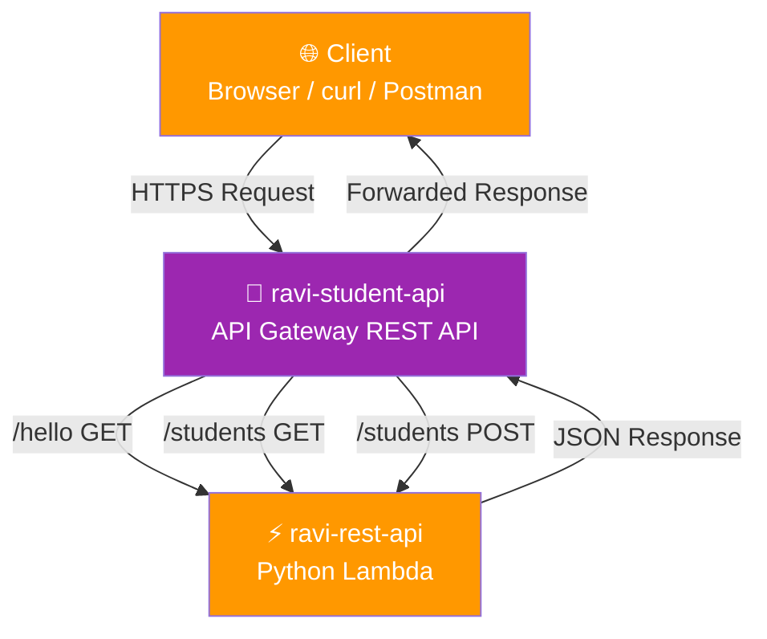
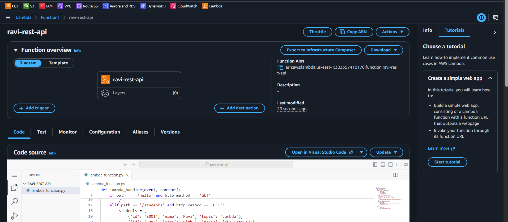
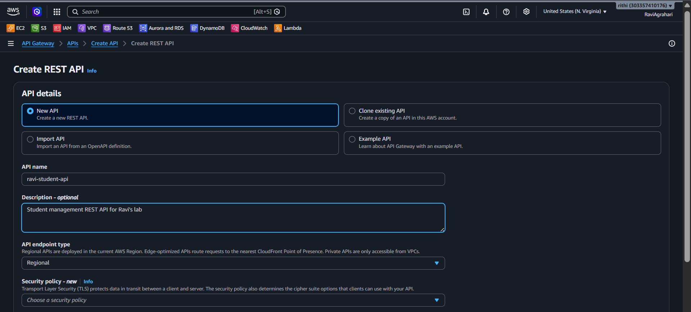
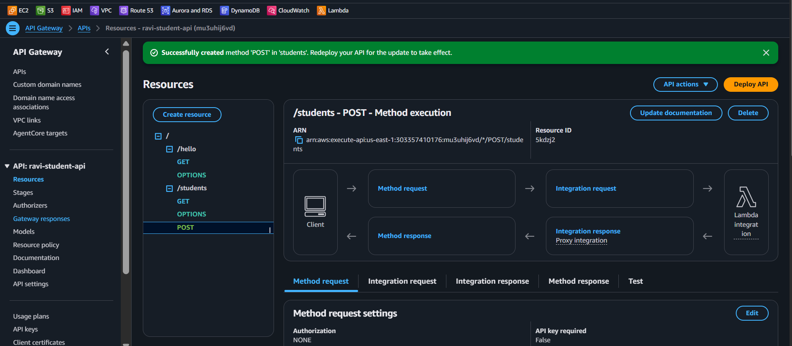
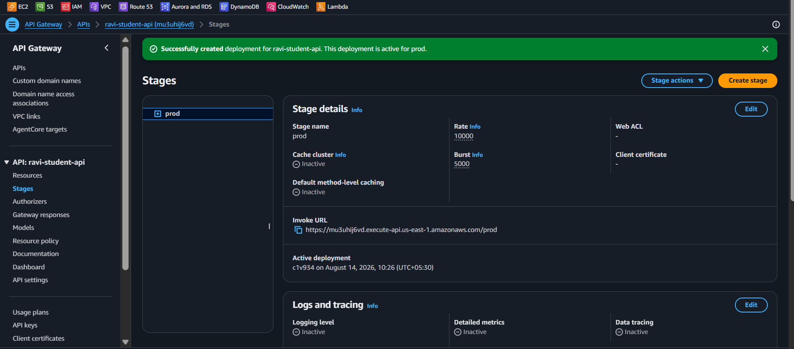
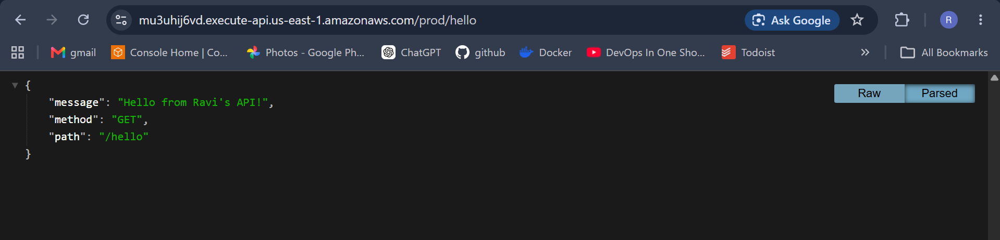
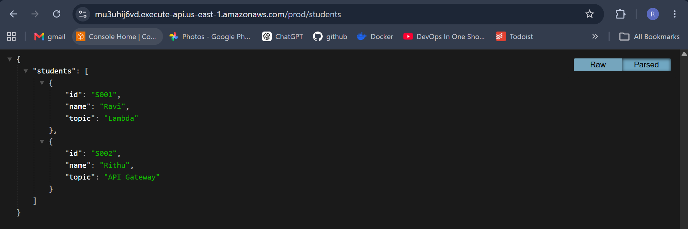

# 🌐 Lab 19 - Lambda: API Gateway REST API

> 📅 **Updated:** 21 August 2026 | ⏱️ **Duration:** ~40 minutes | 📊 **Level:** Intermediate


> ### 🗣️ *"API Gateway is the front door of your building — it checks IDs, routes visitors to the right room, and kicks out anyone who shouldn't be there."*
> — **Rithu** 🚪

<details>
<summary><b>🎭 Ravi & Rithu's Coffee Break Chat</b></summary>

**Ravi:** "API Gateway + Lambda = serverless API?"

**Rithu:** "Exactly! No servers to manage, auto-scales infinitely, and costs almost nothing."

**Ravi:** "This sounds too good to be true."

**Rithu:** "Wait till you see the cold start latency. Everything has a trade-off."

</details>

---

## 🎯 What You'll Master

| Skill | Description |
|-------|-------------|
| 🌐 **REST APIs** | Create and configure resources + methods in API Gateway |
| ⚡ **Lambda Proxy Integration** | Pass full HTTP request to Lambda and return HTTP responses |
| 📦 **Stages & Deployment** | Deploy APIs to `dev`/`prod` environments |
| 🔧 **CORS** | Cross-Origin Resource Sharing for browser access |
| 🧪 **API Testing** | Test GET/POST with browser, curl, or Postman |

> 💡 **Pro Tip:** Every modern "serverless API" — including most AI and mobile backends — is built exactly this way: API Gateway → Lambda → database.

---

## 🚦 Before You Start

### ✅ Prerequisites Checklist
- [ ] ✅ **[Lab 18](../18%20-%20Lambda%20-%20S3%20Triggered%20Function/README.md)** complete
- [ ] 🌍 AWS account with root or admin access
- [ ] 🧰 A tool for testing HTTP requests: browser, `curl`, or [Postman](https://www.postman.com/downloads/)
- [ ] 📋 Basic understanding of HTTP methods (GET, POST) and JSON

### 📦 What You Need (and Don't)
| Required | Optional |
|----------|----------|
| AWS Account (Free Tier friendly) | Postman installed |
| Browser or curl | Basic HTTP knowledge |

> 💡 If you've never used curl or Postman before, don't worry — a browser address bar is actually a GET request, so you can test GET endpoints just by visiting a URL!

---

## 💰 Cost & Safety First

> ⚠️ **Real resources = Real charges.** API Gateway + Lambda is generous on Free Tier, but exposed endpoints can be exploited.

### 💵 Estimated Cost

| Resource | Cost |
|----------|------|
| 🌐 API Gateway (12 months free) | 1M REST API calls/mo |
| ⚡ Lambda (always free) | 1M requests/mo + 400K GB-seconds/mo |
| **Total** | **< $1** ✨ |

> ⚠️ **IMPORTANT:** After the lab, delete the API Gateway (API, stage, deployment), the Lambda function, and the IAM role.

> 💸 **Ravi's Mistake of the Day:** *"I deployed an API Gateway + Lambda combo and forgot to enable CORS. My browser console was a wall of red CORS errors. Frontend debugging 101: check CORS first."*

### 🏷️ Naming Convention

| Resource | Name |
|----------|------|
| ⚡ Lambda Function | `ravi-rest-api` |
| 🌐 API Gateway | `ravi-student-api` |
| 🔐 IAM Role | `api-lambda-role` |

---

## 🧠 How It All Fits Together



### 🔑 Key Concepts
| Component | Role |
|-----------|------|
| **Resource = Path** | `/hello`, `/students` — the URL segments |
| **Method = Verb** | GET, POST, PUT, DELETE — the HTTP actions |
| **Stage = Environment** | `dev`, `prod` — each gets its own URL |
| **Lambda Proxy Integration** | Full HTTP request passed straight to Lambda — full control |
| **CORS** | Cross-origin permission slip for browser access |

**Request Flow:**
```
1. Client sends: GET https://xxxxx.execute-api.us-east-1.amazonaws.com/prod/hello
2. API Gateway receives the request
3. API Gateway matches route: /hello + GET
4. API Gateway invokes Lambda with a JSON event payload
5. Lambda processes the request and returns a JSON response
6. API Gateway forwards the response back to the client
```

---

## 🪜 Step-by-Step Guide

> 🗺️ **Build order:** Lambda function → API Gateway → Resources + Methods → Deploy → Test → CORS fix

### 🟢 Step 1: Create the Lambda Function ⚡

<details>
<summary><b>⚡ Expand for Lambda creation</b></summary>

1. Console search → **Lambda** → **Create function**
2. **Author from scratch** (default)
3. **Function name:** `ravi-rest-api`
4. **Runtime:** **Python 3.14**
5. **Architecture:** `x86_64`
6. **Execution role:**
   - ⚫ **Create a new role with basic Lambda permissions**
   - **Role name:** `api-lambda-role`
7. ✅ **Create function**

**Write the Lambda code:**

8. Scroll to **Code source** → `lambda_function.py`
9. **Replace ALL the code** with:

```python
import json

def lambda_handler(event, context):
    http_method = event.get('httpMethod', 'GET')
    path = event.get('path', '/')

    if path == '/hello' and http_method == 'GET':
        return {
            'statusCode': 200,
            'headers': {'Content-Type': 'application/json', 'Access-Control-Allow-Origin': '*'},
            'body': json.dumps({
                'message': 'Hello from Ravi\'s API!',
                'method': http_method,
                'path': path
            })
        }
    elif path == '/students' and http_method == 'GET':
        students = [
            {'id': 'S001', 'name': 'Ravi', 'topic': 'Lambda'},
            {'id': 'S002', 'name': 'Rithu', 'topic': 'API Gateway'}
        ]
        return {
            'statusCode': 200,
            'headers': {'Content-Type': 'application/json', 'Access-Control-Allow-Origin': '*'},
            'body': json.dumps({'students': students})
        }
    elif path == '/students' and http_method == 'POST':
        body = json.loads(event.get('body', '{}'))
        return {
            'statusCode': 201,
            'headers': {'Content-Type': 'application/json', 'Access-Control-Allow-Origin': '*'},
            'body': json.dumps({
                'message': 'Student created!',
                'data': body
            })
        }
    else:
        return {
            'statusCode': 404,
            'headers': {'Content-Type': 'application/json', 'Access-Control-Allow-Origin': '*'},
            'body': json.dumps({'message': 'Not found'})
        }
```

10. ✅ **Deploy**

</details>



**What does this code do?**

| Path | Method | Response |
|------|--------|----------|
| `/hello` | GET | Returns a greeting message with method and path info |
| `/students` | GET | Returns a list of students as JSON |
| `/students` | POST | Accepts a JSON body and returns confirmation |
| Any other path | — | API Gateway rejects it with **403** before Lambda runs |

> 🗣️ **Rithu's Tip:** *"Notice how Lambda receives the `event` parameter — when API Gateway invokes Lambda, it passes the entire HTTP request as a JSON object, including the method, path, headers, query parameters, and body. Your Lambda then routes the request based on these values."*

---

### 🟢 Step 2: Create the API Gateway 🚪

<details>
<summary><b>🚪 Expand for API Gateway creation</b></summary>

1. Console search → **API Gateway** → under **REST API**, click **Build**
   - ⚠️ Select **REST API** (yellow/orange icon), NOT HTTP API!
2. **Protocol:** REST
3. **Create new API:** ⚫ New API
4. **API name:** `ravi-student-api`
5. **Description:** `Student management REST API for Ravi's lab`
6. **Endpoint Type:** Regional
7. ✅ **Create API**

</details>



> 🗣️ **Rithu's Tip:** *"API Gateway offers three API types: **REST API** — full-featured, supports caching, API keys, etc. **HTTP API** — simpler, cheaper, faster. **WebSocket API** — for real-time bidirectional communication. REST API is the most commonly used."*

---

### 🟢 Step 3: Create Resources and Methods 🔧

<details>
<summary><b>🔧 Expand for resource and method setup</b></summary>

**Create /hello Resource:**

1. Click root `/` → **Create resource**
2. **Resource Name:** `hello` · Path: `/hello`
3. ☑ **Enable API Gateway CORS**
4. ✅ **Create resource**

**Create GET Method on /hello:**

5. Click `/hello` → **Create method** → select **GET** → ✅
6. **Integration type:** ⚫ Lambda Function
7. ☑ **Use Lambda Proxy integration**
8. **Lambda Function:** `ravi-rest-api` → click **OK** on permission warning
9. ✅ **Save**

**Create /students Resource:**

10. Click root `/` → **Create resource**
11. **Resource Name:** `students` · Path: `/students`
12. ☑ **Enable API Gateway CORS**
13. ✅ **Create resource**

**Create GET and POST Methods on /students:**

14. Repeat the **Create method** flow from `/hello` twice — once **GET**, once **POST** — with Lambda Proxy Integration

</details>



**Your final API structure:**
```
/
├── /hello
│   └── GET
└── /students
    ├── GET
    └── POST
```

> 🗣️ **Rithu's Tip:** *"What's 'Lambda Proxy Integration'? It means API Gateway passes the ENTIRE HTTP request to Lambda as-is (method, path, headers, body, everything). Without it, you'd have to manually map request/response templates — and that's a headache. Always use Lambda Proxy Integration!"*

---

### 🟢 Step 4: Deploy the API 🚀

<details>
<summary><b>🚀 Expand for API deployment</b></summary>

1. Click **Deploy API** (top-right of Resources page)
2. **Deployment stage:** ⚫ [New Stage]
3. **Stage name:** `prod`
4. **Stage description:** `Production stage`
5. ✅ **Deploy**

After deployment, you'll see the **Invoke URL**:
```
Invoke URL: https://abc123def4.execute-api.us-east-1.amazonaws.com/prod
```

> ⚠️ **WRITE DOWN THIS URL!** You'll need it for testing.

</details>



> 🗣️ **Rithu's Tip:** *"API Gateway uses stages to manage different environments: `dev` → development, `staging` → pre-production, `prod` → live. Each stage has its own URL and can have different settings (throttling, caching, logging)."*

---

### 🟢 Step 5: Test the API 🧪

<details>
<summary><b>🧪 Expand for API testing</b></summary>

**Test 1: GET /hello**

```bash
curl https://abc123def4.execute-api.us-east-1.amazonaws.com/prod/hello
```
Expected: `{"message": "Hello from Ravi's API!", "method": "GET", "path": "/hello"}`



**Test 2: GET /students**

```bash
curl https://abc123def4.execute-api.us-east-1.amazonaws.com/prod/students
```
Expected: `{"students": [{"id": "S001", "name": "Ravi", ...}, {"id": "S002", "name": "Rithu", ...}]}`



**Test 3: POST /students**

```bash
curl -X POST https://abc123def4.execute-api.us-east-1.amazonaws.com/prod/students \
  -H "Content-Type: application/json" \
  -d '{"name": "Ravi", "topic": "API Gateway"}'
```
Expected: `{"message": "Student created!", "data": {"name": "Ravi", "topic": "API Gateway"}}`

**Test 4: Unknown Path (403)**

```bash
curl https://abc123def4.execute-api.us-east-1.amazonaws.com/prod/anything
```
Expected: `{"message": "Missing Authentication Token"}`

> 💡 This 403 comes from **API Gateway**, not your Lambda — there's no `/anything` resource, so the request never reaches the function. That's expected security behavior, not an error.

</details>

🎉 **Your API is live and working!** Anyone in the world with this URL can now call your API!

---

### 🟢 Step 6: Verify CORS (if needed) 🔗

<details>
<summary><b>🔗 Expand for CORS setup</b></summary>

We already enabled CORS when creating resources, and the Lambda returns `Access-Control-Allow-Origin` headers — so browser access should just work. CORS is browser-only; curl and Postman ignore it.

If you still see CORS errors in a browser:

1. Select the resource (`/hello` or `/students`)
2. Click **Enable CORS** → keep `Access-Control-Allow-Origin: *`
3. Click **Enable CORS** → **Replace** → then **Deploy API** → `prod`

> ⚠️ After any API change — CORS included — you must **redeploy** to the stage for it to take effect.

</details>

> 🗣️ **Rithu's Tip:** *"CORS (Cross-Origin Resource Sharing) is a browser security feature. It prevents a web page on `example.com` from calling your API on another domain unless the API explicitly allows it. In production, use your real domain instead of `*`."*

---

## ✅ Validation Checklist

| # | Check | Status |
|---|-------|--------|
| 1️⃣ | Lambda function `ravi-rest-api` created with correct code | ☐ ✅ |
| 2️⃣ | API Gateway `ravi-student-api` created (REST API) | ☐ ✅ |
| 3️⃣ | `/hello` resource with GET method exists | ☐ ✅ |
| 4️⃣ | `/students` resource with GET and POST methods exists | ☐ ✅ |
| 5️⃣ | All methods use Lambda Proxy Integration | ☐ ✅ |
| 6️⃣ | API deployed to `prod` stage | ☐ ✅ |
| 7️⃣ | GET /hello returns greeting JSON | ☐ ✅ |
| 8️⃣ | GET /students returns student list | ☐ ✅ |
| 9️⃣ | POST /students returns 201 Created | ☐ ✅ |
| 🔟 | Unknown paths return 403 Missing Authentication Token | ☐ ✅ |

---

## 🧹 Cleanup (Follow Order!)

> ⚠️ **Delete in this order to avoid dependency errors!** Exposed APIs can be exploited and forgotten APIs incur charges.

| Step | Action | Console Location |
|------|--------|------------------|
| 1️⃣ 🗑️ | Delete API Gateway `ravi-student-api` | API Gateway → APIs → Actions → Delete |
| 2️⃣ ⚡ | Delete Lambda function `ravi-rest-api` | Lambda → Functions → Actions → Delete |
| 3️⃣ 🔐 | Delete IAM role `api-lambda-role` | IAM → Roles → Delete |

> 🗣️ **Rithu's Tip:** *"Deleting the API first is important — if you delete Lambda first, the API will return 500 errors until the Lambda is recreated. Clean up top-down: API Gateway → Lambda → IAM."*

---

## 🚀 Level Ups (Post-Core Lab)

| Challenge | What to Try | Notes |
|-----------|-------------|-------|
| 🗑️ **DELETE Method** | Add `DELETE /students/{id}` with path parameters | Full CRUD API |
| 🔐 **API Keys** | Enable API key requirement and test with `x-api-key` header | Simple auth |
| 🌍 **Custom Domain** | Map a Route 53 domain to your API Gateway | Production polish |
| ⏱️ **Caching** | Enable stage-level caching for GET responses | Performance optimization |

---

## 🆘 Troubleshooting Quick Reference

| 🔍 Issue | 💡 Likely Cause | 🔧 Fix |
|---------|--------------|-----|
| 502 Bad Gateway | Lambda returned malformed proxy response | `body` must be a **string** (`json.dumps`), `statusCode` must be present |
| 500 Internal Server Error | Lambda function crashed | Lambda → Monitor → Logs → check most recent log stream |
| CORS error in browser | CORS headers missing / API not redeployed | Enable CORS on resource → **redeploy** to `prod` |
| "Missing Authentication Token" | Method doesn't exist / API not deployed | Check Resources tree; deploy after changes |
| POST returns "Unsupported Media Type" | `Content-Type` header missing or wrong | Send `Content-Type: application/json` |
| POST body empty in Lambda | Body not parsed / no proxy integration | Enable Lambda Proxy Integration; parse with `json.loads(event['body'])` |
| "Endpoint request timed out" | Exceeded API Gateway integration timeout (29s) | Optimize Lambda code; raise timeout |

> 🗣️ **Rithu's Tip:** *"The most common mistake with API Gateway + Lambda is forgetting to **redeploy the API after making changes**. API Gateway doesn't automatically deploy updates — you have to manually deploy each time. I've been bitten by this so many times. 😅"*

---

## 🎮 Test Yourself! (No Peeking 👀)

**Q1:** In `GET /students`, what's the resource and what's the method?

<details><summary>👀 Show answer</summary>

**A:** `/students` = the **resource** (the path); `GET` = the **method** (the verb/action). Together they define the request. 🛣️

</details>

**Q2:** What's the difference between 200 OK and 201 Created?

<details><summary>👀 Show answer</summary>

**A:** **200** = successful read/update; **201** = a new resource was **created** (e.g., after a successful POST). 📋

</details>

**Q3:** You change your Lambda but the API still returns old behavior. What did you forget?

<details><summary>👀 Show answer</summary>

**A:** **Deploy the API to the stage!** Editing resources alone isn't enough — you must **Deploy API** for changes to go live. 🚀

</details>

### 🔥 Bonus Challenge

Add a **`DELETE /students/{id}`** method wired to your Lambda, handle the `{id}` path parameter, and test it with curl/Postman. Then re-enable CORS on the new method and confirm a browser can call it. You've now built a full CRUD API! 🏆

> 💪 **Rithu:** *"Path parameters (`{id}`) are the key to real APIs. Master them and every tutorial makes sense after this."*

---

## 📚 Official Documentation

- 🌐 [Amazon API Gateway Developer Guide](https://docs.aws.amazon.com/apigateway/latest/developerguide/welcome.html)
- ⚡ [Set up Lambda Proxy Integrations](https://docs.aws.amazon.com/apigateway/latest/developerguide/set-up-lambda-proxy-integrations.html)
- 🔧 [Enabling CORS](https://docs.aws.amazon.com/apigateway/latest/developerguide/how-to-cors.html)

---

## 🎓 What You Learned

> **Serverless REST APIs from scratch:**
> - 🌐 **API Gateway** → create resources, methods, stages, deploy
> - ⚡ **Lambda Proxy Integration** → full HTTP request passed to Lambda
> - 📦 **Stages** → `dev`/`prod` environments with separate URLs
> - 🔧 **CORS** → browser security for cross-origin requests
> - 🧪 **HTTP Status Codes** → 200 OK, 201 Created, 403 Missing Auth Token

**Golden Habit:** Edit → Deploy → Test → Redeploy after every change. API Gateway never auto-deploys! 🚀

| | Approach |
|---|---|
| 👶 **Noob Way** | Expose Lambda URLs directly with no auth, no stages, no CORS |
| 🧙 **Pro Way** | API Gateway with stages, proxy integration, and proper CORS — the standard serverless stack |

---

## ➡️ What's Next?

You've built APIs, processed files, and secured access. Now let's put it all together with **containerized workloads on ECS Fargate** — the future of cloud computing! 🐳

🎯 **[Lab 20 - ECS: Deploy NGINX on Fargate](../20%20-%20ECS%20-%20Deploy%20NGINX%20on%20Fargate/README.md)**

---

<div align="center">

### ⭐ Enjoyed this lab? Star the repo & share your feedback!

**Happy Learning!** 🚀☁️

</div>
