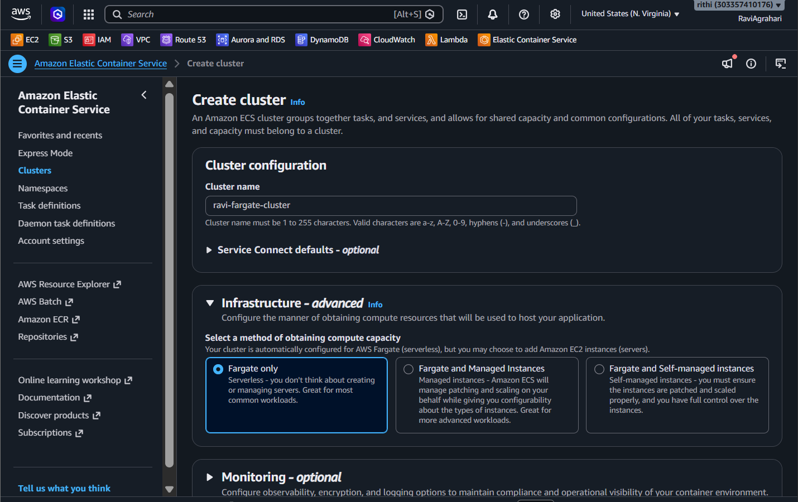
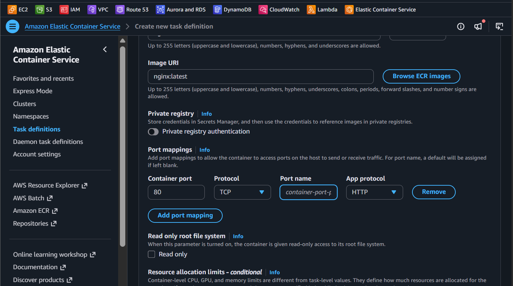
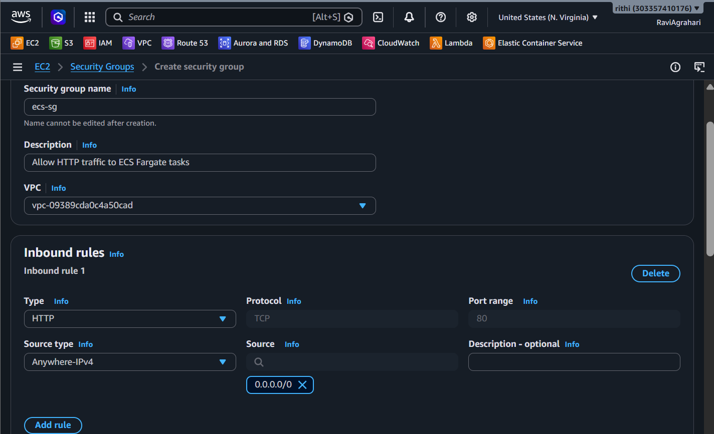
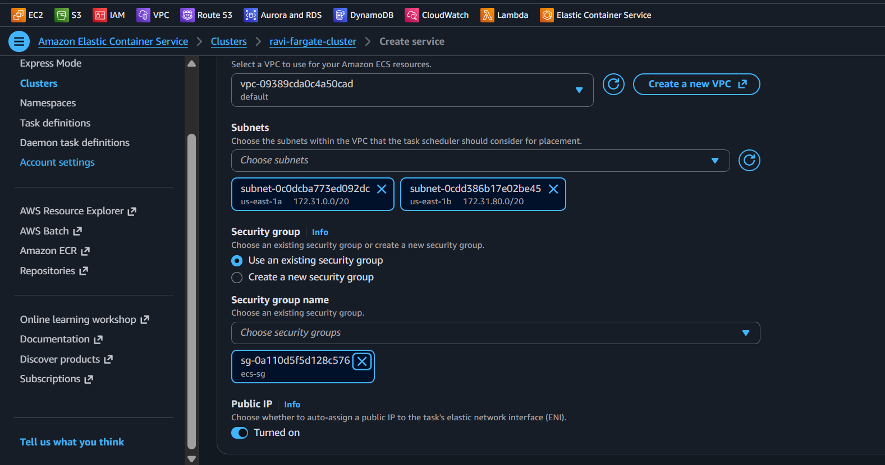
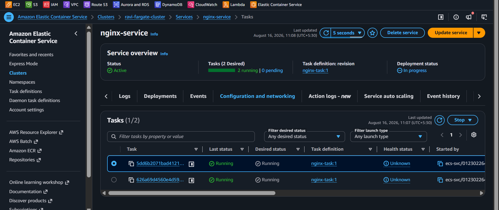
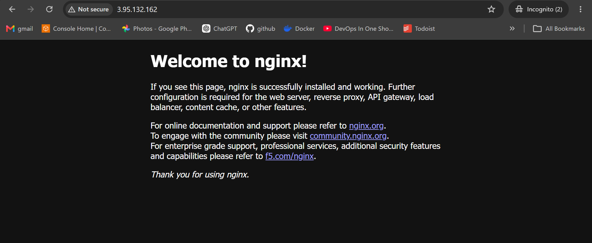
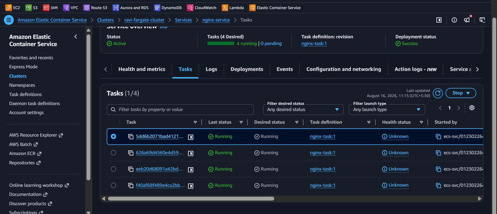
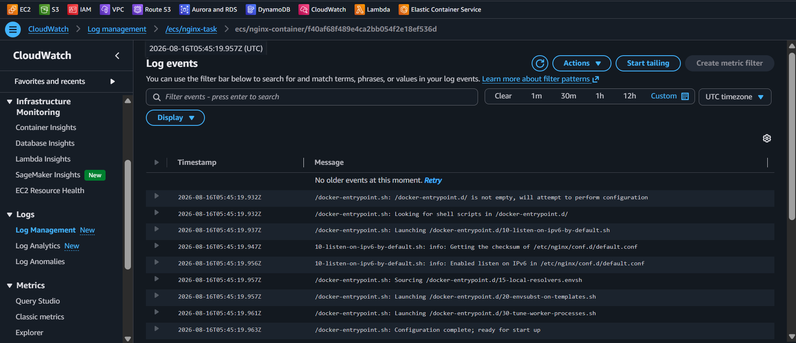

<div align="center">


# Lab 20 — ECS: Deploy NGINX on Fargate


</div>

> "Containers are like shipping containers — standardized, portable, and they work the same everywhere. Fargate means AWS manages the ship." — Rithu

---

<details>
<summary><b>🎭 Ravi & Rithu's Coffee Break Chat</b></summary>

**Ravi:** "What's the difference between containers and VMs?"

**Rithu:** "VMs are like apartments - each has its own kitchen, bathroom, everything. Containers are like dorm rooms - shared building, separate beds."

**Ravi:** "So containers are cheaper?"

**Rithu:** "Cheaper, lighter, faster. Just don't let one container eat all the shared resources or everyone suffers."

</details>

## 📋 Table of Contents

- [🎯 Objective](#-objective)
- [📊 Lab Progress](#-lab-progress)
- [🤔 In Plain English](#-in-plain-english)
- [🧠 Prerequisites](#-prerequisites)
- [💰 Cost Warning](#-cost-warning)
- [🏗️ Architecture](#️-architecture)
- [🛠️ Step-by-Step Instructions](#️-step-by-step-instructions)
- [✅ Validation Checklist](#-validation-checklist)
- [🧹 Cleanup (IMPORTANT!)](#-cleanup-important)
- [🧠 Memory Tips](#-memory-tips)
- [🎓 What You Learned](#-what-you-learned)
- [🎮 Test Yourself](#-test-yourself-no-peeking-)
- [🆚 Pro Tip vs Noob Tip](#-pro-tip-vs-noob-tip)
- [🔗 What's Next?](#-whats-next)
- [❓ Troubleshooting](#-troubleshooting)

---

<div align="center">

## 📊 Lab Progress

`[██░░░░░░░░░░░░░░░░░░] 5% — Let's Begin!`

</div>

---

## 🤔 In Plain English

> **What is this, really?** Containers are **apps + everything they need, packed into a box** that runs anywhere. ECS is AWS's container *orchestrator* — it decides where boxes run and keeps the right number alive. **Fargate** is the serverless mode: AWS runs your boxes on hidden servers so **you never touch an EC2 instance**. Like ordering delivery instead of cooking. 🍕
>
> 🌍 **Why you should care:** Containers are how modern companies ship apps — consistent from laptop to production. Fargate removes the server-hassle from that equation.

---

## 🎯 Objective

In this lab, you'll deploy a **containerized NGINX web server** on **Amazon ECS (Elastic Container Service)** using **AWS Fargate** — the serverless compute engine for containers. You'll create a cluster, a task definition, and a service that runs multiple copies of your container.

**By the end of this lab you will be able to:**
- Create an ECS cluster with Fargate (serverless) compute
- Define a task with a container image from Docker Hub
- Deploy a service that runs and maintains desired task count
- Scale a running service by updating the desired count
- View container logs in CloudWatch
- Understand the difference between ECS with EC2 vs. Fargate

---

## 🧠 Prerequisites

- [ ] Completed [Lab 19 — Lambda: API Gateway REST API](../19%20-%20Lambda%20-%20API%20Gateway%20REST%20API/README.md)
- [ ] AWS account with root or admin access
- [ ] Basic understanding of what containers are (conceptual is fine)
- [ ] A VPC with at least 2 public subnets (default VPC works!)

> 
> You don't need to know Docker or have Docker installed for this lab! Fargate pulls container images from registries (like Docker Hub) directly. You just need to know the image name (like `nginx:latest`).

---

## 💰 Cost Warning

**⚠️ THE METER RUNS FROM THE FIRST SECOND — CLEAN UP WHEN YOU'RE DONE!**

Fargate bills **per second** (1-minute minimum) for provisioned vCPU + memory. At the smallest size (us-east-1):

- **0.25 vCPU:** ~$0.010/hour
- **0.5 GB memory:** ~$0.002/hour
- **2 tasks running for ~45 min:** ≈ **$0.02 total**

So this lab costs only **cents** — if you delete everything right after. Unlike EC2, Fargate has no free tier: compute bills from the moment the image pull starts.

**To avoid extra charges:**
- ⚠️ **DELETE ALL RESOURCES IMMEDIATELY after the lab** (cluster, service, task definition, security group)
- ⚠️ **Scale the service to 0 tasks BEFORE deleting** (see Cleanup section)
- ⚠️ **Don't leave the cluster running overnight!**

> 
> Fargate is like renting a car by the minute — super flexible and you only pay for what you use. But if you forget to return the car (delete the resources), the meter keeps running! 🚗💰

> **Ravi's Mistake of the Day:** I ran a Fargate task with 2 GB memory when 512 MB would've been fine. Fargate charges for provisioned resources, not used resources. Over-provisioning = over-paying.

---

## 🏗️ Architecture

```
┌──────────────────────────────────────────────────┐
│                                                   │
│              ECS Cluster                          │
│          ravi-fargate-cluster                     │
│                                                   │
│   ┌─────────────────────────────────────────┐    │
│   │           Service: nginx-service         │    │
│   │      Desired Count: 2 → 4 (scaled)      │    │
│   │                                          │    │
│   │  ┌──────────────┐  ┌──────────────┐    │    │
│   │  │   Task 1      │  │   Task 2      │    │    │
│   │  │  ┌─────────┐  │  │  ┌─────────┐  │    │    │
│   │  │  │ NGINX    │  │  │  │ NGINX    │  │    │    │
│   │  │  │ :80      │  │  │  │ :80      │  │    │    │
│   │  │  └─────────┘  │  │  └─────────┘  │    │    │
│   │  └──────────────┘  └──────────────┘    │    │
│   │                                          │    │
│   │  ┌──────────────┐  ┌──────────────┐    │    │
│   │  │   Task 3      │  │   Task 4      │    │    │
│   │  │  ┌─────────┐  │  │  ┌─────────┐  │    │    │
│   │  │  │ NGINX    │  │  │  │ NGINX    │  │    │    │
│   │  │  │ :80      │  │  │  │ :80      │  │    │    │
│   │  │  └─────────┘  │  │  └─────────┘  │    │    │
│   │  └──────────────┘  └──────────────┘    │    │
│   └─────────────────────────────────────────┘    │
│                                                   │
│   Each task has: Public IP → port 80 → NGINX      │
│   No load balancer — access tasks directly        │
└──────────────────────────────────────────────────┘
```

> **Did You Know?** Fargate is serverless containers — no servers to manage, patch, or scale. Each task gets its own network interface (`awsvpc` mode) with its own private IP, plus the public IP you assigned. Just define the container and AWS runs it. Magic.

---

## 🛠️ Step-by-Step Instructions

### 

1. Sign in to the **AWS Management Console**.
2. In the search bar, type **ECS** and click on **Elastic Container Service**.
3. In the left navigation pane, click **Clusters**.
4. Click the orange **Create cluster** button.

#### Configure the Cluster:

1. **Cluster name:** `ravi-fargate-cluster`
2. **Infrastructure:** ⚫ **AWS Fargate (serverless)**
   - ⚠️ Make sure you select Fargate, NOT EC2. Fargate = serverless (no EC2 instances to manage).
3. **Tags:** Add a tag (optional but good practice):
   - Key: `Environment`
   - Value: `Lab`
4. Leave all other settings as **defaults**:
   - CloudWatch Container Insights: Not enabled (optional)
5. Click **Create**.

> 📸 [Screenshot: The ECS cluster creation form showing Fargate selected with name ravi-fargate-cluster]


Wait for the cluster to be created. You should see a green success banner: "Cluster ravi-fargate-cluster created successfully."

> 
> - **EC2 mode:** You manage the instances that run your containers. More control, more work.
> - **Fargate mode:** AWS manages the infrastructure. You just set CPU/memory and deploy. Less control, less work.
>
> Like building a house (EC2) vs. renting an apartment (Fargate) — the apartment comes pre-built, you just move in!

---

### 

A task definition is like a blueprint for your container — it specifies which image to run, how much CPU/memory to use, and what ports to expose.

1. In the left navigation pane, click **Task definitions**.
2. Click **Create new task definition**.
3. **Task definition family:** `nginx-task`
4. **Launch type:** ⚫ **AWS Fargate**
5. **Platform version:** Latest
6. **Operating system / architecture:** Linux / x86_64
7. **CPU:** `0.25 vCPU` (minimum for Fargate)
8. **Memory:** `0.5 GB` (minimum for Fargate)
9. **Task execution role:** Leave the default (it should auto-create one with `AmazonECSTaskExecutionRolePolicy`).

#### Add Container:

1. Scroll down to **Container - 1** section.
2. Click **Add container** (or the section may already be expanded).

**Container Configuration:**
1. **Container name:** `nginx-container`
2. **Image URI:** `nginx:latest`
   - This pulls the official NGINX image from Docker Hub.
3. **Essential:** ✅ Yes (this container must run for the task to be healthy)
4. **Port mappings:**
   - **Container port:** `80`
   - **Protocol:** `TCP`
5. Leave other settings as defaults (memory limits, environment variables, etc.).

> 📸 [Screenshot: The task definition page showing nginx:latest as the container image with port 80 mapped]


6. Scroll down and click **Create**.

> 
> `nginx:latest` is one of the most popular Docker images — a web server that serves static content fast. Visit `http://<your-task-ip>` and it returns the default welcome page. In production, you'd use a custom image with your app code.

---

### 

Before creating the service, let's create a security group that allows HTTP traffic to our tasks.

1. In the search bar, type **EC2** and click on **EC2**.
2. In the left navigation pane, click **Security Groups** under "Network & Security".
3. Click **Create security group**.
4. **Security group name:** `ecs-sg`
5. **Description:** `Allow HTTP traffic to ECS Fargate tasks`
6. **VPC:** Select your **default VPC** (it should be pre-selected).
7. **Inbound rules:**
   - Click **Add rule**:
     - **Type:** `HTTP`
     - **Port range:** `80`
     - **Source:** `Anywhere-IPv4` (0.0.0.0/0)
8. **Outbound rules:**
   - Keep the default: **All traffic** → **Anywhere** (0.0.0.0/0)
9. Click **Create security group**.

> 📸 [Screenshot: The security group creation form showing HTTP inbound rule from anywhere]


> 
> In production, this rule would only allow traffic from a load balancer's security group. For this lab, testing from anywhere is fine.

---

### 

Now let's deploy the task definition as a running service!

1. Go to **ECS → Clusters → ravi-fargate-cluster**.
2. In the **Services** tab, click **Create**.

> 📝 **Console note:** The **Create service** page is a single scrolling form. Fill in the sections below and finish with the **Create** button at the bottom.

#### Service details:
1. **Compute options:** ⚫ **Launch type**
2. **Launch type:** ⚫ **Fargate**
3. **Task definition family:** `nginx-task`
   - **Revision:** `1 (latest)`
4. **Service name:** `nginx-service`

#### Deployment configuration:
1. **Service type:** ⚫ **Replica**
2. **Desired tasks:** `2`
   - This means ECS will maintain exactly 2 running tasks at all times.
   - If a task dies, ECS automatically starts a new one!
3. Expand **Deployment options**:
   - **Deployment type:** **Rolling update** (default) — this deploys new versions without downtime.

#### Service Connect (optional):
1. Skip (leave unchecked).

#### Networking:
1. **VPC:** Select your **default VPC**.
2. **Subnets:** Select at least **2 public subnets** (in different Availability Zones):
   - Click on the dropdown and check at least 2 subnets that say "Public" in their name or have a route to an Internet Gateway.
3. **Security groups:** Select `ecs-sg` (the one you created in Step 3).
4. **Public IP:** ⚫ **Assign public IP** → **Turn on**
   - ⚠️ This is REQUIRED for Fargate tasks to pull images from Docker Hub and for you to access the NGINX web server.

> 📸 [Screenshot: The networking configuration showing 2 public subnets selected, ecs-sg security group, and public IP enabled]



#### Load Balancing:
1. **Load balancer type:** ⚫ **None**
   - ⚠️ We'll access tasks directly via their public IPs. In production, you'd put an Application Load Balancer in front.

#### Review and Create:
1. Review all settings.
2. Click **Create**.
3. Wait for the success banner.

> 
> Why these three settings matter:
> - **Public IP = Yes:** Without it, tasks can't pull images from Docker Hub and you can't reach the web server.
> - **2 subnets in different AZs:** If one AZ goes down, the other AZ's tasks keep running.
> - **Desired count = 2:** ECS always keeps 2 tasks running — crashes are replaced automatically.

---

### 

1. Go to **ECS → Clusters → ravi-fargate-cluster**.
2. In the **Services** tab, click on `nginx-service`.
3. You'll see the **Tasks** tab — it should show 2 tasks in a **PROVISIONING** or **PENDING** state.
4. **Wait 2-5 minutes** for tasks to reach **RUNNING** — the first run has to download and start the container image.
5. Click the **refresh** button (↻) periodically to check status.

**Task Status Progression:**
```
PROVISIONING → PENDING → RUNNING ✅
     ↓
  (AWS is allocating resources)
  (Downloading container image)
  (Starting the container)
  (Health check passing)
```

> 📸 [Screenshot: The ECS service page showing 2 tasks in RUNNING state]


> 
> Tasks stuck in PENDING? Check the public IP, public subnets, outbound traffic, and region — see Troubleshooting below.

---

### 

Once both tasks are in **RUNNING** state:

1. In the **Tasks** tab, click on one of the running tasks.
2. Look for the **Network** section — you'll see a **Public IP** address.
3. Click on the public IP (or copy it).
4. Open your web browser and navigate to: `http://<task-public-ip>`
5. You should see the **NGINX welcome page**:

```
Welcome to nginx!
If you see this page, the nginx web server is successfully installed and
working. Further configuration is required.
...
```

> 📸 [Screenshot: Browser showing the NGINX welcome page from the Fargate task's public IP]


#### Check the Other Task:

1. Get the public IP of the **other task**.
2. Open it in a different browser tab: `http://<task-2-public-ip>`
3. You should see the same NGINX welcome page — both tasks run the same `nginx:latest` image.

🎉 **CONGRATULATIONS!** You just deployed a containerized application on AWS ECS Fargate!

> 
> In production, an Application Load Balancer (ALB) sits in front of these tasks — it spreads traffic across tasks so users never need to know individual IPs, and it handles SSL/TLS and health checks. That's a lab for another day!

---

### 

Let's see how easy it is to scale with ECS!

1. Go to **ECS → Clusters → ravi-fargate-cluster → nginx-service**.
2. Click **Update** (or the **Update service** button).
3. **Desired tasks:** Change from `2` to `4`.
4. Click **Skip to review** → **Update service**.
5. Wait 2-3 minutes.
6. Click the **Tasks** tab → You should now see **4 tasks** in RUNNING state!

> 📸 [Screenshot: The ECS service showing 4 running tasks after scaling]


**Scaling Comparison:**

| Before | After |
|--------|-------|
| 2 tasks running | 4 tasks running |
| Can handle moderate traffic | Can handle double the traffic |
| ~$0.03/hour | ~$0.05/hour |

> 
> With traditional servers, scaling means: 1) Buy a new server, 2) Install the OS, 3) Install the application, 4) Configure networking, 5) Hope it works. With Fargate, scaling means: change a number and click Update. That's the power of containers + serverless! 🚀

---

### 

Every Fargate task automatically sends logs to CloudWatch.

1. In the search bar, type **CloudWatch** and open it.
2. In the left navigation pane, click **Log groups**.
3. Look for a log group named `/ecs/nginx-task`.
4. Click on it.
5. You'll see log streams for each task. Click on the most recent one.
6. You should see NGINX startup logs:

```
/docker-entrypoint.sh: /docker-entrypoint.sh: No files or directories
... (NGINX configuration messages)
[notice] 1#1: signal process started
```

> 📸 [Screenshot: CloudWatch Logs showing NGINX container output]



> 
> You can't SSH into a Fargate task — there's no OS to SSH into. Logs are your window inside the container, so check them first when something isn't working!

---

### 

1. **ECS Cluster exists:** ECS → Clusters → `ravi-fargate-cluster`.
2. **Task Definition exists:** ECS → Task definitions → `nginx-task:1`.
3. **Service running:** `nginx-service` with desired count of 4 tasks.
4. **All 4 tasks are RUNNING:** Tasks tab shows 4 tasks in RUNNING state.
5. **NGINX accessible:** `http://<task-public-ip>` shows the welcome page.
6. **Logs visible:** CloudWatch Logs → `/ecs/nginx-task` shows NGINX output.

---

## ✅ Validation Checklist

| # | Check | Status |
|---|-------|--------|
| 1 | ECS cluster `ravi-fargate-cluster` created (Fargate) | ☐ |
| 2 | Task definition `nginx-task` created with `nginx:latest` | ☐ |
| 3 | Security group `ecs-sg` allows HTTP (80) inbound | ☐ |
| 4 | Service `nginx-service` created with desired count = 2 | ☐ |
| 5 | Both tasks reached RUNNING state | ☐ |
| 6 | NGINX welcome page accessible via task public IP | ☐ |
| 7 | Service scaled to 4 tasks | ☐ |
| 8 | All 4 tasks running after scaling | ☐ |
| 9 | CloudWatch Logs show NGINX output | ☐ |

---

> **Achievement Unlocked:** Container Captain! Fargate deployed!

---

## 🧹 Cleanup (IMPORTANT!)

**⚠️ FOLLOW THIS CLEANUP ORDER EXACTLY TO AVOID ERRORS!**

Fargate tasks cost money every minute they're running. Delete everything now!

### Step A: Scale Service to 0 Tasks

1. Go to **ECS → Clusters → ravi-fargate-cluster → nginx-service**.
2. Click **Update**.
3. **Desired tasks:** `0`
4. Click **Skip to review** → **Update service**.
5. Wait for all tasks to stop (Tasks tab should show 0 running tasks).

> ⚠️ **DO NOT skip this step!** If you try to delete a service with running tasks, it can get stuck.

### Step B: Delete the Service

1. Go to **ECS → Clusters → ravi-fargate-cluster**.
2. In the **Services** tab, select `nginx-service`.
3. Click **Delete**.
4. Type `delete` to confirm → **Delete**.
5. Wait for the service to be deleted.

### Step C: Deregister Task Definition

1. Go to **ECS → Task definitions**.
2. Select `nginx-task`.
3. Click **Deregister** on the active revision.
4. Confirm → **Deregister**.

### Step D: Delete the Cluster

1. Go to **ECS → Clusters → ravi-fargate-cluster**.
2. Click **Delete cluster**.
3. Type the cluster name to confirm → **Delete**.

### Step E: Delete the Security Group

1. Go to **EC2 → Security Groups**.
2. Find `ecs-sg`.
3. Select it → **Actions → Delete security groups**.
4. Confirm → **Delete**.

### Step F: Verify Cleanup

1. Go to **ECS → Clusters** → should show no clusters (or only the default).
2. Go to **ECS → Task definitions** → `nginx-task` should show as "INACTIVE".
3. Go to **EC2 → Security Groups** → `ecs-sg` should be gone.
4. Go to **CloudWatch → Log groups** → `/ecs/nginx-task` can be deleted too (optional, logs are very cheap).

> 
> The order matters — scale to 0, then delete service → task definition → cluster. Delete the cluster first with a running service and AWS will complain.

---

## 🧠 Memory Tips

Stick these in your brain and they'll never leave. 🧲

| 🧠 Memory Hook | Remember it like... |
|---|---|
| **Task definition = recipe** | Which image, how much CPU/RAM, which ports. The blueprint for every container. 📋 |
| **Service = the waiter** | Keeps the **desired number of tasks** running. Task dies → waiter orders a new one. 🍽️ |
| **Cluster = the kitchen** | The logical home where all your tasks run. 🍳 |
| **Fargate = serverless containers** | No EC2 to manage — AWS hides the servers. You just write the recipe. 🪄 |
| **Logs → CloudWatch** | Container output streams into CloudWatch automatically. Debug without SSHing. 🐛 |

> 🗣️ **Rithu:** *"Fargate vs EC2 launch type: Fargate = 'I don't want to see any servers, ever.' That's the whole pitch."

---

## 🎓 What You Learned

In this lab, you learned:

1. **Amazon ECS (Elastic Container Service)** — AWS's container orchestration service.
2. **AWS Fargate** — Serverless compute for containers (no EC2 management required).
3. **Task Definitions** — Blueprints that define which container image to run, CPU/memory requirements, and port mappings.
4. **ECS Services** — Maintain a desired number of running tasks (self-healing, auto-restart).
5. **Container Scaling** — Easy horizontal scaling by changing the desired task count.
6. **CloudWatch Logs** — Container output is automatically sent to CloudWatch for debugging.
7. **Security Groups** — Controlling network access to container tasks.
8. **Fargate Networking** — Each task gets its own elastic network interface with its own IP address.

---

## 🎮 Test Yourself! (No Peeking 👀)

**Q1:** What's the difference between a task definition and a service?

<details><summary>👀 Show answer</summary>

**A:** The **task definition** is the recipe (image, CPU, memory, ports). The **service** is the manager that keeps the desired number of tasks running and restarts failures. 🍳

</details>

**Q2:** What makes Fargate different from the EC2 launch type?

<details><summary>👀 Show answer</summary>

**A:** **Fargate is serverless** — AWS runs your containers on managed infrastructure. No EC2 instances to pick, patch, or manage. 🪄

</details>

**Q3:** One of your tasks crashes. What happens?

<details><summary>👀 Show answer</summary>

**A:** The **service notices** the count dropped below desired and **launches a replacement** automatically. Self-healing containers. 🩹

</details>

### 🔥 Bonus Challenge

Change the **desired task count** from 2 to 4 and watch the service launch 2 extra tasks automatically. Then bump it back down and watch them drain. You just scaled containers with one number — the DevOps dream. 🚀

> 💪 **Rithu:** *"Scaling containers is 'change a number, click save.' If you never try it, you'll never believe it."

---

### 🆚 Pro Tip vs Noob Tip

| | Approach |
|---|---|
| **Noob Tip** | SSH into each container to fix things manually |
| **Pro Tip** | Containers are cattle, not pets: change the recipe, redeploy, watch self-healing do the rest |

---

## 🔗 What's Next?

You've completed Labs 16-20! You now have a solid foundation in:
- **IAM** (Lab 16) — Security and access control
- **SNS/SQS** (Lab 17) — Messaging and decoupling
- **Lambda + S3** (Lab 18) — Serverless event-driven processing
- **Lambda + API Gateway** (Lab 19) — Serverless REST APIs
- **ECS Fargate** (Lab 20) — Containerized applications

👉 **[Lab 21 — CloudFormation: Deploy EC2](../21%20-%20CloudFormation%20-%20Deploy%20EC2/README.md)**

Continue to the next lab in the series to keep building your AWS skills!

---

## ❓ Troubleshooting

<details>
<summary><strong>Tasks stuck in PROVISIONING or PENDING state</strong></summary>

**Cause:** Fargate can't launch tasks due to networking issues or insufficient capacity.
**Fix:**
- Verify tasks are assigned **public IPs** (required for pulling images).
- Make sure subnets are **public** (have a route to an Internet Gateway).
- Check that the security group allows **outbound** traffic (to pull the image from Docker Hub).
- Try a different region — Fargate capacity issues sometimes happen in specific AZs.
</details>

<details>
<summary><strong>Tasks fail immediately and restart</strong></summary>

**Cause:** The container crashes on startup, or the image can't be pulled.
**Fix:**
- Check CloudWatch Logs → `/ecs/nginx-task` for error messages.
- Verify the image URI is correct: `nginx:latest` (no typos!).
- Check if your VPC has DNS resolution enabled (it should be by default).
</details>

<details>
<summary><strong>Cannot access NGINX via public IP</strong></summary>

**Cause:** Security group doesn't allow inbound HTTP traffic, or the task has no public IP.
**Fix:**
- Verify the security group `ecs-sg` has an inbound rule for port 80 (HTTP) from 0.0.0.0/0.
- Verify the task has a public IP assigned (check task details → Network section).
- Make sure you're using `http://` (not `https://`).
</details>

<details>
<summary><strong>"CannotPullContainerError" or image pull failures</strong></summary>

**Cause:** Fargate can't reach Docker Hub to pull the image.
**Fix:**
- Verify the task has a public IP and the subnet has internet access (route to an Internet Gateway).
- Verify the security group allows outbound traffic.
- Check the image name is spelled exactly: `nginx:latest`.
- Docker Hub rate limits (`toomanyrequests`) can block pulls — wait a few minutes and retry.
</details>

<details>
<summary><strong>Service scaling takes a long time</strong></summary>

**Cause:** Fargate needs to provision new infrastructure for each task.
**Fix:** This is normal! Fargate tasks take 1-3 minutes to start. Be patient. The first deployment is slowest because the image needs to be pulled. Subsequent tasks are faster because the image is cached.
</details>

<details>
<summary><strong>CloudWatch Logs are empty</strong></summary>

**Cause:** The log group might be in a different region, or the task hasn't been running long enough.
**Fix:**
- Make sure you're looking in the same region as your ECS cluster.
- Wait at least 1 minute after the task starts for logs to appear.
- Check that the task execution role has the `AmazonECSTaskExecutionRolePolicy` attached.
</details>

<details>
<summary><strong>Cleanup fails — "Service has running tasks"</strong></summary>

**Cause:** You tried to delete the service before scaling to 0 tasks.
**Fix:** Go back to the service → Update → Set desired count to 0 → Wait for tasks to stop → Then delete the service.
</details>

---

> 
> ECS is one of the most powerful services in AWS, but it also has the most moving parts. Don't be discouraged if something doesn't work on the first try — even experienced cloud engineers Google ECS troubleshooting! The key is to work through the problem systematically: Check the cluster → Check the service → Check the tasks → Check the logs → Check the networking. You've got this, Ravi! 💪

---

<div align="center">


**🎉 Congratulations on completing Lab 20! 🎉**

</div>
