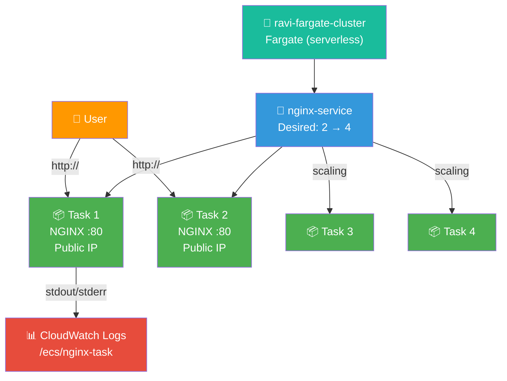

# 🐳 Lab 20 - ECS: Deploy NGINX on Fargate

> 📅 **Updated:** 21 August 2026 | ⏱️ **Duration:** ~45 minutes | 📊 **Level:** Advanced


> ### 🗣️ *"Containers are like shipping containers — standardized, portable, and they work the same everywhere. Fargate means AWS manages the ship."*
> — **Rithu** 📦

<details>
<summary><b>🎭 Ravi & Rithu's Coffee Break Chat</b></summary>

**Ravi:** "What's the difference between containers and VMs?"

**Rithu:** "VMs are like apartments - each has its own kitchen, bathroom, everything. Containers are like dorm rooms - shared building, separate beds."

**Ravi:** "So containers are cheaper?"

**Rithu:** "Cheaper, lighter, faster. Just don't let one container eat all the shared resources or everyone suffers."

</details>

---

## 🎯 What You'll Master

| Skill | Description |
|-------|-------------|
| 🐳 **ECS Clusters** | Create a Fargate cluster (serverless containers) |
| 📋 **Task Definitions** | Blueprint: which image, CPU/memory, ports |
| 🔄 **ECS Services** | Maintain desired task count with self-healing |
| 📈 **Container Scaling** | Scale from 2 to 4 tasks with one number |
| 📊 **CloudWatch Logs** | Container output automatically logged |
| 🔐 **Security Groups** | Control network access to container tasks |

> 💡 **Pro Tip:** Containers are how modern companies ship apps — consistent from laptop to production. Fargate removes the server-hassle from that equation.

---

## 🚦 Before You Start

### ✅ Prerequisites Checklist
- [ ] ✅ **[Lab 19](../19%20-%20Lambda%20-%20API%20Gateway%20REST%20API/README.md)** complete
- [ ] 🌍 AWS account with root or admin access
- [ ] 🧠 Basic understanding of what containers are (conceptual is fine)
- [ ] 🌐 A VPC with at least 2 public subnets (default VPC works!)

### 📦 What You Need (and Don't)
| Required | Optional |
|----------|----------|
| AWS Account | Docker installed (not needed!) |
| Default VPC with 2+ public subnets | Container experience |

> 💡 You don't need to know Docker or have Docker installed! Fargate pulls container images from registries (like Docker Hub) directly. You just need the image name (like `nginx:latest`).

---

## 💰 Cost & Safety First

> ⚠️ **THE METER RUNS FROM THE FIRST SECOND — CLEAN UP WHEN YOU'RE DONE!** Unlike EC2, Fargate has no free tier: compute bills from the moment the image pull starts.

### 💵 Estimated Cost (~45-minute session)

| Resource | Cost |
|----------|------|
| 🐳 0.25 vCPU Fargate task | ~$0.010/hour |
| 💾 0.5 GB memory | ~$0.002/hour |
| 🔄 2 tasks running for ~45 min | ~$0.02 total |
| **Total** | **Cents** ✨ (if you delete immediately!) |

> ⚠️ **DELETE ALL RESOURCES IMMEDIATELY after the lab!** Scale to 0 tasks BEFORE deleting the service. Don't leave the cluster running overnight!

> 💸 **Ravi's Mistake of the Day:** *"I ran a Fargate task with 2 GB memory when 512 MB would've been fine. Fargate charges for provisioned resources, not used resources. Over-provisioning = over-paying."*

### 🏷️ Naming Convention

| Resource | Name |
|----------|------|
| 🐳 ECS Cluster | `ravi-fargate-cluster` |
| 📋 Task Definition | `nginx-task` |
| 🔄 Service | `nginx-service` |
| 🔐 Security Group | `ecs-sg` |
| 📦 Container | `nginx-container` |

---

## 🧠 How It All Fits Together



### 🔑 Key Concepts
| Component | Role |
|-----------|------|
| **Task Definition = Recipe** | Which image, how much CPU/RAM, which ports |
| **Service = The Waiter** | Keeps desired number of tasks running; task dies → orders new one |
| **Cluster = The Kitchen** | Logical home where all your tasks run |
| **Fargate = Serverless Containers** | No EC2 to manage — AWS hides the servers |
| **awsvpc Mode** | Each task gets its own network interface with its own IP |

---

## 🪜 Step-by-Step Guide

> 🗺️ **Build order:** Cluster → Task Definition → Security Group → Service → Wait → Verify → Scale → Logs

### 🟢 Step 1: Create the ECS Cluster 🐳

<details>
<summary><b>🐳 Expand for cluster creation</b></summary>

1. Console search → **ECS** → left nav → **Clusters** → **Create cluster**
2. **Cluster name:** `ravi-fargate-cluster`
3. **Infrastructure:** ⚫ **AWS Fargate (serverless)**
   - ⚠️ Make sure you select Fargate, NOT EC2!
4. **Tags:** Key=`Environment`, Value=`Lab` (optional)
5. Leave other settings as defaults
6. ✅ **Create**

Wait for green success banner: "Cluster ravi-fargate-cluster created successfully."

</details>


> 🗣️ **Rithu's Tip:** *"**EC2 mode:** You manage the instances that run your containers. More control, more work. **Fargate mode:** AWS manages the infrastructure. Less control, less work. Like building a house (EC2) vs. renting an apartment (Fargate)!"*

---

### 🟢 Step 2: Create the Task Definition 📋

<details>
<summary><b>📋 Expand for task definition</b></summary>

A task definition is like a blueprint for your container.

1. Left nav → **Task definitions** → **Create new task definition**
2. **Family:** `nginx-task`
3. **Launch type:** ⚫ **AWS Fargate**
4. **Platform version:** Latest
5. **OS/architecture:** Linux / x86_64
6. **CPU:** `0.25 vCPU` (minimum for Fargate)
7. **Memory:** `0.5 GB` (minimum for Fargate)
8. **Task execution role:** Leave default (auto-creates with `AmazonECSTaskExecutionRolePolicy`)

**Add Container:**

9. Scroll to **Container - 1** section
10. **Container name:** `nginx-container`
11. **Image URI:** `nginx:latest`
12. **Essential:** ✅ Yes
13. **Port mappings:** Container port `80`, Protocol `TCP`
14. ✅ **Create**

</details>


> 🗣️ **Rithu's Tip:** *"`nginx:latest` is one of the most popular Docker images — a web server that serves static content fast. In production, you'd use a custom image with your app code."*

---

### 🟢 Step 3: Create the Security Group 🔐

<details>
<summary><b>🔐 Expand for security group</b></summary>

1. Console search → **EC2** → left nav → **Security Groups**
2. **Create security group:**
   - **Name:** `ecs-sg`
   - **Description:** `Allow HTTP traffic to ECS Fargate tasks`
   - **VPC:** Select your **default VPC**
3. **Inbound rules:** Add rule → Type `HTTP`, Port `80`, Source `Anywhere-IPv4` (0.0.0.0/0)
4. **Outbound rules:** Keep default: All traffic → Anywhere
5. ✅ **Create security group**

</details>


> 🗣️ **Rithu's Tip:** *"In production, this rule would only allow traffic from a load balancer's security group. For this lab, testing from anywhere is fine."*

---

### 🟢 Step 4: Create the Service 🔄

<details>
<summary><b>🔄 Expand for service creation</b></summary>

1. **ECS → Clusters → ravi-fargate-cluster** → **Services** tab → **Create**

**Service details:**
2. **Compute options:** ⚫ **Launch type**
3. **Launch type:** ⚫ **Fargate**
4. **Task definition family:** `nginx-task` · Revision `1 (latest)`
5. **Service name:** `nginx-service`

**Deployment configuration:**
6. **Service type:** ⚫ **Replica**
7. **Desired tasks:** `2`

**Networking:**
8. **VPC:** Default VPC
9. **Subnets:** Select at least **2 public subnets** (different AZs)
10. **Security groups:** Select `ecs-sg`
11. **Public IP:** ⚫ **Turn on** (required for image pull + access)

**Load Balancing:**
12. **Load balancer type:** ⚫ **None** (access tasks directly via public IPs)

13. Review → ✅ **Create**

</details>


> 🗣️ **Rithu's Tip:** *"Why these three settings matter: **Public IP = Yes:** Without it, tasks can't pull images from Docker Hub and you can't reach the web server. **2 subnets in different AZs:** If one AZ goes down, the other keeps running. **Desired count = 2:** ECS always keeps 2 tasks running — crashes are replaced automatically."*

---

### 🟢 Step 5: Wait for RUNNING State ⏳

<details>
<summary><b>⏳ Expand for wait steps</b></summary>

1. **ECS → Clusters → ravi-fargate-cluster** → **Services** tab → `nginx-service`
2. **Tasks** tab — tasks will show PROVISIONING or PENDING
3. **Wait 2-5 minutes** — first run downloads and starts the container image
4. Click **refresh** (↻) periodically

**Task Status Progression:**
```
PROVISIONING → PENDING → RUNNING ✅
     ↓
  (AWS is allocating resources)
  (Downloading container image)
  (Starting the container)
  (Health check passing)
```

</details>


> 🗣️ **Rithu's Tip:** *"Tasks stuck in PENDING? Check the public IP, public subnets, outbound traffic, and region — see Troubleshooting below."*

---

### 🟢 Step 6: Verify NGINX is Running ✅

<details>
<summary><b>✅ Expand for verification</b></summary>

1. Click a running task → **Network** section → find **Public IP**
2. Open browser: `http://<task-public-ip>`
3. You should see the **NGINX welcome page!**


**Check the other task:**
4. Get the public IP of the second task
5. Open `http://<task-2-public-ip>` — same NGINX page!

🎉 **Both tasks run the same `nginx:latest` image!**

</details>

> 🗣️ **Rithu's Tip:** *"In production, an ALB sits in front of these tasks — spreading traffic so users never need to know individual IPs. That's a lab for another day!"*

---

### 🟢 Step 7: Scale the Service 📈

<details>
<summary><b>📈 Expand for scaling</b></summary>

1. **ECS → Clusters → ravi-fargate-cluster → nginx-service** → **Update**
2. **Desired tasks:** Change `2` → `4`
3. **Skip to review** → **Update service**
4. Wait 2-3 minutes
5. **Tasks** tab → **4 tasks** in RUNNING state!

</details>


**Scaling Comparison:**

| Before | After |
|--------|-------|
| 2 tasks running | 4 tasks running |
| Can handle moderate traffic | Can handle double the traffic |
| ~$0.03/hour | ~$0.05/hour |

> 🗣️ **Rithu's Tip:** *"With traditional servers, scaling means: buy a server, install OS, install app, configure networking, hope it works. With Fargate: change a number and click Update. That's the power of containers + serverless!" 🚀*

---

### 🟢 Step 8: View Container Logs 📊

<details>
<summary><b>📊 Expand for log viewing</b></summary>

Every Fargate task automatically sends logs to CloudWatch.

1. Console search → **CloudWatch** → left nav → **Log groups**
2. Find `/ecs/nginx-task`
3. Click on it → open the most recent log stream
4. You should see NGINX startup logs:

```
/docker-entrypoint.sh: /docker-entrypoint.sh: No files or directories
[notice] 1#1: signal process started
```

</details>


> 🗣️ **Rithu's Tip:** *"You can't SSH into a Fargate task — there's no OS to SSH into. Logs are your window inside the container, so check them first when something isn't working!"*

---

## ✅ Validation Checklist

| # | Check | Status |
|---|-------|--------|
| 1️⃣ | ECS cluster `ravi-fargate-cluster` created (Fargate) | ☐ ✅ |
| 2️⃣ | Task definition `nginx-task` with `nginx:latest` | ☐ ✅ |
| 3️⃣ | Security group `ecs-sg` allows HTTP (80) inbound | ☐ ✅ |
| 4️⃣ | Service `nginx-service` with desired count = 2 | ☐ ✅ |
| 5️⃣ | Both tasks reached RUNNING state | ☐ ✅ |
| 6️⃣ | NGINX welcome page accessible via task public IP | ☐ ✅ |
| 7️⃣ | Service scaled to 4 tasks | ☐ ✅ |
| 8️⃣ | All 4 tasks running after scaling | ☐ ✅ |
| 9️⃣ | CloudWatch Logs show NGINX output | ☐ ✅ |

---

## 🧹 Cleanup (Follow Order!)

> ⚠️ **Fargate tasks cost money every minute they're running! Follow this order exactly.**

| Step | Action | Console Location |
|------|--------|------------------|
| 1️⃣ 📉 | Scale service to **0 tasks** → wait for termination | ECS → Services → Update |
| 2️⃣ 🗑️ | Delete service `nginx-service` (type `delete`) | ECS → Clusters → Services |
| 3️⃣ 📋 | Deregister task definition `nginx-task` | ECS → Task definitions |
| 4️⃣ 🗑️ | Delete cluster `ravi-fargate-cluster` | ECS → Clusters → Delete |
| 5️⃣ 🔐 | Delete security group `ecs-sg` | EC2 → Security Groups |
| 6️⃣ 📝 | Delete CloudWatch log group `/ecs/nginx-task` (optional) | CloudWatch → Log groups |

> 🗣️ **Rithu's Tip:** *"The order matters — scale to 0, then delete service → task definition → cluster. Delete the cluster first with a running service and AWS will complain."*

---

## 🚀 Level Ups (Post-Core Lab)

| Challenge | What to Try | Notes |
|-----------|-------------|-------|
| ⚖️ **Add an ALB** | Put an Application Load Balancer in front of tasks | Production-grade traffic distribution |
| 🐳 **Custom Image** | Build a Dockerfile, push to ECR, deploy | Real-world container workflow |
| 🔄 **Rolling Deploy** | Update task definition with new image, watch rolling update | Zero-downtime deployment |
| 📈 **Auto Scaling** | Add ECS Service Auto Scaling with target tracking | Scale based on CPU/memory |

---

## 🆘 Troubleshooting Quick Reference

| 🔍 Issue | 💡 Likely Cause | 🔧 Fix |
|---------|--------------|-----|
| Tasks stuck in PENDING | Can't pull image / networking issue | Verify public IP + public subnets + outbound traffic to Docker Hub |
| Tasks fail immediately and restart | Container crashes / image pull failure | Check CloudWatch Logs; verify image URI `nginx:latest` |
| Can't access NGINX via public IP | SG doesn't allow HTTP / no public IP | Verify `ecs-sg` inbound port 80; verify task has public IP |
| `CannotPullContainerError` | Can't reach Docker Hub | Check public IP, subnet internet access, outbound rules |
| Service scaling takes long | Fargate provisions new infrastructure | Normal! 1-3 minutes per task; first deployment is slowest |
| CloudWatch Logs empty | Wrong region / not enough time | Same region as cluster; wait 1 min after task starts |
| Cleanup fails: "Service has running tasks" | Didn't scale to 0 first | Update service → Desired count = 0 → Wait → Delete |

> 🗣️ **Rithu's Tip:** *"ECS is one of the most powerful services in AWS, but it also has the most moving parts. Work through problems systematically: Cluster → Service → Tasks → Logs → Networking. You've got this!" 💪*

---

## 🎮 Test Yourself! (No Peeking 👀)

**Q1:** What's the difference between a task definition and a service?

<details><summary>👀 Show answer</summary>

**A:** The **task definition** is the recipe (image, CPU, memory, ports). The **service** is the manager that keeps the desired number of tasks running and restarts failures. 🍳

</details>

**Q2:** What makes Fargate different from the EC2 launch type?

<details><summary>👀 Show answer</summary>

**A:** **Fargate is serverless** — AWS runs your containers on managed infrastructure. No EC2 instances to pick, patch, or manage. 🪄

</details>

**Q3:** One of your tasks crashes. What happens?

<details><summary>👀 Show answer</summary>

**A:** The **service notices** the count dropped below desired and **launches a replacement** automatically. Self-healing containers. 🩹

</details>

### 🔥 Bonus Challenge

Change the **desired task count** from 2 to 4 and watch the service launch 2 extra tasks automatically. Then bump it back down and watch them drain. You just scaled containers with one number — the DevOps dream. 🚀

> 💪 **Rithu:** *"Scaling containers is 'change a number, click save.' If you never try it, you'll never believe it."*

---

## 📚 Official Documentation

- 🐳 [Amazon ECS Developer Guide](https://docs.aws.amazon.com/ecs/latest/developerguide/Welcome.html)
- ⚡ [AWS Fargate](https://docs.aws.amazon.com/AmazonECS/latest/developerguide/AWS_Fargate.html)
- 📋 [Task Definitions](https://docs.aws.amazon.com/ecs/latest/developerguide/taskdefinitions.html)

---

## 🎓 What You Learned

> **Container orchestration on AWS:**
> - 🐳 **ECS** → AWS's container orchestration service
> - ⚡ **Fargate** → serverless compute for containers (no EC2 management)
> - 📋 **Task Definitions** → blueprints: image, CPU/memory, ports
> - 🔄 **Services** → maintain desired task count (self-healing, auto-restart)
> - 📈 **Scaling** → horizontal scaling by changing one number
> - 📊 **CloudWatch** → container output automatically logged

**Golden Habit:** Cluster → Task Definition → Service → Verify → Scale. The ECS dance. 🐳

| | Approach |
|---|---|
| 👶 **Noob Way** | SSH into each container to fix things manually |
| 🧙 **Pro Way** | Containers are cattle, not pets: change the recipe, redeploy, watch self-healing do the rest |

---

## ➡️ What's Next?

You've deployed serverless containers! Now let's learn **Infrastructure as Code** — build AWS resources from YAML templates instead of clicking the console. 📜

🎯 **[Lab 21 - CloudFormation: Deploy EC2](../21%20-%20CloudFormation%20-%20Deploy%20EC2/README.md)**

---

<div align="center">

### ⭐ Enjoyed this lab? Star the repo & share your feedback!

**Happy Learning!** 🚀☁️

</div>
