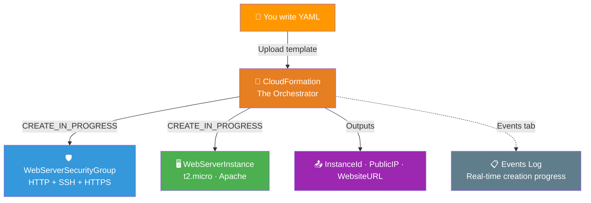
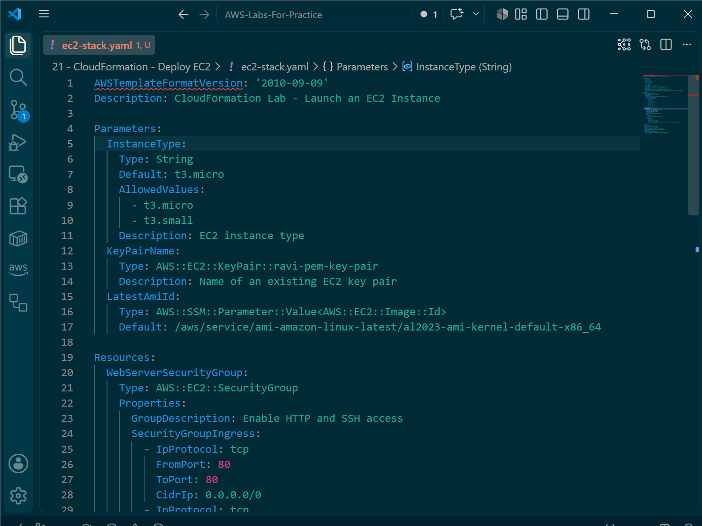
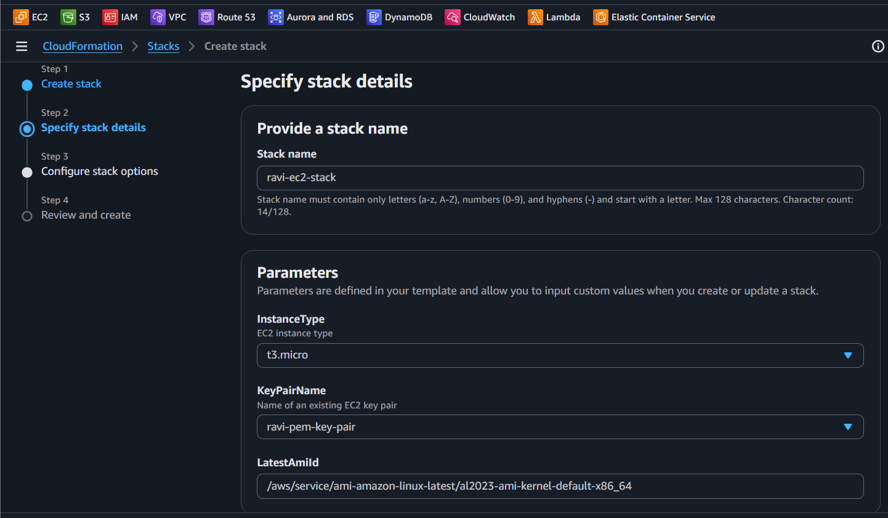
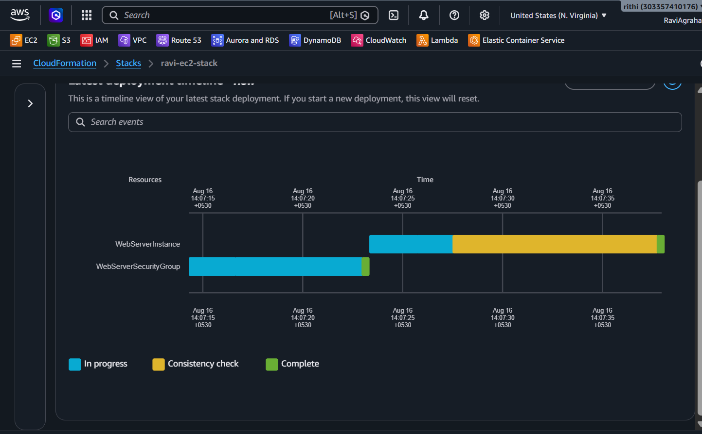
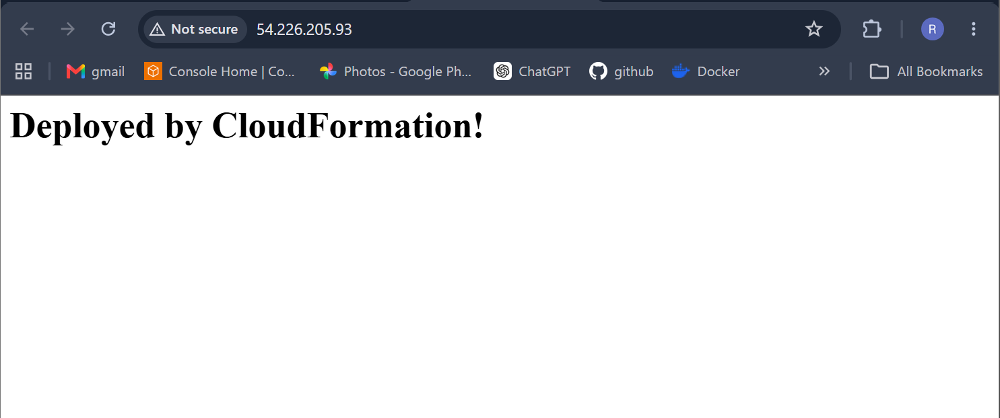
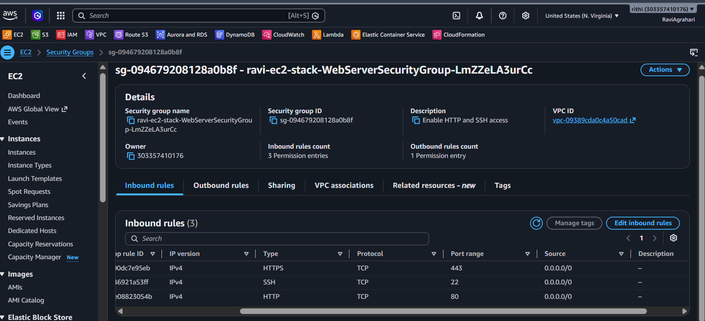
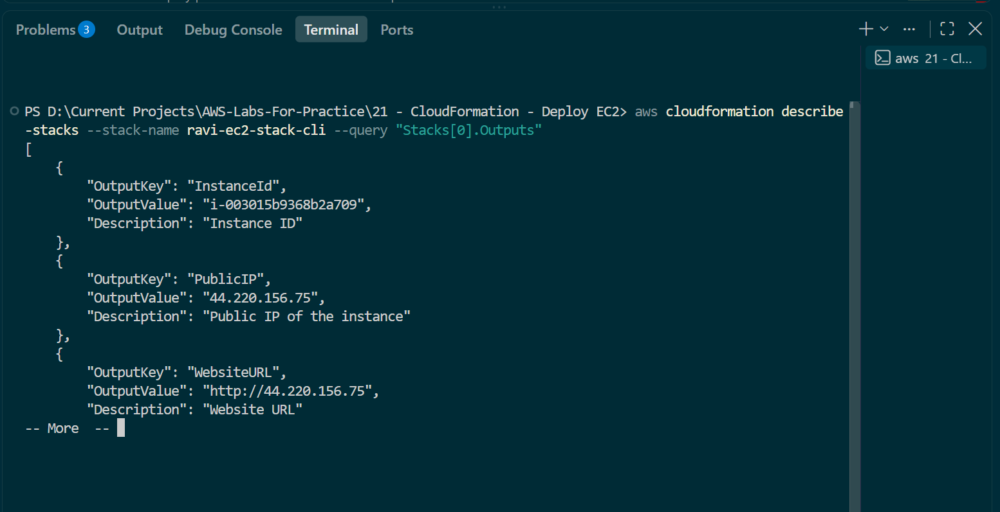

# 📜 Lab 21 - CloudFormation: Deploy EC2

> 📅 **Updated:** 21 August 2026 | ⏱️ **Duration:** ~30 minutes | 📊 **Level:** Intermediate


> ### 🗣️ *"Stop clicking around in the console, Ravi. Let's learn to write code that builds AWS for us!"*
> — **Rithu** 🏗️

<details>
<summary><b>🎭 Ravi & Rithu's Coffee Break Chat</b></summary>

**Ravi:** "CloudFormation is Infrastructure as Code?"

**Rithu:** "Yep! Instead of clicking around the console, you write YAML/JSON and AWS builds it."

**Ravi:** "Like LEGO instructions but for cloud infrastructure?"

**Rithu:** "Perfect analogy! Except the LEGO pieces cost money and some are invisible."

</details>

---

## 🎯 What You'll Master

| Skill | Description |
|-------|-------------|
| 📜 **Infrastructure as Code** | Define AWS resources in YAML instead of clicking |
| 🏗️ **Templates & Stacks** | Write templates, deploy as stacks, update, delete |
| 🧩 **Parameters** | Make templates reusable with user inputs |
| 📤 **Outputs** | Extract useful info (IPs, URLs) after deployment |
| 🖥️ **CLI Integration** | Create and manage stacks from the command line |

> 💡 **Pro Tip:** CloudFormation is **FREE** — you only pay for the resources it creates. Think of it as an architect that never forgets and works while you sleep.

---

## 🚦 Before You Start

### ✅ Prerequisites Checklist
- [ ] ✅ **[Lab 01](../01%20-%20EC2%20-%20Launch%20and%20Connect/README.md)** complete (reuse `first-key-pair` key pair)
- [ ] 🌍 AWS Console access with appropriate permissions
- [ ] 📝 A plain text editor (Notepad, VS Code — NOT Word!)

### 📦 What You Need (and Don't)
| Required | Optional |
|----------|----------|
| AWS Account (Free Tier eligible) | AWS CLI configured (for Step 7) |
| EC2 Key Pair from Lab 01 | |

---

## 💰 Cost & Safety First

> ⚠️ **CloudFormation itself is FREE.** You only pay for the resources it creates.

### 💵 Estimated Cost

| Resource | Cost |
|----------|------|
| 🖥️ t2.micro EC2 instance | ~$0.0116/hr (Free Tier eligible) |
| 📊 Data transfer (minimal) | ~$0.00 |
| **Total** | **< $1** ✨ (within 1 hour) |

> ⚠️ **IMPORTANT:** Delete your stack before leaving! CloudFormation stacks don't auto-delete. Leaving a t2.micro running 24 hours costs ~$0.28.

> 💸 **Ravi's Mistake of the Day:** *"I deleted a CloudFormation stack and it tried to delete the S3 bucket with it. The bucket wasn't empty, so the stack got stuck in DELETE_FAILED state for an hour. Empty buckets before deleting stacks."*

### 🏷️ Naming Convention

| Resource | Name |
|----------|------|
| 📜 Stack | `ravi-ec2-stack` |
| 🖥️ EC2 Instance | `WebServerInstance` |
| 🛡️ Security Group | `WebServerSecurityGroup` |

---

## 🧠 How It All Fits Together



### 🔑 Key Concepts
| Component | Role |
|-----------|------|
| **Template = Blueprint** | YAML file describing desired AWS resources |
| **Stack = House** | The actual resources CloudFormation created from the template |
| **Parameters = Fill-in-the-blanks** | User inputs that make templates reusable |
| **Resources** | The actual AWS resources to create (SG, EC2, etc.) |
| **Outputs** | Information displayed after stack creation (like a receipt) |
| **Stack Lifecycle** | CREATE → UPDATE → DELETE — one click and everything vanishes |

---

## 🪜 Step-by-Step Guide

> 🗺️ **Build order:** Understand IaC → Write template → Create stack → Watch events → Verify → Update → CLI bonus

### 🟢 Step 1: Understand Infrastructure as Code 🧠

<details>
<summary><b>🧠 Expand for IaC concepts</b></summary>

**Infrastructure as Code (IaC)** means defining AWS resources in a text file instead of clicking the console:

- **Console clicking** = cooking without a recipe (messy, hard to repeat)
- **CloudFormation** = following a precise recipe (repeatable, shareable, version-controlled)

**Why it matters:**
- **Repeatable**: Deploy the same stack in 10 regions with one command
- **Version-controlled**: Store your template in Git — see who changed what
- **Automated**: Deploy entire environments with a single API call
- **Self-documenting**: Your template IS your infrastructure documentation
- **Clean**: Delete the stack = every resource it created is gone

</details>

> 🗣️ **Rithu's Tip:** *"Think of CloudFormation as a spell book. You write the spell (template), cast it (create stack), and AWS builds everything. Break the spell (delete stack), and everything vanishes."*

---

### 🟢 Step 2: Write the CloudFormation Template 📝

<details>
<summary><b>📝 Expand for template creation</b></summary>

1. Open a **plain text editor** (Notepad, VS Code — NOT Word!)
2. Create a new file called `ec2-stack.yaml`
3. Copy and paste the **entire** template below:

```yaml
AWSTemplateFormatVersion: '2010-09-09'
Description: CloudFormation Lab - Launch an EC2 Instance with Apache

Parameters:
  InstanceType:
    Type: String
    Default: t3.micro
    AllowedValues:
      - t3.micro
      - t3.small
      - t2.micro
    Description: EC2 instance type

  KeyPairName:
    Type: AWS::EC2::KeyPair::KeyName
    Description: Name of an existing EC2 key pair

  LatestAmiId:
    Type: AWS::SSM::Parameter::Value<AWS::EC2::Image::Id>
    Default: /aws/service/ami-amazon-linux-latest/al2023-ami-kernel-default-x86_64

Resources:
  WebServerSecurityGroup:
    Type: AWS::EC2::SecurityGroup
    Properties:
      GroupDescription: Enable HTTP, HTTPS, and SSH access
      SecurityGroupIngress:
        - IpProtocol: tcp
          FromPort: 22
          ToPort: 22
          CidrIp: 0.0.0.0/0
        - IpProtocol: tcp
          FromPort: 80
          ToPort: 80
          CidrIp: 0.0.0.0/0
        - IpProtocol: tcp
          FromPort: 443
          ToPort: 443
          CidrIp: 0.0.0.0/0

  WebServerInstance:
    Type: AWS::EC2::Instance
    Properties:
      InstanceType: !Ref InstanceType
      KeyName: !Ref KeyPairName
      ImageId: !Ref LatestAmiId
      SecurityGroupIds:
        - !Ref WebServerSecurityGroup
      Tags:
        - Key: Name
          Value: WebServerInstance
      UserData:
        Fn::Base64: |
          #!/bin/bash -xe
          dnf update -y
          dnf install -y httpd
          systemctl enable --now httpd
          cat > /var/www/html/index.html <<'HTML'
          <h1>Deployed by CloudFormation!</h1>
          HTML

Outputs:
  InstanceId:
    Description: Instance ID
    Value: !Ref WebServerInstance

  PublicIP:
    Description: Public IP of the instance
    Value: !GetAtt WebServerInstance.PublicIp

  WebsiteURL:
    Description: Website URL
    Value: !Sub "http://${WebServerInstance.PublicIp}"
```

4. **Save the file** somewhere easy to find (like your Desktop)

</details>



> 🗣️ **Rithu's Tip:** *"The `LatestAmiId` parameter uses SSM Parameter Store to automatically fetch the latest Amazon Linux 2023 AMI. No more hardcoding AMI IDs!"*

---

### 🟢 Step 3: Create the Stack via Console 🏗️

<details>
<summary><b>🏗️ Expand for stack creation</b></summary>

1. Console search → **CloudFormation** → **Create stack** → **With new resources (standard)**
2. **Template source:** ⚫ Upload a template file
3. **Choose file** → select your `ec2-stack.yaml` → **Next**

**Specify stack details:**

4. **Stack name:** `ravi-ec2-stack`
5. **Parameters:**
   - **InstanceType:** `t2.micro` (default)
   - **KeyPairName:** Select `first-key-pair` from dropdown
   - **LatestAmiId:** Leave as default (auto-fills)
6. **Next** → leave defaults → **Next** → **Create stack**

</details>



---

### 🟢 Step 4: Watch the Magic Happen ✨

<details>
<summary><b>✨ Expand for monitoring</b></summary>

1. You should be on the **Stack details** page for `ravi-ec2-stack`
2. Click the **Events** tab to watch creation in real-time
3. Events appear like:
   - `WebServerSecurityGroup` → CREATE_IN_PROGRESS → CREATE_COMPLETE
   - `WebServerInstance` → CREATE_IN_PROGRESS → CREATE_COMPLETE
4. The whole process takes **2-3 minutes**

**Watch for these statuses:**
- `CREATE_IN_PROGRESS` — Being created right now
- `CREATE_COMPLETE` — Successfully created ✅
- `CREATE_FAILED` — Something went wrong (check the error message)

5. Wait until **Stack status** shows **`CREATE_COMPLETE`** (in green)

</details>



> 🗣️ **Rithu's Tip:** *"If you see `CREATE_FAILED`, don't panic! Read the error message — CloudFormation gives you detailed reasons. Common issues: wrong key pair name, missing permissions, or resource limits."*

---

### 🟢 Step 5: Verify Your Work ✅

<details>
<summary><b>✅ Expand for verification</b></summary>

**Check the Outputs tab:**

1. Click the **Outputs** tab on the stack details page
2. You should see three outputs:
   - **InstanceId** — Something like `i-0abc123def456`
   - **PublicIP** — Something like `54.xx.xx.xx`
   - **WebsiteURL** — Something like `http://54.xx.xx.xx`
3. Click the **WebsiteURL** link → you should see: **"Deployed by CloudFormation!"**

**Check EC2:**

4. Open **EC2** → **Instances**
5. You should see an instance named **`WebServerInstance`** in **Running** state

</details>



> 🗣️ **Rithu's Tip:** *"The `UserData` script in the template automatically installed Apache and created a web page. This is called 'bootstrapping' — your instance is ready to serve traffic the moment it launches!"*

---

### 🟢 Step 6: Update the Stack 🔄

<details>
<summary><b>🔄 Expand for stack update</b></summary>

1. Go back to `ec2-stack.yaml` in your text editor
2. Change the EC2 instance tag from:
   ```yaml
   - Key: Name
     Value: WebServerInstance
   ```
   to:
   ```yaml
   - Key: Name
     Value: UpdatedWebServerInstance
   ```
3. Add a new HTTPS inbound rule to the security group:
   ```yaml
   - IpProtocol: tcp
     FromPort: 443
     ToPort: 443
     CidrIp: 0.0.0.0/0
   ```
4. Save the file

**Update the stack:**

5. CloudFormation console → select `ravi-ec2-stack` → **Update**
6. Select **Replace current template** → **Next**
7. Upload updated `ec2-stack.yaml` → **Next** → **Next** → **Update stack**
8. Submit change set → wait for `UPDATE_COMPLETE`

**Verify:**
9. EC2 console → instance name is now **`UpdatedWebServerInstance`**
10. Security group includes HTTPS on port **443**

</details>



> 🗣️ **Rithu's Tip:** *"A real CloudFormation update is about changing template properties, not editing the bootstrap script. The stack update reconciles the live environment with the YAML definition."*

---

### 🟢 Step 7: Create Stack via CLI (Bonus) 🖥️

<details>
<summary><b>🖥️ Expand for CLI commands</b></summary>

Open your terminal and run:

```bash
aws cloudformation validate-template --template-body file://ec2-stack.yaml

aws cloudformation create-stack --stack-name ravi-ec2-stack-cli \
  --template-body file://ec2-stack.yaml \
  --parameters "ParameterKey=KeyPairName,ParameterValue=first-key-pair"
```

**Wait for creation:**

```bash
aws cloudformation wait stack-create-complete --stack-name ravi-ec2-stack-cli
```

**Check the stack and outputs:**

```bash
aws cloudformation describe-stacks --stack-name ravi-ec2-stack-cli
aws cloudformation describe-stacks --stack-name ravi-ec2-stack-cli --query "Stacks[0].Outputs"
```

</details>



> 🗣️ **Rithu's Tip:** *"The CLI is powerful for automation. Imagine running this in a script at 3 AM to deploy infrastructure automatically. That's the power of IaC!"*

---

## ✅ Validation Checklist

| # | Check | Status |
|---|-------|--------|
| 1️⃣ | `ec2-stack.yaml` file exists on your computer | ☐ ✅ |
| 2️⃣ | Stack `ravi-ec2-stack` shows `CREATE_COMPLETE` | ☐ ✅ |
| 3️⃣ | Outputs tab shows InstanceId, PublicIP, WebsiteURL | ☐ ✅ |
| 4️⃣ | WebsiteURL loads "Deployed by CloudFormation!" | ☐ ✅ |
| 5️⃣ | EC2 console shows `WebServerInstance` running | ☐ ✅ |
| 6️⃣ | Stack updated with new instance name | ☐ ✅ |
| 7️⃣ | Security group includes HTTPS (443) | ☐ ✅ |
| 8️⃣ | (Optional) CLI stack `ravi-ec2-stack-cli` also complete | ☐ ✅ |

---

## 🧹 Cleanup (Follow Order!)

> ⚠️ **CloudFormation's best feature: deleting the stack deletes EVERYTHING it created!**

| Step | Action | Console Location |
|------|--------|------------------|
| 1️⃣ 🗑️ | Delete stack `ravi-ec2-stack` | CloudFormation → Stacks → Delete |
| 2️⃣ 🗑️ | Delete CLI stack (if created): `aws cloudformation delete-stack --stack-name ravi-ec2-stack-cli` | CLI |
| 3️⃣ ✅ | Verify: EC2 instance terminated, no stacks remain | EC2 + CloudFormation consoles |

> 🗣️ **Rithu's Tip:** *"One click and EVERYTHING is cleaned up. No orphaned resources, no surprise bills. Compare this to manually creating resources — you'd have to remember to delete each one individually!"*

---

## 🚀 Level Ups (Post-Core Lab)

| Challenge | What to Try | Notes |
|-----------|-------------|-------|
| 🪣 **Add S3 Bucket** | Add `AWS::S3::Bucket` resource to template | One-click bucket create + teardown |
| 🔗 **Cross-stack References** | Export outputs from one stack, import in another | Modular infrastructure |
| 📚 **Stack Sets** | Deploy the same template across multiple accounts/regions | Enterprise-scale IaC |
| 🧬 **Drift Detection** | Manually change a resource, then detect the drift | CloudFormation knows! |

---

## 🆘 Troubleshooting Quick Reference

| 🔍 Issue | 💡 Likely Cause | 🔧 Fix |
|---------|--------------|-----|
| "The key pair does not exist" | Wrong key pair name | EC2 → Key Pairs → verify name (case-sensitive) |
| "AMI not found" | SSM parameter failed to resolve | Manually replace `LatestAmiId` with a specific AMI ID |
| Website shows "This site can't be reached" | Instance not running / SG blocks HTTP | Check instance running; SG allows port 80; wait for UserData |
| "Permission denied" creating stack | Missing IAM permissions | Ensure IAM user has CloudFormation, EC2, SG permissions |
| Stack update fails | Some changes require resource replacement | Check Events tab for specific error |
| Stack won't delete | Dependencies from manually created resources | Delete those first, then try again |

> 🗣️ **Rithu's Tip:** *"You just wrote your first CloudFormation template! From now on, every AWS resource you create, try to think: 'Can I template this?' The answer is almost always yes. Welcome to IaC!"*

---

## 🎮 Test Yourself! (No Peeking 👀)

**Q1:** What's the difference between a template and a stack?

<details><summary>👀 Show answer</summary>

**A:** The **template** is the YAML plan; the **stack** is the set of live resources CloudFormation created from that plan. 📐

</details>

**Q2:** How do you delete ALL the resources a CloudFormation stack created?

<details><summary>👀 Show answer</summary>

**A:** **Delete the stack.** CloudFormation tears down everything it created — instances, SGs, the lot. One click cleanup. 🪄

</details>

**Q3:** Why do companies prefer Infrastructure as Code over console clicks?

<details><summary>👀 Show answer</summary>

**A:** It's **reproducible** (same template = same infra), **reviewable** (code reviews!), **versionable** (git history), and **recoverable** (redeploy after disaster). 📜

</details>

### 🔥 Bonus Challenge

Add an **S3 bucket resource** to your template (search `AWS::S3::Bucket`), update the stack, and confirm the bucket appears. Then **delete the stack** and watch the bucket vanish with it. You just did one-click create AND teardown. 🏗️

> 💪 **Rithu:** *"If you leave this lab still clicking the console for everything, re-read this section. Code is the way."*

---

## 📚 Official Documentation

- 📜 [AWS CloudFormation User Guide](https://docs.aws.amazon.com/AWSCloudFormation/latest/UserGuide/Welcome.html)
- 📝 [Template Reference](https://docs.aws.amazon.com/AWSCloudFormation/latest/UserGuide/template-reference.html)
- 🧩 [Intrinsic Functions](https://docs.aws.amazon.com/AWSCloudFormation/latest/UserGuide/intrinsic-function-reference.html)

---

## 🎓 What You Learned

> **Infrastructure as Code unlocked:**
> - 📜 **CloudFormation** → define AWS resources in YAML templates
> - 🏗️ **Stacks** → live resources created from templates
> - 🧩 **Parameters** → make templates reusable with user inputs
> - 📤 **Outputs** → extract useful info (IPs, URLs) after deployment
> - 🔄 **Update/Delete** → change templates and tear down everything with one click
> - 🖥️ **CLI** → automate stack creation from the command line

**Golden Habit:** Template it → Deploy it → Verify it → Update it → Delete it. The IaC lifecycle. 🏗️

| | Approach |
|---|---|
| 👶 **Noob Way** | Rebuild infrastructure by hand after a disaster — hours of clicking |
| 🧙 **Pro Way** | IaC: redeploy the whole environment from a template in minutes. Version-controlled, reviewable |

---

## ➡️ What's Next?

You've mastered Infrastructure as Code! Now let's explore **CloudTrail** — AWS's audit logging service that records every action taken in your account. 🕵️

🎯 **[Lab 22 - CloudTrail: Enable and Query](../22%20-%20CloudTrail%20-%20Enable%20and%20Query/README.md)**

---

<div align="center">

### ⭐ Enjoyed this lab? Star the repo & share your feedback!

**Happy Learning!** 🚀☁️

</div>
