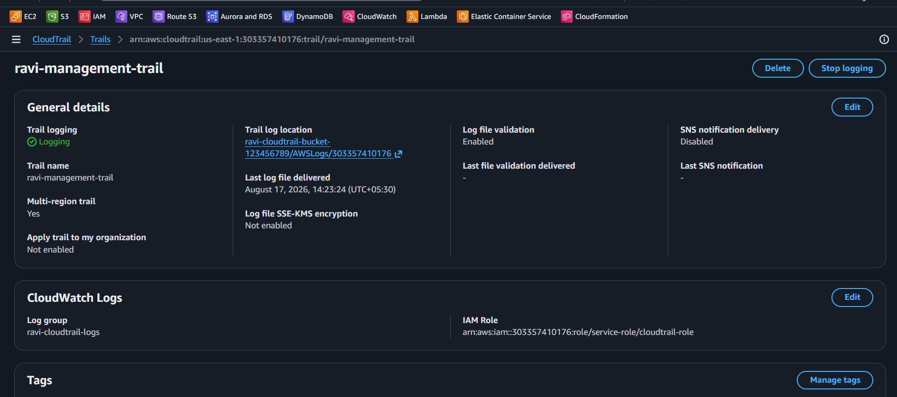
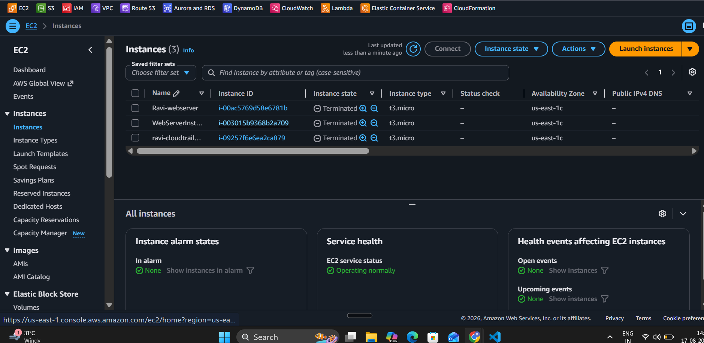
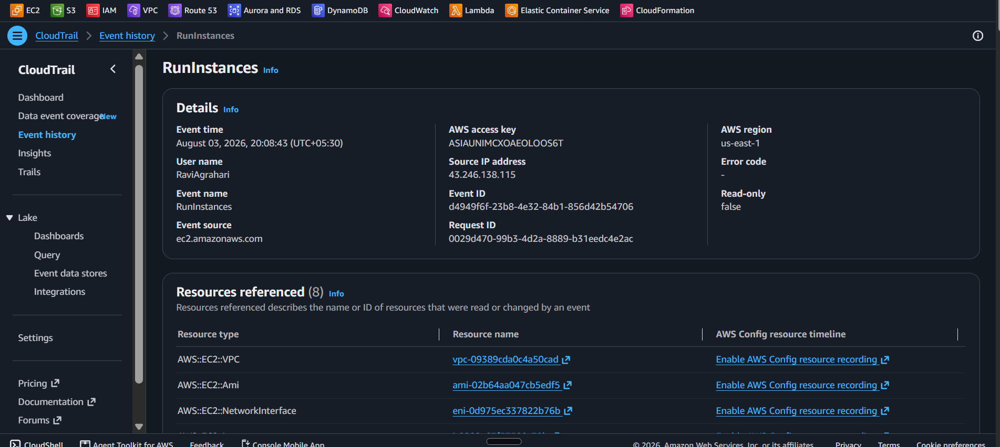
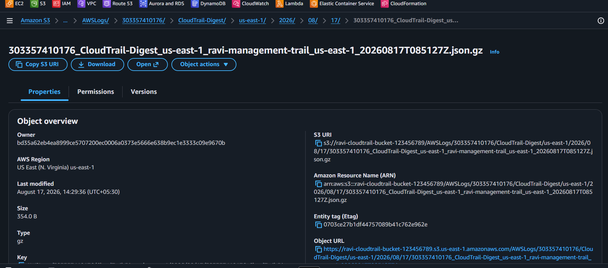
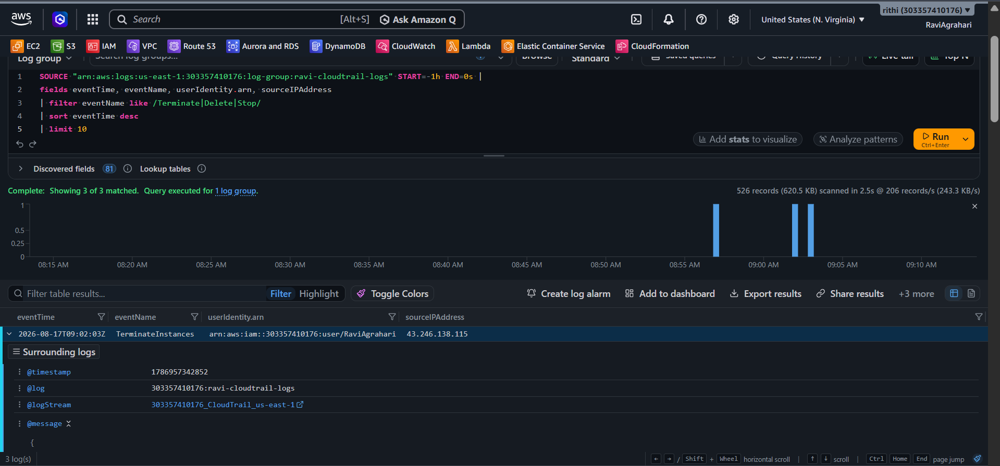
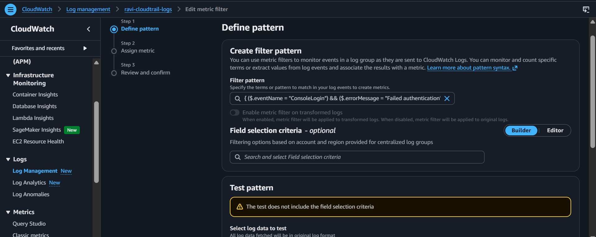
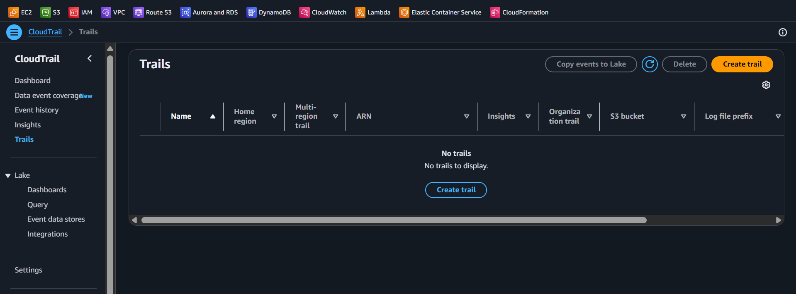

<div align="center">


# Lab 22 — CloudTrail: Enable and Query


</div>

> "In the cloud, someone is always watching. CloudTrail is your security camera — and it never blinks!" — Rithu

---

<details>
<summary><b>🎭 Ravi & Rithu's Coffee Break Chat</b></summary>

**Ravi:** "CloudTrail is like a security camera?"

**Rithu:** "More like a flight recorder for your AWS account. Every API call, every change, logged."

**Ravi:** "Even if I accidentally delete something?"

**Rithu:** "ESPECIALLY if you accidentally delete something. CloudTrail will know exactly who did it... which is you."

</details>

## 📋 Table of Contents

- [🎯 Objective](#-objective)
- [📊 Lab Progress](#-lab-progress)
- [🤔 In Plain English](#-in-plain-english)
- [🧠 Prerequisites](#-prerequisites)
- [💰 Cost Warning](#-cost-warning)
- [🏗️ Architecture](#️-architecture)
- [🛠️ Step-by-Step Instructions](#️-step-by-step-instructions)
- [✅ Validation Checklist](#-validation-checklist)
- [🧹 Cleanup (IMPORTANT!)](#-cleanup-important)
- [🧠 Memory Tips](#-memory-tips)
- [🎓 What You Learned](#-what-you-learned)
- [🎮 Test Yourself](#-test-yourself-no-peeking-)
- [🆚 Pro Tip vs Noob Tip](#-pro-tip-vs-noob-tip)
- [🔗 What's Next?](#-whats-next)
- [❓ Troubleshooting](#-troubleshooting)

---

<div align="center">

## 📊 Lab Progress

`[██░░░░░░░░░░░░░░░░░░] 5% — Let's Begin!`

</div>

---

## 🤔 In Plain English

> **What is this, really?** CloudTrail is the **security camera + black box** of your AWS account. Every API call — who did it, when, from which IP, and what changed — gets recorded. Enable a trail and those records stream to S3 (permanent storage) and CloudWatch Logs (searchable). If something weird happens in your account, CloudTrail is how you find the culprit. 🕵️
>
> 🌍 **Why you should care:** "Who terminated the production database?" is a real interview question. CloudTrail is the answer. Every serious account has it on from day one.

---

## 🎯 Objective

By the end of this lab, you will:
- Understand what CloudTrail is and why every AWS account needs it
- Create a trail that logs all management events to S3 and CloudWatch Logs
- Query events with CloudWatch Logs Insights
- View the audit trail of every action taken in your AWS account

---

## 🧠 Prerequisites

- [ ] Completed Lab 21 (CloudFormation)
- [ ] AWS Console access with appropriate permissions
- [ ] An EC2 key pair exists (from previous labs)

---

## 💰 Cost Warning

CloudTrail has a generous free tier:

| What | Cost |
|------|------|
| First trail — management events | **FREE** (first copy per region) |
| Management events beyond the first | ~$2.00 per 100K events |
| Data events (S3/Lambda) | $0.10 per 100K events (not needed for this lab) |
| CloudWatch Logs ingestion | ~$0.50/GB (minimal for this lab) |
| S3 storage for logs | Standard S3 pricing (pennies) |

Estimated total lab cost: **< $1** if cleaned up within 1 hour.

> 💡 **CloudTrail Lake vs trails:** This lab uses a **trail** (your first copy of management events is free). **CloudTrail Lake** (event data stores) is a *separate* feature billed per GB of ingestion — don't create one, you don't need it.

> ⚠️ **IMPORTANT**: Delete your trail, S3 bucket, and CloudWatch log group before leaving! CloudTrail logs are small but can accumulate over time.

> **Ravi's Mistake of the Day:** I relied on CloudTrail Event History as my "audit trail" — but it only keeps 90 days. Once events rolled off, they were gone forever. A trail to S3 is the real long-term archive.

---

## 🏗️ Architecture

```
┌─────────────────────────────────────────────────────┐
│                  CloudTrail                          │
│                                                     │
│  ┌────────────┐     ┌──────────┐    ┌───────────┐  │
│  │ AWS API    │────▶│  Trail   │───▶│  S3       │  │
│  │ Calls      │     │          │    │  Bucket   │  │
│  │ (who/what) │     │  Logs    │    │  (JSON)   │  │
│  └────────────┘     │  Events  │    └───────────┘  │
│                     │          │                    │
│                     │          │    ┌───────────┐  │
│                     │          │───▶│ CloudWatch │  │
│                     └──────────┘    │ Logs       │  │
│                                     │ (Insights) │  │
│                                     └───────────┘  │
└─────────────────────────────────────────────────────┘
```

> **Did You Know?** CloudTrail logs are stored in S3 and can be queried with Athena. You can literally ask SQL questions about every API call ever made in your AWS account.

---

## 🛠️ Step-by-Step Instructions

### 

Let's set up CloudTrail to record everything happening in your account.

1. Search for **CloudTrail** in the AWS Console and open it.
2. Click **Trails** in the left sidebar → click the orange **Create trail** button (top right).

**Configure your trail:**

3. **Trail name**: Type `ravi-management-trail`
4. **Enable for all accounts in my organization**: Leave unchecked (this is for AWS Organizations)
5. Under **Storage location** → **S3 bucket**, select **Create new S3 bucket**:
   - **S3 bucket**: Type `ravi-cloudtrail-bucket-` followed by random numbers (like `12345`) — bucket names must be globally unique
   - **Log file SSE-KMS encryption**: **Disabled** — keeps logs on free SSE-S3 encryption. (The default, Enabled, creates a paid KMS key.)
   - In **Additional settings**, **Log file validation**: Leave **Enabled** — detects tampering, at no extra cost
6. Under **CloudWatch Logs**, select **Enabled**:
   - **Log group**: **Create new** → type `ravi-cloudtrail-logs`
   - **IAM role**: **Create new** → leave the default name
7. Click **Next** to reach **Choose log events**:
   - **Management events** → **API activity**: **Read/Write** (log both). Management events are logged by default.
   - **Data events**: **Leave off** — data events (S3 object access, Lambda invocations) are NOT logged by default and cost extra. We don't need them.
   - **Insights events**: Leave off (extra cost).
8. Click **Next** → review the settings → click **Create trail**

> 
> **Good news:** Every console trail is a **multi-Region trail** by default — it logs activity in all enabled Regions, so there's no checkbox to worry about. (Single-Region trails can only be created with the AWS CLI.) Logging everything means no blind spots!
>
> CloudTrail also creates and applies the **S3 bucket policy** that grants itself write permission — no manual policy needed.

📸 [Screenshot: CloudTrail page with all settings configured as described]


---

### 

CloudTrail is only useful if there's something to log! Let's create some activity.

1. Go to **EC2** → **Launch instance**.
2. **Name**: `ravi-cloudtrail-test`
3. **AMI**: Amazon Linux 2023 (Free Tier eligible)
4. **Instance type**: `t2.micro` (Free Tier eligible)
5. **Key pair**: Select your existing key pair
6. Leave everything else default and click **Launch instance**.

Wait for the instance to reach **Running**, then:

7. Select the instance → **Instance state** → **Stop instance** → confirm → wait for **Stopped**.
8. Select the instance → **Instance state** → **Terminate instance** → confirm.

We just created three CloudTrail events:
- `RunInstances` (launching the instance)
- `StopInstances` (stopping the instance)
- `TerminateInstances` (terminating the instance)

> 
> "Every click in the AWS Console generates an API call, and CloudTrail records every one of them. Launching, stopping, terminating — each action has a timestamp, user, and source IP."

📸 [Screenshot: EC2 console showing the instance being terminated]


---

### 

Now let's see what CloudTrail recorded!

1. Go to **CloudTrail** → **Event history** in the left sidebar.

**Filter the events:**

2. Click the **Filter** dropdown → select **Event name** → type `RunInstances` and press Enter.
3. You should see the event for when you launched the instance.

**Explore the event details:**

4. Click any event to expand it. You'll see:
   - **Event time**: When the action happened (UTC)
   - **Event name**: RunInstances
   - **Event source**: ec2.amazonaws.com
   - **User identity**: Who performed the action (your IAM user)
   - **Source IP address**: Where the request came from
   - **Request parameters**: What was requested (instance type, AMI, etc.)
   - **Response elements**: What AWS returned (instance ID, etc.)

5. Try filtering by `StopInstances` and `TerminateInstances` to see those events too.

> 
> "Event History shows the last 90 days of events. For longer retention, you need the S3 bucket we configured. Think of it as a 'recent calls' log on your phone."
>
> **CLI alternate:** `aws cloudtrail lookup-events --lookup-attributes AttributeKey=EventName,AttributeValue=RunInstances`

📸 [Screenshot: CloudTrail Event History showing the RunInstances event with details expanded]


---

### 

Your trail sends events to S3 as JSON files. Let's look at them!

1. Go to **S3** and open the bucket you created (starts with `ravi-cloudtrail-bucket-`).
2. Navigate to:
   ```
   AWSLogs/
   └── [your-account-id]/
       └── CloudTrail/
           └── [your-region]/
               └── [year]/
                   └── [month]/
                       └── [day]/
   ```
3. You'll see `.json.gz` log files (compressed). Download one, unzip it, and open it in a text editor.

**What you'll see:**

```json
{
  "Records": [
    {
      "eventVersion": "1.08",
      "eventTime": "2024-01-15T10:30:00Z",
      "awsRegion": "us-east-1",
      "eventSource": "ec2.amazonaws.com",
      "eventName": "RunInstances",
      "userIdentity": {
        "type": "IAMUser",
        "principalId": "AIDA...",
        "arn": "arn:aws:iam::123456789012:user/ravi",
        "accountId": "123456789012"
      },
      "sourceIPAddress": "203.0.113.50",
      "requestParameters": { ... }
    }
  ]
}
```

> 
> "These S3 log files are your permanent audit trail. In a real company, you'd keep these for years for compliance (HIPAA, PCI-DSS, SOC 2). Security teams and auditors love CloudTrail!"



---

### 

This is where CloudTrail gets powerful! Let's query our events using SQL-like syntax.

1. Go to **CloudWatch** → **Logs** → **Logs Insights**.
2. In the **Select log group(s)** dropdown, select `ravi-cloudtrail-logs`.

**Run your first query:**

3. Paste this into the editor and click **Run query** (or press Ctrl+Enter):

```
fields eventTime, eventName, userIdentity.type, sourceIPAddress
| filter eventName = "RunInstances"
| sort eventTime desc
| limit 10
```

4. You should see your RunInstances events!

**Try a more advanced query:**

5. Clear the editor and run:

```
fields eventTime, eventName, userIdentity.arn, sourceIPAddress, userAgent
| sort eventTime desc
| limit 20
```

6. This shows ALL events — who did what, and from where.

**Try a security-focused query:**

7. Run this to find destructive actions:

```
fields eventTime, eventName, userIdentity.arn, sourceIPAddress
| filter eventName like /Terminate|Delete|Stop/
| sort eventTime desc
| limit 10
```

8. Handy for security audits!

> 
> "CloudWatch Logs Insights is like Google for your CloudTrail logs. Instead of scrolling through thousands of events, you write a query and get instant answers. In a real job, you might be asked: 'Who stopped our production server at 3 AM last Tuesday?' — and this is how you'd find out!"

📸 [Screenshot: CloudWatch Logs Insights showing the query and results]

---

### 

Want to get alerted when suspicious activity happens? Create a metric filter!

1. Go to **CloudWatch** → **Logs** → **Log groups** → `ravi-cloudtrail-logs` → **Metric filters** tab → **Create metric filter**.
2. Enter this filter pattern and click **Next**:
   ```
   { ($.eventName = "ConsoleLogin") && ($.errorMessage = "Failed authentication") }
   ```
3. **Filter name**: `FailedLoginAttempts` | **Metric namespace**: `CloudTrailMetrics` | **Metric name**: `FailedLogins` | **Metric value**: `1`
4. Click **Next** → **Create metric filter**.

Now you can alarm on this metric to get notified of failed login attempts!

> 
> "Metric filters are how you turn logs into actionable alerts. Failed logins, unauthorized API calls, root user activity — all of these can trigger alarms that notify your security team."

📸 [Screenshot: Metric filter creation page with the filter pattern entered]


---

## ✅ Validation Checklist

Before moving on, confirm all of these:

- [ ] Trail `ravi-management-trail` exists and is enabled
- [ ] Trail is logging to S3 bucket and CloudWatch Logs
- [ ] Event history shows your EC2 launch, stop, and terminate events
- [ ] S3 bucket contains JSON log files in the correct folder structure
- [ ] CloudWatch Logs Insights query returns results
- [ ] (Optional) Metric filter for failed logins is created

---

> **Achievement Unlocked:** Audit Trail! CloudTrail activated.

---

## 🧹 Cleanup (IMPORTANT!)

CloudTrail is powerful but logs can accumulate. Clean up everything!

**Delete the EC2 instance (if still running):**

1. Go to **EC2** → **Instances** → select any test instances → **Instance state** → **Terminate instance**.

**Delete the CloudTrail trail:**

2. Go to **CloudTrail** → **Trails** → select `ravi-management-trail` → **Delete** → confirm.

**Delete the CloudWatch Logs log group** *(this also removes the metric filter if you created one)*:

3. Go to **CloudWatch** → **Logs** → **Log groups** → select `ravi-cloudtrail-logs` → **Actions** → **Delete** → type `delete` → confirm.

**Delete the IAM role CloudTrail created:**

4. Go to **IAM** → **Roles** → select the `CloudTrail_CloudWatchLogs_Role` role → **Delete** → confirm.

**Delete the S3 bucket:**

5. Go to **S3** → **Buckets** → open `ravi-cloudtrail-bucket-...` → **Empty** → type `permanently delete` to confirm.
6. Back on the bucket list, select the bucket → **Delete** → type the bucket name → **Delete bucket**.

**Verify everything is gone:**

7. CloudTrail: no trails. S3: bucket gone. CloudWatch: log group gone.

> 
> "In production, you'd NEVER delete your CloudTrail. But for this lab, we clean up to avoid any charges. In your real AWS account, always keep at least one trail enabled — it's your security lifeline!"

📸 [Screenshot: CloudTrail console showing no trails remaining]

---

## 🧠 Memory Tips

Stick these in your brain and they'll never leave. 🧲

| 🧠 Memory Hook | Remember it like... |
|---|---|
| **CloudTrail = security camera** | Records **every API call** in your account. Someone did something? The tape has it. 🎥 |
| **Management vs Data events** | **Management** = creating/changing resources (big actions). **Data** = touching data (S3 object reads). 📼 |
| **Event history = 90 days** | The console's built-in replay — free, but only back 90 days. Longer? Send logs to S3. 📅 |
| **Logs → S3 + CloudWatch** | S3 = permanent archive. CloudWatch Logs Insights = search with SQL-ish queries. 🗂️ |
| **Metric filters = alarm triggers** | Turn a log pattern ("AccessDenied") into a metric that can fire alarms. ⏰ |

> 🗣️ **Rithu:** *"Set up CloudTrail before you need it. You can't retroactively watch a camera that was never plugged in."

---

## 🎓 What You Learned

In this lab, you learned:

| Concept | What It Means |
|---------|---------------|
| **CloudTrail** | AWS service that records API activity in your account |
| **Trail** | A configuration that tells CloudTrail where to send logs |
| **Management Events** | API calls that manage AWS resources (create, delete, modify) |
| **Data Events** | API calls that operate on data within resources (S3 object access) |
| **Event History** | Last 90 days of events viewable in the console |
| **S3 Log Storage** | Permanent storage of CloudTrail logs as JSON files |
| **CloudWatch Logs Insights** | SQL-like query engine for searching CloudTrail logs |
| **Metric Filters** | Convert log patterns into CloudWatch metrics and alarms |
| **Security Auditing** | Who did what, when, and from where — the complete picture |

---

## 🎮 Test Yourself! (No Peeking 👀)

**Q1:** What's the difference between management events and data events?

<details><summary>👀 Show answer</summary>

**A:** **Management events** = API calls that *change resources* (create/delete/modify). **Data events** = calls that *touch data inside* resources (like reading an S3 object). 📼

</details>

**Q2:** How far back can you see events in the CloudTrail console's Event History?

<details><summary>👀 Show answer</summary>

**A:** **90 days.** For longer retention (or compliance), stream logs to **S3** permanently. 📅

</details>

**Q3:** Where should CloudTrail logs go for long-term, searchable storage?

<details><summary>👀 Show answer</summary>

**A:** **S3** for permanent archive + **CloudWatch Logs** (with Logs Insights) for powerful searching and alerting. 🗂️

</details>

### 🔥 Bonus Challenge

Launch **and terminate** an EC2 instance, then use CloudTrail's Event History (or Logs Insights) to find the `RunInstances` and `TerminateInstances` events — including **who** did it and **from where**. You've just done a real security audit. 🕵️

> 💪 **Rithu:** *"Every action you've taken in these labs is already recorded. CloudTrail was watching you the whole time — that's the point."

---

### 🆚 Pro Tip vs Noob Tip

| | Approach |
|---|---|
| **Noob Tip** | Enable CloudTrail only after something bad happens |
| **Pro Tip** | Trail on from day one, logging to S3 + CloudWatch, with an alarm on AccessDenied spikes |

---

## 🔗 What's Next?

You now have eyes on everything happening in your AWS account! In the next lab, we'll learn about **KMS** — AWS's Key Management Service for encrypting your data.

**[Lab 23 — KMS: Encrypt S3 and EBS →](../23%20-%20KMS%20-%20Encrypt%20S3%20and%20EBS/README.md)**

---

## ❓ Troubleshooting

<details>
<summary><strong>No events showing in Event History</strong></summary>

**Fix**: Wait 5-10 minutes after creating the trail — it can take time for events to appear. Also make sure you're looking in the correct region.
</details>

<details>
<summary><strong>Trail shows "Logging" but no CloudWatch Logs</strong></summary>

**Fix**: The IAM role might not have permissions. Go to the trail settings and verify the CloudWatch Logs IAM role was created correctly.
</details>

<details>
<summary><strong>CloudWatch Logs Insights query returns no results</strong></summary>

**Fix**: Make sure you selected the correct log group (`ravi-cloudtrail-logs`). Also verify that events have been delivered (can take 5-15 minutes for new trails).
</details>

<details>
<summary><strong>S3 bucket is empty</strong></summary>

**Fix**: CloudTrail delivers logs within 15 minutes. If the bucket is empty after 30 minutes, check the trail status in CloudTrail console.
</details>

<details>
<summary><strong>"Access Denied" when creating the trail</strong></summary>

**Fix**: Ensure your IAM user has the AWS-managed `AWSCloudTrail_FullAccess` policy attached.
</details>

<details>
<summary><strong>Can't delete the S3 bucket</strong></summary>

**Fix**: You must EMPTY the bucket first (delete all objects), then delete the bucket. S3 buckets cannot be deleted if they contain objects.
</details>

<details>
<summary><strong>Metric filter doesn't seem to work</strong></summary>

**Fix**: After creating the filter, wait 5-10 minutes for it to start processing new log events. The filter only applies to NEW events, not historical ones.
</details>

---

> 
> "You now know more about AWS security auditing than most people! CloudTrail is one of those services that seems boring until something goes wrong — then it's the most important thing in the world. Always keep it enabled!"

---

<div align="center">


**🎉 Congratulations on completing Lab 22! 🎉**

</div>
