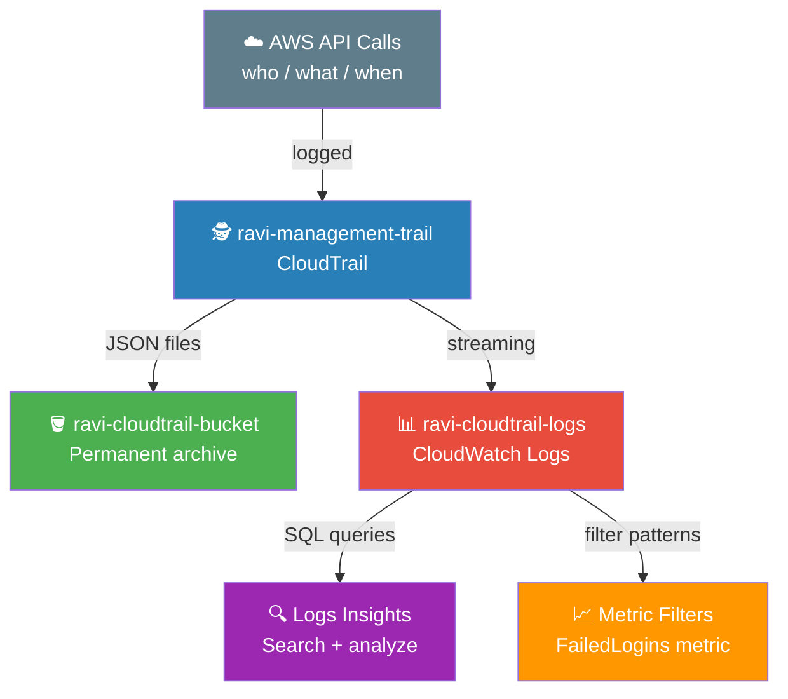

# 🕵️ Lab 22 - CloudTrail: Enable and Query

> 📅 **Updated:** 21 August 2026 | ⏱️ **Duration:** ~20 minutes | 📊 **Level:** Beginner


> ### 🗣️ *"In the cloud, someone is always watching. CloudTrail is your security camera — and it never blinks!"*
> — **Rithu** 🕵️

<details>
<summary><b>🎭 Ravi & Rithu's Coffee Break Chat</b></summary>

**Ravi:** "CloudTrail is like a security camera?"

**Rithu:** "More like a flight recorder for your AWS account. Every API call, every change, logged."

**Ravi:** "Even if I accidentally delete something?"

**Rithu:** "ESPECIALLY if you accidentally delete something. CloudTrail will know exactly who did it... which is you."

</details>

---

## 🎯 What You'll Master

| Skill | Description |
|-------|-------------|
| 🕵️ **CloudTrail Trails** | Create a trail that logs all management events |
| 🪣 **S3 Log Storage** | Permanent audit trail as JSON files in S3 |
| 📊 **CloudWatch Logs Insights** | SQL-like queries to search event history |
| 📈 **Metric Filters** | Convert log patterns into CloudWatch metrics and alarms |
| 🔍 **Event History** | Last 90 days of events viewable in the console |

> 💡 **Pro Tip:** "Who terminated the production database?" is a real interview question. CloudTrail is the answer. Every serious account has it on from day one.

---

## 🚦 Before You Start

### ✅ Prerequisites Checklist
- [ ] ✅ **[Lab 21](../21%20-%20CloudFormation%20-%20Deploy%20EC2/README.md)** complete
- [ ] 🌍 AWS Console access with appropriate permissions
- [ ] 🔑 An EC2 key pair exists (from previous labs)

### 📦 What You Need (and Don't)
| Required | Optional |
|----------|----------|
| AWS Account | |
| ~20 minutes | |

---

## 💰 Cost & Safety First

> ⚠️ **CloudTrail has a generous free tier** — the first copy of management events per region is free.

### 💵 Estimated Cost

| Resource | Cost |
|----------|------|
| 🕵️ First trail — management events | **FREE** (first copy per region) |
| 🪣 S3 storage for logs | Standard S3 pricing (pennies) |
| 📊 CloudWatch Logs ingestion | ~$0.50/GB (minimal for this lab) |
| **Total** | **< $1** ✨ (within 1 hour) |

> 💡 **CloudTrail Lake vs trails:** This lab uses a **trail** (your first copy of management events is free). **CloudTrail Lake** (event data stores) is a *separate* feature billed per GB — don't create one, you don't need it.

> ⚠️ **IMPORTANT:** Delete your trail, S3 bucket, and CloudWatch log group before leaving!

> 💸 **Ravi's Mistake of the Day:** *"I relied on CloudTrail Event History as my 'audit trail' — but it only keeps 90 days. Once events rolled off, they were gone forever. A trail to S3 is the real long-term archive."*

### 🏷️ Naming Convention

| Resource | Name |
|----------|------|
| 🕵️ Trail | `ravi-management-trail` |
| 🪣 S3 Bucket | `ravi-cloudtrail-bucket-*` |
| 📊 Log Group | `ravi-cloudtrail-logs` |
| 🖥️ Test Instance | `ravi-cloudtrail-test` |

---

## 🧠 How It All Fits Together



### 🔑 Key Concepts
| Component | Role |
|-----------|------|
| **Trail** | A configuration telling CloudTrail where to send logs |
| **Management Events** | API calls that create/modify/delete resources |
| **Data Events** | API calls that touch data inside resources (S3 object access) |
| **Event History** | Last 90 days viewable in the console (free, but temporary) |
| **S3 Log Storage** | Permanent archive as JSON files |
| **CloudWatch Logs Insights** | SQL-like query engine for searching logs |

---

## 🪜 Step-by-Step Guide

> 🗺️ **Build order:** Create trail → Generate activity → View events → Query in S3 → Query in Insights → Create metric filter

### 🟢 Step 1: Create the CloudTrail Trail 🕵️

<details>
<summary><b>🕵️ Expand for trail creation</b></summary>

1. Console search → **CloudTrail** → **Trails** → **Create trail**

**Configure your trail:**

2. **Trail name:** `ravi-management-trail`
3. **Enable for all accounts in my organization:** Leave unchecked

**Storage location:**
4. **S3 bucket:** Select **Create new S3 bucket**
   - **S3 bucket:** `ravi-cloudtrail-bucket-12345` (add random digits)
   - **Log file SSE-KMS encryption:** **Disabled** (free SSE-S3)
   - **Log file validation:** **Enabled** (detects tampering, no extra cost)

**CloudWatch Logs:**
5. **Enabled** → **Log group:** Create new → `ravi-cloudtrail-logs`
6. **IAM role:** Create new → leave default name

**Log events:**
7. **Management events:** Read/Write (log both — default)
8. **Data events:** Leave off (costs extra)
9. **Insights events:** Leave off (extra cost)

10. **Next** → review → **Create trail**

</details>


> 🗣️ **Rithu's Tip:** *"Every console trail is a **multi-Region trail** by default — it logs activity in all enabled Regions, so there's no blind spots! CloudTrail also creates and applies the S3 bucket policy automatically."*

---

### 🟢 Step 2: Generate Some Activity 🎬

<details>
<summary><b>🎬 Expand for activity generation</b></summary>

CloudTrail is only useful if there's something to log!

1. **EC2 → Launch instance**
2. **Name:** `ravi-cloudtrail-test`
3. **AMI:** Amazon Linux 2023 · **Instance type:** `t2.micro`
4. **Key pair:** Select existing → **Launch instance**

Wait for **Running**, then:

5. Select instance → **Instance state → Stop instance** → confirm → wait for **Stopped**
6. Select instance → **Instance state → Terminate instance** → confirm

We just created three CloudTrail events:
- `RunInstances` (launching)
- `StopInstances` (stopping)
- `TerminateInstances` (terminating)

</details>


> 🗣️ **Rithu's Tip:** *"Every click in the AWS Console generates an API call, and CloudTrail records every one of them. Launching, stopping, terminating — each action has a timestamp, user, and source IP."*

---

### 🟢 Step 3: View Events in CloudTrail 👁️

<details>
<summary><b>👁️ Expand for event viewing</b></summary>

1. **CloudTrail → Event history**

**Filter events:**

2. **Filter** dropdown → **Event name** → type `RunInstances` → Enter
3. You should see the event for when you launched the instance

**Explore the event details:**

4. Click any event to expand:
   - **Event time:** When it happened (UTC)
   - **Event name:** RunInstances
   - **Event source:** ec2.amazonaws.com
   - **User identity:** Who performed the action
   - **Source IP address:** Where the request came from
   - **Request parameters:** What was requested
   - **Response elements:** What AWS returned

5. Try filtering by `StopInstances` and `TerminateInstances`

</details>


> 🗣️ **Rithu's Tip:** *"Event History shows the last 90 days. For longer retention, you need the S3 bucket. Think of it as a 'recent calls' log on your phone."*

---

### 🟢 Step 4: Query Events in S3 🪣

<details>
<summary><b>🪣 Expand for S3 log exploration</b></summary>

1. **S3 → Buckets** → open `ravi-cloudtrail-bucket-...`
2. Navigate to:
   ```
   AWSLogs/
   └── [your-account-id]/
       └── CloudTrail/
           └── [your-region]/
               └── [year]/
                   └── [month]/
                       └── [day]/
   ```
3. Download a `.json.gz` file, unzip it, open in a text editor

**What you'll see:**

```json
{
  "Records": [
    {
      "eventVersion": "1.08",
      "eventTime": "2024-01-15T10:30:00Z",
      "awsRegion": "us-east-1",
      "eventSource": "ec2.amazonaws.com",
      "eventName": "RunInstances",
      "userIdentity": {
        "type": "IAMUser",
        "arn": "arn:aws:iam::123456789012:user/ravi"
      },
      "sourceIPAddress": "203.0.113.50"
    }
  ]
}
```

</details>


> 🗣️ **Rithu's Tip:** *"These S3 log files are your permanent audit trail. In a real company, you'd keep these for years for compliance (HIPAA, PCI-DSS, SOC 2)."*

---

### 🟢 Step 5: Query with CloudWatch Logs Insights 🔍

<details>
<summary><b>🔍 Expand for Insights queries</b></summary>

1. **CloudWatch → Logs → Logs Insights**
2. Select `ravi-cloudtrail-logs` from dropdown

**Query 1 — Find RunInstances events:**

```
fields eventTime, eventName, userIdentity.type, sourceIPAddress
| filter eventName = "RunInstances"
| sort eventTime desc
| limit 10
```

**Query 2 — All events (who/what/where):**

```
fields eventTime, eventName, userIdentity.arn, sourceIPAddress, userAgent
| sort eventTime desc
| limit 20
```

**Query 3 — Security-focused (destructive actions):**

```
fields eventTime, eventName, userIdentity.arn, sourceIPAddress
| filter eventName like /Terminate|Delete|Stop/
| sort eventTime desc
| limit 10
```

</details>


> 🗣️ **Rithu's Tip:** *"CloudWatch Logs Insights is like Google for your CloudTrail logs. Instead of scrolling through thousands of events, you write a query and get instant answers. In a real job, you might be asked: 'Who stopped our production server at 3 AM last Tuesday?' — and this is how you'd find out!"*

---

### 🟢 Step 6: Create a Metric Filter 📈

<details>
<summary><b>📈 Expand for metric filter creation</b></summary>

Get alerted when suspicious activity happens:

1. **CloudWatch → Logs → Log groups → ravi-cloudtrail-logs → Metric filters → Create metric filter**
2. **Filter pattern:**
   ```
   { ($.eventName = "ConsoleLogin") && ($.errorMessage = "Failed authentication") }
   ```
3. **Next** → **Filter name:** `FailedLoginAttempts` · **Metric namespace:** `CloudTrailMetrics` · **Metric name:** `FailedLogins` · **Metric value:** `1`
4. **Next** → **Create metric filter**

Now you can alarm on this metric to get notified of failed login attempts!

</details>


> 🗣️ **Rithu's Tip:** *"Metric filters are how you turn logs into actionable alerts. Failed logins, unauthorized API calls, root user activity — all of these can trigger alarms that notify your security team."*

---

## ✅ Validation Checklist

| # | Check | Status |
|---|-------|--------|
| 1️⃣ | Trail `ravi-management-trail` exists and is enabled | ☐ ✅ |
| 2️⃣ | Trail logging to S3 bucket and CloudWatch Logs | ☐ ✅ |
| 3️⃣ | Event history shows EC2 launch, stop, and terminate events | ☐ ✅ |
| 4️⃣ | S3 bucket contains JSON log files in correct folder structure | ☐ ✅ |
| 5️⃣ | CloudWatch Logs Insights query returns results | ☐ ✅ |
| 6️⃣ | (Optional) Metric filter for failed logins created | ☐ ✅ |

---

## 🧹 Cleanup (Follow Order!)

> ⚠️ **Delete everything to avoid charges!**

| Step | Action | Console Location |
|------|--------|------------------|
| 1️⃣ 🗑️ | Delete EC2 instance `ravi-cloudtrail-test` (if still running) | EC2 → Instances → Terminate |
| 2️⃣ 🗑️ | Delete trail `ravi-management-trail` | CloudTrail → Trails → Delete |
| 3️⃣ 📝 | Delete log group `ravi-cloudtrail-logs` | CloudWatch → Log groups → Delete |
| 4️⃣ 🔐 | Delete IAM role `CloudTrail_CloudWatchLogs_Role` | IAM → Roles → Delete |
| 5️⃣ 💾 | **Empty** + delete S3 bucket `ravi-cloudtrail-bucket-...` | S3 → Empty → Delete |
| 6️⃣ ✅ | Verify: no trails, no buckets, no log groups | All consoles |

> 🗣️ **Rithu's Tip:** *"In production, you'd NEVER delete your CloudTrail. But for this lab, we clean up to avoid charges. In your real AWS account, always keep at least one trail enabled — it's your security lifeline!"*

---

## 🚀 Level Ups (Post-Core Lab)

| Challenge | What to Try | Notes |
|-----------|-------------|-------|
| 🔍 **Athena Queries** | Query CloudTrail S3 logs with SQL via Athena | Full SQL power on your audit trail |
| 📧 **Alarm on AccessDenied** | Metric filter + SNS alarm for AccessDenied spikes | Real-time security alerts |
| 🌍 **Organizational Trail** | Enable trail for all accounts in AWS Organizations | Enterprise-wide auditing |
| 📊 **Dashboard** | CloudWatch dashboard showing trail metrics | Visual security overview |

---

## 🆘 Troubleshooting Quick Reference

| 🔍 Issue | 💡 Likely Cause | 🔧 Fix |
|---------|--------------|-----|
| No events in Event History | Trail still propagating | Wait 5-10 min after creating trail |
| Trail shows "Logging" but no CloudWatch Logs | IAM role missing permissions | Check trail settings → CloudWatch Logs IAM role |
| Insights query returns no results | Wrong log group / events not delivered | Select `ravi-cloudtrail-logs`; wait 5-15 min |
| S3 bucket is empty | Logs haven't arrived yet | CloudTrail delivers within 15 min; check trail status |
| "Access Denied" creating trail | Missing CloudTrail permissions | Attach `AWSCloudTrail_FullAccess` policy |
| Can't delete S3 bucket | Objects still inside | **Empty** bucket first, then delete |
| Metric filter doesn't work | Filter only applies to NEW events | Wait 5-10 min; filter won't show historical events |

> 🗣️ **Rithu's Tip:** *"You now know more about AWS security auditing than most people! CloudTrail seems boring until something goes wrong — then it's the most important thing in the world. Always keep it enabled!"*

---

## 🎮 Test Yourself! (No Peeking 👀)

**Q1:** What's the difference between management events and data events?

<details><summary>👀 Show answer</summary>

**A:** **Management events** = API calls that *change resources* (create/delete/modify). **Data events** = calls that *touch data inside* resources (like reading an S3 object). 📼

</details>

**Q2:** How far back can you see events in the CloudTrail console's Event History?

<details><summary>👀 Show answer</summary>

**A:** **90 days.** For longer retention (or compliance), stream logs to **S3** permanently. 📅

</details>

**Q3:** Where should CloudTrail logs go for long-term, searchable storage?

<details><summary>👀 Show answer</summary>

**A:** **S3** for permanent archive + **CloudWatch Logs** (with Logs Insights) for powerful searching and alerting. 🗂️

</details>

### 🔥 Bonus Challenge

Launch **and terminate** an EC2 instance, then use CloudTrail's Event History (or Logs Insights) to find the `RunInstances` and `TerminateInstances` events — including **who** did it and **from where**. You've just done a real security audit. 🕵️

> 💪 **Rithu:** *"Every action you've taken in these labs is already recorded. CloudTrail was watching you the whole time — that's the point."*

---

## 📚 Official Documentation

- 🕵️ [AWS CloudTrail User Guide](https://docs.aws.amazon.com/awscloudtrail/latest/userguide/cloudtrail-user-guide.html)
- 🔍 [CloudWatch Logs Insights](https://docs.aws.amazon.com/AmazonCloudWatch/latest/logs/AnalyzingLogData.html)
- 📈 [Filter and Pattern Syntax](https://docs.aws.amazon.com/AmazonCloudWatch/latest/logs/FilterAndPatternSyntax.html)

---

## 🎓 What You Learned

> **Audit logging and security visibility:**
> - 🕵️ **CloudTrail** → records every API call in your account
> - 🪣 **S3 Storage** → permanent audit trail as JSON files
> - 📊 **Logs Insights** → SQL-like queries to search events
> - 📈 **Metric Filters** → convert log patterns into alerts
> - 👁️ **Event History** → last 90 days viewable in console

**Golden Habit:** Trail on from day one → S3 for archive → Logs Insights for search → metric filters for alerts. 🕵️

| | Approach |
|---|---|
| 👶 **Noob Way** | Enable CloudTrail only after something bad happens |
| 🧙 **Pro Way** | Trail on from day one, logging to S3 + CloudWatch, with an alarm on AccessDenied spikes |

---

## ➡️ What's Next?

You now have eyes on everything happening in your AWS account! Now let's learn about **KMS** — AWS's Key Management Service for encrypting your data. 🔐

🎯 **[Lab 23 - KMS: Encrypt S3 and EBS](../23%20-%20KMS%20-%20Encrypt%20S3%20and%20EBS/README.md)**

---

<div align="center">

### ⭐ Enjoyed this lab? Star the repo & share your feedback!

**Happy Learning!** 🚀☁️

</div>
