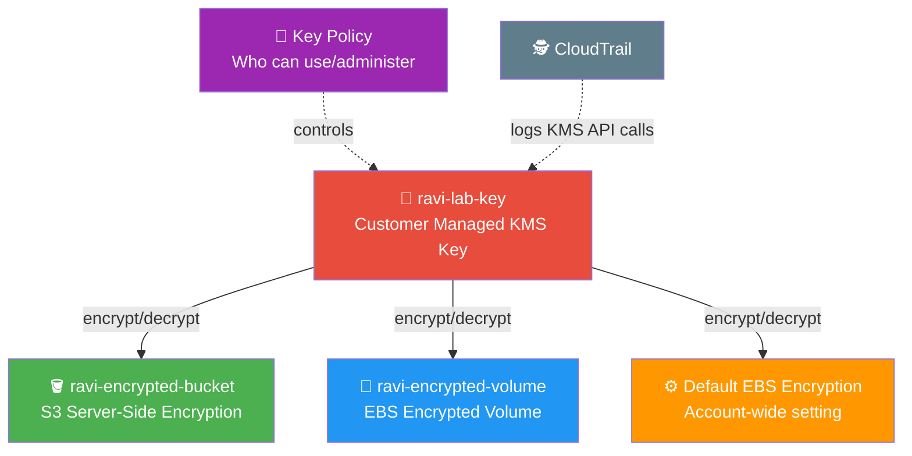

# 🔐 Lab 23 - KMS: Encrypt S3 and EBS

> 📅 **Updated:** 21 August 2026 | ⏱️ **Duration:** ~30 minutes | 📊 **Level:** Intermediate


> ### 🗣️ *"If your data isn't encrypted, it's like leaving your front door wide open with a neon sign saying 'Free Stuff!'"*
> — **Rithu** 🔐

<details>
<summary><b>🎭 Ravi & Rithu's Coffee Break Chat</b></summary>

**Ravi:** "Encryption sounds hard..."

**Rithu:** "With KMS, it's literally a checkbox. AWS handles the key management."

**Ravi:** "What if someone steals my encryption key?"

**Rithu:** "That's the beauty - they CAN'T steal it. KMS keeps it locked up tighter than Fort Knox."

</details>

---

## 🎯 What You'll Master

| Skill | Description |
|-------|-------------|
| 🔑 **KMS Keys** | Create and manage Customer Managed encryption keys |
| 🪣 **S3 Encryption** | Encrypt S3 buckets with KMS server-side encryption |
| 💾 **EBS Encryption** | Create and attach encrypted EBS volumes |
| ⚙️ **Default EBS Encryption** | Auto-encrypt all new EBS volumes account-wide |
| 📜 **Key Policies** | Control who can use and administer keys |

> 💡 **Pro Tip:** Encryption is table stakes in cloud security. If a disk is stolen, encrypted data is just noise. KMS makes encryption a checkbox instead of a nightmare.

---

## 🚦 Before You Start

### ✅ Prerequisites Checklist
- [ ] ✅ **[Lab 22](../22%20-%20CloudTrail%20-%20Enable%20and%20Query/README.md)** complete
- [ ] 🌍 AWS Console access with appropriate permissions
- [ ] 🔑 An EC2 key pair exists (from previous labs)

### 📦 What You Need (and Don't)
| Required | Optional |
|----------|----------|
| AWS Account | AWS CLI configured |
| ~30 minutes | |

---

## 💰 Cost & Safety First

> ⚠️ **KMS keys cost $1/month.** Schedule deletion during cleanup!

### 💵 Estimated Cost

| Resource | Cost |
|----------|------|
| 🔑 Customer managed key | **$1 per key per month** (prorated) |
| 🔑 Key usage (encrypt/decrypt) | $0.03 per 10,000 requests |
| 🪣 S3 Standard storage | $0.023/GB/month |
| 💾 EBS gp3 storage | $0.08/GB/month |
| **Total** | **< $1** ✨ (within 1 hour) |

> ⚠️ **KMS keys have a mandatory 7-day waiting period before deletion!** Schedule deletion during cleanup to avoid the $1/month charge.

> 💸 **Ravi's Mistake of the Day:** *"I created a KMS key and used it to encrypt an S3 bucket. When I deleted the key, the bucket's data became permanently unreadable. KMS keys are not delete-and-forget."*

### 🏷️ Naming Convention

| Resource | Name |
|----------|------|
| 🔑 KMS Key | `ravi-lab-key` |
| 🪣 S3 Bucket | `ravi-encrypted-bucket-*` |
| 💾 EBS Volume | `ravi-encrypted-volume` |
| 🖥️ EC2 Instance | `ravi-kms-test` |

---

## 🧠 How It All Fits Together



### 🔑 Key Concepts
| Component | Role |
|-----------|------|
| **KMS = Secure Keychain** | Keys live in AWS's vault — you control them via policies, never by hand |
| **Customer Managed Key** | You create and control it (rotation, policies) — **$1/month** |
| **AWS-managed Key** | AWS creates and controls it — **free**, but limited control |
| **Key Policy** | JSON document controlling who can use/administer the key |
| **Encryption Transparency** | S3/EBS encrypt/decrypt automatically — you use data normally |
| **Key Deletion** | 7-day waiting period prevents accidental deletion |

---

## 🪜 Step-by-Step Guide

> 🗺️ **Build order:** Create KMS key → Encrypt S3 → Verify via CLI → Create encrypted EBS → Attach to EC2 → Enable default encryption → Review key policy

### 🟢 Step 1: Create the KMS Key 🔑

<details>
<summary><b>🔑 Expand for key creation</b></summary>

1. Console search → **KMS** → **Customer managed keys** → **Create key**

**Configure the key:**
2. **Key type:** Select **Symmetric** (same key for encrypt and decrypt)
3. **Key usage:** Select **Encrypt and decrypt** → **Next**

**Add alias and description:**
4. **Alias:** `ravi-lab-key`
5. **Description:** `KMS key for Ravi's lab`
6. **Tags:** Key=`Environment`, Value=`Lab` (optional) → **Next**

**Key administrators:**
7. Make sure your IAM user is checked ✅ → **Next**

**Key usage permissions:**
8. Make sure your IAM user is checked ✅ → **Next**

**Review and create:**
9. Review the key policy → ✅ **Finish**

</details>


> 🗣️ **Rithu's Tip:** *"Customer Managed Keys give YOU control over who can use the key, how it's used, and when it's deleted. AWS-managed keys are fine for basic encryption, but customer managed keys are required for compliance (HIPAA, PCI-DSS)."*

---

### 🟢 Step 2: Encrypt an S3 Bucket 🪣

<details>
<summary><b>🪣 Expand for S3 encryption setup</b></summary>

1. **S3 → Create bucket**

**Configure the bucket:**
2. **Bucket name:** `ravi-encrypted-bucket-12345` (random digits for uniqueness)
3. **Default encryption:** Enable
   - **Encryption key type:** Choose from your AWS KMS keys
   - **AWS KMS key:** Select `ravi-lab-key`
4. ✅ **Create bucket**

**Upload a test file:**
5. Open bucket → **Upload** → **Add files** → select any small file
6. ✅ **Upload**

**Verify encryption:**
7. Click the uploaded file → **Properties** tab
8. Scroll to **Server-side encryption** → you should see:
   - **Encryption type:** AWS KMS
   - **AWS KMS key ARN:** Shows your `ravi-lab-key` ARN

</details>


> 🗣️ **Rithu's Tip:** *"S3 server-side encryption means AWS encrypts the data when it's written to disk and decrypts it when you download it. The encryption/decryption is transparent — you don't need to do anything special to read your files."*

---

### 🟢 Step 3: Verify Encryption via CLI 🖥️

<details>
<summary><b>🖥️ Expand for CLI verification</b></summary>

Open your terminal and run:

```bash
aws s3api head-object --bucket ravi-encrypted-bucket-12345 --key your-file-name.txt
```

**Look for these fields:**

```json
{
    "ServerSideEncryption": "aws:kms",
    "SSEKMSKeyId": "arn:aws:kms:us-east-1:123456789012:key/abc123-def456..."
}
```

- **`ServerSideEncryption: aws:kms`** → confirms KMS encryption
- **`SSEKMSKeyId`** → shows YOUR key ARN was used

</details>


> 🗣️ **Rithu's Tip:** *"The `head-object` command is like checking the label on a package — it tells you metadata about the file without downloading it. The encryption info is right there in the metadata!"*

---

### 🟢 Step 4: Create an Encrypted EBS Volume 💾

<details>
<summary><b>💾 Expand for EBS volume creation</b></summary>

1. **EC2 → Volumes → Create volume**

**Configure the volume:**
2. **Type:** gp3 (General Purpose SSD — Free Tier eligible)
3. **Size:** `10` GiB
4. **Availability Zone:** `us-east-1a`
5. **Encryption:** ✅ Enabled
6. **KMS key:** Choose from your AWS KMS keys → `ravi-lab-key`
7. **Tag:** Key=`Name`, Value=`ravi-encrypted-volume`
8. ✅ **Create volume**

**Verify encryption:**
9. Wait for **available** status
10. Select volume → **Actions → View details**
11. **Encryption:** Enabled · **KMS key ID:** Shows `ravi-lab-key` ARN

</details>


> 🗣️ **Rithu's Tip:** *"Encrypted EBS volumes mean data at rest on the disk is encrypted. If someone steals the physical drive, they can't read your data without the KMS key. This is a must-have for sensitive data!"*

---

### 🟢 Step 5: Attach Volume to EC2 🖥️

<details>
<summary><b>🖥️ Expand for EC2 attachment and mounting</b></summary>

**Launch a test instance:**

1. **EC2 → Launch instance**
2. **Name:** `ravi-kms-test` · **AMI:** Amazon Linux 2023 · **Type:** t2.micro
3. Select existing key pair → ✅ **Launch instance**

Wait for **Running** state, then:

**Attach the volume:**

4. **Volumes** → select `ravi-encrypted-volume`
5. **Actions → Attach volume** → Instance: `ravi-kms-test` → **Attach volume**

**SSH and mount:**

6. SSH into the instance:
```bash
ssh -i "your-key-pair.pem" ec2-user@your-instance-public-ip
```

7. Check the volume is attached:
```bash
lsblk
```
You should see `xvdf` — that's your encrypted volume!

8. Format and mount:
```bash
sudo mkfs -t ext4 /dev/xvdf
sudo mkdir /mnt/encrypted
sudo mount /dev/xvdf /mnt/encrypted
```

9. Write data to the encrypted volume:
```bash
echo "This data is encrypted with KMS!" | sudo tee /mnt/encrypted/secret.txt
sudo cat /mnt/encrypted/secret.txt
```

10. Check volume status:
```bash
df -h /mnt/encrypted
```

</details>


> 🗣️ **Rithu's Tip:** *"The encryption is transparent to the operating system. You mount and use the volume normally — AWS handles all the encrypt/decrypt operations behind the scenes using the KMS key."*

---

### 🟢 Step 6: Enable Default EBS Encryption ⚙️

<details>
<summary><b>⚙️ Expand for default encryption</b></summary>

Want ALL new EBS volumes to be encrypted automatically?

1. **EC2 → Settings → EBS encryption → Manage**
2. ✅ **Enable encryption by default**
3. **Default encryption key:** Choose from your AWS KMS keys → `ravi-lab-key`
4. 💾 **Save changes**

Every new EBS volume you create will now be automatically encrypted!

</details>


> 🗣️ **Rithu's Tip:** *"Default encryption is like setting your phone to auto-lock. You don't have to remember to lock it — it just happens. One click now, protection forever."*

---

### 🟢 Step 7: Understand the Key Policy 📜

<details>
<summary><b>📜 Expand for key policy review</b></summary>

1. **KMS → Customer managed keys → ravi-lab-key → Key policy tab**

**Understand the policy structure:**
- **Key administrators:** Can view/edit the key policy but CANNOT use it for encryption
- **Key users:** Can use the key for encrypt/decrypt operations
- **Key usage permissions:** Can use the key for specific AWS services

**Check CloudTrail for KMS activity:**

2. **CloudTrail → Event history** → filter by Event source: `kms.amazonaws.com`
3. You should see events like `CreateKey`, `DescribeKey`, `Encrypt`, `Decrypt`

</details>


> 🗣️ **Rithu's Tip:** *"KMS key policies are like a VIP list at a club. The key policy says who gets in (can use the key) and who can change the guest list (can administer the key). Everyone else is turned away!"*

---

## ✅ Validation Checklist

| # | Check | Status |
|---|-------|--------|
| 1️⃣ | KMS key `ravi-lab-key` exists and is Enabled | ☐ ✅ |
| 2️⃣ | S3 bucket with KMS default encryption | ☐ ✅ |
| 3️⃣ | Uploaded file shows KMS encryption in Properties | ☐ ✅ |
| 4️⃣ | CLI `head-object` shows `SSEKMSKeyId` | ☐ ✅ |
| 5️⃣ | EBS volume encrypted with `ravi-lab-key` | ☐ ✅ |
| 6️⃣ | Encrypted volume attached to EC2 and data is readable | ☐ ✅ |
| 7️⃣ | Default EBS encryption enabled with `ravi-lab-key` | ☐ ✅ |
| 8️⃣ | CloudTrail shows KMS API calls | ☐ ✅ |

---

## 🧹 Cleanup (Follow Order!)

> ⚠️ **KMS keys cost $1/month. Delete everything carefully!**

| Step | Action | Console Location |
|------|--------|------------------|
| 1️⃣ 🔄 | Detach encrypted volume (if attached) | EC2 → Volumes → Detach |
| 2️⃣ 🗑️ | Delete EBS volume `ravi-encrypted-volume` | EC2 → Volumes → Delete |
| 3️⃣ 🗑️ | Terminate EC2 instance `ravi-kms-test` | EC2 → Instances → Terminate |
| 4️⃣ 💾 | **Empty** + delete S3 bucket `ravi-encrypted-bucket-...` | S3 → Empty → Delete |
| 5️⃣ ⚙️ | Disable default EBS encryption (optional) | EC2 → EBS encryption → Manage |
| 6️⃣ 🗑️ | **Schedule KMS key deletion** (7-day waiting period!) | KMS → ravi-lab-key → Key deletion |

> ⚠️ **KMS keys have a mandatory 7-day waiting period.** You cannot cancel deletion once scheduled!

> 🗣️ **Rithu's Tip:** *"The 7-day waiting period is a safety net. If you accidentally schedule a key for deletion, you have 7 days to cancel it. In production, never delete a key that's encrypting important data!"*

---

## 🚀 Level Ups (Post-Core Lab)

| Challenge | What to Try | Notes |
|-----------|-------------|-------|
| 🔄 **Key Rotation** | Enable automatic annual key rotation | AWS rotates the backing key material |
| 📜 **Cross-account Key Sharing** | Share a KMS key with another AWS account | Multi-account encryption |
| 🔑 **Asymmetric Keys** | Create an RSA KMS key for public/private encryption | Digital signatures |
| 📊 **Key Usage Dashboard** | CloudWatch dashboard tracking KMS API calls | Encryption monitoring |

---

## 🆘 Troubleshooting Quick Reference

| 🔍 Issue | 💡 Likely Cause | 🔧 Fix |
|---------|--------------|-----|
| Can't find `ravi-lab-key` in dropdown | Wrong region / missing permissions | Same region as key creation; check `kms:DescribeKey` permission |
| S3 bucket doesn't show encryption option | Missed during creation | Bucket Properties tab → edit encryption settings |
| EBS volume shows "Encryption not enabled" | Didn't check Enable box | Cannot enable on existing volume — create new encrypted one |
| Can't attach encrypted volume | Wrong Availability Zone | EBS volumes are AZ-specific — attach to instance in same AZ |
| "Access Denied" using KMS key | Missing KMS permissions | Check key policy → ensure user is under Key users |
| Can't delete KMS key immediately | Mandatory 7-day waiting period | Schedule deletion → wait 7 days |
| Default EBS encryption doesn't affect existing volumes | Only applies to NEW volumes | Create snapshots + copy with encryption to convert existing |

> 🗣️ **Rithu's Tip:** *"Encryption isn't optional anymore — it's a best practice and often a legal requirement. The rule is simple: if the data is sensitive, encrypt it. If you're not sure, encrypt it anyway!"*

---

## 🎮 Test Yourself! (No Peeking 👀)

**Q1:** What's the difference between a customer-managed and an AWS-managed KMS key?

<details><summary>👀 Show answer</summary>

**A:** **Customer-managed** = you create and control it (rotation, access policies) — costs ~**$1/month**. **AWS-managed** = AWS creates and controls it — **free**, but less control. 💰

</details>

**Q2:** You delete a KMS key. What happens to the data encrypted with it, and when?

<details><summary>👀 Show answer</summary>

**A:** After a **7-day waiting period** the key is deleted — and **data encrypted with it becomes unrecoverable** forever. Delete keys with extreme care! ⏳

</details>

**Q3:** Why does KMS encryption feel "transparent" to your applications?

<details><summary>👀 Show answer</summary>

**A:** Because S3/EBS **encrypt and decrypt automatically** using the key — your app reads and writes data normally, never handling keys. 🪄

</details>

### 🔥 Bonus Challenge

Enable **Default EBS Encryption** in your account settings (EC2 → Settings → EBS encryption), then launch a quick instance and verify its volume shows **Encrypted: Yes** — with zero extra config. You just made your whole account safer forever. 🛡️

> 💪 **Rithu:** *"Default encryption is the gift that keeps giving. One click now, protection forever."*

---

## 📚 Official Documentation

- 🔐 [AWS KMS Developer Guide](https://docs.aws.amazon.com/kms/latest/developerguide/overview.html)
- 🪣 [Protecting Data Using SSE-KMS](https://docs.aws.amazon.com/AmazonS3/latest/userguide/serv-side-encryption.html)
- 💾 [Amazon EBS Encryption](https://docs.aws.amazon.com/AWSEC2/latest/UserGuide/EBSEncryption.html)

---

## 🎓 What You Learned

> **Encryption at rest with KMS:**
> - 🔑 **KMS** → secure key management with HSM-backed hardware
> - 🪣 **S3 Encryption** → server-side encryption with customer managed keys
> - 💾 **EBS Encryption** → encrypted volumes attached to EC2
> - ⚙️ **Default Encryption** → account-wide auto-encryption for new volumes
> - 📜 **Key Policies** → control who can use and administer keys
> - ⏳ **Key Deletion** → 7-day safety waiting period

**Golden Habit:** Encrypt everything by default → use customer managed keys for compliance → never delete a key without checking what it protects. 🔐

| | Approach |
|---|---|
| 👶 **Noob Way** | Skip encryption because "my data isn't sensitive" |
| 🧙 **Pro Way** | Encrypt everything by default. Stolen disks are useless; compliance is effortless |

---

## ➡️ What's Next?

Your data is now encrypted! Next: learn about **AWS Backup** — how to protect your data with automated backups across multiple services. 💾

🎯 **[Lab 24 - AWS Backup: Multi-Service Backup](../24%20-%20AWS%20Backup%20-%20Multi-Service%20Backup/README.md)**

---

<div align="center">

### ⭐ Enjoyed this lab? Star the repo & share your feedback!

**Happy Learning!** 🚀☁️

</div>
