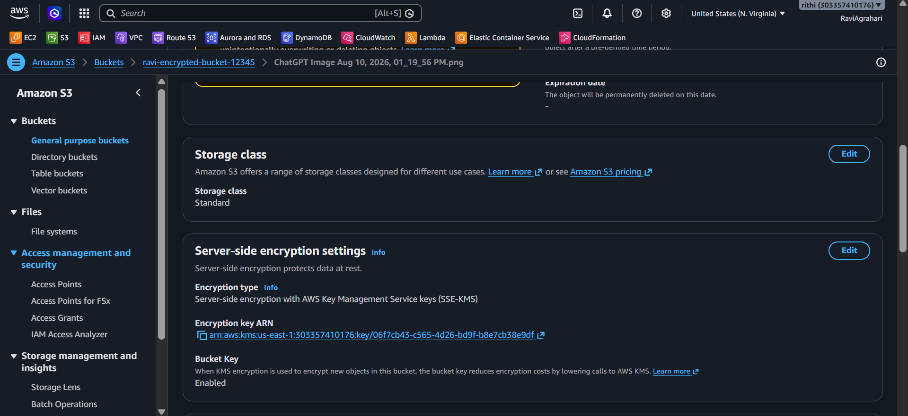
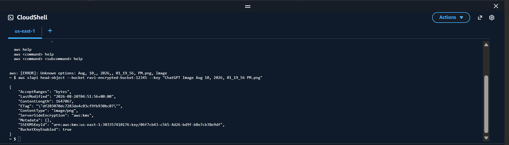
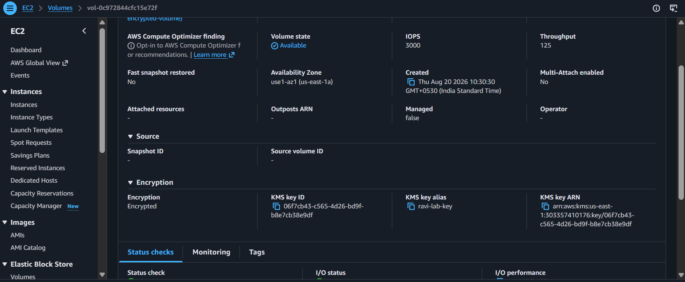
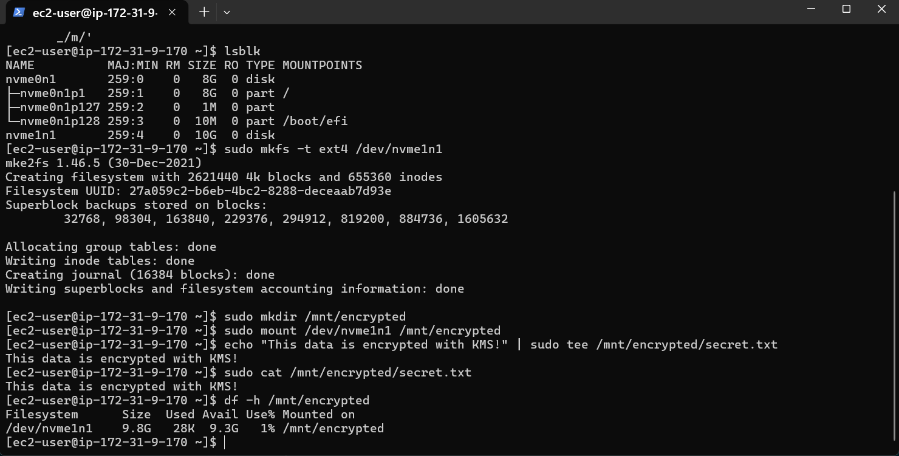
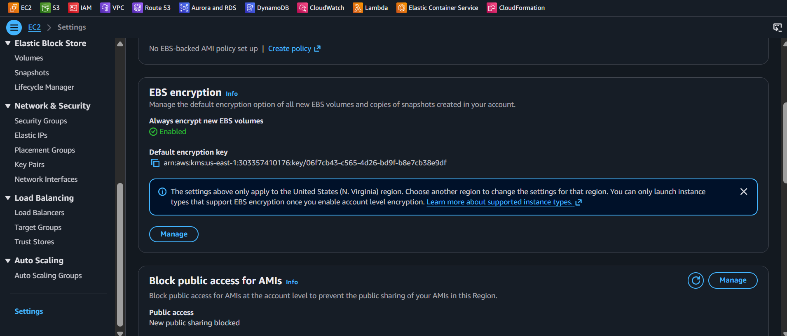
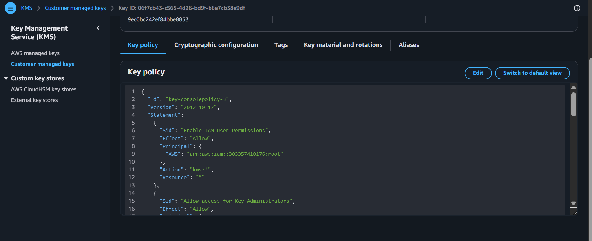

<div align="center">


# Lab 23 — KMS: Encrypt S3 and EBS


</div>

> "If your data isn't encrypted, it's like leaving your front door wide open with a neon sign saying 'Free Stuff!'" — Rithu
---

<details>
<summary><b>🎭 Ravi & Rithu's Coffee Break Chat</b></summary>

**Ravi:** "Encryption sounds hard..."

**Rithu:** "With KMS, it's literally a checkbox. AWS handles the key management."

**Ravi:** "What if someone steals my encryption key?"

**Rithu:** "That's the beauty - they CAN'T steal it. KMS keeps it locked up tighter than Fort Knox."

</details>

## 📋 Table of Contents

- [🎯 Objective](#-objective)
- [📊 Lab Progress](#-lab-progress)
- [🤔 In Plain English](#-in-plain-english)
- [🧠 Prerequisites](#-prerequisites)
- [💰 Cost Warning](#-cost-warning)
- [🏗️ Architecture](#️-architecture)
- [🛠️ Step-by-Step Instructions](#️-step-by-step-instructions)
- [✅ Validation Checklist](#-validation-checklist)
- [🧹 Cleanup (IMPORTANT!)](#-cleanup-important)
- [🧠 Memory Tips](#-memory-tips)
- [🎓 What You Learned](#-what-you-learned)
- [🎮 Test Yourself](#-test-yourself-no-peeking-)
- [🆚 Pro Tip vs Noob Tip](#-pro-tip-vs-noob-tip)
- [🔗 What's Next?](#-whats-next)
- [❓ Troubleshooting](#-troubleshooting)

---

<div align="center">

## 📊 Lab Progress

`[██░░░░░░░░░░░░░░░░░░] 5% — Let's Begin!`

</div>

---

## 🤔 In Plain English

> **What is this, really?** KMS is AWS's **secure keychain**. It holds the master keys that encrypt and decrypt your data. When S3 or EBS needs to encrypt something, they ask KMS: "lock this with the key" — and the data is scrambled on disk. You never see or handle the keys yourself; everything happens behind the scenes. 🔐
>
> 🌍 **Why you should care:** Encryption is table stakes in cloud security. If a disk is stolen, encrypted data is just noise. KMS makes encryption a checkbox instead of a nightmare.

---

## 🎯 Objective

By the end of this lab, you will:
- Understand what KMS is and how encryption works in AWS
- Create a Customer Managed KMS key
- Encrypt an S3 bucket with KMS encryption
- Create and attach an encrypted EBS volume
- Understand the difference between AWS-managed and customer-managed keys

KMS (Key Management Service) is AWS's **encryption headquarters**. It manages the keys that lock and unlock your data. Think of it as a super-secure keychain that never leaves your pocket.

---

## 🧠 Prerequisites

- [ ] Completed Lab 22 (CloudTrail)
- [ ] AWS Console access with appropriate permissions
- [ ] An EC2 key pair exists (from previous labs)

---

## 💰 Cost Warning

KMS pricing is straightforward:

| What | Cost |
|------|------|
| AWS-managed key (aws/s3, aws/ebs) | **FREE** |
| Customer managed key | **$1 per key per month** |
| Key usage (encrypt/decrypt) | $0.03 per 10,000 requests |
| S3 Standard storage | $0.023/GB/month |
| EBS gp3 storage | $0.08/GB/month |

Estimated total lab cost: **< $1** if cleaned up within 1 hour (the $1 key charge is prorated).

> ⚠️ **IMPORTANT**: KMS keys cannot be immediately deleted — there's a mandatory 7-day waiting period (pending deletion). Schedule deletion during cleanup to avoid the $1/month charge!

> **Ravi's Mistake of the Day:** I created a KMS key and then used it to encrypt an S3 bucket. When I deleted the key, the bucket's data became permanently unreadable. KMS keys are not delete-and-forget.

---

## 🏗️ Architecture

```
┌─────────────────────────────────────────────────────┐
│                  KMS Key Management                 │
│                                                     │
│  ┌──────────────────┐                               │
│  │  Customer Managed │                               │
│  │  KMS Key          │                               │
│  │  (ravi-lab-key)   │                               │
│  │                   │                               │
│  │  ┌─────────────┐ │                               │
│  │  │ Key Policy  │ │  Who can use this key?        │
│  │  │ (IAM rules) │ │  - Administrators: manage     │
│  │  └─────────────┘ │  - Users: encrypt/decrypt     │
│  └────────┬─────────┘                               │
│           │                                         │
│     ┌─────┴─────┐                                   │
│     │           │                                   │
│  ┌──▼───┐  ┌───▼────┐                              │
│  │  S3  │  │  EBS   │                              │
│  │Bucket│  │ Volume │                              │
│  │(KMS) │  │ (KMS)  │                              │
│  └──────┘  └────────┘                              │
└─────────────────────────────────────────────────────┘
```

> **Did You Know?** AWS KMS uses hardware security modules (HSMs) that are certified under FIPS 140-2 Level 2. Your encryption keys are stored in military-grade hardware.

---

## 🛠️ Step-by-Step Instructions

### 

Let's create your own encryption key!

1. Open the **AWS Console** in your browser
2. Search for **KMS** in the search bar and click on it
3. Click **Customer managed keys** in the left sidebar
4. Click the orange **Create key** button (top right)

**Configure the key:**

5. **Key type**: Select **Symmetric** (this is the most common type — same key for encrypt and decrypt)
6. **Key usage**: Select **Encrypt and decrypt**
7. Click **Next**

**Add alias and description:**

8. **Alias**: Type `ravi-lab-key` (this is how you'll reference the key)
9. **Description**: Type `KMS key for Ravi's lab`
10. **Tags** (optional): Add a tag with Key=`Environment`, Value=`Lab`
11. Click **Next**

**Key administrators:**

12. You'll see your IAM user listed. Make sure it's checked ✅
13. Click **Next**

**Key usage permissions:**

14. Again, make sure your IAM user is checked ✅
15. Click **Next**

**Review and create:**

16. Review the key policy (it will show who can administer and use the key)
17. Click **Finish**

Your key is now created! You should see it listed with a status of **Enabled**.

> 
> "Customer Managed Keys give YOU control over who can use the key, how it's used, and when it's deleted. AWS-managed keys are fine for basic encryption, but customer managed keys are required for compliance (HIPAA, PCI-DSS)."

📸 [Screenshot: KMS console showing the newly created `ravi-lab-key` with Enabled status]


---

### 

Now let's use your key to encrypt an S3 bucket!

1. Go to **S3** in the AWS Console
2. Click **Create bucket** (top right)

**Configure the bucket:**

3. **Bucket name**: Type `ravi-encrypted-bucket-12345` (add random numbers — bucket names are global)
4. **AWS Region**: Select your preferred region (e.g., us-east-1)
5. Under **Default encryption**:
   - Check ✅ **Enable** (it might be enabled by default)
   - **Encryption key type**: Select **Choose from your AWS KMS keys**
   - **AWS KMS key**: Select `ravi-lab-key` from the dropdown
6. Leave everything else as default
7. Click **Create bucket**

**Upload a test file:**

8. Click on your new bucket name
9. Click **Upload** (top right)
10. Click **Add files** and select any small file from your computer (a text file or image)
11. Click **Upload**
12. Wait for the upload to complete

**Verify encryption:**

13. Click on the uploaded file name
14. Click **Properties** tab
15. Scroll down to **Server-side encryption**
16. You should see:
    - **Encryption type**: AWS KMS
    - **AWS KMS key ARN**: Shows your `ravi-lab-key` ARN

Your file is now encrypted with your custom KMS key! 🔐

> 
> "S3 server-side encryption means AWS encrypts the data when it's written to disk and decrypts it when you download it. The encryption/decryption is transparent — you don't need to do anything special to read your files."

📸 [Screenshot: S3 object Properties showing KMS encryption with ravi-lab-key ARN]


---

### 

Let's verify the encryption using the AWS CLI!

Open your terminal (Command Prompt or PowerShell) and run:

```bash
aws s3api head-object --bucket ravi-encrypted-bucket-12345 --key your-file-name.txt
```

Replace `your-file-name.txt` with the actual name of the file you uploaded.

**Look for these fields in the output:**

```json
{
    "AcceptRanges": "bytes",
    "LastModified": "2024-01-15T10:30:00+00:00",
    "ContentLength": 1234,
    "ETag": "\"abc123...\"",
    "ContentType": "text/plain",
    "ServerSideEncryption": "aws:kms",
    "SSEKMSKeyId": "arn:aws:kms:us-east-1:123456789012:key/abc123-def456..."
}
```

**Key fields to look for:**

- **`ServerSideEncryption`**: Shows `aws:kms` — confirms KMS encryption
- **`SSEKMSKeyId`**: Shows the ARN of your `ravi-lab-key` — confirms YOUR key was used

> 
> "The `head-object` command is like checking the label on a package — it tells you metadata about the file without downloading it. The encryption info is right there in the metadata!"

📸 [Screenshot: Terminal showing the head-object output with SSEKMSKeyId visible]


---

### 

Let's create an encrypted EBS volume using your KMS key!

1. Go to **EC2** in the AWS Console
2. Click **Volumes** in the left sidebar
3. Click **Create volume** (top right)

**Configure the volume:**

4. **Type**: Select **gp3** (General Purpose SSD — Free Tier eligible)
5. **Size**: Type `10` GiB
6. **IOPS**: Leave at default (3000)
7. **Throughput**: Leave at default (125 Mi/s)
8. **Availability Zone**: Select `us-east-1a`
9. **Encryption**: Check ✅ **Enabled**
10. **KMS key**: Select **Choose from your AWS KMS keys**
11. **AWS KMS key**: Select `ravi-lab-key` from the dropdown
12. **Tag**: Add Tag Key=`Name`, Value=`ravi-encrypted-volume`
13. Click **Create volume**

**Verify encryption:**

14. Wait for the volume to show **available** status
15. Select the volume → Click **Actions** → **View details**
16. You should see:
    - **Encryption**: Enabled
    - **KMS key ID**: Shows your `ravi-lab-key` ARN

> 
> "Encrypted EBS volumes mean that data at rest on the disk is encrypted. If someone steals the physical drive, they can't read your data without the KMS key. This is a must-have for sensitive data!"

📸 [Screenshot: EBS volume details showing encryption enabled with ravi-lab-key]


---

### 

Let's attach the encrypted volume to an EC2 instance and verify it works!

1. Go to **EC2** → **Instances**
2. Click **Launch instance** (or use an existing running instance)
3. **Name**: Type `ravi-kms-test`
4. **AMI**: Amazon Linux 2023
5. **Instance type**: t2.micro
6. **Key pair**: Select your existing key pair
7. Leave everything else as default
8. Click **Launch instance** → **View all instances**

Wait for the instance to be in **Running** state:

9. Go to **Volumes** in the left sidebar
10. Select your encrypted volume (`ravi-encrypted-volume`)
11. Click **Actions** → **Attach volume**
12. **Instance**: Select `ravi-kms-test`
13. **Device name**: Leave as default (`/dev/sdf`)
14. Click **Attach volume**

**SSH into the instance and mount the volume:**

15. Open your terminal and SSH into the instance:
    ```bash
    ssh -i "your-key-pair.pem" ec2-user@your-instance-public-ip
    ```

16. Check that the volume is attached:
    ```bash
    lsblk
    ```
    You should see `xvdf` (or similar) — that's your encrypted volume!

17. Format the volume:
    ```bash
    sudo mkfs -t ext4 /dev/xvdf
    ```

18. Create a mount point and mount:
    ```bash
    sudo mkdir /mnt/encrypted
    sudo mount /dev/xvdf /mnt/encrypted
    ```

19. Write data to the encrypted volume:
    ```bash
    echo "This data is encrypted with KMS!" | sudo tee /mnt/encrypted/secret.txt
    sudo cat /mnt/encrypted/secret.txt
    ```

20. Check the volume status:
    ```bash
    df -h /mnt/encrypted
    ```

You should see the volume mounted and the data written! The data on this volume is encrypted with your KMS key.

> 
> "The encryption is transparent to the operating system. You mount and use the volume normally — AWS handles all the encrypt/decrypt operations behind the scenes using the KMS key."

📸 [Screenshot: Terminal showing lsblk, mount, and the encrypted data]


---

### 

Want ALL new EBS volumes to be encrypted automatically? Enable default encryption!

1. Go to **EC2** in the AWS Console
2. Click **Setting** in the left sidebar and select **EBS encryption**
3. Click **Manage**

**Configure default encryption:**

4. Check ✅ **Enable encryption by default**
5. **Default encryption key**: Select **Choose from your AWS KMS keys**
6. **AWS KMS key**: Select `ravi-lab-key`
7. Click **Save changes**

Now, every new EBS volume you create will automatically be encrypted with your KMS key!

> 
> "Default encryption is like setting your phone to auto-lock. You don't have to remember to lock it — it just happens. Same with EBS volumes — encrypt everything by default and you'll never accidentally create an unencrypted volume."

📸 [Screenshot: EBS encryption defaults page showing encryption enabled with ravi-lab-key]

---

### 

Let's look at who can use your key and how!

1. Go to **KMS** → **Customer managed keys**
2. Click on `ravi-lab-key`
3. Click the **Key policy** tab

**Understand the policy structure:**

The key policy is a JSON document that controls:
- **Who can administer the key** (Key administrators section)
- **Who can use the key** for encryption/decryption (Key users section)
- **Who can use the key for specific services** (Key users section)

**Key sections to understand:**

- **Key administrators**: Can view/edit the key policy but CANNOT use it for encryption
- **Key users**: Can use the key for encrypt/decrypt operations
- **Key usage permissions**: Can use the key for specific AWS services (S3, EBS, etc.)

**Check CloudTrail for KMS activity:**

4. Go to **CloudTrail** → **Event history**
5. Filter by **Event source** = `kms.amazonaws.com`
6. You should see events like:
   - `CreateKey` — when you created the key
   - `DescribeKey` — when you viewed key details
   - `Encrypt` — when S3/EBS used the key
   - `Decrypt` — when data was decrypted

> 
> "KMS key policies are like a VIP list at a club. The key policy says who gets in (can use the key) and who can change the guest list (can administer the key). Everyone else is turned away!"

📸 [Screenshot: KMS key policy tab showing the policy document]


---

## ✅ Validation Checklist

Before moving on, confirm all of these:

- [ ] KMS key `ravi-lab-key` exists and is Enabled ✅
- [ ] S3 bucket `ravi-encrypted-bucket-12345` exists with KMS default encryption ✅
- [ ] Uploaded file shows KMS encryption in Properties ✅
- [ ] CLI `head-object` shows `SSEKMSKeyId` ✅
- [ ] EBS volume `ravi-encrypted-volume` is encrypted with `ravi-lab-key` ✅
- [ ] Encrypted volume is attached to EC2 and data is readable ✅
- [ ] Default EBS encryption is enabled with `ravi-lab-key` ✅
- [ ] CloudTrail shows KMS API calls ✅

---

> **Achievement Unlocked:** Encryption Expert! KMS secured your data.

---

## 🧹 Cleanup (IMPORTANT!)

KMS keys cost $1/month. Delete everything carefully!

**🗑️ Detach and delete the EBS volume:**

1. 🔄 Go to **EC2** → **Volumes**
2. 🔍 Select your encrypted volume
3. 🛑 Click **Actions** → **Detach volume** (if attached)
4. ⏳ Wait for it to show **Available** status
5. 🗑️ Select it again → Click **Actions** → **Delete volume**
6. 🧹 Confirm deletion

**🗑️ Terminate the EC2 instance:**

7. 🛑 Go to **EC2** → **Instances**
8. 🔍 Select `ravi-kms-test`
9. 🗑️ Click **Instance state** → **Terminate instance**
10. 🧹 Confirm termination

**🗑️ Empty and delete the S3 bucket:**

11. 💾 Go to **S3** → **Buckets**
12. 🔍 Click on `ravi-encrypted-bucket-12345`
13. 🗑️ Click **Empty** → Type `permanently delete` → Click **Delete**
14. 🔄 Go back to bucket list → Select the bucket → Click **Delete**
15. 🧹 Type the bucket name → Click **Delete bucket**

**🔄 Disable default EBS encryption (optional):**

16. 🔄 Go to **EC2** → **EBS encryption** → **Manage encryption defaults**
17. 🛑 Uncheck **Enable encryption by default**
18. 💾 Click **Save changes**

**🗑️ Schedule KMS key deletion:**

19. ⏳ Go to **KMS** → **Customer managed keys**
20. 🔍 Click on `ravi-lab-key`
21. 🗑️ Click **Key deletion** (in the top right, under Actions)
22. ✅ Check **I understand the following: key will be scheduled for deletion in 7 days**
23. 🧹 Type `ravi-lab-key` to confirm
24. 🛑 Click **Schedule deletion**

> ⚠️ **IMPORTANT**: KMS keys have a mandatory 7-day waiting period before deletion. You cannot cancel the deletion once scheduled! Make sure you're done with the key before scheduling.

**🔍 Verify cleanup:**

25. ✅ Go to KMS → confirm the key shows "Pending deletion" status
26. ✅ Go to S3 → confirm the bucket is gone
27. ✅ Go to EC2 → confirm the volume is gone

> 
> "The 7-day waiting period for KMS key deletion is intentional — it's a safety net. If you accidentally schedule a key for deletion, you have 7 days to cancel it. In production, never delete a key that's encrypting important data!"

---

## 🧠 Memory Tips

Stick these in your brain and they'll never leave. 🧲

| 🧠 Memory Hook | Remember it like... |
|---|---|
| **KMS = secure keychain** | Keys live in AWS's vault — you control them via policies, never by hand. 🔑 |
| **Customer vs AWS-managed key** | **Customer-managed** = you control it (rotation, policies) — costs **$1/month**. **AWS-managed** = free but limited control. 💰 |
| **Key deletion = 7-day waiting room** | Deleting a key doesn't happen instantly — a **7-day waiting period** gives you time to change your mind. ⏳ |
| **Encryption transparency** | S3/EBS encrypt/decrypt **automatically** with the key — you use data normally, keys stay hidden. 🪄 |
| **Default EBS encryption** | Flip one account setting and **every new EBS volume is encrypted automatically**. Set it and forget it. ✅ |

> 🗣️ **Rithu:** *"If you can click 'enable default EBS encryption' today, do it. Future-you will never have to remember to encrypt anything again."

---

## 🎓 What You Learned

In this lab, you learned:

| Concept | What It Means |
|---------|---------------|
| **KMS** | AWS service that manages encryption keys |
| **Customer Managed Key** | A key you create and control (costs $1/month) |
| **AWS-managed Key** | A key AWS creates for you (free, limited control) |
| **Key Policy** | JSON document controlling who can use/administer the key |
| **S3 Server-Side Encryption** | S3 encrypts data using KMS when written to disk |
| **EBS Encryption** | EBS encrypts data at rest using KMS |
| **Default EBS Encryption** | Auto-encrypt all new EBS volumes |
| **Encryption Transparency** | KMS encrypts/decrypts behind the scenes — you use data normally |
| **Key Deletion** | 7-day waiting period prevents accidental key deletion |

---

## 🎮 Test Yourself! (No Peeking 👀)

**Q1:** What's the difference between a customer-managed and an AWS-managed KMS key?

<details><summary>👀 Show answer</summary>

**A:** **Customer-managed** = you create and control it (rotation, access policies) — costs ~**$1/month**. **AWS-managed** = AWS creates and controls it — **free**, but less control. 💰

</details>

**Q2:** You delete a KMS key. What happens to the data encrypted with it, and when?

<details><summary>👀 Show answer</summary>

**A:** After a **7-day waiting period** the key is deleted — and **data encrypted with it becomes unrecoverable** forever. Delete keys with extreme care! ⏳

</details>

**Q3:** Why does KMS encryption feel "transparent" to your applications?

<details><summary>👀 Show answer</summary>

**A:** Because S3/EBS **encrypt and decrypt automatically** using the key — your app reads and writes data normally, never handling keys. 🪄

</details>

### 🔥 Bonus Challenge

Enable **Default EBS Encryption** in your account settings (EC2 → Settings → EBS encryption), then launch a quick instance and verify its volume shows **Encrypted: Yes** — with zero extra config. You just made your whole account safer forever. 🛡️

> 💪 **Rithu:** *"Default encryption is the gift that keeps giving. One click now, protection forever."

---

### 🆚 Pro Tip vs Noob Tip

| | Approach |
|---|---|
| **Noob Tip** | Skip encryption because "my data isn't sensitive" |
| **Pro Tip** | Encrypt everything by default. Stolen disks are useless; compliance is effortless |

---

## 🔗 What's Next?

Your data is now encrypted! In the next lab, we'll learn about **AWS Backup** — how to protect your data with automated backups across multiple services.

**[Lab 24 — AWS Backup: Multi-Service Backup →](../24%20-%20AWS%20Backup%20-%20Multi-Service%20Backup/README.md)**

---

## ❓ Troubleshooting

<details>
<summary>🔍 <strong>Can't find `ravi-lab-key` in the KMS dropdown</strong></summary>

💡 **Fix**: Make sure you're in the same region where you created the key. KMS keys are regional. Also verify your IAM user has `kms:DescribeKey` permission.
</details>

<details>
<summary>🔍 <strong>S3 bucket doesn't show encryption option</strong></summary>

💡 **Fix**: When creating the bucket, scroll down to "Default encryption" section. If you missed it, go to the bucket Properties tab after creation and edit the encryption settings.
</details>

<details>
<summary>🔍 <strong>EBS volume shows "Encryption not enabled"</strong></summary>

💡 **Fix**: Make sure you checked the "Enable" box during volume creation. You cannot enable encryption on an existing unencrypted volume — you must create a new encrypted volume.
</details>

<details>
<summary>🔍 <strong>Can't attach the encrypted volume</strong></summary>

🔧 **Fix**: Ensure the EC2 instance is in the same Availability Zone as the volume. EBS volumes are AZ-specific — you can only attach them to instances in the same AZ.
</details>

<details>
<summary>🔍 <strong>SSH fails after mounting the volume</strong></summary>

💡 **Fix**: This shouldn't be related to the volume. Check your security group allows SSH (port 22). Make sure you're using the correct key pair and public IP.
</details>

<details>
<summary>🔍 <strong>"Access Denied" when trying to use the KMS key</strong></summary>

🔧 **Fix**: Your IAM user needs `kms:Encrypt`, `kms:Decrypt`, and `kms:GenerateDataKey` permissions. Check the key policy to ensure your user is listed under Key users.
</details>

<details>
<summary>🔍 <strong>Can't delete the KMS key</strong></summary>

💡 **Fix**: You cannot immediately delete a KMS key. You must schedule deletion with a minimum 7-day waiting period. Go to the key → Actions → Key deletion to schedule it.
</details>

<details>
<summary>🔍 <strong>Default EBS encryption change doesn't affect existing volumes</strong></summary>

💡 **Fix**: Default encryption only applies to NEW volumes. Existing unencrypted volumes remain unencrypted. You'd need to create snapshots and copy them with encryption to convert existing volumes.
</details>

---

> 
> "Encryption isn't optional anymore — it's a best practice and often a legal requirement. You now know how to encrypt data at rest in S3 and EBS using KMS. The rule is simple: if the data is sensitive, encrypt it. If you're not sure, encrypt it anyway!"

---

<div align="center">


**🎉 Congratulations on completing Lab 23! 🎉**

</div>
