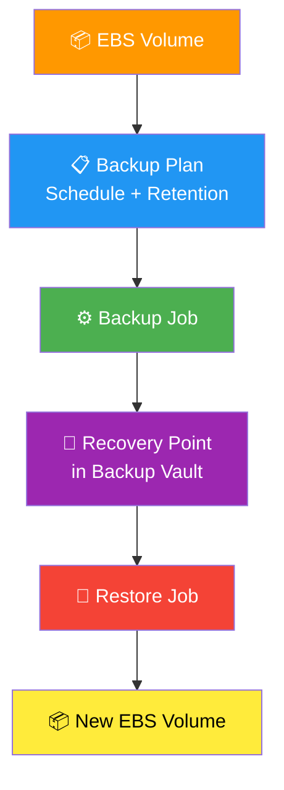
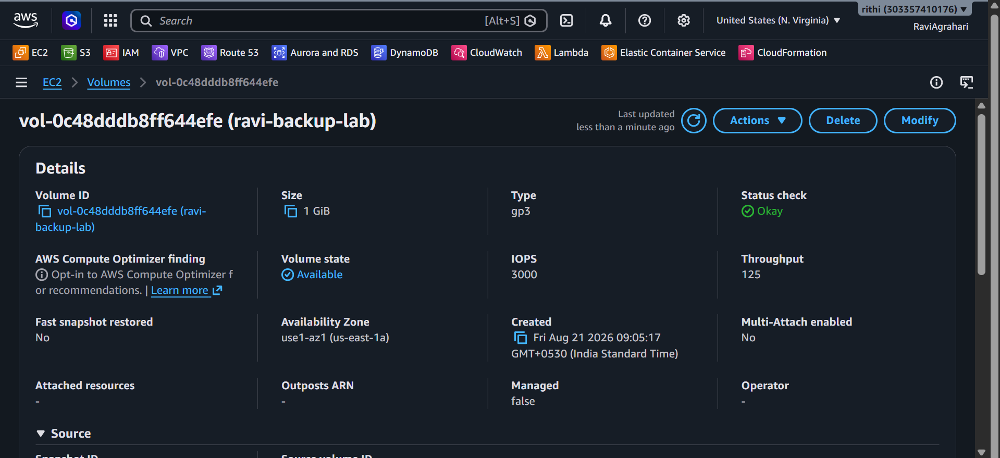
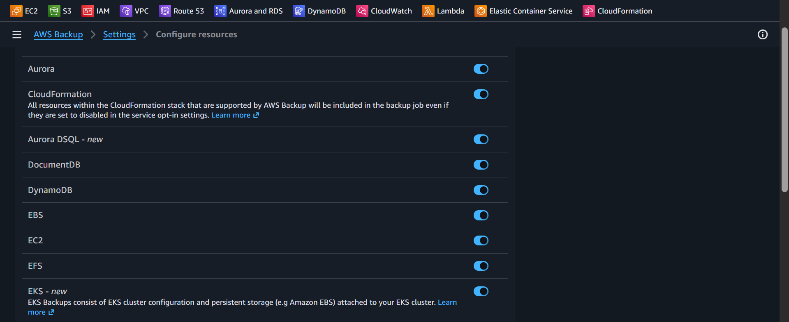
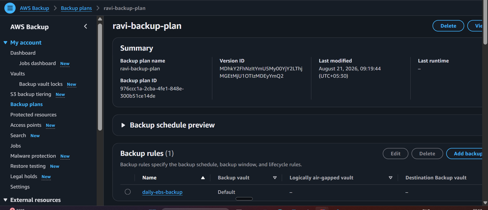
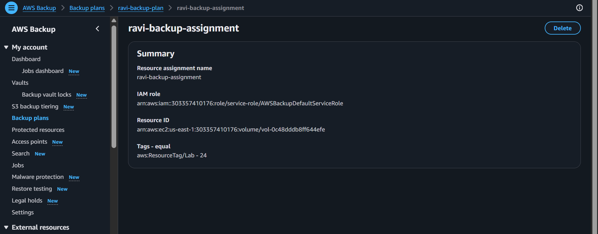
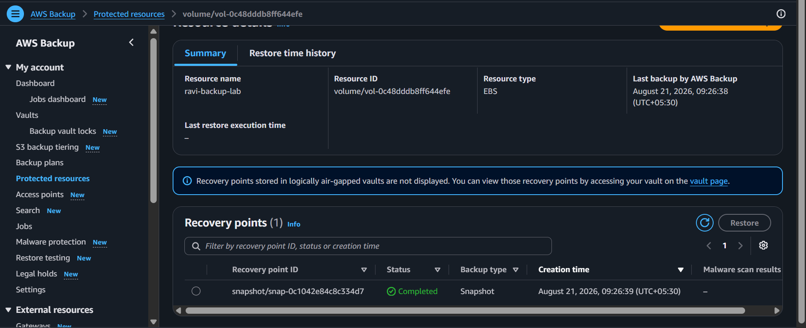
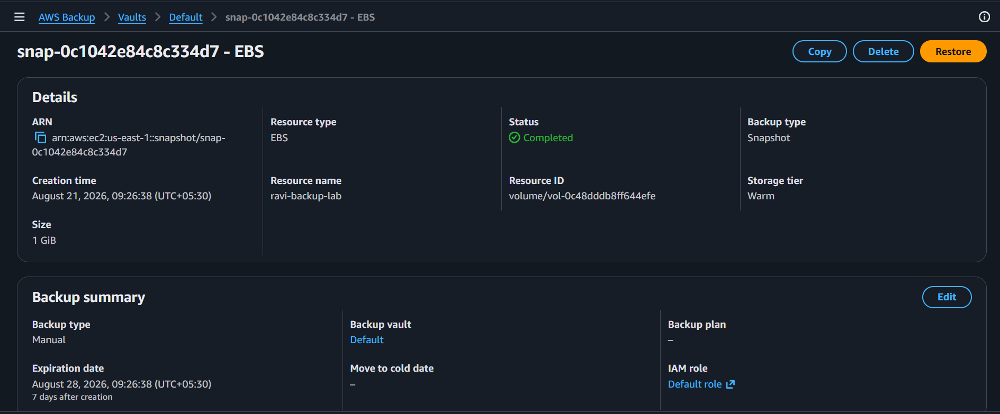
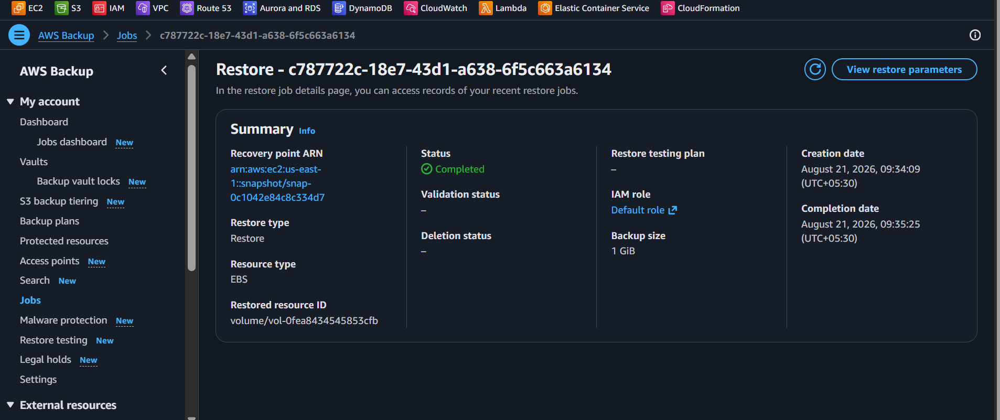
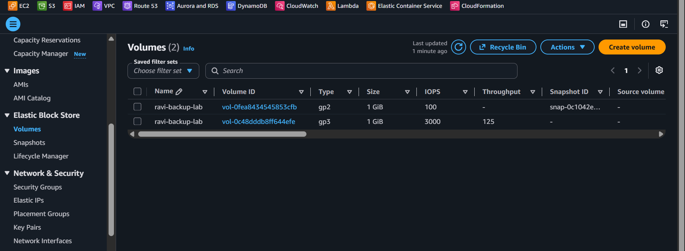

# 🛡️ Lab 24 - AWS Backup: Backup & Restore an EBS Volume

> 📅 **Updated:** 20 August 2026 | ⏱️ **Duration:** 30-45 minutes | 📊 **Level:** Beginner/Intermediate

---

## 🎯 What You'll Master

| Skill | Description |
|-------|-------------|
| 🏗️ **Backup Plan Creation** | Build a plan with schedule + retention rules |
| 🏷️ **Resource Assignment** | Tag-based targeting for EBS volumes |
| ⚡ **On-Demand Backup** | Trigger immediate backups without waiting |
| ✅ **Recovery Point Validation** | Confirm backups completed successfully |
| 🔄 **Restore Workflow** | Create new volumes from recovery points |
| 🧹 **Cleanup Strategy** | Remove only lab resources safely |

> 💡 **Pro Tip:** This lab focuses on **EBS** as the core skill. The same patterns apply to RDS, S3, DynamoDB — each with their own nuances (covered in Optional Extensions).

---

## 🚦 Before You Start

### ✅ Prerequisites Checklist
- [ ] 🌍 **Single Region** — Pick one and stick with it
- [ ] 🔐 **Permissions** — AWS Backup, EC2, IAM, EBS access
- [ ] 🚫 **Non-Production** — Never run in prod accounts!
- [ ] 💰 **Billing Alarm** — Set up if using a paid account

### 📦 What You Need (and Don't)
| Required | Optional |
|----------|----------|
| AWS Account | EC2 Key Pair |
| EBS Volume (1 GiB gp3) | EC2 Instance |
| AWS Backup Access | RDS Database |

---

## 💰 Cost & Safety First

> ⚠️ **Real resources = Real charges.** EBS volumes, recovery points, and restored volumes incur costs based on Region, size, storage class, and duration.

### 🏷️ **Mandatory Tags** — Apply to EVERY resource:

| Key | Value | Purpose |
|-----|-------|---------|
| `Lab` | `24` | Lab identification |
| `Name` | `ravi-backup-lab` | Resource naming |

> 🛑 **CLEANUP RULE:** Delete ONLY resources with these tags. The Default vault may contain backups from other labs — **don't touch them!**

---

## 🧠 How AWS Backup Fits Together

### 🔑 Key Concepts
| Component | Role |
|-----------|------|
| **Backup Plan** | Container for one or more rules |
| **Rule** | Defines schedule, vault, lifecycle |
| **Backup Job** | Creates a recovery point |
| **Restore Job** | Creates new resource from recovery point |
| **On-Demand** | Runs immediately (no waiting for schedule) |

---

## 🪜 Step-by-Step Guide

### 🟢 Step 1: Create or Choose an EBS Volume

<b>📋 Expand for detailed steps</b>

1. 🌐 Open **EC2 Console** → **Elastic Block Store** → **Volumes**
2. ➕ Click **Create volume**
3. ⚙️ Configure:
   - **Type:** `gp3`
   - **Size:** `1 GiB` (minimum)
   - **AZ:** Pick one (note it down!)
4. 🏷️ **Add tags:**
   - `Lab = 24`
   - `Name = ravi-backup-lab`
5. ✅ Click **Create volume**
6. 📝 **Record:** Volume ID + Availability Zone
7. ⏳ Wait for state **Available**

> 📸 **📸 Screenshot Proof:** Capture the EC2 Volumes console.

> 💡 **The volume can stay unattached!** No EC2 instance needed for this lab.

---

### 🟢 Step 2: Verify AWS Backup Settings

<b>🔍 Expand for verification steps</b>

1. 🌐 Open **AWS Backup Console** (same Region!)
2. ⚙️ Go to **Settings** → Check **Service opt-in**
3. ✅ Confirm **Amazon EBS** is **Enabled**
4. 📋 Open **Protected resources** → Verify your volume is discoverable

> ⚠️ **Discovery ≠ Protection** — A resource is only protected after assignment + completed backup job.

> 📸 **📸 Screenshot Proof:** Capture AWS Backup Settings showing **Amazon EBS** is **Enabled** in the Service opt-in section.

---

### 🟢 Step 3: Create the Backup Plan

<b>📋 Expand for plan creation</b>

1. 🌐 **Backup plans** → **Create backup plan**
2. 🏗️ Choose **Build a new plan**
3. 📝 **Plan name:** `ravi-backup-plan`
4. ➕ **Add rule:**
   | Field | Value |
   |-------|-------|
   | Rule name | `daily-ebs-backup` |
   | Backup vault | `Default` |
   | Schedule | Daily (pick convenient time) |
   | Retention | `7` days |
5. ✅ **Create plan**

> 📸 **📸 Screenshot Proof:** Capture the Backup Plan overview showing `ravi-backup-plan` with the `daily-ebs-backup` rule, schedule, and 7-day retention.

> 🕐 **Schedule Note:** Use console picker. If cron expression needed, verify timezone and `cron(...)` wrapper. This schedules FUTURE runs — we'll use on-demand for validation.

---

### 🟢 Step 4: Assign the Tagged Volume

<b>🏷️ Expand for assignment steps</b>

1. 🌐 Open `ravi-backup-plan`
2. 📋 Go to **Resource assignments** / **Resources** tab
3. ➕ **Assign resources**
4. 📝 **Assignment name:** `ravi-backup-assignment`
5. 🎯 **Resource type:** `EBS`
6. 🏷️ **Selection:** Tag-based → Key `Lab`, Value `24`
7. 🔐 **IAM Role:** Use AWS Backup service role (create default if needed)
8. ✅ **Submit**

> 📸 **📸 Screenshot Proof:** Capture the Resource Assignment screen showing `ravi-backup-assignment` targeting **EBS** with tag selection `Lab=24`.

> 🎯 **Tag vs ID:** Tag selection (`Lab=24`) is safer — avoids accidentally picking wrong volume.

---

### 🟢 Step 5: Run On-Demand Backup ⚡

<b>⚡ Expand for immediate backup</b>

1. 🌐 **Protected resources** → **Create on-demand backup**
2. 🎯 **Resource type:** `EBS`
3. 📦 Select your Step 1 volume
4. 💾 **Backup vault:** `Default`
5. ⏳ **Retention:** `7` days
6. 🔐 **IAM Role:** AWS Backup service role
7. ✅ **Create on-demand backup**
8. ⏳ **Wait** for **Backup jobs** → **Completed**

> 📸 **📸 Screenshot Proof:** Capture the Backup Jobs console showing the on-demand backup job with status **Completed** and your volume ID.

> 🛑 **STOP HERE** until job shows **Completed**! Running job = no usable recovery point.

---

### 🟢 Step 6: Confirm Recovery Point ✅

<b>🔍 Expand for verification</b>

1. 🌐 **Backup vaults** → **Default**
2. 🔍 Find recovery point for your tagged volume
3. ✅ Verify:
   - Resource ID matches
   - Creation time
   - Status = **Completed**
   - Expiry date (7 days from now)

> 📸 **📸 Screenshot Proof:** Capture the Recovery Point details showing Resource ID, Status **Completed**, and Expiry date.

> 📌 **Evidence:** Recovery point = proof of backup. Original volume existing ≠ backed up!

---

### 🟢 Step 7: Restore the Backup 🔄

<b>🔄 Expand for restore steps</b>

1. 🌐 Select recovery point from Step 6
2. 🔄 Click **Restore**
3. 📦 **Restore type:** New EBS volume (default)
4. 📍 **AZ:** Same as Step 1
5. ⚙️ Keep original size & encryption
6. 🏷️ **Add tags** (if form allows):
   - `Lab = 24`
   - `Name = ravi-backup-restored`
7. ✅ **Submit restore job**
8. ⏳ **Restore jobs** → Wait for **Completed**
9. 🌐 **EC2 → Volumes** → Find new volume

> 📸 **📸 Screenshot Proof:** Capture the Restore Jobs console showing status **Completed**, and the EC2 Volumes console showing the new restored volume with `Name=ravi-backup-restored` tag, **Available** and **unattached**.

> ✨ **Non-destructive!** Original volume untouched. Restored volume starts **unattached** — verify ID, size, AZ, encryption, tags, `Available` state.

---

## ✅ Validation Checklist

| # | Check | Status |
|---|-------|--------|
| 1️⃣ | Original volume tagged `Lab=24`, `Name=ravi-backup-lab` | ☐ ✅ |
| 2️⃣ | `ravi-backup-plan` exists with 7-day retention | ☐ ✅ |
| 3️⃣ | `ravi-backup-assignment` targets tagged EBS | ☐ ✅ |
| 4️⃣ | On-demand backup job = **Completed** | ☐ ✅ |
| 5️⃣ | Recovery point in Default vault | ☐ ✅ |
| 6️⃣ | Restore job = **Completed** | ☐ ✅ |
| 7️⃣ | Second EBS volume exists, unattached | ☐ ✅ |
| 8️⃣ | Both volumes identifiable by ID + tags | ☐ ✅ |

---

## 🧹 Cleanup (Follow Order!)

> ⚠️ **Delete in this exact sequence to avoid dependency errors:**

| Step | Action | Console Location |
|------|--------|------------------|
| 1️⃣ 🗑️ | Delete restored volume (`ravi-backup-restored`) | EC2 → Volumes |
| 2️⃣ 🗑️ | Delete original volume (`ravi-backup-lab`) | EC2 → Volumes |
| 3️⃣ 🧹 | Delete assignment `ravi-backup-assignment` | AWS Backup → Plan |
| 4️⃣ 🧹 | Delete plan `ravi-backup-plan` | AWS Backup → Plans |
| 5️⃣ 🗑️ | Delete **lab's** recovery point only | Backup vaults → Default |
| 6️⃣ 🧹 | Delete dedicated IAM role (if created) | IAM → Roles |
| 7️⃣ 🔍 | **Final sweep:** EC2, Backup jobs, Restore jobs, Recovery points | All consoles |

> 🛑 **NEVER DELETE:** Default backup vault • Other labs' recovery points • Vault-locked/retention-protected points

---

## 🚀 Optional Extensions (Post-Core Lab)

| Service | What to Try | Notes |
|---------|-------------|-------|
| 🗄️ **RDS** | Backup & restore DB instance | ⏱️ Longer, 💰 costlier |
| 🪣 **S3** | Enable versioning, opt-in, IAM, backup mode | Prerequisites differ |
| ⚡ **DynamoDB** | Backup & restore to new table | Restore ≠ overwrite |
| 🌍 **Cross-Region** | Dedicated vault in target Region | Test copy + cleanup separately |
| 📋 **Compliance** | AWS Backup Audit Manager + framework | Reports ≠ auto-generated |

---

## 🆘 Troubleshooting Quick Reference

| 🔍 Issue | 💡 Likely Cause | 🔧 Fix |
|-------|--------------|-----|
| 📦 Volume not listed | Wrong Region / not `Available` / EBS not opted-in | Check Region, volume state, Backup Settings |
| ❌ Backup job fails | IAM permissions / Region mismatch / KMS / resource state | Read job status message for specifics |
| 👻 Recovery point invisible | Job not **Completed** / wrong filter | Wait for completion, filter by resource ID |
| 💥 Restore fails | AZ mismatch / EBS quota / KMS / trying to overwrite | Check job details, use new volume, verify perms |

---

## 📚 Official Documentation

- 📖 [What is AWS Backup?](https://docs.aws.amazon.com/aws-backup/latest/devguide/whatisbackup.html)
- 📋 [Creating a Backup Plan](https://docs.aws.amazon.com/aws-backup/latest/devguide/creating-a-backup-plan.html)
- 🏷️ [Assigning Resources](https://docs.aws.amazon.com/aws-backup/latest/devguide/assigning-resources.html)
- 🔄 [Restoring a Backup](https://docs.aws.amazon.com/aws-backup/latest/devguide/restoring-a-backup.html)
- 🗑️ [Deleting Backups](https://docs.aws.amazon.com/aws-backup/latest/devguide/deleting-backups.html)

---

## 🎓 What You Learned

> **AWS Backup = Coordination Layer**
> - 📋 **Plan** → When backups run
> - 💾 **Vault** → Stores recovery points  
> - 🔄 **Restore** → Creates new resources

**Golden Habit:** Create → Wait **Completed** → Restore → Verify → Clean up deliberately 🧹

---

## ➡️ What's Next?

🎯 **[Lab 25 - Capstone: Full Stack on AWS](../25%20-%20Capstone%20-%20Full%20Stack%20on%20AWS/README.md)**

---

### ⭐ Enjoyed this lab? Star the repo & share your feedback!

**Happy Learning!** 🚀☁️

