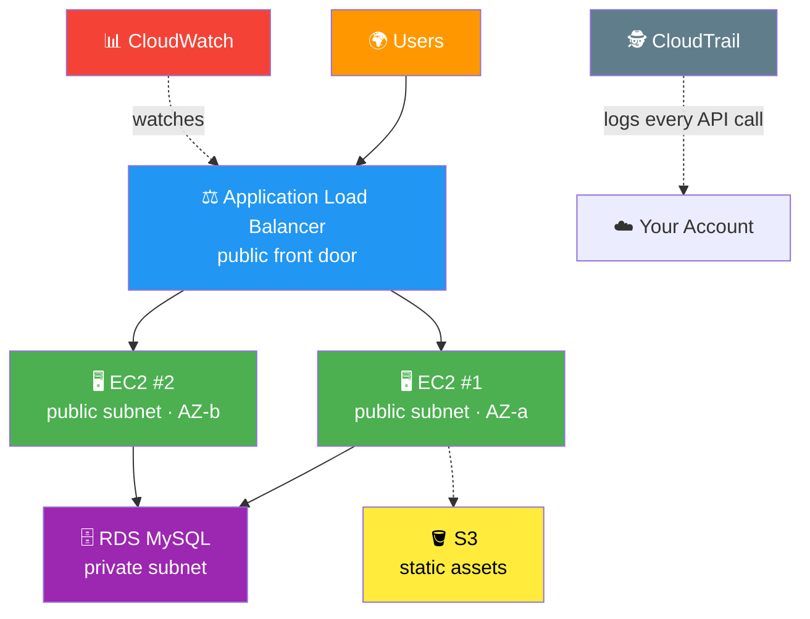

# 🏆 Lab 25 - Capstone: Full Stack on AWS

> 📅 **Updated:** 21 August 2026 | ⏱️ **Duration:** ~90 minutes | 📊 **Level:** Advanced (Final Boss 👑)


---

## 🎯 What You'll Master

| Skill | Description |
|-------|-------------|
| 🌐 **Multi-Tier Networking** | VPC with public/private subnets across 2 AZs |
| 🔐 **Defense in Depth** | Chained security groups: ALB → EC2 → RDS |
| ⚖️ **Load Balancing** | ALB + target group distributing web traffic |
| 📈 **Auto Scaling** | Self-healing fleet with target tracking policy |
| 🗄️ **Managed Database** | Private-subnet RDS MySQL with real data |
| 📊 **Monitoring** | CloudWatch dashboard + CPU alarm + SNS alert |
| 🕵️ **Auditing** | CloudTrail logging every API call |
| 🧹 **Full Cleanup** | Tear down 10+ services in the right order |

> 💡 **Pro Tip:** This is the **final exam** — every skill from Labs 01–24 assembled into one production-like app. Take your time, name everything carefully, and be proud of this one! 🎉

---

## 🚦 Before You Start

### ✅ Prerequisites Checklist
- [ ] 🏁 **Labs 01–24 done** — this lab assumes those skills
- [ ] 🌍 **Single Region** — Pick one and stick with it
- [ ] 🔐 **Permissions** — Admin access (VPC, EC2, RDS, S3, IAM, CloudWatch, CloudTrail)
- [ ] ⏰ **~90 uninterrupted minutes**
- [ ] 💳 **Know your account type** — created before/after Jul 15 2025 changes your Free Tier (see Cost below)
- [ ] 📝 **Notepad ready** — You'll create many named resources!

### 📦 What You Need (and Don't)
| Required | Optional |
|----------|----------|
| AWS Account (Free Tier friendly) | Registered domain (for Route 53) |
| EC2 Key Pair (from Lab 01) | Browser tab discipline 😅 |
| Your email (for alarm alerts) | |

---

## 💰 Cost & Safety First

> ⚠️ **Real resources = Real charges.** Most of this lab fits Free Tier, but the ALB is *not* free — and forgotten resources bill forever.

### 💵 Estimated Cost (~90-minute session)

> ⚠️ **Free Tier changed on July 15, 2025!** Accounts created **before** that date keep the classic 12-month/750-hr free tier. Accounts created **after** get a credit-based model instead: **$100 signup credit + up to $100 more** (earned via activities like launching EC2, creating RDS, setting a budget), a 6-month Free Plan window, and some service restrictions. [Official details →](https://docs.aws.amazon.com/awsaccountbilling/latest/aboutv2/free-tier.html)

| Resource | 🕰️ Legacy account (pre-Jul 2025) | 💳 New account (Jul 2025+) |
|----------|----------------------------------|----------------------------|
| 🖥️ 2× t2.micro (~1.5 hr) | ✅ Within 750 hrs/mo free tier → ~$0 | Draws from credits (~$0.01) |
| 🗄️ db.t3.micro RDS (~1.5 hr) | ✅ Within free tier → ~$0 | Draws from credits (~$0.01) |
| ⚖️ ALB (~1.5 hr) | ❌ Not free tier → ~$0.05 | Draws from credits (~$0.05) |
| 🪣 S3 · 📊 CloudWatch · 🕵️ CloudTrail | ✅ Always-free limits cover this lab | ✅ Always-free limits / credits |
| **Total** | **< $1** ✨ | **Pennies of credit** ✨ |

> 💡 On the new **Free Plan**, some services may prompt you to upgrade to the Paid Plan — you'll still use credits first, not your card. Either way: set a **Budgets alert** before starting (it's one of the $20 credit-earning activities too 😉).

### 🏷️ **Naming Convention** — Use these EXACT names:

| Pattern | Example | Purpose |
|---------|---------|---------|
| `ravi-capstone-*` | `ravi-capstone-vpc` | Instantly identify lab resources |

> 🛑 **CLEANUP RULE:** Delete ONLY resources matching `ravi-capstone-*` (and your audit bucket). Default/default-VPC resources belong to AWS — **don't touch them!**

---

## 🧠 How It All Fits Together



### 🔑 Key Concepts
| Component | Role |
|-----------|------|
| **VPC + Subnets** | Isolated network; public = internet-facing, private = database |
| **Security Group Chain** | Internet → ALB (:80) → EC2 (:80) → RDS (:3306) — each layer trusts only the one above |
| **Launch Template** | Blueprint: AMI, size, SG, startup script |
| **ASG + Target Tracking** | Cruise control 🚗 — keeps 2–4 healthy instances |
| **ALB + Target Group** | Front door + health-checked traffic splitter |
| **RDS (private)** | Managed MySQL — no public IP, ever |
| **CloudWatch** | Dashboards + alarms = early warning system |
| **CloudTrail** | Black-box recorder for every API action |

> 🛡️ **Why no NAT Gateway?** Nothing here needs outbound internet from a private subnet (web servers are public, RDS is managed). Skipping it avoids the classic **~$32/month** forgetting-to-delete trap. Want NAT practice? See Lab 09.

---

## 🪜 Step-by-Step Guide

> 🗺️ **Build order matters:** Network → Firewalls → Storage → Compute blueprint → Traffic → Scaling → Database → Monitoring → Auditing. Each step unblocks the next!

### 🟢 Step 1: Create the VPC 🌐

<details>
<summary><b>📋 Expand for detailed steps</b></summary>

1. 🌐 Open **VPC Console** → **VPC and more** (one-shot wizard!)
2. 📝 **Name tag auto-generation:** `ravi-capstone-vpc`
3. ⚙️ Configure:
   - **IPv4 CIDR:** `10.0.0.0/16`
   - **AZs:** `2`
   - **Public subnets:** `2` · **Private subnets:** `2`
   - **NAT gateways:** `None` ✅ (cost trap avoided!)
   - **VPC endpoints:** `None`
   - **DNS hostnames:** ✅ Enabled
4. 👀 Preview should show: 4 subnets (`10.0.1–4.0/24`), 1 IGW, route tables
5. ✅ Click **Create VPC**
6. 🔍 Verify: **Subnets** = 4 · **Internet Gateways** = 1 attached · **NAT Gateways** = none

</details>

> 📸 **Screenshot Proof:** Capture the VPC visual topology showing all 4 subnets, IGW, and route tables.

> 💡 **The VPC is your virtual data center.** Everything you build from here lives inside it — just like Lab 08, but bigger!

---

### 🟢 Step 2: Create the Security Group Chain 🔐

<details>
<summary><b>🔐 Expand for firewall setup</b></summary>

Create all three in **EC2 Console** → **Security Groups**, in this exact order:

**1️⃣ ALB SG — the front door**
- Name: `ravi-alb-sg` · VPC: `ravi-capstone-vpc`
- Inbound: HTTP `80` ← Anywhere-IPv4 (`0.0.0.0/0`)

**2️⃣ EC2 SG — the app layer**
- Name: `ravi-ec2-sg` · VPC: `ravi-capstone-vpc`
- Inbound: HTTP `80` ← Source = `ravi-alb-sg` 🎯
- Inbound: SSH `22` ← Source = **My IP**

**3️⃣ RDS SG — the vault**
- Name: `ravi-rds-sg` · VPC: `ravi-capstone-vpc`
- Inbound: MySQL/Aurora `3306` ← Source = `ravi-ec2-sg` 🎯

</details>

> 📸 **Screenshot Proof:** Capture all three security groups showing their inbound rules chained together.

> 🏰 **Defense in depth:** Each layer only accepts traffic from the layer above. Even if one falls, the next still holds! Creating them **first** means RDS (Step 7) can reference them immediately — no rework.

---

### 🟢 Step 3: Create the S3 Assets Bucket 🪣

<details>
<summary><b>🪣 Expand for bucket setup</b></summary>

1. 🌐 Open **S3 Console** → **Create bucket**
2. 📝 **Bucket name:** `ravi-capstone-assets-12345` (add your own random digits — must be globally unique)
3. 🌍 **Region:** Same as your VPC
4. 🔒 **Block Public Access:** Leave all ✅ ON (default — safest!)
5. 🔐 **Default encryption:** Keep SSE-S3 (default)
6. ✅ **Create bucket**
7. 📤 Open bucket → **Upload** → add a local `style.css`:
   ```css
   body { font-family: Arial; background-color: #f0f0f0; }
   h1 { color: #333; }
   ```
8. ✅ **Upload**

</details>

> 📸 **Screenshot Proof:** Capture the bucket showing `style.css` uploaded.

> 💡 **Public access stays blocked!** In real apps, static assets are served privately via CloudFront or presigned URLs — never a wide-open bucket. (See Labs 05–07 for the hosting patterns.)

---

### 🟢 Step 4: Create the Launch Template 📄

<details>
<summary><b>📄 Expand for template setup</b></summary>

1. 🌐 **EC2 Console** → **Launch Templates** → **Create launch template**
2. 📝 **Name:** `ravi-capstone-template`
3. ⚙️ Configure:
   - **AMI:** Amazon Linux 2023 (Free Tier eligible)
   - **Instance type:** `t2.micro`
   - **Key pair:** Select yours
   - **Firewall:** Select existing → `ravi-ec2-sg`
   - **Storage:** 8 GiB gp3 (default)
4. 📜 Expand **Advanced details** → paste into **User data**:

```bash
#!/bin/bash
dnf update -y
dnf install -y httpd php php-mysqlnd mariadb105
systemctl start httpd
cat > /var/www/html/index.html << 'EOF'
<!DOCTYPE html>
<html>
<head><title>Capstone Project</title></head>
<body>
<h1>Welcome to Ravi's Capstone Project!</h1>
<p>This full-stack app runs on AWS!</p>
<p>Architecture: Route 53 &rarr; ALB &rarr; EC2 &rarr; RDS</p>
<p>Services used: EC2, RDS, S3, ALB, VPC, CloudWatch, CloudTrail</p>
</body>
</html>
EOF
systemctl enable httpd
```

5. ✅ **Create launch template**

</details>

> 📸 **Screenshot Proof:** Capture the launch template summary page showing AMI, instance type, SG, and User Data.

> 💡 **User Data = bootstrap script.** It runs on every instance the ASG launches — Apache + PHP + MariaDB client, plus a homepage. Bonus: `mariadb105` pre-installs the MySQL client we'll use in Step 7! 😉

---

### 🟢 Step 5: Create Target Group + ALB ⚖️

<details>
<summary><b>⚖️ Expand for load balancer setup</b></summary>

**Part A — Target Group first:**

1. 🌐 **EC2 Console** → **Target Groups** → **Create target group**
2. ⚙️ Configure:
   - **Type:** Instances · **Name:** `ravi-capstone-tg`
   - **Protocol:** HTTP `80` · **VPC:** `ravi-capstone-vpc`
   - **Health check path:** `/`
3. ✅ **Create target group** (don't register targets — the ASG does that!)

**Part B — Now the ALB:**

4. 🌐 **Load Balancers** → **Create load balancer** → **Application Load Balancer**
5. ⚙️ Configure:
   - **Name:** `ravi-capstone-alb` · **Scheme:** Internet-facing
   - **VPC:** `ravi-capstone-vpc` · **Mappings:** ✅ both AZs
   - **Security group:** `ravi-alb-sg`
   - **Listener:** HTTP `80` → Forward to `ravi-capstone-tg`
6. ✅ **Create load balancer**
7. ⏳ Wait for **State = Active** (~2–3 min), then copy the **DNS name**

</details>

> 📸 **Screenshot Proof:** Capture the ALB details showing State **Active** and its DNS name.

> 🚦 **The ALB is your front door.** Health checks fail targets out, traffic flows only to healthy instances. If one server dies, users never notice!

---

### 🟢 Step 6: Create the Auto Scaling Group 📈

<details>
<summary><b>📈 Expand for ASG setup</b></summary>

1. 🌐 **EC2 Console** → **Auto Scaling Groups** → **Create Auto Scaling group**
2. 📝 **Name:** `ravi-capstone-asg` · **Launch template:** `ravi-capstone-template` → **Next**
3. 🌐 **Network:** VPC `ravi-capstone-vpc` → select **both public subnets** (`10.0.1.0/24`, `10.0.2.0/24`) → **Next**
4. ⚙️ **Advanced options:**
   - **Attach to an existing load balancer** → choose `ravi-capstone-tg` ✨ (it exists now — that's why we built it first!)
   - **Health checks:** ✅ ELB · Grace period `300` seconds → **Next**
5. 📏 **Group size:** Desired `2` · Min `2` · Max `4`
6. 🎯 **Scaling policy:** Target tracking → **Average CPU utilization** → target `50` → **Next**
7. ⏭️ Skip notifications → **Next** → **Next** → **Create Auto Scaling group**
8. ⏳ Wait 2–3 min → **Activity** tab shows 2 instances launching · **Instances** show **InService**

</details>

> 📸 **Screenshot Proof:** Capture the ASG showing 2 instances **InService** across both AZs, and the target group showing 2 **healthy** targets.

> 🚗 **Cruise control for servers:** CPU above 50%? Add instances. Below? Remove them. Plus self-healing — kill an instance and watch the ASG replace it automatically!

---

### 🟢 Step 7: Create RDS MySQL 🗄️

<details>
<summary><b>🗄️ Expand for database setup</b></summary>

**Create the database:**

1. 🌐 **RDS Console** → **Create database**
2. ⚙️ Configure:
   - **Engine:** MySQL · **Template:** `Free tier` — labeled `Sandbox` on paid-plan accounts (same db.t3.micro sizing either way) 👀
   - **DB identifier:** `ravi-capstone-db`
   - **Master username:** `admin` · **Password:** strong one (write it down! 📝)
   - **Storage:** gp3, `20` GiB, autoscaling ❌ unchecked
   - **Connectivity:** VPC `ravi-capstone-vpc` · Public access **No**
   - **Existing SG:** `ravi-rds-sg` ✨ (created back in Step 2!)
   - **Initial DB name:** `capstone_app`
   - **Automated backups:** ❌ off · **Deletion protection:** ❌ off (easy cleanup)
3. ✅ **Create database** → ⏳ wait 5–10 min for **Available** → copy the **Endpoint**

**Seed real data (from a web server):**

4. 🔑 SSH into one ASG instance (public IP from **EC2 → Instances**)
5. 🔌 Connect (client already installed by User Data!):
   ```bash
   mysql -h ravi-capstone-db.xxxx.us-east-1.rds.amazonaws.com -u admin -p
   ```
6. 🌱 Create a table + rows:
   ```sql
   USE capstone_app;
   CREATE TABLE users (
       id INT AUTO_INCREMENT PRIMARY KEY,
       name VARCHAR(100) NOT NULL,
       email VARCHAR(100) NOT NULL,
       created_at TIMESTAMP DEFAULT CURRENT_TIMESTAMP
   );
   INSERT INTO users (name, email) VALUES
       ('Ravi', 'ravi@example.com'),
       ('Rithu', 'rithu@example.com'),
       ('AWS Learner', 'learner@example.com');
   SELECT * FROM users;
   EXIT;
   ```

</details>

> 📸 **Screenshot Proof:** Capture the RDS instance **Available** with endpoint, and the terminal showing `SELECT * FROM users` returning 3 rows.

> 🏰 **Crown jewels stay hidden:** RDS lives in a private subnet with **no public IP**. Only your EC2 layer can reach port 3306 — the SG chain from Step 2 enforces it!

---

### 🟢 Step 8: Set Up CloudWatch 📊

<details>
<summary><b>📊 Expand for monitoring setup</b></summary>

**Build the dashboard:**

1. 🌐 **CloudWatch Console** → **Dashboards** → **Create dashboard** → name: `Capstone-Dashboard`
2. ➕ Add widgets:
   | Widget | Metric |
   |--------|--------|
   | 📈 Line | EC2 → Per-Instance → **CPUUtilization** (both instances) |
   | 🔢 Number | ALB → **RequestCount** |
   | 📈 Line | RDS → **DatabaseConnections** |
   | 🔢 Number | ALB → **UnHealthyHostCount** |
3. 💾 **Save dashboard**

**Create the alarm:**

4. 🚨 **Alarms** → **Create alarm** → **Select metric** → EC2 → Per-Instance → **CPUUtilization**
5. ⚙️ Configure:
   - **Statistic:** Average · **Period:** 5 min
   - **Threshold:** Greater than `80` · **Datapoints:** 2 of 3
6. 🔔 **Notification:** New SNS topic `ravi-capstone-alerts` → your email → **Create topic**
7. ✅ **Next → Next → Create alarm** → 📬 confirm the subscription email!

</details>

> 📸 **Screenshot Proof:** Capture the dashboard with all 4 widgets, and the alarm in **OK** state.

> 🚨 **Dashboards = bird's-eye view. Alarms = smoke detector.** Metrics take 5–15 min to appear — patience, young builder. ⏳

---

### 🟢 Step 9: Enable CloudTrail 🕵️

<details>
<summary><b>🕵️ Expand for audit trail setup</b></summary>

1. 🌐 **CloudTrail Console** → **Trails** → **Create trail**
2. ⚙️ Configure:
   - **Trail name:** `ravi-capstone-trail`
   - **Storage location:** Create new S3 bucket → `ravi-capstone-audit-12345` (add random digits)
   - **Management events:** Read/Write events (default)
3. ✅ **Create trail** → status shows **Logging** 🟢

</details>

> 📸 **Screenshot Proof:** Capture the trail showing **Logging = Yes**.

> 📼 **Black-box recorder:** Every API call — who, what, when. Console-created trails cover **all Regions** automatically. If something breaks, CloudTrail tells you exactly what happened!

---

### 🟡 Step 10: Configure Route 53 (Optional) 🌍

<details>
<summary><b>🌍 Expand for DNS setup — skip if no domain</b></summary>

**Have a domain? Point it at your ALB:**

1. 🌐 **Route 53** → **Hosted zones** → your domain
2. ➕ **Create record:**
   - **Record type:** `A` · **Alias:** ✅ ON
   - **Route traffic to:** Alias to ALB → your Region → `ravi-capstone-alb`
3. ✅ **Create records**

**No domain? No problem!** The ALB DNS name works perfectly — the architecture is identical. 💪

</details>

> 📸 **Screenshot Proof:** Capture the alias record pointing to the ALB (or a note that you're using the ALB DNS directly).

---

### 🟢 Step 11: Full Verification ✅

<details>
<summary><b>✅ Expand for end-to-end checks</b></summary>

Run through every layer of the stack:

| # | Check | Where | Expect |
|---|-------|-------|--------|
| 1️⃣ | Web app loads | Browser → ALB DNS | 🎉 Capstone HTML page |
| 2️⃣ | Load balancing | Refresh 5–10× | Requests split across instances |
| 3️⃣ | Fleet healthy | EC2 → ASG | 2 instances **InService** |
| 4️⃣ | Targets green | EC2 → Target Group | 2 targets **healthy** |
| 5️⃣ | Database live | RDS console | `ravi-capstone-db` **Available** |
| 6️⃣ | Data persisted | Your earlier `SELECT` | 3 user rows |
| 7️⃣ | Metrics flowing | CloudWatch dashboard | CPU, requests, connections |
| 8️⃣ | Alarm calm | CloudWatch → Alarms | Status **OK** 🟢 |
| 9️⃣ | Audit working | CloudTrail → Event history | Filter source `ec2.amazonaws.com` |
| 🔟 | Assets stored | S3 bucket | `style.css` present |
| 1️⃣1️⃣ | Network solid | VPC console | 4 subnets + IGW attached |

</details>

> 📸 **Screenshot Proof:** Capture the browser showing the capstone page + the CloudWatch dashboard with live metrics.

> 🏆 **Every layer verified = a genuinely production-like deployment.** You built this from scratch!

---

### 🟢 Step 12: Document Your Architecture 📝

<details>
<summary><b>📝 Expand for the resource inventory</b></summary>

Great engineers document their work! Here's what you built:

```text
NETWORK      ravi-capstone-vpc (10.0.0.0/16)
             ├─ Public:  10.0.1.0/24 (AZ-a), 10.0.2.0/24 (AZ-b)
             ├─ Private: 10.0.3.0/24 (AZ-a), 10.0.4.0/24 (AZ-b)
             └─ Internet Gateway

COMPUTE      ravi-capstone-template → ravi-capstone-asg (2–4 × t2.micro)

TRAFFIC      ravi-capstone-alb → ravi-capstone-tg (HTTP :80)

DATABASE     ravi-capstone-db (MySQL, db.t3.micro, private subnets)

STORAGE      ravi-capstone-assets-12345 (style.css)

SECURITY     ravi-alb-sg → ravi-ec2-sg → ravi-rds-sg (chained!)

MONITORING   Capstone-Dashboard · CPU >80% alarm · ravi-capstone-alerts (SNS)

AUDITING     ravi-capstone-trail → ravi-capstone-audit-12345 (S3)
```

</details>

> 📸 **Screenshot Proof:** Save this inventory (or draw the diagram yourself in any tool) — it's your portfolio artifact! 🎨

---

## ✅ Validation Checklist

| # | Check | Status |
|---|-------|--------|
| 1️⃣ | ALB DNS loads the capstone page in a browser | ☐ ✅ |
| 2️⃣ | 2 EC2 instances **InService** across both AZs | ☐ ✅ |
| 3️⃣ | Target group shows both targets **healthy** | ☐ ✅ |
| 4️⃣ | RDS **Available** + `users` table returns 3 rows | ☐ ✅ |
| 5️⃣ | S3 bucket holds `style.css` | ☐ ✅ |
| 6️⃣ | CloudWatch dashboard shows live metrics | ☐ ✅ |
| 7️⃣ | CPU alarm exists in **OK** state | ☐ ✅ |
| 8️⃣ | CloudTrail trail is **Logging** | ☐ ✅ |
| 9️⃣ | SG chain correct: ALB → EC2 → RDS | ☐ ✅ |
| 🔟 | VPC has 4 subnets + IGW (and NO NAT Gateway 😉) | ☐ ✅ |

---

## 🧹 Cleanup (Follow Order!)

> ⚠️ **Delete in this exact sequence to avoid dependency errors. Missing cleanup = ongoing charges!**

| Step | Action | Console Location |
|------|--------|------------------|
| 1️⃣ 🗑️ | Delete Route 53 records (if created) | Route 53 → Hosted zones |
| 2️⃣ 🧹 | Delete CPU alarm → dashboard | CloudWatch |
| 3️⃣ 🗑️ | Delete SNS topic `ravi-capstone-alerts` | SNS → Topics |
| 4️⃣ 🗑️ | Delete trail `ravi-capstone-trail` | CloudTrail → Trails |
| 5️⃣ 💾 | **Empty** + delete audit bucket | S3 |
| 6️⃣ 🗑️ | Delete ALB, then target group | EC2 → Load Balancers / Target Groups |
| 7️⃣ 📉 | ASG: set **Desired = 0** → wait for termination → **Delete** | EC2 → Auto Scaling Groups |
| 8️⃣ 🧹 | Delete launch template | EC2 → Launch Templates |
| 9️⃣ 🗑️ | Terminate any leftover instances | EC2 → Instances |
| 🔟 🗑️ | Delete `ravi-capstone-db` (❌ final snapshot, ✅ acknowledgment) → wait → delete subnet group | RDS |
| 1️⃣1️⃣ 💾 | **Empty** + delete assets bucket | S3 |
| 1️⃣2️⃣ 🌐 | Delete VPC `ravi-capstone-vpc` (subnets, IGW, route tables go with it) | VPC → Your VPCs |
| 1️⃣3️⃣ 🔐 | Delete `ravi-alb-sg`, `ravi-ec2-sg`, `ravi-rds-sg` | EC2 → Security Groups |
| 1️⃣4️⃣ 🔍 | **Final sweep:** EC2, RDS, S3, VPC, CloudTrail, CloudWatch, ALB | All consoles |

> 🛑 **NEVER DELETE:** Default VPC/subnets/SGs • buckets not named `ravi-capstone-*` • other labs' resources

> 💡 **Order logic:** Consumers die before providers — traffic stuff first, network foundation last. Delete the VPC **after** everything inside it is gone, and S3 buckets must be **emptied** before deletion!

---

## 🚀 Level Ups (Post-Core Lab)

| Challenge | What to Try | Notes |
|-----------|-------------|-------|
| 💥 **Chaos Test** | Terminate one web instance → watch ALB drain + ASG replace it | Self-healing proof! |
| 🕵️ **Audit Hunt** | Find your terminate event in CloudTrail Event history | Who/what/when |
| 📜 **Infrastructure as Code** | Rebuild the whole stack with CloudFormation (see Lab 21) | Reproducible = pro move |
| 🌍 **Custom Domain** | Add Route 53 + ACM HTTPS certificate | Real-world polish |
| ⚡ **Serverless Tier** | Swap EC2 for Lambda + API Gateway (Labs 18–19) | Compare architectures |

---

## 🆘 Troubleshooting Quick Reference

| 🔍 Issue | 💡 Likely Cause | 🔧 Fix |
|-------|--------------|-----|
| ⚖️ ALB returns **502** | Targets failing health checks | Wait for User Data to finish (~2 min); verify `ravi-ec2-sg` allows :80 from `ravi-alb-sg` |
| 🎯 Targets **unhealthy** | App not up yet / wrong SG chain | Check health check path `/`; confirm SG references, not CIDRs |
| 🗄️ Can't reach RDS from EC2 | SG chain broken / wrong endpoint | `ravi-rds-sg` must allow 3306 from `ravi-ec2-sg`; copy full endpoint hostname |
| 📈 ASG won't launch instances | Quota / template error | Check Service Quotas for t2.micro; verify launch template + subnet IPs available |
| 📊 Dashboard shows no data | Metrics still propagating | Wait 5–15 min; confirm correct Region in CloudWatch |
| 🗑️ Can't delete VPC | Resources still inside | Delete subnets' occupants first — follow Cleanup order 1→13 |
| 🪣 Bucket won't delete | Objects still inside | **Empty** bucket first, then delete |
| 🚨 Alarm stuck in **INSUFFICIENT_DATA** | Not enough datapoints yet | Normal for first ~15 min; it settles to OK |

---

## 📚 Official Documentation

- 🌐 [VPC User Guide](https://docs.aws.amazon.com/vpc/latest/userguide/what-is-amazon-vpc.html)
- ⚖️ [Application Load Balancers](https://docs.aws.amazon.com/elasticloadbalancing/latest/application/introduction.html)
- 📈 [EC2 Auto Scaling User Guide](https://docs.aws.amazon.com/autoscaling/ec2/userguide/what-is-amazon-ec2-auto-scaling.html)
- 🗄️ [RDS for MySQL User Guide](https://docs.aws.amazon.com/AmazonRDS/latest/UserGuide/CHAP_MySQL.html)
- 📊 [CloudWatch User Guide](https://docs.aws.amazon.com/AmazonCloudWatch/latest/monitoring/WhatIsCloudWatch.html)
- 🕵️ [CloudTrail User Guide](https://docs.aws.amazon.com/awscloudtrail/latest/userguide/cloudtrail-user-guide.html)

---

## 🎓 What You Learned

> **You assembled the full stack:**
> - 🌐 **Network** → VPC, subnets, IGW
> - 🔐 **Security** → chained SGs, private database
> - ⚖️ **Traffic** → ALB + health-checked targets
> - 📈 **Scale** → ASG with target tracking
> - 🗄️ **Data** → managed MySQL in private subnets
> - 📊 **Observe** → dashboards, alarms, audit logs

**Golden Habit:** Build in dependency order → Verify each layer → Break it on purpose → Clean up completely 🧹

| | Approach |
|---|---|
| 👶 **Noob Way** | Click through the console every time |
| 🧙 **Pro Way** | Template it (CloudFormation/IaC) — reproducible, documented, version-controlled |

---

## ➡️ What's Next?

🎉 **CONGRATULATIONS — ALL 25 LABS COMPLETE!** 🎉

You went from launching your first EC2 instance (Lab 01) to building a full multi-tier, monitored, audited application (this one). That's not tutorial-following — that's **engineering**. 🏆

| Path | Next Move |
|------|-----------|
| 📜 **Certify** | AWS Cloud Practitioner → Solutions Architect Associate |
| ⚡ **Go Serverless** | Lambda, API Gateway, ECS/Fargate deep dives |
| 🛠️ **Build Real** | Deploy a portfolio site, blog, or small SaaS |
| 👥 **Community** | AWS re:Post, r/aws, local meetups |

<div align="center">

**You are now an AWS Builder. Go build something amazing!** 🚀☁️

⭐ Enjoyed the journey? Star the repo & share your feedback!

</div>
