# 🏆 AWS Hands-On Labs

> 📅 **Updated:** 21 August 2026 | 📊 **25 Labs** | 💰 **Total Cost: < $15**

> ### 🗣️ *"You don't truly know AWS until you've broken it, fixed it, and deployed it yourself."*
> — **Rithu** 🚀

---

## 🎯 What You'll Master

| Skill | Labs |
|-------|------|
| 🖥️ **Compute** | EC2, Auto Scaling, Load Balancing |
| 🪣 **Storage** | S3, EBS, AMIs, Cross-Region Replication |
| 🌐 **Networking** | VPC, Security Groups, NAT, Route 53 |
| 🗄️ **Databases** | RDS MySQL, DynamoDB |
| ⚡ **Serverless** | Lambda, API Gateway, SNS/SQS |
| 🐳 **Containers** | ECS Fargate |
| 📜 **Infrastructure as Code** | CloudFormation |
| 🔐 **Security** | IAM, KMS, CloudTrail, AWS Backup |
| 📊 **Monitoring** | CloudWatch Alarms & Dashboards |

---

## 🧠 How It All Fits Together

```mermaid
graph TD
    subgraph "🌐 Networking & Compute"
        EC2["🖥️ EC2"]
        VPC["🏗️ VPC"]
        ALB["⚖️ Load Balancer"]
        ASG["📈 Auto Scaling"]
        R53["🌍 Route 53"]
    end

    subgraph "🪣 Storage & Databases"
        S3["🪣 S3"]
        EBS["💾 EBS"]
        RDS["🗄️ RDS"]
        DDB["📊 DynamoDB"]
    end

    subgraph "⚡ Serverless & Containers"
        LAMBDA["⚡ Lambda"]
        APIGW["🚪 API Gateway"]
        ECS["🐳 ECS Fargate"]
        SNS["📣 SNS"]
        SQS["📬 SQS"]
    end

    subgraph "🔐 Security & Operations"
        IAM["🔐 IAM"]
        KMS["🔑 KMS"]
        CT["🕵️ CloudTrail"]
        CW["📊 CloudWatch"]
        BACKUP["💾 AWS Backup"]
        CF["📜 CloudFormation"]
    end

    VPC --> EC2
    VPC --> ALB
    ALB --> ASG
    EC2 --> EBS
    EC2 --> RDS
    R53 --> ALB
    LAMBDA --> S3
    APIGW --> LAMBDA
    ECS --> S3
    SNS --> SQS
    IAM --> EC2
    KMS --> S3
    KMS --> EBS
    CT --> S3
    CW --> EC2
    BACKUP --> EBS
    BACKUP --> RDS
    CF --> EC2

    style EC2 fill:#FF9800,color:#fff
    style VPC fill:#3498DB,color:#fff
    style ALB fill:#9C27B0,color:#fff
    style ASG fill:#E67E22,color:#fff
    style S3 fill:#4CAF50,color:#fff
    style EBS fill:#2196F3,color:#fff
    style RDS fill:#9C27B0,color:#fff
    style LAMBDA fill:#FF9800,color:#fff
    style APIGW fill:#9C27B0,color:#fff
    style ECS fill:#1ABC9C,color:#fff
    style IAM fill:#E74C3C,color:#fff
    style KMS fill:#E74C3C,color:#fff
    style CT fill:#607D8B,color:#fff
    style CW fill:#E74C3C,color:#fff
    style CF fill:#E67E22,color:#fff
    style SNS fill:#E74C3C,color:#fff
    style SQS fill:#27AE60,color:#fff
    style R53 fill:#3498DB,color:#fff
    style BACKUP fill:#607D8B,color:#fff
```

---

## 🚦 Before You Start

### ✅ Prerequisites Checklist
- [ ] 🌍 AWS Account (with Free Tier access)
- [ ] 💻 AWS CLI installed and configured
- [ ] 🔧 Terminal / command line ready
- [ ] 📧 Billing alert set up (trust us!)

> 💡 Head over to [PREREQUISITES.md](./PREREQUISITES.md) for the full breakdown with links and step-by-step setup instructions.

---

## 💰 Cost & Safety First

> ⚠️ **WARNING: Protect Your Wallet!** Forgotten resources bill forever.

### Cost Management Rules

| # | Rule | Details |
|:-:|---|---|
| 1 | **Use Free Tier** | Most labs work within Free Tier — check [aws.amazon.com/free](https://aws.amazon.com/free/) |
| 2 | **Set Billing Alerts** | **Non-negotiable.** Budgets → $1, $5, $10 alerts |
| 3 | **CLEAN UP AFTER EVERY LAB** | Terminate instances, delete buckets, remove snapshots — **everything must go** |
| 4 | **Check Billing Dashboard** | Visit [AWS Billing](https://console.aws.amazon.com/billing/) periodically |
| 5 | **Stop, Don't Terminate** | If continuing later, **stop** instances (no compute charges) |

### Cost Estimates

| Symbol | Meaning |
|:-:|---|
| < $1 | Pennies — barely registers on your bill |
| < $2 | A couple of pennies — still negligible |
| ~$3 | A few cents — totally fine for learning |
| < $5 | Still under a fancy coffee |
| **Free** | $0.00 — the best price! |

> **Disclaimer:** Estimates assume prompt cleanup. Leaving a t3.micro running 24h costs ~$0.10 — not bad for one, but they add up!

---

## 🗺️ The Learning Path — All 25 Labs

> 💡 **Difficulty Guide:** 🟢 Beginner-friendly | 🟡 Some experience helps | 🔴 Bring your A-game

| # | Lab Title | Difficulty | Time | Cost | Primary Service |
|:-:|---|:-:|:-:|:-:|---|
| 01 | [EC2 - Launch and Connect](./01%20-%20EC2%20-%20Launch%20and%20Connect/) | 🟢 | ~30 min | < $1 | EC2 |
| 02 | [EC2 - Security Groups Deep Dive](./02%20-%20EC2%20-%20Security%20Groups%20Deep%20Dive/) | 🟢 | ~25 min | < $1 | EC2 / VPC |
| 03 | [EBS - Volumes and Snapshots](./03%20-%20EBS%20-%20Volumes%20and%20Snapshots/) | 🟢 | ~30 min | < $1 | EBS |
| 04 | [AMI - Create and Clone](./04%20-%20AMI%20-%20Create%20and%20Clone/) | 🟢 | ~20 min | < $1 | EC2 / AMI |
| 05 | [S3 - Static Website Hosting](./05%20-%20S3%20-%20Static%20Website%20Hosting/) | 🟢 | ~25 min | < $1 | S3 |
| 06 | [S3 - Versioning and Lifecycle Policies](./06%20-%20S3%20-%20Versioning%20and%20Lifecycle%20Policies/) | 🟢 | ~20 min | < $1 | S3 |
| 07 | [S3 - Cross-Region Replication](./07%20-%20S3%20-%20Cross-Region%20Replication/) | 🟡 | ~40 min | < $2 | S3 |
| 08 | [VPC - Build from Scratch](./08%20-%20VPC%20-%20Build%20from%20Scratch/) | 🟡 | ~45 min | < $2 | VPC |
| 09 | [VPC - NAT Gateway and VPC Endpoints](./09%20-%20VPC%20-%20NAT%20Gateway%20and%20VPC%20Endpoints/) | 🟡 | ~40 min | ~$3 | VPC |
| 10 | [ELB - Application Load Balancer](./10%20-%20ELB%20-%20Application%20Load%20Balancer/) | 🟡 | ~40 min | < $2 | EC2 / ELB |
| 11 | [ASG - Auto Scaling Group](./11%20-%20ASG%20-%20Auto%20Scaling%20Group/) | 🟡 | ~35 min | < $2 | EC2 / ASG |
| 12 | [Route 53 - DNS and Failover](./12%20-%20Route%2053%20-%20DNS%20and%20Failover/) | 🟡 | ~35 min | < $3 | Route 53 |
| 13 | [RDS - MySQL on AWS](./13%20-%20RDS%20-%20MySQL%20on%20AWS/) | 🟡 | ~35 min | < $3 | RDS |
| 14 | [DynamoDB - CRUD Operations](./14%20-%20DynamoDB%20-%20CRUD%20Operations/) | 🟢 | ~25 min | < $1 | DynamoDB |
| 15 | [CloudWatch - Alarms and Dashboards](./15%20-%20CloudWatch%20-%20Alarms%20and%20Dashboards/) | 🟢 | ~25 min | < $1 | CloudWatch |
| 16 | [IAM - Users, Groups, Roles, Policies](./16%20-%20IAM%20-%20Users,%20Groups,%20Roles,%20Policies/) | 🟢 | ~30 min | **Free** | IAM |
| 17 | [SNS and SQS - Messaging](./17%20-%20SNS%20and%20SQS%20-%20Messaging/) | 🟢 | ~25 min | < $1 | SNS / SQS |
| 18 | [Lambda - S3 Triggered Function](./18%20-%20Lambda%20-%20S3%20Triggered%20Function/) | 🟡 | ~35 min | < $1 | Lambda / S3 |
| 19 | [Lambda - API Gateway REST API](./19%20-%20Lambda%20-%20API%20Gateway%20REST%20API/) | 🟡 | ~40 min | < $1 | Lambda / API GW |
| 20 | [ECS - Deploy NGINX on Fargate](./20%20-%20ECS%20-%20Deploy%20NGINX%20on%20Fargate/) | 🔴 | ~45 min | < $2 | ECS / Fargate |
| 21 | [CloudFormation - Deploy EC2](./21%20-%20CloudFormation%20-%20Deploy%20EC2/) | 🟡 | ~30 min | < $1 | CloudFormation |
| 22 | [CloudTrail - Enable and Query](./22%20-%20CloudTrail%20-%20Enable%20and%20Query/) | 🟢 | ~20 min | < $1 | CloudTrail |
| 23 | [KMS - Encrypt S3 and EBS](./23%20-%20KMS%20-%20Encrypt%20S3%20and%20EBS/) | 🟡 | ~30 min | < $1 | KMS |
| 24 | [AWS Backup - Multi-Service Backup](./24%20-%20AWS%20Backup%20-%20Multi-Service%20Backup/) | 🟡 | ~35 min | < $2 | AWS Backup |
| 25 | **[Capstone - Full Stack on AWS](./25%20-%20Capstone%20-%20Full%20Stack%20on%20AWS/)** | 🔴 | ~90 min | < $5 | Multiple |

**Total Estimated Cost: Less than $15** (if you clean up after each lab! 🧹)

---

## 🛤️ Recommended Learning Tracks

| Track | Labs | Focus |
|---|---|---|
| 🖥️ Compute | 01 → 02 → 04 → 10 → 11 | EC2 basics, networking, AMIs, load balancing, auto scaling |
| 🪣 Storage | 03 → 05 → 06 → 07 | EBS volumes, S3 hosting, versioning, cross-region replication |
| 🌐 Networking | 02 → 08 → 09 → 12 | Security groups, VPC from scratch, NAT/Endpoints, DNS & failover |
| 🗄️ Database | 13 → 14 | Relational (RDS/MySQL) and NoSQL (DynamoDB) |
| ⚡ Serverless | 18 → 19 | Lambda triggers and API Gateway REST APIs |
| 🔐 Security | 16 → 22 → 23 | IAM, CloudTrail, and KMS encryption |
| 🐳 Containers | 20 | ECS with Fargate |
| 🏗️ Enterprise | 17 → 21 → 24 → 25 | Messaging, CloudFormation, Backup, and the Capstone |

---

## 🧠 What Is This Repository?

### [Learn_AWS-Amazon-Web-Services](https://github.com/agravi987/Learn_AWS-Amazon-Web-Services)

| | Repository | Purpose |
|---|---|---|
| [Learn_AWS](https://github.com/agravi987/Learn_AWS-Amazon-Web-Services) | Theory, concepts, notes & diagrams |
| **This Repo (Hands-On Labs)** | Hands-on labs, exercises & practice |

**The golden workflow:** Read the theory → Do the lab → Break it on purpose → Clean up → Repeat!

---

## 🧹 Cleanup Reminder

### ALWAYS CLEAN UP YOUR RESOURCES AFTER EACH LAB!

Terminate EC2 instances, delete S3 buckets, remove RDS instances, release Elastic IPs,
delete VPCs, remove security groups, delete snapshots — **everything must go.**

**Your wallet will thank you.** 💰

---

## 🏆 Milestones

Track your progress and celebrate your wins!

- [ ] Lab 01 — First EC2 instance launched! Welcome to the cloud! ☁️
- [ ] Lab 02 — Security Groups mastered. You speak firewall now. 🛡️
- [ ] Lab 03 — EBS & Snapshots. Your data is safe(ish). 💾
- [ ] Lab 04 — AMIs created. Cloning machines like a pro. 🐑
- [ ] Lab 05 — First website hosted on S3. You're a web host now! 🌐
- [ ] Lab 06 — Versioning & Lifecycle. Your data manages itself. 🔄
- [ ] Lab 07 — Cross-region replication. Thinking globally. 🌍
- [ ] Lab 08 — VPC built from scratch. Network architect vibes. 🏗️
- [ ] Lab 09 — NAT Gateways & Endpoints. Private networking done right. 🔒
- [ ] Lab 10 — Load balancer deployed. Traffic? Handled. ⚖️
- [ ] Lab 11 — Auto Scaling. Your infra scales while you sleep. 📈
- [ ] Lab 12 — Route 53 DNS & Failover. DNS wizard now. 🧙
- [ ] Lab 13 — RDS MySQL running. Databases in the cloud! 🗄️
- [ ] Lab 14 — DynamoDB CRUD. NoSQL champion. 🏆
- [ ] Lab 15 — CloudWatch monitoring. You can see everything. 👁️
- [ ] Lab 16 — IAM mastered. Security is no joke. 🔐
- [ ] Lab 17 — SNS & SQS. Messaging like a pro. 📬
- [ ] Lab 18 — Lambda + S3. Serverless is magic. ⚡
- [ ] Lab 19 — API Gateway + Lambda. Building APIs? Easy. 🌐
- [ ] Lab 20 — ECS Fargate. Containers without the headache. 🐳
- [ ] Lab 21 — CloudFormation. Infrastructure as Code unlocked. 📜
- [ ] Lab 22 — CloudTrail. You see all. You know all. 🕵️
- [ ] Lab 23 — KMS encryption. Things are secure now. 🔑
- [ ] Lab 24 — AWS Backup. Everything is protected. 💾
- [ ] **Lab 25 — CAPSTONE COMPLETE! YOU ARE AN AWS BUILDER! 🏆**

---

## 📚 Official Documentation

- 🌐 [AWS Documentation](https://docs.aws.amazon.com/)
- 🆓 [AWS Free Tier](https://aws.amazon.com/free/)
- 💰 [AWS Pricing](https://aws.amazon.com/pricing/)
- 📊 [AWS Billing Dashboard](https://console.aws.amazon.com/billing/)

---

## 🤝 Contributing

Found a bug? Have a suggestion? Want to add your own lab?

1. Fork this repository
2. Create a feature branch (`git checkout -b lab/improvement-name`)
3. Make your changes
4. Submit a Pull Request with a clear description

---

## 🆘 Support

If you get stuck on a lab:

1. Re-read the lab instructions carefully
2. Check the AWS documentation linked in each lab
3. Open a GitHub Issue with details about where you're stuck
4. Ask in AWS communities — someone has definitely hit the same issue before!

---

### Ready? Start with [Lab 01 - EC2 Launch and Connect](./01%20-%20EC2%20-%20Launch%20and%20Connect/)!

---

*Built with cloud and love by Rithu & Ravi* ❤️

*"The cloud is not magic. It's just someone else's computer. Now it's YOUR computer."*

### ⭐ Enjoyed the journey? Star the repo & share your feedback!

